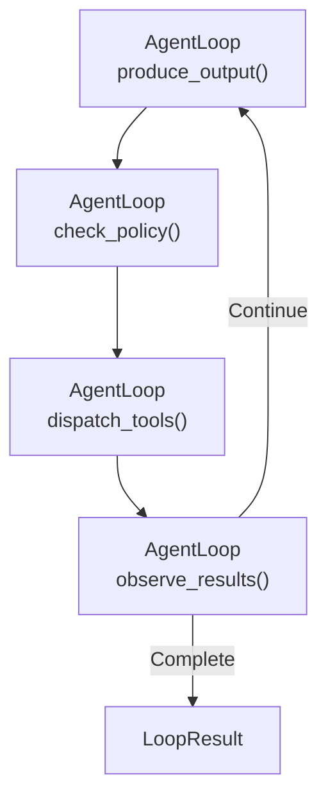

# 推論ループガイド

## 他の言語


## 目次


---

## 概要

推論ループはSymbiontにおける自律エージェントのコア実行エンジンです。構造化されたサイクルを通じて、LLM、ポリシーゲート、外部ツール間のマルチターン対話を駆動します：

1. **Observe** — 前回のツール実行結果を収集
2. **Reason** — LLMが提案アクション（ツール呼び出しまたはテキスト応答）を生成
3. **Gate** — ポリシーエンジンが各提案アクションを評価
4. **Act** — 承認されたアクションがツールエクゼキューターにディスパッチ

ループは、LLMが最終テキスト応答を生成するか、イテレーション/トークン制限に達するか、タイムアウトするまで継続します。

### 設計原則

- **コンパイル時の安全性**：無効なフェーズ遷移はRustの型システムによりコンパイル時に検出
- **オプトイン複雑性**：ループはプロバイダーとポリシーゲートだけで動作し、ナレッジブリッジ、Cedarポリシー、ヒューマン・イン・ザ・ループはすべてオプション
- **後方互換性**：新機能（ナレッジブリッジなど）の追加で既存コードが壊れることはない
- **可観測性**：すべてのフェーズがジャーナルイベントとトレーシングスパンを発行

---

## クイックスタート

### 最小限の例

```rust
use std::sync::Arc;
use symbi_runtime::reasoning::circuit_breaker::CircuitBreakerRegistry;
use symbi_runtime::reasoning::context_manager::DefaultContextManager;
use symbi_runtime::reasoning::conversation::{Conversation, ConversationMessage};
use symbi_runtime::reasoning::executor::DefaultActionExecutor;
use symbi_runtime::reasoning::loop_types::{BufferedJournal, LoopConfig};
use symbi_runtime::reasoning::policy_bridge::DefaultPolicyGate;
use symbi_runtime::reasoning::reasoning_loop::ReasoningLoopRunner;
use symbi_runtime::types::AgentId;

// Set up the runner with default components
let runner = ReasoningLoopRunner {
    provider: Arc::new(my_inference_provider),
    policy_gate: Arc::new(DefaultPolicyGate::permissive()),
    executor: Arc::new(DefaultActionExecutor::default()),
    context_manager: Arc::new(DefaultContextManager::default()),
    circuit_breakers: Arc::new(CircuitBreakerRegistry::default()),
    journal: Arc::new(BufferedJournal::new(1000)),
    knowledge_bridge: None,
};

// Build a conversation
let mut conv = Conversation::with_system("You are a helpful assistant.");
conv.push(ConversationMessage::user("What is 6 * 7?"));

// Run the loop
let result = runner.run(AgentId::new(), conv, LoopConfig::default()).await;

println!("Output: {}", result.output);
println!("Iterations: {}", result.iterations);
println!("Tokens used: {}", result.total_usage.total_tokens);
```

### ツール定義付き

```rust
use symbi_runtime::reasoning::inference::ToolDefinition;

let config = LoopConfig {
    max_iterations: 10,
    tool_definitions: vec![
        ToolDefinition {
            name: "web_search".into(),
            description: "Search the web for information".into(),
            parameters: serde_json::json!({
                "type": "object",
                "properties": {
                    "query": { "type": "string" }
                },
                "required": ["query"]
            }),
        },
    ],
    ..Default::default()
};

let result = runner.run(agent_id, conv, config).await;
```

---

## フェーズシステム

### 型状態パターン

ループはRustの型システムを使用して、コンパイル時に有効なフェーズ遷移を強制します。各フェーズはゼロサイズ型マーカーです：

```rust
pub struct Reasoning;      // LLM produces proposed actions
pub struct PolicyCheck;    // Each action evaluated by the gate
pub struct ToolDispatching; // Approved actions executed
pub struct Observing;      // Results collected for next iteration
```

`AgentLoop<Phase>` 構造体はループの状態を保持し、現在のフェーズに適切なメソッドのみを呼び出せます。例えば、`AgentLoop<Reasoning>` は `produce_output()` のみを公開し、これはselfを消費して `AgentLoop<PolicyCheck>` を返します。

つまり、以下のミスは**ランタイムバグではなくコンパイルエラー**になります：
- ポリシーチェックのスキップ
- 推論なしでのツールディスパッチ
- ディスパッチなしでの結果観測

### フェーズフロー



---

## 推論プロバイダー

`InferenceProvider` トレイトはLLMバックエンドを抽象化します：

```rust
#[async_trait]
pub trait InferenceProvider: Send + Sync {
    async fn complete(
        &self,
        conversation: &Conversation,
        options: &InferenceOptions,
    ) -> Result<InferenceResponse, InferenceError>;

    fn provider_name(&self) -> &str;
    fn default_model(&self) -> &str;
    fn supports_native_tools(&self) -> bool;
    fn supports_structured_output(&self) -> bool;
}
```

### クラウドプロバイダー（OpenRouter）

`CloudInferenceProvider` はOpenRouter（または任意のOpenAI互換エンドポイント）に接続します：

```bash
export OPENROUTER_API_KEY="sk-or-..."
export OPENROUTER_MODEL="google/gemini-2.0-flash-001"  # optional
```

```rust
use symbi_runtime::reasoning::providers::cloud::CloudInferenceProvider;

let provider = CloudInferenceProvider::from_env()
    .expect("OPENROUTER_API_KEY must be set");
```

---

## ポリシーゲート

すべての提案アクションは実行前にポリシーゲートを通過します：

```rust
#[async_trait]
pub trait ReasoningPolicyGate: Send + Sync {
    async fn evaluate_action(
        &self,
        agent_id: &AgentId,
        action: &ProposedAction,
        state: &LoopState,
    ) -> LoopDecision;
}

pub enum LoopDecision {
    Allow,
    Deny { reason: String },
    Modify { modified_action: Box<ProposedAction>, reason: String },
}
```

### 組み込みゲート

- **`DefaultPolicyGate::permissive()`** — すべてのアクションを許可（開発/テスト用）
- **`DefaultPolicyGate::new()`** — デフォルトポリシールール
- **`OpaPolicyGateBridge`** — OPAベースのポリシーエンジンへのブリッジ
- **`CedarGate`** — Cedarポリシー言語の統合

### ポリシー拒否フィードバック

アクションが拒否された場合、拒否理由がポリシーフィードバック観測としてLLMにフィードバックされ、次のイテレーションでアプローチを調整できるようになります。

---

## アクション実行

### ActionExecutorトレイト

```rust
#[async_trait]
pub trait ActionExecutor: Send + Sync {
    async fn execute_actions(
        &self,
        actions: &[ProposedAction],
        config: &LoopConfig,
        circuit_breakers: &CircuitBreakerRegistry,
    ) -> Vec<Observation>;
}
```

### 組み込みエクゼキューター

| エクゼキューター | 説明 |
|----------------|------|
| `DefaultActionExecutor` | ツールごとのタイムアウト付き並列ディスパッチ |
| `EnforcedActionExecutor` | `ToolInvocationEnforcer` -> MCPパイプラインを通じて委任 |
| `KnowledgeAwareExecutor` | ナレッジツールをインターセプトし、残りは内部エクゼキューターに委任 |

### サーキットブレーカー

各ツールには失敗を追跡する関連サーキットブレーカーがあります：

- **Closed**（正常）：ツール呼び出しは通常通り処理
- **Open**（トリップ）：連続失敗が多すぎるため、呼び出しは即座に拒否
- **Half-open**（プロービング）：復旧テストのために限定的な呼び出しを許可

```rust
let circuit_breakers = CircuitBreakerRegistry::new(CircuitBreakerConfig {
    failure_threshold: 3,
    recovery_timeout: Duration::from_secs(60),
    half_open_max_calls: 1,
});
```

---

## ナレッジ-推論ブリッジ

`KnowledgeBridge` はエージェントのナレッジストア（階層メモリ、ナレッジベース、ベクトル検索）を推論ループに接続します。

### セットアップ

```rust
use symbi_runtime::reasoning::knowledge_bridge::{KnowledgeBridge, KnowledgeConfig};

let bridge = Arc::new(KnowledgeBridge::new(
    context_manager.clone(),  // Arc<dyn context::ContextManager>
    KnowledgeConfig {
        max_context_items: 5,
        relevance_threshold: 0.3,
        auto_persist: true,
    },
));

let runner = ReasoningLoopRunner {
    // ... other fields ...
    knowledge_bridge: Some(bridge),
};
```

### 動作原理

**各推論ステップの前に：**
1. 最近のユーザー/ツールメッセージから検索語を抽出
2. `query_context()` と `search_knowledge()` が関連アイテムを取得
3. 結果がフォーマットされてシステムメッセージとして注入（前回の注入を置換）

**ツールディスパッチ中：**
`KnowledgeAwareExecutor` は2つの特別なツールをインターセプトします：

- **`recall_knowledge`** — ナレッジベースを検索してフォーマットされた結果を返す
  ```json
  { "query": "capital of France", "limit": 5 }
  ```

- **`store_knowledge`** — 新しいファクトを主語-述語-目的語のトリプルとして保存
  ```json
  { "subject": "Earth", "predicate": "has", "object": "one moon", "confidence": 0.95 }
  ```

その他のすべてのツール呼び出しは、変更なしで内部エクゼキューターに委任されます。

**ループ完了後：**
`auto_persist` が有効な場合、ブリッジはアシスタント応答を抽出し、将来の対話のためにワーキングメモリとして保存します。

### 後方互換性

`knowledge_bridge: None` を設定すると、ランナーは以前と同一に動作します — コンテキスト注入なし、ナレッジツールなし、永続化なし。

---

## 対話管理

### Conversation型

`Conversation` はOpenAIおよびAnthropic APIフォーマットへのシリアライズを備えたメッセージの順序付きシーケンスを管理します：

```rust
let mut conv = Conversation::with_system("You are a helpful assistant.");
conv.push(ConversationMessage::user("Hello"));
conv.push(ConversationMessage::assistant("Hi there!"));

// Serialize for API calls
let openai_msgs = conv.to_openai_messages();
let (system, anthropic_msgs) = conv.to_anthropic_messages();
```

### トークンバジェット強制

ループ内の `ContextManager`（ナレッジの `ContextManager` とは別）は、対話のトークンバジェットを管理します：

- **スライディングウィンドウ**：最も古いメッセージから削除
- **観測マスキング**：冗長なツール結果を非表示
- **アンカードサマリー**：システムメッセージ + 直近N件のメッセージを保持

---

## 永続ジャーナル

すべてのフェーズ遷移は、設定された `JournalWriter` に `JournalEntry` を発行します：

```rust
pub struct JournalEntry {
    pub sequence: u64,
    pub timestamp: DateTime<Utc>,
    pub agent_id: AgentId,
    pub iteration: u32,
    pub event: LoopEvent,
}

pub enum LoopEvent {
    Started { agent_id, config },
    ReasoningComplete { iteration, actions, usage },
    PolicyEvaluated { iteration, action_count, denied_count },
    ToolsDispatched { iteration, tool_count, duration },
    ObservationsCollected { iteration, observation_count },
    Terminated { reason, iterations, total_usage, duration },
    RecoveryTriggered { iteration, tool_name, strategy, error },
}
```

デフォルトの `BufferedJournal` はエントリをメモリに保存します。本番環境のデプロイでは、永続ストレージ用に `JournalWriter` を実装できます。

---

## 設定

### LoopConfig

```rust
pub struct LoopConfig {
    pub max_iterations: u32,        // Default: 25
    pub max_total_tokens: u32,      // Default: 100,000
    pub timeout: Duration,          // Default: 5 minutes
    pub default_recovery: RecoveryStrategy,
    pub tool_timeout: Duration,     // Default: 30 seconds
    pub max_concurrent_tools: usize, // Default: 5
    pub context_token_budget: usize, // Default: 32,000
    pub tool_definitions: Vec<ToolDefinition>,
}
```

### リカバリー戦略

ツール実行が失敗した場合、ループは異なるリカバリー戦略を適用できます：

| 戦略 | 説明 |
|------|------|
| `Retry` | 指数バックオフでリトライ |
| `Fallback` | 代替ツールを試行 |
| `CachedResult` | 十分に新しい場合、キャッシュされた結果を使用 |
| `LlmRecovery` | LLMに代替アプローチを見つけさせる |
| `Escalate` | 人間のオペレーターキューにルーティング |
| `DeadLetter` | 断念して失敗をログに記録 |

---

## テスト

### ユニットテスト（APIキー不要）

```bash
cargo test -j2 -p symbi-runtime --lib -- reasoning::knowledge
```

### モックプロバイダーによる統合テスト

```bash
cargo test -j2 -p symbi-runtime --test knowledge_reasoning_tests
```

### 実際のLLMによるライブテスト

```bash
OPENROUTER_API_KEY="sk-or-..." OPENROUTER_MODEL="google/gemini-2.0-flash-001" \
  cargo test -j2 -p symbi-runtime --features http-input --test reasoning_live_tests -- --nocapture
```

---

## 実装フェーズ

推論ループは5つのフェーズで構築され、各フェーズが機能を追加しました：

| フェーズ | 焦点 | 主要コンポーネント |
|---------|------|------------------|
| **1** | コアループ | `conversation`、`inference`、`phases`、`reasoning_loop` |
| **2** | レジリエンス | `circuit_breaker`、`executor`、`context_manager`、`policy_bridge` |
| **3** | DSL統合 | `human_critic`、`pipeline_config`、REPLビルトイン |
| **4** | マルチエージェント | `agent_registry`、`critic_audit`、`saga` |
| **5** | 可観測性 | `cedar_gate`、`journal`、`metrics`、`scheduler`、`tracing_spans` |
| **Bridge** | ナレッジ | `knowledge_bridge`、`knowledge_executor` |
| **orga-adaptive** | 高度な機能 | `tool_profile`、`progress_tracker`、`pre_hydrate`、拡張 `knowledge_bridge` |

---

## 高度なプリミティブ（orga-adaptive）

`orga-adaptive` フィーチャーゲートは4つの高度な機能を追加します。詳細は[完全ガイド](orga-adaptive.md)を参照してください。

| プリミティブ | 目的 |
|-------------|------|
| **Tool Profile** | LLMに見えるツールのグロブベースフィルタリング |
| **Progress Tracker** | スタックループ検出付きステップごとのリトライ制限 |
| **Pre-Hydration** | タスク入力参照からの決定的コンテキストプリフェッチ |
| **Scoped Conventions** | `recall_knowledge` によるディレクトリ対応コンベンション取得 |

```rust
let config = LoopConfig {
    tool_profile: Some(ToolProfile::include_only(&["search_*", "file_*"])),
    pre_hydration: Some(PreHydrationConfig::default()),
    ..Default::default()
};
```

---

## 次のステップ

- **[ランタイムアーキテクチャ](runtime-architecture.md)** — 完全なシステムアーキテクチャ概要
- **[セキュリティモデル](security-model.md)** — ポリシー強制と監査証跡
- **[DSLガイド](dsl-guide.md)** — エージェント定義言語
- **[APIリファレンス](api-reference.md)** — 完全なAPIドキュメント
