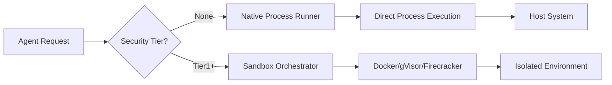

# Native Execution Mode (No Docker/Isolation)

## Overview

Symbiont supports running agents without Docker or container isolation for development environments or trusted deployments where maximum performance and minimal dependencies are desired.

## ⚠️ Security Warnings

**IMPORTANT**: Native execution mode bypasses all container-based security controls:

- ❌ No process isolation
- ❌ No filesystem isolation  
- ❌ No network isolation
- ❌ No resource limits enforcement
- ❌ Direct access to host system

**USE ONLY FOR**:
- Local development with trusted code
- Controlled environments with trusted agents
- Testing and debugging
- Environments where Docker is not available

**DO NOT USE FOR**:
- Production environments with untrusted code
- Multi-tenant deployments
- Public-facing services
- Processing untrusted user input

## Architecture

### Sandbox Tier Hierarchy

```
┌─────────────────────────────────────────┐
│ SecurityTier::None (Native Execution)   │ ← No isolation
├─────────────────────────────────────────┤
│ SecurityTier::Tier1 (Docker)            │ ← Container isolation
├─────────────────────────────────────────┤
│ SecurityTier::Tier2 (gVisor)            │ ← Enhanced isolation
├─────────────────────────────────────────┤
│ SecurityTier::Tier3 (Firecracker)       │ ← Maximum isolation
└─────────────────────────────────────────┘
```

### Native Execution Flow



## Configuration

### Option 1: TOML Configuration

```toml
# config.toml

[security]
# Allow native execution (default: false)
allow_native_execution = true
# Default sandbox tier
default_sandbox_tier = "None"  # or "Tier1", "Tier2", "Tier3"

[security.native_execution]
# Apply resource limits even in native mode
enforce_resource_limits = true
# Maximum memory in MB
max_memory_mb = 2048
# Maximum CPU cores
max_cpu_cores = 4.0
# Maximum execution time in seconds
max_execution_time_seconds = 300
# Working directory for native execution
working_directory = "/tmp/symbiont-native"
# Allowed commands/executables
allowed_executables = ["python3", "node", "bash"]
```

### Complete Config Example

A full `config.toml` with native execution alongside other system settings:

```toml
# config.toml
[api]
port = 8080
host = "127.0.0.1"
timeout_seconds = 30
max_body_size = 10485760

[database]
qdrant_url = "http://localhost:6333"
qdrant_collection = "symbiont"
vector_dimension = 384

[logging]
level = "info"
format = "Pretty"
structured = true

[security]
key_provider = { Environment = { var_name = "SYMBIONT_KEY" } }
enable_compression = true
enable_backups = true
enable_safety_checks = true

[storage]
context_path = "./data/context"
git_clone_path = "./data/git"
backup_path = "./data/backups"
max_context_size_mb = 1024

[native_execution]
enabled = true
default_executable = "python3"
working_directory = "/tmp/symbiont-native"
enforce_resource_limits = true
max_memory_mb = 2048
max_cpu_seconds = 300
max_execution_time_seconds = 300
allowed_executables = ["python3", "python", "node", "bash", "sh"]
```

### NativeExecutionConfig Fields

| Field | Type | Default | Description |
|-------|------|---------|-------------|
| `enabled` | bool | `false` | Enable native execution mode |
| `default_executable` | string | `"bash"` | Default interpreter/shell |
| `working_directory` | path | `/tmp/symbiont-native` | Execution directory |
| `enforce_resource_limits` | bool | `true` | Apply OS-level limits |
| `max_memory_mb` | Option<u64> | `Some(2048)` | Memory limit in MB |
| `max_cpu_seconds` | Option<u64> | `Some(300)` | CPU time limit |
| `max_execution_time_seconds` | u64 | `300` | Wall-clock timeout |
| `allowed_executables` | Vec<String> | `[bash, python3, etc.]` | Executable whitelist |

### Option 2: Environment Variables

```bash
export SYMBIONT_ALLOW_NATIVE_EXECUTION=true
export SYMBIONT_DEFAULT_SANDBOX_TIER=None
export SYMBIONT_NATIVE_MAX_MEMORY_MB=2048
export SYMBIONT_NATIVE_MAX_CPU_CORES=4.0
export SYMBIONT_NATIVE_WORKING_DIR=/tmp/symbiont-native
```

### Option 3: Agent-Level Configuration

```symbi
agent NativeWorker {
  metadata {
    name: "Local Development Agent"
    version: "1.0.0"
  }
  
  security {
    tier: None
    sandbox: Permissive
    capabilities: ["local_filesystem", "network"]
  }
  
  on trigger "local_processing" {
    // Executes directly on host
    execute_native("python3 process.py")
  }
}
```

## Usage Examples

### Example 1: Development Mode

```rust
use symbi_runtime::{Config, SecurityTier, SandboxOrchestrator};

#[tokio::main]
async fn main() -> Result<(), Box<dyn std::error::Error>> {
    // Enable native execution for development
    let mut config = Config::default();
    config.security.allow_native_execution = true;
    config.security.default_sandbox_tier = SecurityTier::None;
    
    let orchestrator = SandboxOrchestrator::new(config)?;
    
    // Execute code natively
    let result = orchestrator.execute_code(
        SecurityTier::None,
        "print('Hello from native execution!')",
        HashMap::new()
    ).await?;
    
    println!("Output: {}", result.stdout);
    Ok(())
}
```

### Example 2: CLI Flag

```bash
# Run with native execution
symbiont run agent.dsl --native

# Or with explicit tier
symbiont run agent.dsl --sandbox-tier=none

# With resource limits
symbiont run agent.dsl --native \
  --max-memory=1024 \
  --max-cpu=2.0 \
  --timeout=300
```

### Example 3: Mixed Execution

```rust
// Use native execution for trusted local operations
let local_result = orchestrator.execute_code(
    SecurityTier::None,
    local_code,
    env_vars
).await?;

// Use Docker for external/untrusted operations  
let isolated_result = orchestrator.execute_code(
    SecurityTier::Tier1,
    untrusted_code,
    env_vars
).await?;
```

## Implementation Details

### Native Process Runner

The native runner uses `std::process::Command` with optional resource limits:

```rust
pub struct NativeRunner {
    config: NativeConfig,
}

impl NativeRunner {
    pub async fn execute(&self, code: &str, env: HashMap<String, String>) 
        -> Result<ExecutionResult> {
        // Direct process execution
        let mut command = Command::new(&self.config.executable);
        command.current_dir(&self.config.working_dir);
        command.envs(env);
        
        // Optional: Apply resource limits via rlimit (Unix)
        #[cfg(unix)]
        if self.config.enforce_limits {
            self.apply_resource_limits(&mut command)?;
        }
        
        let output = command.output().await?;
        
        Ok(ExecutionResult {
            stdout: String::from_utf8_lossy(&output.stdout).to_string(),
            stderr: String::from_utf8_lossy(&output.stderr).to_string(),
            exit_code: output.status.code().unwrap_or(-1),
            success: output.status.success(),
        })
    }
}
```

### Resource Limits (Unix)

On Unix systems, native execution can still enforce some limits:

- **Memory**: Using `setrlimit(RLIMIT_AS)`
- **CPU Time**: Using `setrlimit(RLIMIT_CPU)`
- **Process Count**: Using `setrlimit(RLIMIT_NPROC)`
- **File Size**: Using `setrlimit(RLIMIT_FSIZE)`

### Platform Support

| Platform | Native Execution | Resource Limits |
|----------|-----------------|-----------------|
| Linux    | ✅ Full         | ✅ rlimit       |
| macOS    | ✅ Full         | ⚠️ Partial      |
| Windows  | ✅ Full         | ❌ Limited      |

## Migration from Docker

### Step 1: Update Configuration

```diff
# config.toml
[security]
- default_sandbox_tier = "Tier1"
+ default_sandbox_tier = "None"
+ allow_native_execution = true
```

### Step 2: Remove Docker Dependencies

```bash
# No longer required
# docker build -t symbi:latest .
# docker run ...

# Direct execution
cargo build --release
./target/release/symbiont run agent.dsl
```

### Hybrid Approach

Use both execution modes strategically — native for trusted local operations, Docker for untrusted code:

```rust
// Trusted local operations
let local_result = orchestrator.execute_code(
    SecurityTier::None,  // Native
    trusted_code,
    env
).await?;

// External/untrusted operations
let isolated_result = orchestrator.execute_code(
    SecurityTier::Tier1,  // Docker
    external_code,
    env
).await?;
```

### Step 3: Handle Environment Variables

Docker automatically isolated environment variables. With native execution, set them explicitly:

```bash
export AGENT_API_KEY="xxx"
export AGENT_DB_URL="postgresql://..."
symbiont run agent.dsl --native
```

## Performance Comparison

| Mode | Startup | Throughput | Memory | Isolation |
|------|---------|------------|--------|-----------|
| Native | ~10ms | 100% | Minimal | None |
| Docker | ~500ms | ~95% | +128MB | Good |
| gVisor | ~800ms | ~70% | +256MB | Better |
| Firecracker | ~125ms | ~90% | +64MB | Best |

## Troubleshooting

### Issue: Permission Denied

```bash
# Solution: Ensure working directory is writable
mkdir -p /tmp/symbiont-native
chmod 755 /tmp/symbiont-native
```

### Issue: Command Not Found

```bash
# Solution: Ensure executable is in PATH or use absolute path
export PATH=$PATH:/usr/local/bin
# Or configure absolute path
allowed_executables = ["/usr/bin/python3", "/usr/bin/node"]
```

### Issue: Resource Limits Not Applied

Native execution on Windows has limited resource limit support. Consider:
- Using Job Objects (Windows-specific)
- Monitoring and terminating runaway processes
- Upgrading to container-based execution

## Best Practices

1. **Development Only**: Use native execution primarily for development
2. **Gradual Migration**: Start with containers, drop to native when stable
3. **Monitoring**: Even without isolation, monitor resource usage
4. **Allowlists**: Restrict allowed executables and paths
5. **Logging**: Enable comprehensive audit logging
6. **Testing**: Test with containers before deploying native

## Security Checklist

Before enabling native execution in any environment:

- [ ] All agent code is from trusted sources
- [ ] Environment is isolated from production
- [ ] No external user input is processed
- [ ] Monitoring and logging are enabled
- [ ] Resource limits are configured
- [ ] Executable allowlist is restrictive
- [ ] Filesystem access is limited
- [ ] Team understands security implications

## Related Documentation

- [Security Model](security-model.md) - Full security architecture
- [Sandbox Architecture](runtime-architecture.md#sandbox-architecture) - Container tiers
- [Configuration Guide](getting-started.md#configuration) - Setup options
- [DSL Security Directives](dsl-guide.md#security) - Agent-level security

---

**Remember**: Native execution trades security for convenience. Always understand the risks and apply appropriate controls for your deployment environment.
