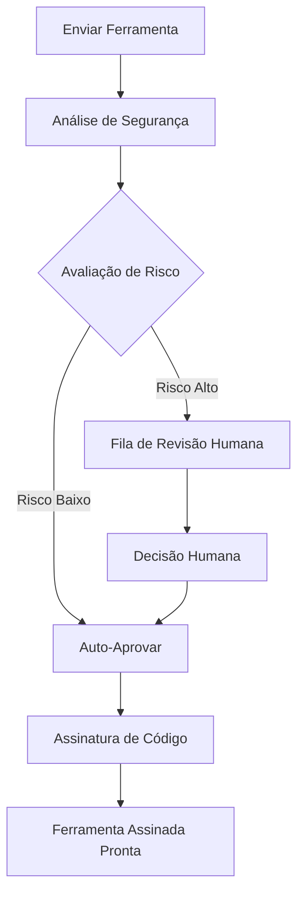

layout: default
title: Referência da API
description: "Documentação completa das APIs do runtime do Symbiont"
nav_exclude: true
---

# Referência da API

Este documento fornece documentação abrangente para as APIs do runtime Symbiont. O projeto Symbiont expõe dois sistemas de API distintos projetados para diferentes casos de uso e estágios de desenvolvimento.

## Visão Geral

O Symbiont oferece duas interfaces de API:

1. **API HTTP do Runtime** - Uma API completa para interação direta com o runtime, gerenciamento de agentes e execução de fluxos de trabalho
2. **API de Revisão de Ferramentas (Produção)** - Uma API abrangente e pronta para produção para fluxos de trabalho de revisão e assinatura de ferramentas orientados por IA

---

## API HTTP do Runtime

A API HTTP do Runtime fornece acesso direto ao runtime Symbiont para execução de fluxos de trabalho, gerenciamento de agentes e monitoramento do sistema. Todos os endpoints estão totalmente implementados e prontos para produção quando o recurso `http-api` está habilitado.

### URL Base
```
http://127.0.0.1:8080/api/v1
```

### Autenticação

Os endpoints de gerenciamento de agentes requerem autenticação com token Bearer. Configure a variável de ambiente `API_AUTH_TOKEN` e inclua o token no cabeçalho Authorization:

```
Authorization: Bearer <your-token>
```

**Endpoints Protegidos:**
- Todos os endpoints `/api/v1/agents/*` requerem autenticação
- Os endpoints `/api/v1/health`, `/api/v1/workflows/execute` e `/api/v1/metrics` não requerem autenticação

### Endpoints Disponíveis

#### Verificação de Saúde
```http
GET /api/v1/health
```

Retorna o status atual de saúde do sistema e informações básicas do runtime.

**Resposta (200 OK):**
```json
{
  "status": "healthy",
  "uptime_seconds": 3600,
  "timestamp": "2024-01-15T10:30:00Z",
  "version": "1.0.0"
}
```

**Resposta (500 Erro Interno do Servidor):**
```json
{
  "status": "unhealthy",
  "error": "Database connection failed",
  "timestamp": "2024-01-15T10:30:00Z"
}
```

### Endpoints Disponíveis

#### Execução de Fluxo de Trabalho
```http
POST /api/v1/workflows/execute
```

Executa um fluxo de trabalho com parâmetros especificados.

**Corpo da Solicitação:**
```json
{
  "workflow_id": "string",
  "parameters": {},
  "agent_id": "optional-agent-id"
}
```

**Resposta (200 OK):**
```json
{
  "result": "workflow execution result"
}
```

#### Gerenciamento de Agentes

Todos os endpoints de gerenciamento de agentes requerem autenticação via o cabeçalho `Authorization: Bearer <token>`.

##### Listar Agentes
```http
GET /api/v1/agents
Authorization: Bearer <your-token>
```

Recupera uma lista de todos os agentes ativos no runtime.

**Resposta (200 OK):**
```json
[
  "agent-id-1",
  "agent-id-2",
  "agent-id-3"
]
```

##### Obter Status do Agente
```http
GET /api/v1/agents/{id}/status
Authorization: Bearer <your-token>
```

Obtém informações detalhadas de status para um agente específico, incluindo métricas de execução em tempo real.

**Resposta (200 OK):**
```json
{
  "agent_id": "uuid",
  "state": "running|ready|waiting|failed|completed|terminated",
  "last_activity": "2024-01-15T10:30:00Z",
  "scheduled_at": "2024-01-15T10:00:00Z",
  "resource_usage": {
    "memory_usage": 268435456,
    "cpu_usage": 15.5,
    "active_tasks": 1
  },
  "execution_context": {
    "execution_mode": "ephemeral|persistent|scheduled|event_driven",
    "process_id": 12345,
    "uptime": "00:15:30",
    "health_status": "healthy|unhealthy"
  }
}
```

**Novos Estados de Agente:**
- `running`: Agente está executando ativamente com um processo em execução
- `ready`: Agente está inicializado e pronto para execução
- `waiting`: Agente está na fila para execução
- `failed`: Execução do agente falhou ou verificação de saúde falhou
- `completed`: Tarefa do agente concluída com sucesso
- `terminated`: Agente foi terminado graciosamente ou forçosamente

##### Criar Agente
```http
POST /api/v1/agents
Authorization: Bearer <your-token>
```

Cria um novo agente com a configuração fornecida.

**Corpo da Solicitação:**
```json
{
  "name": "my-agent",
  "dsl": "agent definition in DSL format"
}
```

**Resposta (200 OK):**
```json
{
  "id": "uuid",
  "status": "created"
}
```

##### Atualizar Agente
```http
PUT /api/v1/agents/{id}
Authorization: Bearer <your-token>
```

Atualiza a configuração de um agente existente. Pelo menos um campo deve ser fornecido.

**Corpo da Solicitação:**
```json
{
  "name": "updated-agent-name",
  "dsl": "updated agent definition in DSL format"
}
```

**Resposta (200 OK):**
```json
{
  "id": "uuid",
  "status": "updated"
}
```

##### Excluir Agente
```http
DELETE /api/v1/agents/{id}
Authorization: Bearer <your-token>
```

Exclui um agente existente do runtime.

**Resposta (200 OK):**
```json
{
  "id": "uuid",
  "status": "deleted"
}
```

##### Executar Agente
```http
POST /api/v1/agents/{id}/execute
Authorization: Bearer <your-token>
```

Aciona a execução de um agente específico.

**Corpo da Solicitação:**
```json
{}
```

**Resposta (200 OK):**
```json
{
  "execution_id": "uuid",
  "status": "execution_started"
}
```

##### Obter Histórico de Execução do Agente
```http
GET /api/v1/agents/{id}/history
Authorization: Bearer <your-token>
```

Recupera o histórico de execução para um agente específico.

**Resposta (200 OK):**
```json
{
  "history": [
    {
      "execution_id": "uuid",
      "status": "completed",
      "timestamp": "2024-01-15T10:30:00Z"
    }
  ]
}
```

##### Heartbeat do Agente
```http
POST /api/v1/agents/{id}/heartbeat
Authorization: Bearer <your-token>
```

Envia um heartbeat de um agente em execução para atualizar seu status de saúde.

##### Enviar Evento para o Agente
```http
POST /api/v1/agents/{id}/events
Authorization: Bearer <your-token>
```

Envia um evento externo para um agente em execução para execução orientada a eventos.

#### Métricas do Sistema
```http
GET /api/v1/metrics
```

Recupera um snapshot abrangente de métricas cobrindo agendador, gerenciador de tarefas, balanceador de carga e recursos do sistema.

**Resposta (200 OK):**
```json
{
  "timestamp": "2026-02-16T12:00:00Z",
  "scheduler": {
    "total_jobs": 12,
    "active_jobs": 8,
    "paused_jobs": 2,
    "failed_jobs": 1,
    "total_runs": 450,
    "successful_runs": 445,
    "dead_letter_count": 2
  },
  "task_manager": {
    "queued_tasks": 3,
    "running_tasks": 5,
    "completed_tasks": 1200,
    "failed_tasks": 15
  },
  "load_balancer": {
    "total_workers": 4,
    "active_workers": 3,
    "requests_per_second": 12.5
  },
  "system": {
    "cpu_usage_percent": 45.2,
    "memory_usage_bytes": 536870912,
    "memory_total_bytes": 17179869184,
    "uptime_seconds": 3600
  }
}
```

O snapshot de métricas também pode ser exportado para arquivos (escrita JSON atômica) ou endpoints OTLP usando o sistema `MetricsExporter` do runtime. Veja a seção [Métricas e Telemetria](#métricas--telemetria) abaixo.

---

### Métricas e Telemetria

O Symbiont suporta exportação de métricas de runtime para múltiplos backends:

#### Exportador de Arquivo

Escreve snapshots de métricas como arquivos JSON atômicos (tempfile + rename):

```rust
use symbi_runtime::metrics::{FileMetricsExporter, MetricsExporterConfig};

let exporter = FileMetricsExporter::new("/var/lib/symbi/metrics.json");
exporter.export(&snapshot)?;
```

#### Exportador OTLP

Envia métricas para qualquer endpoint compatível com OpenTelemetry (requer o recurso `metrics`):

```rust
use symbi_runtime::metrics::{OtlpExporter, OtlpExporterConfig, OtlpProtocol};

let config = OtlpExporterConfig {
    endpoint: "http://localhost:4317".to_string(),
    protocol: OtlpProtocol::Grpc,
    ..Default::default()
};
```

#### Exportador Composto

Fan-out para múltiplos backends simultaneamente — falhas de exportação individuais são registradas mas não bloqueiam outros exportadores:

```rust
use symbi_runtime::metrics::CompositeExporter;

let composite = CompositeExporter::new(vec![
    Box::new(file_exporter),
    Box::new(otlp_exporter),
]);
```

#### Coleta em Segundo Plano

O `MetricsCollector` executa como uma thread de segundo plano, coletando snapshots periodicamente e exportando-os:

```rust
use symbi_runtime::metrics::MetricsCollector;

let collector = MetricsCollector::new(exporter, interval);
collector.start();
// ... depois ...
collector.stop();
```

---

### Varredura de Skills (ClawHavoc)

O `SkillScanner` inspeciona o conteúdo de skills de agentes em busca de padrões maliciosos antes do carregamento. Ele inclui **40 regras de defesa ClawHavoc integradas** em 10 categorias de ataque:

| Categoria | Contagem | Severidade | Exemplos |
|-----------|----------|------------|----------|
| Regras de defesa originais | 10 | Crítica/Aviso | `pipe-to-shell`, `eval-with-fetch`, `rm-rf-pattern` |
| Reverse shells | 7 | Crítica | bash, nc, ncat, mkfifo, python, perl, ruby |
| Coleta de credenciais | 6 | Alta | Chaves SSH, credenciais AWS, config cloud, cookies do navegador, chaveiro |
| Exfiltração de rede | 3 | Alta | Túnel DNS, `/dev/tcp`, netcat outbound |
| Injeção de processo | 4 | Crítica | ptrace, LD_PRELOAD, `/proc/mem`, gdb attach |
| Escalação de privilégio | 5 | Alta | sudo, setuid, setcap, chown root, nsenter |
| Symlink / travessia de caminho | 2 | Média | Escape de symlink, travessia profunda de caminho |
| Cadeias de download | 3 | Média | curl save, wget save, chmod exec |

Veja o [Modelo de Segurança](/security-model#clawhavoc-skill-scanner) para a lista completa de regras e modelo de severidade.

#### Uso

```rust
use symbi_runtime::skills::SkillScanner;

let scanner = SkillScanner::new(); // inclui todas as 40 regras padrão
let result = scanner.scan_skill("/path/to/skill/");

if !result.passed {
    for finding in &result.findings {
        eprintln!("[{}] {}: {} (line {})",
            finding.severity, finding.rule, finding.message, finding.line);
    }
}
```

Padrões de negação personalizados podem ser adicionados junto com os padrões:

```rust
let scanner = SkillScanner::with_custom_rules(vec![
    ("custom-pattern".into(), r"my_dangerous_pattern".into(),
     ScanSeverity::Warning, "Custom rule description".into()),
]);
```

### Configuração do Servidor

O servidor da API HTTP do Runtime pode ser configurado com as seguintes opções:

- **Endereço de bind padrão**: `127.0.0.1:8080`
- **Suporte CORS**: Configurável para desenvolvimento
- **Rastreamento de solicitações**: Habilitado via middleware Tower
- **Feature gate**: Disponível atrás do recurso `http-api` do Cargo

---

### Referência de Configuração de Features

#### Inferência LLM em Nuvem (`cloud-llm`)

Conecte a provedores de LLM em nuvem via OpenRouter para raciocínio de agentes:

```bash
cargo build --features cloud-llm
```

**Variáveis de Ambiente:**
- `OPENROUTER_API_KEY` — Sua chave de API OpenRouter (obrigatória)
- `OPENROUTER_MODEL` — Modelo a utilizar (padrão: `google/gemini-2.0-flash-001`)

O provedor de LLM em nuvem integra-se com o pipeline `execute_actions()` do loop de raciocínio. Suporta respostas em streaming, retentativas automáticas com backoff exponencial e rastreamento de uso de tokens.

#### Modo Agente Autônomo (`standalone-agent`)

Combina inferência LLM em nuvem com acesso a ferramentas Composio para agentes cloud-native:

```bash
cargo build --features standalone-agent
# Habilita: cloud-llm + composio
```

**Variáveis de Ambiente:**
- `OPENROUTER_API_KEY` — Chave de API OpenRouter
- `COMPOSIO_API_KEY` — Chave de API Composio
- `COMPOSIO_MCP_URL` — URL do servidor MCP Composio

#### Motor de Políticas Cedar (`cedar`)

Autorização formal usando a [linguagem de políticas Cedar](https://www.cedarpolicy.com/):

```bash
cargo build --features cedar
```

As políticas Cedar integram-se com a fase Gate do loop de raciocínio, fornecendo decisões de autorização granulares. Veja o [Modelo de Segurança](/security-model#cedar-policy-engine) para exemplos de políticas.

#### Configuração de Banco de Dados Vetorial

O Symbiont inclui o **LanceDB** como backend vetorial embutido padrão — nenhum serviço externo é necessário. Para implantações em escala, o Qdrant está disponível como backend opcional.

**LanceDB (padrão):**
```toml
[vector_db]
enabled = true
backend = "lancedb"
collection_name = "symbi_knowledge"
```

Nenhuma configuração adicional necessária. Os dados são armazenados localmente junto ao runtime.

**Qdrant (opcional):**
```bash
cargo build --features vector-qdrant
```

```toml
[vector_db]
enabled = true
backend = "qdrant"
collection_name = "symbi_knowledge"
url = "http://localhost:6333"
```

**Variáveis de Ambiente:**
- `SYMBIONT_VECTOR_BACKEND` — `lancedb` (padrão) ou `qdrant`
- `QDRANT_URL` — URL do servidor Qdrant (apenas quando usando Qdrant)

#### Primitivas de Raciocínio Avançado (`orga-adaptive`)

Habilite curadoria de ferramentas, detecção de loops travados, pré-busca de contexto e convenções com escopo:

```bash
cargo build --features orga-adaptive
```

Veja o [guia orga-adaptive](/orga-adaptive) para a referência completa de configuração.

---

### Estruturas de Dados

#### Tipos Centrais
```rust
// Solicitação de execução de fluxo de trabalho
WorkflowExecutionRequest {
    workflow_id: String,
    parameters: serde_json::Value,
    agent_id: Option<AgentId>
}

// Resposta de status do agente
AgentStatusResponse {
    agent_id: AgentId,
    state: AgentState,
    last_activity: DateTime<Utc>,
    resource_usage: ResourceUsage
}

// Resposta de verificação de saúde
HealthResponse {
    status: String,
    uptime_seconds: u64,
    timestamp: DateTime<Utc>,
    version: String
}

// Solicitação de criação de agente
CreateAgentRequest {
    name: String,
    dsl: String
}

// Resposta de criação de agente
CreateAgentResponse {
    id: String,
    status: String
}

// Solicitação de atualização de agente
UpdateAgentRequest {
    name: Option<String>,
    dsl: Option<String>
}

// Resposta de atualização de agente
UpdateAgentResponse {
    id: String,
    status: String
}

// Resposta de exclusão de agente
DeleteAgentResponse {
    id: String,
    status: String
}

// Solicitação de execução de agente
ExecuteAgentRequest {
    // Struct vazia por enquanto
}

// Resposta de execução de agente
ExecuteAgentResponse {
    execution_id: String,
    status: String
}

// Registro de execução de agente
AgentExecutionRecord {
    execution_id: String,
    status: String,
    timestamp: String
}

// Resposta de histórico de execução de agente
GetAgentHistoryResponse {
    history: Vec<AgentExecutionRecord>
}
```

### Interface do Provedor de Runtime

A API implementa uma trait `RuntimeApiProvider` com os seguintes métodos aprimorados:

- `execute_workflow()` - Executa um fluxo de trabalho com parâmetros dados
- `get_agent_status()` - Recupera status detalhado com métricas de execução em tempo real
- `get_system_health()` - Obtém saúde geral do sistema com estatísticas do agendador
- `list_agents()` - Lista todos os agentes (em execução, na fila e concluídos)
- `shutdown_agent()` - Desligamento gracioso com limpeza de recursos e tratamento de timeout
- `get_metrics()` - Recupera métricas abrangentes do sistema incluindo estatísticas de tarefas
- `create_agent()` - Cria agentes com especificação de modo de execução
- `update_agent()` - Atualiza configuração do agente com persistência
- `delete_agent()` - Exclui agente com limpeza adequada de processos em execução
- `execute_agent()` - Aciona execução com monitoramento e verificações de saúde
- `get_agent_history()` - Recupera histórico detalhado de execução com métricas de desempenho

#### API de Agendamento

Todos os endpoints de agendamento requerem autenticação. Requer o recurso `cron`.

##### Listar Agendamentos
```http
GET /api/v1/schedules
Authorization: Bearer <your-token>
```

**Resposta (200 OK):**
```json
[
  {
    "job_id": "uuid",
    "name": "daily-report",
    "cron_expression": "0 0 9 * * *",
    "timezone": "America/New_York",
    "status": "active",
    "enabled": true,
    "next_run": "2026-03-04T09:00:00Z",
    "run_count": 42
  }
]
```

##### Criar Agendamento
```http
POST /api/v1/schedules
Authorization: Bearer <your-token>
```

**Corpo da Solicitação:**
```json
{
  "name": "daily-report",
  "cron_expression": "0 0 9 * * *",
  "timezone": "America/New_York",
  "agent_name": "report-agent",
  "policy_ids": ["policy-1"],
  "one_shot": false
}
```

O `cron_expression` usa seis campos: `sec min hour day month weekday` (campo opcional sétimo para ano).

**Resposta (200 OK):**
```json
{
  "job_id": "uuid",
  "next_run": "2026-03-04T09:00:00Z",
  "status": "created"
}
```

##### Atualizar Agendamento
```http
PUT /api/v1/schedules/{id}
Authorization: Bearer <your-token>
```

**Corpo da Solicitação (todos os campos opcionais):**
```json
{
  "cron_expression": "0 */10 * * * *",
  "timezone": "UTC",
  "policy_ids": ["policy-2"],
  "one_shot": true
}
```

##### Pausar / Retomar / Acionar Agendamento
```http
POST /api/v1/schedules/{id}/pause
POST /api/v1/schedules/{id}/resume
POST /api/v1/schedules/{id}/trigger
Authorization: Bearer <your-token>
```

**Resposta (200 OK):**
```json
{
  "job_id": "uuid",
  "action": "paused",
  "status": "ok"
}
```

##### Excluir Agendamento
```http
DELETE /api/v1/schedules/{id}
Authorization: Bearer <your-token>
```

**Resposta (200 OK):**
```json
{
  "job_id": "uuid",
  "deleted": true
}
```

##### Obter Histórico do Agendamento
```http
GET /api/v1/schedules/{id}/history
Authorization: Bearer <your-token>
```

**Resposta (200 OK):**
```json
{
  "job_id": "uuid",
  "history": [
    {
      "run_id": "uuid",
      "started_at": "2026-03-03T09:00:00Z",
      "completed_at": "2026-03-03T09:01:23Z",
      "status": "completed",
      "error": null,
      "execution_time_ms": 83000
    }
  ]
}
```

##### Obter Próximas Execuções
```http
GET /api/v1/schedules/{id}/next?count=5
Authorization: Bearer <your-token>
```

**Resposta (200 OK):**
```json
{
  "job_id": "uuid",
  "next_runs": [
    "2026-03-04T09:00:00Z",
    "2026-03-05T09:00:00Z"
  ]
}
```

##### Saúde do Agendador
```http
GET /api/v1/health/scheduler
```

Retorna saúde e estatísticas específicas do agendador.

---

#### API de Adaptadores de Canais

Todos os endpoints de canais requerem autenticação. Conecta agentes ao Slack, Microsoft Teams e Mattermost.

##### Listar Canais
```http
GET /api/v1/channels
Authorization: Bearer <your-token>
```

**Resposta (200 OK):**
```json
[
  {
    "id": "uuid",
    "name": "slack-general",
    "platform": "slack",
    "status": "running"
  }
]
```

##### Registrar Canal
```http
POST /api/v1/channels
Authorization: Bearer <your-token>
```

**Corpo da Solicitação:**
```json
{
  "name": "slack-general",
  "platform": "slack",
  "config": {
    "webhook_url": "https://hooks.slack.com/...",
    "channel": "#general"
  }
}
```

Plataformas suportadas: `slack`, `teams`, `mattermost`.

**Resposta (200 OK):**
```json
{
  "id": "uuid",
  "name": "slack-general",
  "platform": "slack",
  "status": "registered"
}
```

##### Obter / Atualizar / Excluir Canal
```http
GET    /api/v1/channels/{id}
PUT    /api/v1/channels/{id}
DELETE /api/v1/channels/{id}
Authorization: Bearer <your-token>
```

##### Iniciar / Parar Canal
```http
POST /api/v1/channels/{id}/start
POST /api/v1/channels/{id}/stop
Authorization: Bearer <your-token>
```

**Resposta (200 OK):**
```json
{
  "id": "uuid",
  "action": "started",
  "status": "ok"
}
```

##### Saúde do Canal
```http
GET /api/v1/channels/{id}/health
Authorization: Bearer <your-token>
```

**Resposta (200 OK):**
```json
{
  "id": "uuid",
  "connected": true,
  "platform": "slack",
  "workspace_name": "my-team",
  "channels_active": 3,
  "last_message_at": "2026-03-03T15:42:00Z",
  "uptime_secs": 86400
}
```

##### Mapeamentos de Identidade
```http
GET  /api/v1/channels/{id}/mappings
POST /api/v1/channels/{id}/mappings
Authorization: Bearer <your-token>
```

Mapeia usuários da plataforma para identidades Symbiont para interações com agentes.

##### Log de Auditoria do Canal
```http
GET /api/v1/channels/{id}/audit
Authorization: Bearer <your-token>
```

---

### Recursos do Agendador

**Execução Real de Tarefas:**
- Criação de processos com ambientes de execução seguros
- Monitoramento de recursos (memória, CPU) com intervalos de 5 segundos
- Verificações de saúde e detecção automática de falhas
- Suporte para modos de execução efêmero, persistente, agendado e orientado a eventos

**Desligamento Gracioso:**
- Período de terminação graciosa de 30 segundos
- Terminação forçada para processos não responsivos
- Limpeza de recursos e persistência de métricas
- Limpeza de fila e sincronização de estado

### Gerenciamento de Contexto Aprimorado

**Capacidades de Busca Avançada:**
```json
{
  "query_type": "keyword|temporal|similarity|hybrid",
  "search_terms": ["term1", "term2"],
  "time_range": {
    "start": "2024-01-01T00:00:00Z",
    "end": "2024-01-31T23:59:59Z"
  },
  "memory_types": ["factual", "procedural", "episodic"],
  "relevance_threshold": 0.7,
  "max_results": 10
}
```

**Cálculo de Importância:**
- Pontuação multi-fator com frequência de acesso, recência e feedback do usuário
- Ponderação de tipo de memória e fatores de decaimento por idade
- Cálculo de pontuação de confiança para conhecimento compartilhado

**Integração de Controle de Acesso:**
- Motor de políticas conectado a operações de contexto
- Acesso com escopo de agente com limites seguros
- Compartilhamento de conhecimento com permissões granulares

---

## API de Revisão de Ferramentas (Produção)

A API de Revisão de Ferramentas fornece um fluxo de trabalho completo para revisar, analisar e assinar ferramentas MCP (Protocolo de Contexto de Modelo) de forma segura usando análise de segurança orientada por IA com capacidades de supervisão humana.

### URL Base
```
https://your-symbiont-instance.com/api/v1
```

### Autenticação
Todos os endpoints requerem autenticação JWT Bearer:
```
Authorization: Bearer <your-jwt-token>
```

### Fluxo de Trabalho Principal

A API de Revisão de Ferramentas segue este fluxo de solicitação/resposta:



### Endpoints

#### Sessões de Revisão

##### Enviar Ferramenta para Revisão
```http
POST /sessions
```

Envia uma ferramenta MCP para revisão e análise de segurança.

**Corpo da Solicitação:**
```json
{
  "tool_name": "string",
  "tool_version": "string",
  "source_code": "string",
  "metadata": {
    "description": "string",
    "author": "string",
    "permissions": ["array", "of", "permissions"]
  }
}
```

**Resposta:**
```json
{
  "review_id": "uuid",
  "status": "submitted",
  "created_at": "2024-01-15T10:30:00Z"
}
```

##### Listar Sessões de Revisão
```http
GET /sessions
```

Recupera uma lista paginada de sessões de revisão com filtragem opcional.

**Parâmetros de Consulta:**
- `page` (integer): Número da página para paginação
- `limit` (integer): Número de itens por página
- `status` (string): Filtrar por status de revisão
- `author` (string): Filtrar por autor da ferramenta

**Resposta:**
```json
{
  "sessions": [
    {
      "review_id": "uuid",
      "tool_name": "string",
      "status": "string",
      "created_at": "2024-01-15T10:30:00Z",
      "updated_at": "2024-01-15T11:00:00Z"
    }
  ],
  "pagination": {
    "page": 1,
    "limit": 20,
    "total": 100,
    "has_next": true
  }
}
```

##### Obter Detalhes da Sessão de Revisão
```http
GET /sessions/{reviewId}
```

Recupera informações detalhadas sobre uma sessão de revisão específica.

**Resposta:**
```json
{
  "review_id": "uuid",
  "tool_name": "string",
  "tool_version": "string",
  "status": "string",
  "analysis_results": {
    "risk_score": 85,
    "findings": ["array", "of", "security", "findings"],
    "recommendations": ["array", "of", "recommendations"]
  },
  "created_at": "2024-01-15T10:30:00Z",
  "updated_at": "2024-01-15T11:00:00Z"
}
```

#### Análise de Segurança

##### Obter Resultados da Análise
```http
GET /analysis/{analysisId}
```

Recupera resultados detalhados de análise de segurança para uma análise específica.

**Resposta:**
```json
{
  "analysis_id": "uuid",
  "review_id": "uuid",
  "risk_score": 85,
  "analysis_type": "automated",
  "findings": [
    {
      "severity": "high",
      "category": "code_injection",
      "description": "Potential code injection vulnerability detected",
      "location": "line 42",
      "recommendation": "Sanitize user input before execution"
    }
  ],
  "rag_insights": [
    {
      "knowledge_source": "security_kb",
      "relevance_score": 0.95,
      "insight": "Similar patterns found in known vulnerabilities"
    }
  ],
  "completed_at": "2024-01-15T10:45:00Z"
}
```

#### Fluxo de Trabalho de Revisão Humana

##### Obter Fila de Revisão
```http
GET /review/queue
```

Recupera itens pendentes de revisão humana, tipicamente ferramentas de alto risco que requerem inspeção manual.

**Resposta:**
```json
{
  "pending_reviews": [
    {
      "review_id": "uuid",
      "tool_name": "string",
      "risk_score": 92,
      "priority": "high",
      "assigned_to": "reviewer@example.com",
      "escalated_at": "2024-01-15T11:00:00Z"
    }
  ],
  "queue_stats": {
    "total_pending": 5,
    "high_priority": 2,
    "average_wait_time": "2h 30m"
  }
}
```

##### Enviar Decisão de Revisão
```http
POST /review/{reviewId}/decision
```

Envia a decisão de um revisor humano sobre uma revisão de ferramenta.

**Corpo da Solicitação:**
```json
{
  "decision": "approve|reject|request_changes",
  "comments": "Detailed review comments",
  "conditions": ["array", "of", "approval", "conditions"],
  "reviewer_id": "reviewer@example.com"
}
```

**Resposta:**
```json
{
  "review_id": "uuid",
  "decision": "approve",
  "processed_at": "2024-01-15T12:00:00Z",
  "next_status": "approved_for_signing"
}
```

#### Assinatura de Ferramentas

##### Obter Status da Assinatura
```http
GET /signing/{reviewId}
```

Recupera o status da assinatura e informações de assinatura para uma ferramenta revisada.

**Resposta:**
```json
{
  "review_id": "uuid",
  "signing_status": "completed",
  "signature_info": {
    "algorithm": "RSA-SHA256",
    "key_id": "signing-key-001",
    "signature": "base64-encoded-signature",
    "signed_at": "2024-01-15T12:30:00Z"
  },
  "certificate_chain": ["array", "of", "certificates"]
}
```

##### Baixar Ferramenta Assinada
```http
GET /signing/{reviewId}/download
```

Baixa o pacote de ferramenta assinada com assinatura incorporada e metadados de verificação.

**Resposta:**
Download binário do pacote de ferramenta assinada.

#### Estatísticas e Monitoramento

##### Obter Estatísticas do Fluxo de Trabalho
```http
GET /stats
```

Recupera estatísticas e métricas abrangentes sobre o fluxo de trabalho de revisão.

**Resposta:**
```json
{
  "workflow_stats": {
    "total_reviews": 1250,
    "approved": 1100,
    "rejected": 125,
    "pending": 25
  },
  "performance_metrics": {
    "average_review_time": "45m",
    "auto_approval_rate": 0.78,
    "human_review_rate": 0.22
  },
  "security_insights": {
    "common_vulnerabilities": ["sql_injection", "xss", "code_injection"],
    "risk_score_distribution": {
      "low": 45,
      "medium": 35,
      "high": 20
    }
  }
}
```

### Limitação de Taxa

A API de Revisão de Ferramentas implementa limitação de taxa por tipo de endpoint:

- **Endpoints de envio**: 10 solicitações por minuto
- **Endpoints de consulta**: 100 solicitações por minuto
- **Endpoints de download**: 20 solicitações por minuto

Cabeçalhos de limite de taxa são incluídos em todas as respostas:
```
X-RateLimit-Limit: 100
X-RateLimit-Remaining: 95
X-RateLimit-Reset: 1642248000
```

### Tratamento de Erros

A API usa códigos de status HTTP padrão e retorna informações detalhadas de erro:

```json
{
  "error": {
    "code": "INVALID_REQUEST",
    "message": "Tool source code is required",
    "details": {
      "field": "source_code",
      "reason": "missing_required_field"
    }
  }
}
```


---

## Primeiros Passos

### API HTTP do Runtime

1. Certifique-se de que o runtime está construído com o recurso `http-api`:
   ```bash
   cargo build --features http-api
   ```

2. Configure o token de autenticação para endpoints de agentes:
   ```bash
   export API_AUTH_TOKEN="<your-token>"
   ```

3. Inicie o servidor do runtime:
   ```bash
   ./target/debug/symbiont-runtime --http-api
   ```

4. Verifique se o servidor está executando:
   ```bash
   curl http://127.0.0.1:8080/api/v1/health
   ```

5. Teste o endpoint de agentes autenticado:
   ```bash
   curl -H "Authorization: Bearer $API_AUTH_TOKEN" \
        http://127.0.0.1:8080/api/v1/agents
   ```

### API de Revisão de Ferramentas

1. Obtenha credenciais de API do seu administrador Symbiont
2. Envie uma ferramenta para revisão usando o endpoint `/sessions`
3. Monitore o progresso da revisão via `/sessions/{reviewId}`
4. Baixe ferramentas assinadas de `/signing/{reviewId}/download`

## Suporte

Para suporte de API e questões:
- Revise a [documentação de Arquitetura do Runtime](runtime-architecture.md)
- Consulte a [documentação do Modelo de Segurança](security-model.md)
- Registre problemas no repositório GitHub do projeto
