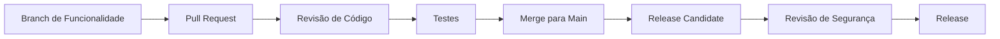

# Contribuindo

## Outros idiomas


## Índice


---

## Visão Geral

O Symbiont recebe contribuições da comunidade com satisfação! Seja corrigindo bugs, adicionando funcionalidades, melhorando a documentação ou fornecendo feedback, suas contribuições ajudam a tornar o Symbiont melhor para todos.

### Formas de Contribuir

- **Relatos de Bugs**: Ajude a identificar e resolver problemas
- **Solicitações de Funcionalidades**: Sugira novas capacidades e melhorias
- **Documentação**: Melhore guias, exemplos e documentação de API
- **Contribuições de Código**: Corrija bugs e implemente novas funcionalidades
- **Segurança**: Reporte vulnerabilidades de segurança de forma responsável
- **Testes**: Adicione casos de teste e melhore a cobertura de testes

---

## Primeiros Passos

### Pré-requisitos

Antes de contribuir, certifique-se de ter:

- **Rust 1.82+** com cargo
- **Git** para controle de versão
- **Docker** para testes e desenvolvimento
- **Conhecimento básico** de Rust, princípios de segurança e sistemas de IA

### Configuração do Ambiente de Desenvolvimento

1. **Fork e Clone do Repositório**
```bash
# Faça fork do repositório no GitHub, depois clone seu fork
git clone https://github.com/YOUR_USERNAME/symbiont.git
cd symbiont

# Adicionar remote upstream
git remote add upstream https://github.com/thirdkeyai/symbiont.git
```

2. **Configurar o Ambiente de Desenvolvimento**
```bash
# Instalar dependências Rust
rustup update
rustup component add rustfmt clippy

# Instalar hooks de pre-commit
cargo install pre-commit
pre-commit install

# Compilar o projeto
cargo build
```

3. **Executar Testes**
```bash
# Executar todos os testes
cargo test --workspace

# Executar suítes de testes específicas
cargo test --package symbiont-dsl
cargo test --package symbi-runtime

# Executar com cobertura
cargo tarpaulin --out html
```

4. **Iniciar Serviços de Desenvolvimento**
```bash
# Iniciar serviços necessários com Docker Compose
docker-compose up -d redis postgres

# Verificar se os serviços estão rodando
cargo run --example basic_agent
```

---

## Diretrizes de Desenvolvimento

### Padrões de Código

**Estilo de Código Rust:**
- Use `rustfmt` para formatação consistente
- Siga as convenções de nomenclatura do Rust
- Escreva código Rust idiomático
- Inclua documentação abrangente
- Adicione testes unitários para toda nova funcionalidade

**Requisitos de Segurança:**
- Todo código relacionado à segurança deve ser revisado
- Operações criptográficas devem usar bibliotecas aprovadas
- Validação de entrada é obrigatória para todas as APIs públicas
- Testes de segurança devem acompanhar funcionalidades de segurança

**Diretrizes de Desempenho:**
- Faça benchmark de código crítico para desempenho
- Evite alocações desnecessárias em caminhos quentes
- Use `async`/`await` para operações de I/O
- Profile o uso de memória para funcionalidades que consomem muitos recursos

### Organização do Código

```
symbiont/
├── dsl/                    # Parser e gramática DSL
│   ├── src/
│   ├── tests/
│   └── tree-sitter-symbiont/
├── runtime/                # Sistema de runtime principal
│   ├── src/
│   │   ├── api/           # API HTTP (opcional)
│   │   ├── context/       # Gerenciamento de contexto
│   │   ├── integrations/  # Integrações externas
│   │   ├── rag/           # Motor RAG
│   │   ├── scheduler/     # Agendamento de tarefas
│   │   └── types/         # Definições de tipos principais
│   ├── examples/          # Exemplos de uso
│   ├── tests/             # Testes de integração
│   └── docs/              # Documentação técnica
├── enterprise/             # Funcionalidades enterprise
│   └── src/
└── docs/                  # Documentação da comunidade
```

### Diretrizes de Commits

**Formato de Mensagem de Commit:**
```
<type>(<scope>): <description>

[optional body]

[optional footer]
```

**Tipos:**
- `feat`: Nova funcionalidade
- `fix`: Correção de bug
- `docs`: Alterações na documentação
- `style`: Alterações de estilo de código (formatação, etc.)
- `refactor`: Refatoração de código
- `test`: Adição ou atualização de testes
- `chore`: Tarefas de manutenção

**Exemplos:**
```bash
feat(runtime): add multi-tier sandbox support

Implements Docker, gVisor, and Firecracker isolation tiers with
automatic risk assessment and tier selection.

Closes #123

fix(dsl): resolve parser error with nested policy blocks

The parser was incorrectly handling nested policy definitions,
causing syntax errors for complex security configurations.

docs(security): update cryptographic implementation details

Add detailed documentation for Ed25519 signature implementation
and key management procedures.
```

---

## Tipos de Contribuições

### Relatos de Bugs

Ao relatar bugs, por favor inclua:

**Informações Obrigatórias:**
- Versão e plataforma do Symbiont
- Passos mínimos de reprodução
- Comportamento esperado vs. real
- Mensagens de erro e logs
- Detalhes do ambiente

**Template de Relato de Bug:**
```markdown
## Descrição do Bug
Descrição breve do problema

## Passos para Reproduzir
1. Passo um
2. Passo dois
3. Passo três

## Comportamento Esperado
O que deveria acontecer

## Comportamento Real
O que realmente acontece

## Ambiente
- SO: [ex.: Ubuntu 22.04]
- Versão do Rust: [ex.: 1.88.0]
- Versão do Symbiont: [ex.: 1.0.0]
- Versão do Docker: [se aplicável]

## Contexto Adicional
Qualquer outra informação relevante
```

### Solicitações de Funcionalidades

**Processo de Solicitação de Funcionalidade:**
1. Verifique issues existentes para solicitações similares
2. Crie uma issue detalhada de solicitação de funcionalidade
3. Participe da discussão e design
4. Implemente a funcionalidade seguindo as diretrizes

**Template de Solicitação de Funcionalidade:**
```markdown
## Descrição da Funcionalidade
Descrição clara da funcionalidade proposta

## Motivação
Por que essa funcionalidade é necessária? Que problema ela resolve?

## Design Detalhado
Como essa funcionalidade deve funcionar? Inclua exemplos se possível.

## Alternativas Consideradas
Que outras soluções foram consideradas?

## Notas de Implementação
Quaisquer considerações técnicas ou restrições
```

### Contribuições de Código

**Processo de Pull Request:**

1. **Criar Branch de Funcionalidade**
```bash
git checkout -b feature/descriptive-name
```

2. **Implementar Alterações**
- Escrever código seguindo as diretrizes de estilo
- Adicionar testes abrangentes
- Atualizar documentação conforme necessário
- Garantir que todos os testes passem

3. **Fazer Commit das Alterações**
```bash
git add .
git commit -m "feat(component): descriptive commit message"
```

4. **Push e Criar PR**
```bash
git push origin feature/descriptive-name
# Criar pull request no GitHub
```

**Requisitos do Pull Request:**
- [ ] Todos os testes passam
- [ ] Código segue as diretrizes de estilo
- [ ] Documentação está atualizada
- [ ] Implicações de segurança são consideradas
- [ ] Impacto no desempenho é avaliado
- [ ] Alterações que quebram compatibilidade são documentadas

### Contribuições de Documentação

**Tipos de Documentação:**
- **Guias do Usuário**: Ajudam usuários a entender e usar funcionalidades
- **Documentação de API**: Referência técnica para desenvolvedores
- **Exemplos**: Exemplos de código funcionais e tutoriais
- **Documentação de Arquitetura**: Design de sistema e detalhes de implementação

**Padrões de Documentação:**
- Escreva prosa clara e concisa
- Inclua exemplos de código funcionais
- Use formatação e estilo consistentes
- Teste todos os exemplos de código
- Atualize documentação relacionada

**Estrutura de Documentação:**
```markdown
---
layout: default
title: Page Title
nav_order: N
description: "Brief page description"
---

# Page Title

Brief introduction paragraph.


---

## Content sections...
```

---

## Diretrizes de Testes

### Tipos de Testes

**Testes Unitários:**
- Testar funções e módulos individuais
- Mockar dependências externas
- Execução rápida (<1s por teste)

```rust
#[cfg(test)]
mod tests {
    use super::*;

    #[test]
    fn test_policy_evaluation() {
        let policy = Policy::new("test_policy", PolicyRules::default());
        let context = PolicyContext::new();
        let result = policy.evaluate(&context);
        assert_eq!(result, PolicyDecision::Allow);
    }
}
```

**Testes de Integração:**
- Testar interações entre componentes
- Usar dependências reais quando possível
- Tempo de execução moderado (<10s por teste)

```rust
#[tokio::test]
async fn test_agent_lifecycle() {
    let runtime = test_runtime().await;
    let agent_config = AgentConfig::default();

    let agent_id = runtime.create_agent(agent_config).await.unwrap();
    let status = runtime.get_agent_status(agent_id).await.unwrap();

    assert_eq!(status, AgentStatus::Ready);
}
```

**Testes de Segurança:**
- Testar controles e políticas de segurança
- Verificar operações criptográficas
- Testar cenários de ataque

```rust
#[tokio::test]
async fn test_sandbox_isolation() {
    let sandbox = create_test_sandbox(SecurityTier::Tier2).await;

    // Tentativa de acessar recurso restrito
    let result = sandbox.execute_malicious_code().await;

    // Deve ser bloqueado pelos controles de segurança
    assert!(result.is_err());
    assert_eq!(result.unwrap_err(), SandboxError::AccessDenied);
}
```

### Dados de Teste

**Fixtures de Teste:**
- Use dados de teste consistentes entre os testes
- Evite valores hardcoded quando possível
- Limpe dados de teste após a execução

```rust
pub fn create_test_agent_config() -> AgentConfig {
    AgentConfig {
        id: AgentId::new(),
        name: "test_agent".to_string(),
        security_tier: SecurityTier::Tier1,
        memory_limit: 512 * 1024 * 1024, // 512MB
        capabilities: vec!["test".to_string()],
        policies: vec![],
        metadata: HashMap::new(),
    }
}
```

---

## Considerações de Segurança

### Processo de Revisão de Segurança

**Alterações Sensíveis à Segurança:**
Todas as alterações que afetam a segurança devem passar por revisão adicional:

- Implementações criptográficas
- Autenticação e autorização
- Validação e sanitização de entrada
- Mecanismos de sandbox e isolamento
- Sistemas de auditoria e logging

**Lista de Verificação de Revisão de Segurança:**
- [ ] Modelo de ameaças atualizado se necessário
- [ ] Testes de segurança adicionados
- [ ] Bibliotecas criptográficas são aprovadas
- [ ] Validação de entrada é abrangente
- [ ] Tratamento de erros não vaza informações
- [ ] Logging de auditoria está completo

### Relato de Vulnerabilidades

**Divulgação Responsável:**
Se você descobrir uma vulnerabilidade de segurança:

1. **NAO** crie uma issue pública
2. Envie email para security@thirdkey.ai com detalhes
3. Forneça passos de reprodução se possível
4. Permita tempo para investigação e correção
5. Coordene o cronograma de divulgação

**Template de Relatório de Segurança:**
```
Subject: Security Vulnerability in Symbiont

Component: [componente afetado]
Severity: [critical/high/medium/low]
Description: [descrição detalhada]
Reproduction: [passos para reproduzir]
Impact: [impacto potencial]
Suggested Fix: [se aplicável]
```

---

## Processo de Revisão

### Diretrizes de Revisão de Código

**Para Autores:**
- Mantenha alterações focadas e atômicas
- Escreva mensagens de commit claras
- Adicione testes para novas funcionalidades
- Atualize documentação conforme necessário
- Responda prontamente ao feedback de revisão

**Para Revisores:**
- Foque na correção e segurança do código
- Verifique aderência às diretrizes
- Confirme que a cobertura de testes é adequada
- Garanta que a documentação está atualizada
- Seja construtivo e prestativo

**Critérios de Revisão:**
- **Correção**: O código funciona conforme o esperado?
- **Segurança**: Há alguma implicação de segurança?
- **Desempenho**: O desempenho é aceitável?
- **Manutenibilidade**: O código é legível e manutenível?
- **Testes**: Os testes são abrangentes e confiáveis?

### Requisitos de Merge

**Todos os PRs devem:**
- [ ] Passar em todos os testes automatizados
- [ ] Ter pelo menos uma revisão aprovada
- [ ] Incluir documentação atualizada
- [ ] Seguir padrões de codificação
- [ ] Incluir testes apropriados

**PRs Sensíveis à Segurança devem:**
- [ ] Ter revisão da equipe de segurança
- [ ] Incluir testes de segurança
- [ ] Atualizar modelo de ameaças se necessário
- [ ] Ter documentação de trilha de auditoria

---

## Diretrizes da Comunidade

### Código de Conduta

Estamos comprometidos em fornecer um ambiente acolhedor e inclusivo para todos os contribuidores. Por favor, leia e siga nosso [Código de Conduta](CODE_OF_CONDUCT.md).

**Princípios Fundamentais:**
- **Respeito**: Trate todos os membros da comunidade com respeito
- **Inclusão**: Acolha perspectivas e origens diversas
- **Colaboração**: Trabalhe junto de forma construtiva
- **Aprendizado**: Apoie o aprendizado e o crescimento
- **Qualidade**: Mantenha altos padrões para código e comportamento

### Comunicação

**Canais:**
- **GitHub Issues**: Relatos de bugs e solicitações de funcionalidades
- **GitHub Discussions**: Perguntas gerais e ideias
- **Pull Requests**: Revisão de código e colaboração
- **Email**: security@thirdkey.ai para questões de segurança

**Diretrizes de Comunicação:**
- Seja claro e conciso
- Mantenha o foco no assunto
- Seja paciente e prestativo
- Use linguagem inclusiva
- Respeite diferentes pontos de vista

---

## Reconhecimento

### Contribuidores

Reconhecemos e apreciamos todas as formas de contribuição:

- **Contribuidores de Código**: Listados em CONTRIBUTORS.md
- **Contribuidores de Documentação**: Creditados na documentação
- **Relatores de Bugs**: Mencionados nas notas de release
- **Pesquisadores de Segurança**: Creditados nos avisos de segurança

### Níveis de Contribuidor

**Contribuidor da Comunidade:**
- Enviar pull requests
- Relatar bugs e problemas
- Participar de discussões

**Contribuidor Regular:**
- Contribuições de qualidade consistente
- Ajudar na revisão de pull requests
- Orientar novos contribuidores

**Mantenedor:**
- Membro da equipe principal
- Permissões de merge
- Gerenciamento de releases
- Direção do projeto

---

## Obtendo Ajuda

### Recursos

- **Documentação**: Guias e referências completos
- **Exemplos**: Exemplos de código funcionais em `/examples`
- **Testes**: Casos de teste mostrando comportamento esperado
- **Issues**: Pesquise issues existentes para soluções

### Canais de Suporte

**Suporte da Comunidade:**
- GitHub Issues para bugs e solicitações de funcionalidades
- GitHub Discussions para perguntas e ideias
- Stack Overflow com tag `symbiont`

**Suporte Direto:**
- Email: support@thirdkey.ai
- Segurança: security@thirdkey.ai

### FAQ

**P: Como começo a contribuir?**
R: Comece configurando o ambiente de desenvolvimento, lendo a documentação e procurando labels "good first issue".

**P: Quais habilidades preciso para contribuir?**
R: Programação Rust, conhecimento básico de segurança e familiaridade com conceitos de IA/ML são úteis, mas não são necessários para todas as contribuições.

**P: Quanto tempo leva a revisão de código?**
R: Normalmente 1-3 dias úteis para alterações pequenas, mais tempo para alterações complexas ou sensíveis à segurança.

**P: Posso contribuir sem escrever código?**
R: Sim! Documentação, testes, relatos de bugs e solicitações de funcionalidades são contribuições valiosas.

---

## Processo de Release

### Fluxo de Desenvolvimento



### Versionamento

O Symbiont segue o [Versionamento Semântico](https://semver.org/):

- **Major** (X.0.0): Alterações que quebram compatibilidade
- **Minor** (0.X.0): Novas funcionalidades, retrocompatível
- **Patch** (0.0.X): Correções de bugs, retrocompatível

### Cronograma de Releases

- **Releases patch**: Conforme necessário para correções críticas
- **Releases minor**: Mensalmente para novas funcionalidades
- **Releases major**: Trimestralmente para alterações significativas

---

## Próximos Passos

Pronto para contribuir? Veja como começar:

1. **[Configure seu ambiente de desenvolvimento](#configuração-do-ambiente-de-desenvolvimento)**
2. **[Encontre uma boa primeira issue](https://github.com/thirdkeyai/symbiont/labels/good%20first%20issue)**
3. **[Participe da discussão](https://github.com/thirdkeyai/symbiont/discussions)**
4. **[Leia a documentação técnica](/runtime-architecture)**

Obrigado pelo seu interesse em contribuir para o Symbiont! Suas contribuições ajudam a construir o futuro do desenvolvimento de software seguro e nativo de IA.
