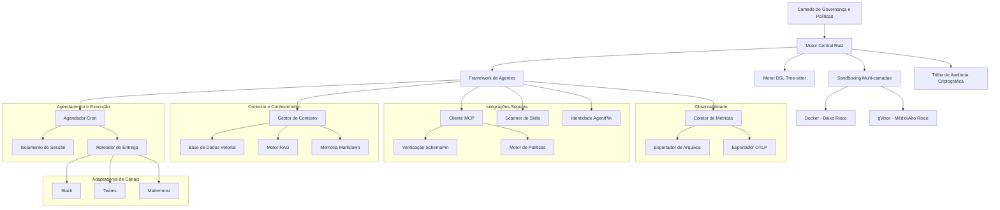

# Documentação do Symbiont

Framework de agentes nativo de IA para construir agentes autônomos e conscientes de políticas com agendamento, adaptadores de canais e identidade criptográfica — construído em Rust.


---

## O que é o Symbiont?

O Symbiont é um framework de agentes nativo de IA para construir agentes autônomos e conscientes de políticas que colaboram com segurança com humanos, outros agentes e modelos de linguagem grandes. Ele fornece uma pilha de produção completa — desde um DSL declarativo e motor de agendamento até adaptadores de canais multi-plataforma e verificação de identidade criptográfica — tudo construído em Rust para performance e segurança.

### Principais Características

- **🛡️ Design Focado em Segurança**: Arquitetura de confiança zero com sandboxing multi-camadas, aplicação de políticas e trilhas de auditoria criptográficas
- **📋 DSL Declarativo**: Linguagem dedicada para definir agentes, políticas, agendamentos e integrações de canais com análise tree-sitter
- **📅 Agendamento de Produção**: Execução de tarefas baseada em cron com isolamento de sessão, roteamento de entrega, filas de mensagens mortas e suporte a jitter
- **💬 Adaptadores de Canais**: Conecte agentes ao Slack, Microsoft Teams e Mattermost com verificação de webhook e mapeamento de identidade
- **🌐 Módulo de Entrada HTTP**: Servidor de webhook para integrações externas com autenticação Bearer/JWT, limitação de taxa e CORS
- **🔑 Identidade AgentPin**: Verificação criptográfica de identidade de agentes via ES256 JWTs ancorados a endpoints well-known
- **🔐 Gestão de Segredos**: Integração com HashiCorp Vault com backends de arquivo criptografado e chaveiro do SO
- **🧠 Contexto e Conhecimento**: Sistemas de conhecimento aprimorados com RAG e busca vetorial (LanceDB embutido por padrão, Qdrant opcional) e embeddings locais opcionais
- **🔗 Integração MCP**: Cliente do Protocolo de Contexto de Modelo com verificação criptográfica de ferramentas via SchemaPin
- **⚡ SDKs Multi-Linguagem**: SDKs JavaScript e Python para acesso completo à API incluindo agendamento, canais e recursos enterprise
- **🔄 Loop de Raciocínio Agêntico**: Ciclo Observe-Reason-Gate-Act (ORGA) com aplicação de typestate, gates de políticas, circuit breakers, journal durável e ponte de conhecimento
- **🧪 Raciocínio Avançado** (`orga-adaptive`): Filtragem de perfil de ferramentas, detecção de loops travados, pré-busca determinística de contexto e convenções com escopo de diretório
- **📜 Motor de Políticas Cedar**: Integração de linguagem de autorização formal para controle de acesso granular
- **🏗️ Alto Desempenho**: Runtime nativo em Rust otimizado para cargas de trabalho de produção com execução assíncrona em toda a pilha
- **🤖 Plugins para Assistentes de IA**: Plugins de governança de primeira parte para [Claude Code](https://github.com/thirdkeyai/symbi-claude-code) e [Gemini CLI](https://github.com/thirdkeyai/symbi-gemini-cli) com aplicação de políticas Cedar, verificação SchemaPin e trilhas de auditoria

### Inicialização de Projeto (`symbi init`)

Scaffolding interativo de projetos com templates baseados em perfis. Escolha entre os perfis minimal, assistant, dev-agent ou multi-agent. Modo de verificação SchemaPin configurável e camadas de sandbox. Inclui um catálogo integrado de agentes para importar agentes governados pré-construídos. Funciona de forma não interativa para pipelines CI/CD com `--no-interact`.

### Execução de Agente Individual (`symbi run`)

Execute qualquer agente diretamente pelo CLI sem iniciar o runtime completo:

```bash
symbi run recon --input '{"target": "10.0.1.5"}'
```

Carrega o DSL do agente, configura o loop de raciocínio ORGA com inferência em nuvem, executa, imprime os resultados e encerra. Resolve nomes de agentes automaticamente a partir do diretório `agents/`.

### Governança de Comunicação Inter-Agente

Todos os builtins inter-agente (`ask`, `delegate`, `send_to`, `parallel`, `race`) são roteados através do CommunicationBus com avaliação de políticas. O `CommunicationPolicyGate` aplica regras no estilo Cedar para chamadas inter-agente — controlando quais agentes podem se comunicar, com avaliação de regras baseada em prioridade e negação firme em violações de política. As mensagens são assinadas criptograficamente, criptografadas e auditadas.

---

## Primeiros Passos

### Instalação Rápida

```bash
# Clonar o repositório
git clone https://github.com/thirdkeyai/symbiont.git
cd symbiont

# Construir container symbi unificado
docker build -t symbi:latest .

# Ou usar container pré-construído
docker pull ghcr.io/thirdkeyai/symbi:latest

# Testar o sistema
cargo test

# Testar o CLI unificado
docker run --rm symbi:latest --version
docker run --rm -v $(pwd):/workspace symbi:latest dsl parse --help
docker run --rm symbi:latest mcp --help
```

### Seu Primeiro Agente

```rust
metadata {
    version = "1.0.0"
    author = "developer"
    description = "Simple analysis agent"
}

agent analyze_data(input: DataSet) -> Result {
    capabilities = ["data_analysis"]

    policy secure_analysis {
        allow: read(input) if input.anonymized == true
        deny: store(input) if input.contains_pii == true
        audit: all_operations with signature
    }

    with memory = "ephemeral", privacy = "high" {
        if (validate_input(input)) {
            result = process_data(input);
            audit_log("analysis_completed", result.metadata);
            return result;
        } else {
            return reject("Invalid input data");
        }
    }
}
```

---

## Visão Geral da Arquitetura



---

## Casos de Uso

### Desenvolvimento e Pesquisa
- Geração segura de código e testes automatizados
- Experimentos de colaboração multi-agente
- Desenvolvimento de sistemas de IA conscientes do contexto

### Aplicações Críticas de Privacidade
- Processamento de dados de saúde com controles de privacidade
- Automação de serviços financeiros com capacidades de auditoria
- Sistemas governamentais e de defesa com recursos de segurança

---

## Status do Projeto

### v1.9.0 Estável

O Symbiont v1.9.0 é a versão estável mais recente, oferecendo um framework completo de agentes de IA com capacidades de nível de produção:

- **Integração ToolClad**: Contratos de ferramentas declarativos com carregamento de manifestos, validação de argumentos, backends HTTP/MCP proxy, injeção de segredos e executores de sessão/navegador
- **CLI `symbi tools`**: Aplicação de escopo, geração de políticas Cedar e observador de recarga automática para manifestos ToolClad
- **Endurecimento de produção**: Canais limitados, sondas de saúde, TTL de segredos, recarga de políticas Cedar, exportação de auditoria e limitação de taxa
- **Correções de segurança**: Mitigação de vetores DoS críticos, endurecimento de validação JWT, prevenção de vazamento de variáveis de ambiente e melhorias no guard do sandbox
- **Propagação W3C Traceparent**: Propagação de contexto de rastreamento distribuído OpenTelemetry através dos limites de agentes
- **Loop de Raciocínio Agêntico**: Ciclo ORGA com aplicação de typestate, conversação multi-turno, inferência em nuvem e SLM, circuit breakers, journal durável e ponte de conhecimento
- **Primitivas de Raciocínio Avançado** (`orga-adaptive`): Filtragem de perfil de ferramentas, detecção de loops travados por passo, pré-busca determinística de contexto e convenções com escopo de diretório
- **Motor de Políticas Cedar**: Autorização formal via integração de linguagem de políticas Cedar (feature `cedar`)
- **Inferência LLM em Nuvem**: Provedor de inferência em nuvem compatível com OpenRouter (feature `cloud-llm`)
- **Modo Agente Autônomo**: Linha única para agentes cloud-native com LLM + ferramentas Composio (feature `standalone-agent`)
- **Backend Vetorial LanceDB Embutido**: Busca vetorial sem configuração — LanceDB padrão, Qdrant opcional via feature flag `vector-qdrant`
- **Pipeline de Compactação de Contexto**: Compactação em camadas com sumarização por LLM e contagem de tokens multi-modelo (OpenAI, Claude, Gemini, Llama, Mistral e mais)
- **Scanner ClawHavoc**: 40 regras de detecção em 10 categorias de ataque com modelo de severidade de 5 níveis e whitelist de executáveis
- **Integração Composio MCP**: Conexão baseada em SSE com feature gate ao servidor Composio MCP para acesso a ferramentas externas
- **Memória Persistente**: Memória de agente baseada em Markdown com fatos, procedimentos, padrões aprendidos e compactação baseada em retenção
- **Verificação de Webhook**: Verificação HMAC-SHA256 e JWT com presets para GitHub, Stripe, Slack e personalizados
- **Fortalecimento de Segurança HTTP**: Binding somente em loopback, listas de permissão CORS, validação JWT EdDSA, separação de endpoint de saúde
- **Métricas e Telemetria**: Exportadores de arquivo e OTLP com fan-out composto, rastreamento distribuído OpenTelemetry
- **Motor de Agendamento**: Execução baseada em cron com isolamento de sessão, roteamento de entrega, filas de mensagens mortas e jitter
- **Adaptadores de Canais**: Slack (comunidade), Microsoft Teams e Mattermost (enterprise) com assinatura HMAC
- **Identidade AgentPin**: Identidade criptográfica de agentes via ES256 JWTs ancorados a endpoints well-known
- **Gestão de Segredos**: Backends HashiCorp Vault, arquivo criptografado e chaveiro do SO
- **SDKs JavaScript e Python**: Clientes de API completos cobrindo agendamento, canais, webhooks, memória, skills e métricas

### 🔮 Roadmap v1.7.0
- ~~Governança de comunicação inter-agente~~ ✅ Enviado
- ~~Inicialização de projeto (`symbi init`)~~ ✅ Enviado
- Integração de agentes externos e suporte ao protocolo A2A
- Suporte RAG multi-modal (imagens, áudio, dados estruturados)
- Adaptadores de canais adicionais (Discord, Matrix)

---

## Comunidade

- **Documentação**: Guias abrangentes e referências de API
  - [Referência da API](api-reference.md)
  - [Guia do Loop de Raciocínio](reasoning-loop.md)
  - [Raciocínio Avançado (orga-adaptive)](orga-adaptive.md)
  - [Guia de Agendamento](scheduling.md)
  - [Módulo de Entrada HTTP](http-input.md)
  - [Guia DSL](dsl-guide.md)
  - [Modelo de Segurança](security-model.md)
  - [Arquitetura de Runtime](runtime-architecture.md)
- **Pacotes**: [crates.io/crates/symbi](https://crates.io/crates/symbi) | [npm symbiont-sdk-js](https://www.npmjs.com/package/symbiont-sdk-js) | [PyPI symbiont-sdk](https://pypi.org/project/symbiont-sdk/)
- **Plugins**: [Claude Code](https://github.com/thirdkeyai/symbi-claude-code) | [Gemini CLI](https://github.com/thirdkeyai/symbi-gemini-cli)
- **Issues**: [GitHub Issues](https://github.com/thirdkeyai/symbiont/issues)
- **Licença**: Software de código aberto da ThirdKey

---

## Próximos Passos

<div class="grid grid-cols-1 md:grid-cols-3 gap-6 mt-8">
  <div class="card">
    <h3>🚀 Começar</h3>
    <p>Siga nosso guia de introdução para configurar seu primeiro ambiente Symbiont.</p>
    <a href="/getting-started" class="btn btn-outline">Guia de Início Rápido</a>
  </div>

  <div class="card">
    <h3>📖 Aprender o DSL</h3>
    <p>Domine o DSL do Symbiont para construir agentes conscientes de políticas.</p>
    <a href="/dsl-guide" class="btn btn-outline">Documentação DSL</a>
  </div>

  <div class="card">
    <h3>🏗️ Arquitetura</h3>
    <p>Compreenda o sistema de runtime e o modelo de segurança.</p>
    <a href="/runtime-architecture" class="btn btn-outline">Guia de Arquitetura</a>
  </div>
</div>
