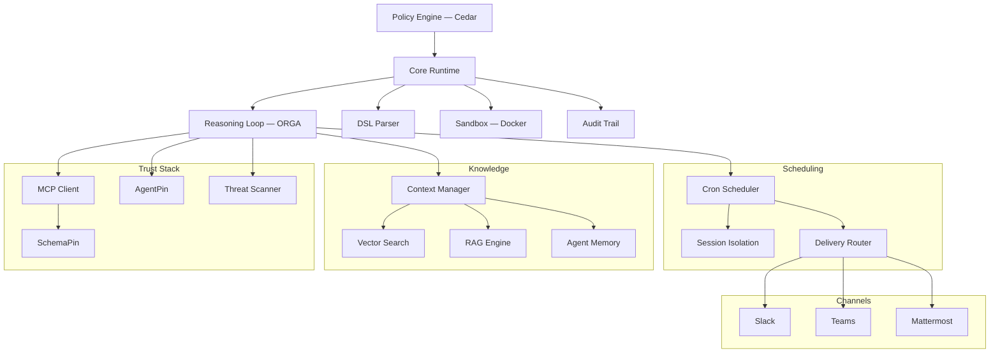

# Documentacao do Symbiont

Runtime de agentes governado por politicas para producao. Execute agentes de IA e ferramentas sob controles explicitos de politicas, identidade e auditoria.

## O que e o Symbiont?

O Symbiont e um runtime nativo em Rust para executar agentes de IA e ferramentas sob controles explicitos de politicas, identidade e auditoria.

A maioria dos frameworks de agentes foca em orquestracao. O Symbiont foca no que acontece quando agentes precisam rodar em ambientes reais com risco real: ferramentas nao confiaveis, dados sensiveis, limites de aprovacao, requisitos de auditoria e aplicacao repetivel.

### Como funciona

O Symbiont separa a intencao do agente da autoridade de execucao:

1. **Agentes propoem** acoes atraves do loop de raciocinio (Observe-Reason-Gate-Act)
2. **O runtime avalia** cada acao contra verificacoes de politica, identidade e confianca
3. **A politica decide** — acoes permitidas sao executadas; acoes negadas sao bloqueadas ou encaminhadas para aprovacao
4. **Tudo e registrado** — trilha de auditoria a prova de adulteracao para cada decisao

A saida do modelo nunca e tratada como autoridade de execucao. O runtime controla o que realmente acontece.

### Capacidades principais

| Capacidade | O que faz |
|-----------|-------------|
| **Motor de politicas** | Autorizacao granular com [Cedar](https://www.cedarpolicy.com/) para acoes de agentes, chamadas de ferramentas e acesso a recursos |
| **Verificacao de ferramentas** | Verificacao criptografica [SchemaPin](https://schemapin.org) de esquemas de ferramentas MCP antes da execucao |
| **Identidade de agentes** | Identidade ES256 ancorada ao dominio com [AgentPin](https://agentpin.org) para agentes e tarefas agendadas |
| **Loop de raciocinio** | Ciclo Observe-Reason-Gate-Act com aplicacao de typestate, gates de politicas e circuit breakers |
| **Sandboxing** | Isolamento baseado em Docker com limites de recursos para cargas de trabalho nao confiaveis |
| **Registro de auditoria** | Logs a prova de adulteracao com registros estruturados para cada decisao de politica |
| **Gestao de segredos** | Integracao com Vault/OpenBao, armazenamento criptografado AES-256-GCM, com escopo por agente |
| **Integracao MCP** | Suporte nativo ao Model Context Protocol com acesso governado a ferramentas |

Capacidades adicionais: varredura de ameacas para conteudo de ferramentas/habilidades, agendamento cron, memoria persistente de agentes, busca RAG hibrida (LanceDB/Qdrant), verificacao de webhooks, roteamento de entregas, telemetria OTLP, endurecimento de seguranca HTTP, adaptadores de canal (Slack/Teams/Mattermost), e plugins de governanca para [Claude Code](https://github.com/thirdkeyai/symbi-claude-code) e [Gemini CLI](https://github.com/thirdkeyai/symbi-gemini-cli).

---

## Inicio rapido

### Criar e executar um projeto (Docker, ~60 segundos)

```bash
# 1. Cria o projeto. Gera symbiont.toml, agents/, policies/,
#    docker-compose.yml e um .env com SYMBIONT_MASTER_KEY recem-gerada.
docker run --rm -v $(pwd):/workspace ghcr.io/thirdkeyai/symbi:latest \
  init --profile assistant --no-interact --dir /workspace

# 2. Inicia o runtime. Le o .env automaticamente.
docker compose up
```

API do runtime em `http://localhost:8080`, HTTP Input em `http://localhost:8081`.

### Instalacao (sem Docker)

**Script de instalacao (macOS / Linux):**
```bash
curl -fsSL https://symbiont.dev/install.sh | bash
```

**Homebrew (macOS):**
```bash
brew tap thirdkeyai/tap
brew install symbi
```

**A partir do codigo-fonte:**
```bash
git clone https://github.com/thirdkeyai/symbiont.git
cd symbiont
cargo build --release
```

Binarios pre-compilados tambem estao disponiveis em [GitHub Releases](https://github.com/thirdkeyai/symbiont/releases). Consulte o [Guia de introducao](/getting-started) para detalhes completos.

### Seu primeiro agente

```symbiont
agent secure_analyst(input: DataSet) -> Result {
    policy access_control {
        allow: read(input) if input.verified == true
        deny: send_email without approval
        audit: all_operations
    }

    with memory = "persistent", requires = "approval" {
        result = analyze(input);
        return result;
    }
}
```

Consulte o [guia DSL](/dsl-guide) para a gramatica completa incluindo blocos `metadata`, `schedule`, `webhook` e `channel`.

### Scaffolding de projeto

```bash
symbi init        # Configuracao interativa de projeto — gera symbiont.toml, agents/,
                  # policies/, docker-compose.yml e um .env com SYMBIONT_MASTER_KEY
                  # gerada. Passe --dir <PATH> para alvejar um diretorio especifico
                  # (obrigatorio ao rodar dentro de um container).
symbi run agent   # Executar um unico agente sem iniciar o runtime completo
symbi up          # Iniciar o runtime completo com auto-configuracao
```

---

## Arquitetura



---

## Modelo de seguranca

O Symbiont e projetado em torno de um principio simples: **a saida do modelo nunca deve ser confiada como autoridade de execucao.**

As acoes fluem atraves de controles do runtime:

- **Confianca zero** — todas as entradas de agentes sao nao confiaveis por padrao
- **Verificacoes de politica** — autorizacao Cedar antes de cada chamada de ferramenta e acesso a recursos
- **Verificacao de ferramentas** — verificacao criptografica SchemaPin de esquemas de ferramentas
- **Limites de sandbox** — isolamento Docker para execucao nao confiavel
- **Aprovacao do operador** — gates de revisao humana para acoes sensiveis
- **Controle de segredos** — backends Vault/OpenBao, armazenamento local criptografado, namespaces de agentes
- **Registro de auditoria** — registros criptograficamente a prova de adulteracao de cada decisao

Consulte o guia do [Modelo de seguranca](/security-model) para detalhes completos.

---

## Guias

- [Introducao](/getting-started) — Instalacao, configuracao, primeiro agente
- [Modelo de seguranca](/security-model) — Arquitetura de confianca zero, aplicacao de politicas
- [Arquitetura do runtime](/runtime-architecture) — Internos do runtime e modelo de execucao
- [Loop de raciocinio](/reasoning-loop) — Ciclo ORGA, gates de politicas, circuit breakers
- [Guia DSL](/dsl-guide) — Referencia da linguagem de definicao de agentes
- [Referencia de API](/api-reference) — Endpoints HTTP API e configuracao
- [Agendamento](/scheduling) — Motor cron, roteamento de entregas, filas de mensagens mortas
- [Entrada HTTP](/http-input) — Servidor de webhooks, autenticacao, limitacao de taxa

---

## Comunidade e recursos

- **Pacotes**: [crates.io/crates/symbi](https://crates.io/crates/symbi) | [npm symbiont-sdk-js](https://www.npmjs.com/package/symbiont-sdk-js) | [PyPI symbiont-sdk](https://pypi.org/project/symbiont-sdk/)
- **SDKs**: [JavaScript/TypeScript](https://github.com/ThirdKeyAI/symbiont-sdk-js) | [Python](https://github.com/ThirdKeyAI/symbiont-sdk-python)
- **Plugins**: [Claude Code](https://github.com/thirdkeyai/symbi-claude-code) | [Gemini CLI](https://github.com/thirdkeyai/symbi-gemini-cli)
- **Issues**: [GitHub Issues](https://github.com/thirdkeyai/symbiont/issues)
- **Licenca**: Apache 2.0 (Community Edition)

---

## Proximos passos

<div class="grid grid-cols-1 md:grid-cols-3 gap-6 mt-8">
  <div class="card">
    <h3>Comecar</h3>
    <p>Instale o Symbiont e execute seu primeiro agente governado.</p>
    <a href="/getting-started" class="btn btn-outline">Guia de inicio rapido</a>
  </div>

  <div class="card">
    <h3>Modelo de seguranca</h3>
    <p>Entenda os limites de confianca e a aplicacao de politicas.</p>
    <a href="/security-model" class="btn btn-outline">Guia de seguranca</a>
  </div>

  <div class="card">
    <h3>Referencia DSL</h3>
    <p>Aprenda a linguagem de definicao de agentes.</p>
    <a href="/dsl-guide" class="btn btn-outline">Guia DSL</a>
  </div>
</div>
