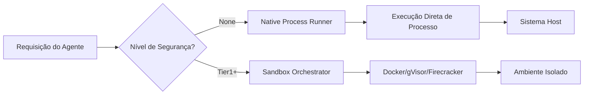

# Modo de Execução Nativa (Sem Docker/Isolamento)

## Outros idiomas


O Symbiont suporta a execução de agentes sem Docker ou isolamento de containers para ambientes de desenvolvimento ou implantações confiáveis onde desempenho máximo e dependências mínimas são desejados.

## Avisos de Segurança

**IMPORTANTE**: O modo de execução nativa ignora todos os controles de segurança baseados em container:

- Sem isolamento de processos
- Sem isolamento de sistema de arquivos
- Sem isolamento de rede
- Sem imposição de limites de recursos
- Acesso direto ao sistema host

> **A feature `native-sandbox` não compila em builds de release.** Ela é protegida por um `compile_error!` sob `not(debug_assertions)`, de modo que um binário de release nunca pode incluir o runner nativo. É um auxílio de desenvolvimento somente para debug.

**USE APENAS PARA**:
- Desenvolvimento local com código confiável
- Ambientes controlados com agentes confiáveis
- Testes e depuração
- Ambientes onde Docker não está disponível

**NAO USE PARA**:
- Ambientes de produção com código não confiável
- Implantações multi-tenant
- Serviços expostos publicamente
- Processamento de entrada de usuários não confiáveis

## Arquitetura

### Hierarquia de Níveis de Sandbox

```
┌─────────────────────────────────────────┐
│ SecurityTier::None (Execução Nativa)    │ ← Sem isolamento
├─────────────────────────────────────────┤
│ SecurityTier::Tier1 (Docker)            │ ← Isolamento de container
├─────────────────────────────────────────┤
│ SecurityTier::Tier2 (gVisor)            │ ← Isolamento aprimorado
├─────────────────────────────────────────┤
│ SecurityTier::Tier3 (Firecracker)       │ ← Isolamento máximo
└─────────────────────────────────────────┘
```

### Fluxo de Execução Nativa



## Configuração

### Opção 1: Configuração TOML

```toml
# symbiont.toml

[security]
# Permitir execução nativa (padrão: false)
allow_native_execution = true

# A execução nativa é sua própria seção de nível superior (não aninhada sob [security]).
[native_execution]
enabled = true
default_executable = "python3"
working_directory = "/tmp/symbiont-native"
# Aplicar limites de recursos do SO mesmo em modo nativo
enforce_resource_limits = true
max_memory_mb = 2048              # Option<u64>
max_cpu_seconds = 300             # Option<u64> — tempo de CPU, não contagem de núcleos
max_execution_time_seconds = 300  # timeout de relógio
allowed_executables = ["python3", "node", "bash"]
```

### Exemplo de Configuração Completa

Um `config.toml` completo com execução nativa junto com outras configurações do sistema:

```toml
# config.toml
[api]
port = 8080
host = "127.0.0.1"
timeout_seconds = 30
max_body_size = 10485760

[database]
# Dimensão do vetor de embedding. O LanceDB (backend embarcado padrão) não
# precisa de configuração adicional. O backend é escolhido em tempo de compilação
# via a feature Cargo `vector-lancedb` (padrão) ou `vector-qdrant` — não existe
# chave de configuração `vector_backend`; use a variável de ambiente
# SYMBIONT_VECTOR_BACKEND para alternar em tempo de execução.
vector_dimension = 384

# Usado ao executar com o backend Qdrant (SYMBIONT_VECTOR_BACKEND=qdrant):
# qdrant_url = "http://localhost:6333"
# qdrant_collection = "symbiont"

[logging]
level = "info"
format = "Pretty"
structured = true

[security]
key_provider = { Environment = { var_name = "SYMBIONT_KEY" } }
enable_compression = true
enable_backups = true
enable_safety_checks = true

[storage]
context_path = "./data/context"
git_clone_path = "./data/git"
backup_path = "./data/backups"
max_context_size_mb = 1024

[native_execution]
enabled = true
default_executable = "python3"
working_directory = "/tmp/symbiont-native"
enforce_resource_limits = true
max_memory_mb = 2048
max_cpu_seconds = 300
max_execution_time_seconds = 300
allowed_executables = ["python3", "python", "node", "bash", "sh"]
```

### Campos de NativeExecutionConfig

| Campo | Tipo | Padrão | Descrição |
|-------|------|--------|-----------|
| `enabled` | bool | `false` | Habilitar modo de execução nativa |
| `default_executable` | string | `"bash"` | Interpretador/shell padrão |
| `working_directory` | path | `/tmp/symbiont-native` | Diretório de execução |
| `enforce_resource_limits` | bool | `true` | Aplicar limites no nível do SO |
| `max_memory_mb` | Option<u64> | `Some(2048)` | Limite de memória em MB |
| `max_cpu_seconds` | Option<u64> | `Some(300)` | Limite de tempo de CPU |
| `max_execution_time_seconds` | u64 | `300` | Timeout de relógio |
| `allowed_executables` | Vec<String> | `[bash, python3, etc.]` | Lista de executáveis permitidos |

### Opção 2: Proteções de segurança de runtime (ambiente)

Não existem configurações `SYMBIONT_NATIVE_*` / `SYMBIONT_ALLOW_NATIVE_EXECUTION` /
`SYMBIONT_DEFAULT_SANDBOX_TIER` — a execução nativa é configurada através da
seção de configuração `[native_execution]` acima. As únicas variáveis de
ambiente relacionadas ao modo nativo são as duas proteções de segurança de
runtime, ambas as quais devem ser definidas para realmente executar o runner
nativo (sem isolamento):

```bash
export SYMBI_UNSAFE_NATIVE_SANDBOX=1   # reconhece o runner nativo
export SYMBIONT_ALLOW_UNISOLATED=1     # permite SandboxTier::None
```

### Opção 3: Configuração por Agente

```symbi
metadata {
  version = "1.0.0"
  description = "Local Development Agent"
}

agent native_worker(task: String) -> String {
  capabilities = ["local_filesystem", "network"]

  policy dev_only {
    allow: ["local_filesystem", "network"] if true
  }

  # tier 0 = sem sandbox (execução no host); requer os opt-ins acima
  with sandbox = "none" {
    return process(task);
  }
}
```

## Exemplos de Uso

### Exemplo 1: Modo de Desenvolvimento

```rust
use symbi_runtime::{Config, SecurityTier, SandboxOrchestrator};

#[tokio::main]
async fn main() -> Result<(), Box<dyn std::error::Error>> {
    // Habilitar execução nativa para desenvolvimento
    let mut config = Config::default();
    config.security.allow_native_execution = true;

    let orchestrator = SandboxOrchestrator::new(config)?;

    // Executar código nativamente
    let result = orchestrator.execute_code(
        SecurityTier::None,
        "print('Hello from native execution!')",
        HashMap::new()
    ).await?;

    println!("Output: {}", result.stdout);
    Ok(())
}
```

### Exemplo 2: Compilando e executando com o runner nativo

Não existe uma flag de CLI `--native`. A execução nativa (no host) requer três opt-ins explícitos:

1. **Compile com a feature `native-sandbox` — apenas builds de debug.** A feature não oferece isolamento algum e é protegida por um `compile_error!` em builds de release:

   ```bash
   cargo build --features native-sandbox    # apenas debug; release não compila
   ```

2. **Reconheça ambas as proteções de runtime:**

   ```bash
   export SYMBI_UNSAFE_NATIVE_SANDBOX=1   # reconhece o runner nativo
   export SYMBIONT_ALLOW_UNISOLATED=1     # permite SandboxTier::None em execuções não-dev
   ```

3. **Selecione o tier 0 (sem sandbox) na DSL do agente:**

   ```
   with sandbox = "none" {
       // ...
   }
   ```

   Os limites de recursos (memória/CPU/timeout) vêm do bloco `with` / configuração (veja acima), não de flags de CLI.

Em seguida, execute normalmente:

```bash
symbi run agent.symbi
```

### Exemplo 3: Execução Mista

```rust
// Usar execução nativa para operações locais confiáveis
let local_result = orchestrator.execute_code(
    SecurityTier::None,
    local_code,
    env_vars
).await?;

// Usar Docker para operações externas/não confiáveis
let isolated_result = orchestrator.execute_code(
    SecurityTier::Tier1,
    untrusted_code,
    env_vars
).await?;
```

## Detalhes de Implementação

### Native Process Runner

O runner nativo usa `std::process::Command` com limites de recursos opcionais:

```rust
pub struct NativeRunner {
    config: NativeConfig,
}

impl NativeRunner {
    pub async fn execute(&self, code: &str, env: HashMap<String, String>)
        -> Result<ExecutionResult> {
        // Execução direta de processo
        let mut command = Command::new(&self.config.executable);
        command.current_dir(&self.config.working_dir);
        command.envs(env);

        // Opcional: Aplicar limites de recursos via rlimit (Unix)
        #[cfg(unix)]
        if self.config.enforce_limits {
            self.apply_resource_limits(&mut command)?;
        }

        let output = command.output().await?;

        Ok(ExecutionResult {
            stdout: String::from_utf8_lossy(&output.stdout).to_string(),
            stderr: String::from_utf8_lossy(&output.stderr).to_string(),
            exit_code: output.status.code().unwrap_or(-1),
            success: output.status.success(),
        })
    }
}
```

### Limites de Recursos (Unix)

Em sistemas Unix, a execução nativa ainda pode impor alguns limites:

- **Memória**: Usando `setrlimit(RLIMIT_AS)`
- **Tempo de CPU**: Usando `setrlimit(RLIMIT_CPU)`
- **Contagem de Processos**: Usando `setrlimit(RLIMIT_NPROC)`
- **Tamanho de Arquivo**: Usando `setrlimit(RLIMIT_FSIZE)`

### Suporte de Plataformas

| Plataforma | Execução Nativa | Limites de Recursos |
|------------|----------------|---------------------|
| Linux      | Completo       | rlimit              |
| macOS      | Completo       | Parcial             |
| Windows    | Completo       | Limitado            |

## Migração do Docker

### Passo 1: Atualizar Configuração

```diff
# config.toml
[security]
- default_sandbox_tier = "Tier1"
+ default_sandbox_tier = "None"
+ allow_native_execution = true
```

### Passo 2: Remover Dependências do Docker

```bash
# Não é mais necessário
# docker build -t symbi:latest .
# docker run ...

# Execução direta
cargo build --release
./target/release/symbi run agent.symbi
```

### Abordagem Híbrida

Use ambos os modos de execução estrategicamente -- nativo para operações locais confiáveis, Docker para código não confiável:

```rust
// Operações locais confiáveis
let local_result = orchestrator.execute_code(
    SecurityTier::None,  // Nativo
    trusted_code,
    env
).await?;

// Operações externas/não confiáveis
let isolated_result = orchestrator.execute_code(
    SecurityTier::Tier1,  // Docker
    external_code,
    env
).await?;
```

### Passo 3: Gerenciar Variáveis de Ambiente

O Docker isolava automaticamente as variáveis de ambiente. Com execução nativa, defina-as explicitamente:

```bash
export AGENT_API_KEY="xxx"
export AGENT_DB_URL="postgresql://..."
export SYMBI_UNSAFE_NATIVE_SANDBOX=1
export SYMBIONT_ALLOW_UNISOLATED=1
symbi run agent.symbi   # o agente deve declarar: with sandbox = "none" { ... }
```

## Comparação de Desempenho

| Modo | Inicialização | Throughput | Memória | Isolamento |
|------|---------------|------------|---------|------------|
| Nativo | ~10ms | 100% | Mínima | Nenhum |
| Docker | ~500ms | ~95% | +128MB | Bom |
| gVisor | ~800ms | ~70% | +256MB | Melhor |
| Firecracker | ~125ms | ~90% | +64MB | Ótimo |

## Solução de Problemas

### Problema: Permissão Negada

```bash
# Solução: Garantir que o diretório de trabalho seja gravável
mkdir -p /tmp/symbiont-native
chmod 755 /tmp/symbiont-native
```

### Problema: Comando Não Encontrado

```bash
# Solução: Garantir que o executável está no PATH ou usar caminho absoluto
export PATH=$PATH:/usr/local/bin
# Ou configurar caminho absoluto
allowed_executables = ["/usr/bin/python3", "/usr/bin/node"]
```

### Problema: Limites de Recursos Não Aplicados

A execução nativa no Windows possui suporte limitado a limites de recursos. Considere:
- Usar Job Objects (específico do Windows)
- Monitorar e encerrar processos descontrolados
- Migrar para execução baseada em container

## Boas Práticas

1. **Apenas para Desenvolvimento**: Use execução nativa primariamente para desenvolvimento
2. **Migração Gradual**: Comece com containers, migre para nativo quando estável
3. **Monitoramento**: Mesmo sem isolamento, monitore o uso de recursos
4. **Listas de Permissão**: Restrinja executáveis e caminhos permitidos
5. **Logging**: Habilite logging de auditoria abrangente
6. **Testes**: Teste com containers antes de implantar nativamente

## Lista de Verificação de Segurança

Antes de habilitar a execução nativa em qualquer ambiente:

- [ ] Todo código de agente é de fontes confiáveis
- [ ] O ambiente está isolado da produção
- [ ] Nenhuma entrada externa de usuário é processada
- [ ] Monitoramento e logging estão habilitados
- [ ] Limites de recursos estão configurados
- [ ] Lista de executáveis permitidos é restritiva
- [ ] Acesso ao sistema de arquivos é limitado
- [ ] A equipe compreende as implicações de segurança

## Documentação Relacionada

- [Modelo de Segurança](security-model.pt.md) - Arquitetura completa de segurança
- [Arquitetura de Sandbox](runtime-architecture.pt.md#sandbox-architecture) - Níveis de container
- [Guia de Configuração](getting-started.pt.md#configuration) - Opções de configuração
- [Diretivas de Segurança DSL](dsl-guide.pt.md#security) - Segurança no nível do agente

---

**Lembre-se**: A execução nativa troca segurança por conveniência. Sempre compreenda os riscos e aplique controles apropriados para seu ambiente de implantação.
