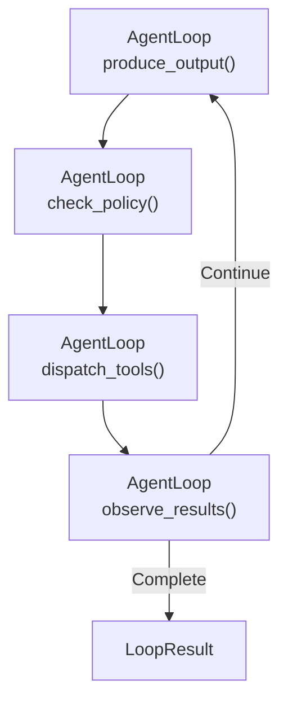

# Guia do Loop de Raciocínio

## Outros idiomas


## Índice


---

## Visão Geral

O loop de raciocínio é o motor de execução principal para agentes autônomos no Symbiont. Ele conduz uma conversa multi-turno entre um LLM, um portão de políticas e ferramentas externas através de um ciclo estruturado:

1. **Observe** — Coleta resultados de execuções anteriores de ferramentas
2. **Reason** — LLM produz ações propostas (chamadas de ferramentas ou respostas de texto)
3. **Gate** — Motor de políticas avalia cada ação proposta
4. **Act** — Ações aprovadas são despachadas para executores de ferramentas

O loop continua até que o LLM produza uma resposta final de texto, atinja limites de iteração/tokens ou expire por timeout.

### Princípios de Design

- **Segurança em tempo de compilação**: Transições de fase inválidas são detectadas em tempo de compilação através do sistema de tipos do Rust
- **Complexidade opcional**: O loop funciona apenas com um provedor e portão de políticas; ponte de conhecimento, políticas Cedar e human-in-the-loop são todos opcionais
- **Retrocompatível**: Adicionar novos recursos (como a ponte de conhecimento) nunca quebra código existente
- **Observável**: Cada fase emite eventos de journal e spans de tracing

---

## Início Rápido

### Exemplo Mínimo

```rust
use std::sync::Arc;
use symbi_runtime::reasoning::circuit_breaker::CircuitBreakerRegistry;
use symbi_runtime::reasoning::context_manager::DefaultContextManager;
use symbi_runtime::reasoning::conversation::{Conversation, ConversationMessage};
use symbi_runtime::reasoning::executor::DefaultActionExecutor;
use symbi_runtime::reasoning::loop_types::{BufferedJournal, LoopConfig};
use symbi_runtime::reasoning::policy_bridge::DefaultPolicyGate;
use symbi_runtime::reasoning::reasoning_loop::ReasoningLoopRunner;
use symbi_runtime::types::AgentId;

// Set up the runner with default components
let runner = ReasoningLoopRunner {
    provider: Arc::new(my_inference_provider),
    policy_gate: Arc::new(DefaultPolicyGate::permissive()),
    executor: Arc::new(DefaultActionExecutor::default()),
    context_manager: Arc::new(DefaultContextManager::default()),
    circuit_breakers: Arc::new(CircuitBreakerRegistry::default()),
    journal: Arc::new(BufferedJournal::new(1000)),
    knowledge_bridge: None,
};

// Build a conversation
let mut conv = Conversation::with_system("You are a helpful assistant.");
conv.push(ConversationMessage::user("What is 6 * 7?"));

// Run the loop
let result = runner.run(AgentId::new(), conv, LoopConfig::default()).await;

println!("Output: {}", result.output);
println!("Iterations: {}", result.iterations);
println!("Tokens used: {}", result.total_usage.total_tokens);
```

### Com Definições de Ferramentas

```rust
use symbi_runtime::reasoning::inference::ToolDefinition;

let config = LoopConfig {
    max_iterations: 10,
    tool_definitions: vec![
        ToolDefinition {
            name: "web_search".into(),
            description: "Search the web for information".into(),
            parameters: serde_json::json!({
                "type": "object",
                "properties": {
                    "query": { "type": "string" }
                },
                "required": ["query"]
            }),
        },
    ],
    ..Default::default()
};

let result = runner.run(agent_id, conv, config).await;
```

---

## Sistema de Fases

### Padrão Typestate

O loop utiliza o sistema de tipos do Rust para impor transições de fase válidas em tempo de compilação. Cada fase é um marcador de tipo de tamanho zero:

```rust
pub struct Reasoning;      // LLM produces proposed actions
pub struct PolicyCheck;    // Each action evaluated by the gate
pub struct ToolDispatching; // Approved actions executed
pub struct Observing;      // Results collected for next iteration
```

A struct `AgentLoop<Phase>` carrega o estado do loop e só pode chamar métodos apropriados para sua fase atual. Por exemplo, `AgentLoop<Reasoning>` expõe apenas `produce_output()`, que consome self e retorna `AgentLoop<PolicyCheck>`.

Isso significa que os seguintes erros são **erros de compilação**, não bugs de runtime:
- Pular a verificação de política
- Despachar ferramentas sem raciocinar primeiro
- Observar resultados sem despachar

### Fluxo de Fases



---

## Provedores de Inferência

A trait `InferenceProvider` abstrai backends de LLM:

```rust
#[async_trait]
pub trait InferenceProvider: Send + Sync {
    async fn complete(
        &self,
        conversation: &Conversation,
        options: &InferenceOptions,
    ) -> Result<InferenceResponse, InferenceError>;

    fn provider_name(&self) -> &str;
    fn default_model(&self) -> &str;
    fn supports_native_tools(&self) -> bool;
    fn supports_structured_output(&self) -> bool;
}
```

### Provedor Cloud (OpenRouter)

O `CloudInferenceProvider` conecta ao OpenRouter (ou qualquer endpoint compatível com OpenAI):

```bash
export OPENROUTER_API_KEY="sk-or-..."
export OPENROUTER_MODEL="google/gemini-2.0-flash-001"  # optional
```

```rust
use symbi_runtime::reasoning::providers::cloud::CloudInferenceProvider;

let provider = CloudInferenceProvider::from_env()
    .expect("OPENROUTER_API_KEY must be set");
```

---

## Portão de Políticas

Cada ação proposta passa pelo portão de políticas antes da execução:

```rust
#[async_trait]
pub trait ReasoningPolicyGate: Send + Sync {
    async fn evaluate_action(
        &self,
        agent_id: &AgentId,
        action: &ProposedAction,
        state: &LoopState,
    ) -> LoopDecision;
}

pub enum LoopDecision {
    Allow,
    Deny { reason: String },
    Modify { modified_action: Box<ProposedAction>, reason: String },
}
```

### Portões Integrados

- **`DefaultPolicyGate::permissive()`** — Permite todas as ações (desenvolvimento/testes)
- **`DefaultPolicyGate::new()`** — Regras de política padrão
- **`OpaPolicyGateBridge`** — Ponte para o motor de políticas baseado em OPA
- **`CedarGate`** — Integração com linguagem de políticas Cedar

### Feedback de Negação de Política

Quando uma ação é negada, o motivo da negação é retroalimentado ao LLM como uma observação de feedback de política, permitindo que ele ajuste sua abordagem na próxima iteração.

---

## Execução de Ações

### Trait ActionExecutor

```rust
#[async_trait]
pub trait ActionExecutor: Send + Sync {
    async fn execute_actions(
        &self,
        actions: &[ProposedAction],
        config: &LoopConfig,
        circuit_breakers: &CircuitBreakerRegistry,
    ) -> Vec<Observation>;
}
```

### Executores Integrados

| Executor | Descrição |
|----------|-----------|
| `DefaultActionExecutor` | Despacho paralelo com timeouts por ferramenta |
| `EnforcedActionExecutor` | Delega através de `ToolInvocationEnforcer` -> pipeline MCP |
| `KnowledgeAwareExecutor` | Intercepta ferramentas de conhecimento, delega o resto para executor interno |

### Circuit Breakers

Cada ferramenta possui um circuit breaker associado que rastreia falhas:

- **Closed** (normal): Chamadas de ferramenta procedem normalmente
- **Open** (acionado): Muitas falhas consecutivas; chamadas rejeitadas imediatamente
- **Half-open** (sondagem): Chamadas limitadas permitidas para testar recuperação

```rust
let circuit_breakers = CircuitBreakerRegistry::new(CircuitBreakerConfig {
    failure_threshold: 3,
    recovery_timeout: Duration::from_secs(60),
    half_open_max_calls: 1,
});
```

---

## Ponte Conhecimento-Raciocínio

A `KnowledgeBridge` conecta o armazém de conhecimento do agente (memória hierárquica, base de conhecimento, busca vetorial) ao loop de raciocínio.

### Configuração

```rust
use symbi_runtime::reasoning::knowledge_bridge::{KnowledgeBridge, KnowledgeConfig};

let bridge = Arc::new(KnowledgeBridge::new(
    context_manager.clone(),  // Arc<dyn context::ContextManager>
    KnowledgeConfig {
        max_context_items: 5,
        relevance_threshold: 0.3,
        auto_persist: true,
    },
));

let runner = ReasoningLoopRunner {
    // ... other fields ...
    knowledge_bridge: Some(bridge),
};
```

### Como Funciona

**Antes de cada etapa de raciocínio:**
1. Termos de busca são extraídos de mensagens recentes do usuário/ferramentas
2. `query_context()` e `search_knowledge()` recuperam itens relevantes
3. Resultados são formatados e injetados como mensagem de sistema (substituindo a injeção anterior)

**Durante o despacho de ferramentas:**
O `KnowledgeAwareExecutor` intercepta duas ferramentas especiais:

- **`recall_knowledge`** — Busca na base de conhecimento e retorna resultados formatados
  ```json
  { "query": "capital of France", "limit": 5 }
  ```

- **`store_knowledge`** — Armazena um novo fato como tripla sujeito-predicado-objeto
  ```json
  { "subject": "Earth", "predicate": "has", "object": "one moon", "confidence": 0.95 }
  ```

Todas as outras chamadas de ferramenta são delegadas ao executor interno sem alteração.

**Após conclusão do loop:**
Se `auto_persist` estiver habilitado, a ponte extrai respostas do assistente e as armazena como memória de trabalho para conversas futuras.

### Retrocompatibilidade

Definir `knowledge_bridge: None` faz o runner se comportar identicamente ao anterior — sem injeção de contexto, sem ferramentas de conhecimento, sem persistência.

---

## Gerenciamento de Conversa

### Tipo Conversation

`Conversation` gerencia uma sequência ordenada de mensagens com serialização para os formatos de API OpenAI e Anthropic:

```rust
let mut conv = Conversation::with_system("You are a helpful assistant.");
conv.push(ConversationMessage::user("Hello"));
conv.push(ConversationMessage::assistant("Hi there!"));

// Serialize for API calls
let openai_msgs = conv.to_openai_messages();
let (system, anthropic_msgs) = conv.to_anthropic_messages();
```

### Imposição de Orçamento de Tokens

O `ContextManager` interno ao loop (não confundir com o `ContextManager` de conhecimento) gerencia o orçamento de tokens da conversa:

- **Janela Deslizante**: Remove mensagens mais antigas primeiro
- **Mascaramento de Observação**: Oculta resultados verbosos de ferramentas
- **Resumo Ancorado**: Mantém mensagem de sistema + N mensagens recentes

---

## Journal Durável

Cada transição de fase emite um `JournalEntry` para o `JournalWriter` configurado:

```rust
pub struct JournalEntry {
    pub sequence: u64,
    pub timestamp: DateTime<Utc>,
    pub agent_id: AgentId,
    pub iteration: u32,
    pub event: LoopEvent,
}

pub enum LoopEvent {
    Started { agent_id, config },
    ReasoningComplete { iteration, actions, usage },
    PolicyEvaluated { iteration, action_count, denied_count },
    ToolsDispatched { iteration, tool_count, duration },
    ObservationsCollected { iteration, observation_count },
    Terminated { reason, iterations, total_usage, duration },
    RecoveryTriggered { iteration, tool_name, strategy, error },
}
```

O `BufferedJournal` padrão armazena entradas em memória. Implantações de produção podem implementar `JournalWriter` para armazenamento persistente.

---

## Configuração

### LoopConfig

```rust
pub struct LoopConfig {
    pub max_iterations: u32,        // Default: 25
    pub max_total_tokens: u32,      // Default: 100,000
    pub timeout: Duration,          // Default: 5 minutes
    pub default_recovery: RecoveryStrategy,
    pub tool_timeout: Duration,     // Default: 30 seconds
    pub max_concurrent_tools: usize, // Default: 5
    pub context_token_budget: usize, // Default: 32,000
    pub tool_definitions: Vec<ToolDefinition>,
}
```

### Estratégias de Recuperação

Quando a execução de uma ferramenta falha, o loop pode aplicar diferentes estratégias de recuperação:

| Estratégia | Descrição |
|------------|-----------|
| `Retry` | Retentar com backoff exponencial |
| `Fallback` | Tentar ferramentas alternativas |
| `CachedResult` | Usar resultado em cache se suficientemente recente |
| `LlmRecovery` | Pedir ao LLM para encontrar uma abordagem alternativa |
| `Escalate` | Encaminhar para fila de operador humano |
| `DeadLetter` | Desistir e registrar a falha |

---

## Testes

### Testes Unitários (Sem Necessidade de Chave de API)

```bash
cargo test -j2 -p symbi-runtime --lib -- reasoning::knowledge
```

### Testes de Integração com Provedor Mock

```bash
cargo test -j2 -p symbi-runtime --test knowledge_reasoning_tests
```

### Testes ao Vivo com LLM Real

```bash
OPENROUTER_API_KEY="sk-or-..." OPENROUTER_MODEL="google/gemini-2.0-flash-001" \
  cargo test -j2 -p symbi-runtime --features http-input --test reasoning_live_tests -- --nocapture
```

---

## Fases de Implementação

O loop de raciocínio foi construído em cinco fases, cada uma adicionando capacidades:

| Fase | Foco | Componentes Principais |
|------|------|----------------------|
| **1** | Loop principal | `conversation`, `inference`, `phases`, `reasoning_loop` |
| **2** | Resiliência | `circuit_breaker`, `executor`, `context_manager`, `policy_bridge` |
| **3** | Integração DSL | `human_critic`, `pipeline_config`, builtins do REPL |
| **4** | Multi-agente | `agent_registry`, `critic_audit`, `saga` |
| **5** | Observabilidade | `cedar_gate`, `journal`, `metrics`, `scheduler`, `tracing_spans` |
| **Bridge** | Conhecimento | `knowledge_bridge`, `knowledge_executor` |
| **orga-adaptive** | Avançado | `tool_profile`, `progress_tracker`, `pre_hydrate`, `knowledge_bridge` estendido |

---

## Primitivas Avançadas (orga-adaptive)

O feature gate `orga-adaptive` adiciona quatro capacidades avançadas. Consulte o [guia completo](orga-adaptive.md) para detalhes.

| Primitiva | Propósito |
|-----------|-----------|
| **Tool Profile** | Filtragem baseada em glob de ferramentas visíveis ao LLM |
| **Progress Tracker** | Limites de retentativa por passo com detecção de loops travados |
| **Pre-Hydration** | Pré-busca determinística de contexto a partir de referências na entrada da tarefa |
| **Scoped Conventions** | Recuperação de convenções por diretório via `recall_knowledge` |

```rust
let config = LoopConfig {
    tool_profile: Some(ToolProfile::include_only(&["search_*", "file_*"])),
    pre_hydration: Some(PreHydrationConfig::default()),
    ..Default::default()
};
```

---

## Próximos Passos

- **[Arquitetura de Runtime](runtime-architecture.md)** — Visão geral completa da arquitetura do sistema
- **[Modelo de Segurança](security-model.md)** — Imposição de políticas e trilhas de auditoria
- **[Guia DSL](dsl-guide.md)** — Linguagem de definição de agentes
- **[Referência da API](api-reference.md)** — Documentação completa da API
