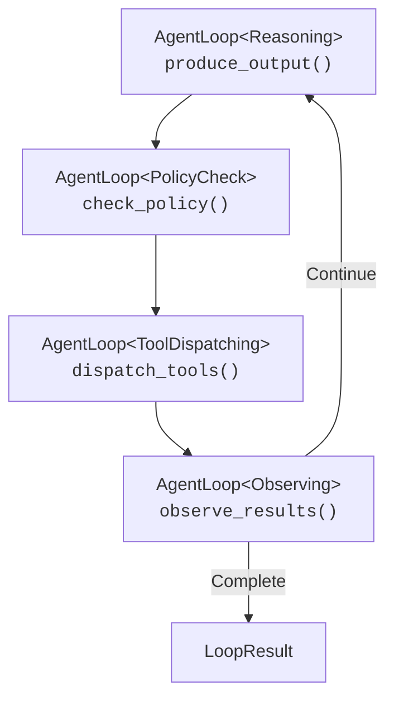

# Guia del Bucle de Razonamiento
{: .no_toc }

## Otros idiomas
{: .no_toc}

[English](reasoning-loop.md) | [中文简体](reasoning-loop.zh-cn.md) | **Español** | [Português](reasoning-loop.pt.md) | [日本語](reasoning-loop.ja.md) | [Deutsch](reasoning-loop.de.md)

---

Guia completa del bucle de razonamiento agentico de Symbiont: un ciclo Observar-Razonar-Evaluar-Actuar (ORGA) con seguridad de tipos para comportamiento autonomo de agentes.
{: .fs-6 .fw-300 }

## Tabla de contenidos
{: .no_toc .text-delta }

1. TOC
{:toc}

---

## Descripcion General

El bucle de razonamiento es el motor de ejecucion principal para agentes autonomos en Symbiont. Impulsa una conversacion de multiples turnos entre un LLM, una puerta de politicas y herramientas externas a traves de un ciclo estructurado:

1. **Observar** — Recopilar resultados de ejecuciones anteriores de herramientas
2. **Razonar** — El LLM produce acciones propuestas (llamadas a herramientas o respuestas de texto)
3. **Evaluar** — El motor de politicas evalua cada accion propuesta
4. **Actuar** — Las acciones aprobadas se despachan a los ejecutores de herramientas

El bucle continua hasta que el LLM produce una respuesta de texto final, alcanza los limites de iteraciones/tokens, o expira por tiempo.

### Principios de Diseno

- **Seguridad en tiempo de compilacion**: Las transiciones de fase invalidas se detectan en tiempo de compilacion mediante el sistema de tipos de Rust
- **Complejidad opcional**: El bucle funciona solo con un proveedor y una puerta de politicas; el puente de conocimiento, las politicas Cedar y human-in-the-loop son todos opcionales
- **Retrocompatible**: Agregar nuevas funcionalidades (como el puente de conocimiento) nunca rompe el codigo existente
- **Observable**: Cada fase emite eventos de diario y tramos de trazado

---

## Inicio Rapido

### Ejemplo Minimo

```rust
use std::sync::Arc;
use symbi_runtime::reasoning::circuit_breaker::CircuitBreakerRegistry;
use symbi_runtime::reasoning::context_manager::DefaultContextManager;
use symbi_runtime::reasoning::conversation::{Conversation, ConversationMessage};
use symbi_runtime::reasoning::executor::DefaultActionExecutor;
use symbi_runtime::reasoning::loop_types::{BufferedJournal, LoopConfig};
use symbi_runtime::reasoning::policy_bridge::DefaultPolicyGate;
use symbi_runtime::reasoning::reasoning_loop::ReasoningLoopRunner;
use symbi_runtime::types::AgentId;

// Set up the runner with default components
let runner = ReasoningLoopRunner {
    provider: Arc::new(my_inference_provider),
    policy_gate: Arc::new(DefaultPolicyGate::permissive()),
    executor: Arc::new(DefaultActionExecutor::default()),
    context_manager: Arc::new(DefaultContextManager::default()),
    circuit_breakers: Arc::new(CircuitBreakerRegistry::default()),
    journal: Arc::new(BufferedJournal::new(1000)),
    knowledge_bridge: None,
};

// Build a conversation
let mut conv = Conversation::with_system("You are a helpful assistant.");
conv.push(ConversationMessage::user("What is 6 * 7?"));

// Run the loop
let result = runner.run(AgentId::new(), conv, LoopConfig::default()).await;

println!("Output: {}", result.output);
println!("Iterations: {}", result.iterations);
println!("Tokens used: {}", result.total_usage.total_tokens);
```

### Con Definiciones de Herramientas

```rust
use symbi_runtime::reasoning::inference::ToolDefinition;

let config = LoopConfig {
    max_iterations: 10,
    tool_definitions: vec![
        ToolDefinition {
            name: "web_search".into(),
            description: "Search the web for information".into(),
            parameters: serde_json::json!({
                "type": "object",
                "properties": {
                    "query": { "type": "string" }
                },
                "required": ["query"]
            }),
        },
    ],
    ..Default::default()
};

let result = runner.run(agent_id, conv, config).await;
```

---

## Sistema de Fases

### Patron Typestate

El bucle utiliza el sistema de tipos de Rust para imponer transiciones de fase validas en tiempo de compilacion. Cada fase es un marcador de tipo de tamano cero:

```rust
pub struct Reasoning;      // LLM produces proposed actions
pub struct PolicyCheck;    // Each action evaluated by the gate
pub struct ToolDispatching; // Approved actions executed
pub struct Observing;      // Results collected for next iteration
```

La estructura `AgentLoop<Phase>` lleva el estado del bucle y solo puede llamar metodos apropiados para su fase actual. Por ejemplo, `AgentLoop<Reasoning>` solo expone `produce_output()`, que consume self y devuelve `AgentLoop<PolicyCheck>`.

Esto significa que los siguientes errores son **errores de compilacion**, no bugs en tiempo de ejecucion:
- Saltar la verificacion de politicas
- Despachar herramientas sin razonar primero
- Observar resultados sin despachar

### Flujo de Fases



---

## Proveedores de Inferencia

El trait `InferenceProvider` abstrae sobre backends de LLM:

```rust
#[async_trait]
pub trait InferenceProvider: Send + Sync {
    async fn complete(
        &self,
        conversation: &Conversation,
        options: &InferenceOptions,
    ) -> Result<InferenceResponse, InferenceError>;

    fn provider_name(&self) -> &str;
    fn default_model(&self) -> &str;
    fn supports_native_tools(&self) -> bool;
    fn supports_structured_output(&self) -> bool;
}
```

### Proveedor en la Nube (OpenRouter)

El `CloudInferenceProvider` se conecta a OpenRouter (o cualquier endpoint compatible con OpenAI):

```bash
export OPENROUTER_API_KEY="sk-or-..."
export OPENROUTER_MODEL="google/gemini-2.0-flash-001"  # optional
```

```rust
use symbi_runtime::reasoning::providers::cloud::CloudInferenceProvider;

let provider = CloudInferenceProvider::from_env()
    .expect("OPENROUTER_API_KEY must be set");
```

---

## Puerta de Politicas

Cada accion propuesta pasa por la puerta de politicas antes de su ejecucion:

```rust
#[async_trait]
pub trait ReasoningPolicyGate: Send + Sync {
    async fn evaluate_action(
        &self,
        agent_id: &AgentId,
        action: &ProposedAction,
        state: &LoopState,
    ) -> LoopDecision;
}

pub enum LoopDecision {
    Allow,
    Deny { reason: String },
    Modify { modified_action: Box<ProposedAction>, reason: String },
}
```

### Puertas Integradas

- **`DefaultPolicyGate::permissive()`** — Permite todas las acciones (desarrollo/pruebas)
- **`DefaultPolicyGate::new()`** — Reglas de politica predeterminadas
- **`OpaPolicyGateBridge`** — Puente al motor de politicas basado en OPA
- **`CedarGate`** — Integracion con el lenguaje de politicas Cedar

### Retroalimentacion de Denegacion de Politicas

Cuando una accion es denegada, el motivo de la denegacion se retroalimenta al LLM como una observacion de retroalimentacion de politicas, permitiendole ajustar su enfoque en la siguiente iteracion.

---

## Ejecucion de Acciones

### Trait ActionExecutor

```rust
#[async_trait]
pub trait ActionExecutor: Send + Sync {
    async fn execute_actions(
        &self,
        actions: &[ProposedAction],
        config: &LoopConfig,
        circuit_breakers: &CircuitBreakerRegistry,
    ) -> Vec<Observation>;
}
```

### Ejecutores Integrados

| Ejecutor | Descripcion |
|----------|-------------|
| `DefaultActionExecutor` | Despacho en paralelo con timeouts por herramienta |
| `EnforcedActionExecutor` | Delega a traves de `ToolInvocationEnforcer` -> pipeline MCP |
| `KnowledgeAwareExecutor` | Intercepta herramientas de conocimiento, delega el resto al ejecutor interno |

### Circuit Breakers

Cada herramienta tiene un circuit breaker asociado que rastrea fallos:

- **Cerrado** (normal): Las llamadas a herramientas proceden normalmente
- **Abierto** (disparado): Demasiados fallos consecutivos; las llamadas se rechazan inmediatamente
- **Semi-abierto** (sondeo): Se permiten llamadas limitadas para probar la recuperacion

```rust
let circuit_breakers = CircuitBreakerRegistry::new(CircuitBreakerConfig {
    failure_threshold: 3,
    recovery_timeout: Duration::from_secs(60),
    half_open_max_calls: 1,
});
```

---

## Puente Conocimiento-Razonamiento

El `KnowledgeBridge` conecta el almacen de conocimiento del agente (memoria jerarquica, base de conocimiento, busqueda vectorial) con el bucle de razonamiento.

### Configuracion

```rust
use symbi_runtime::reasoning::knowledge_bridge::{KnowledgeBridge, KnowledgeConfig};

let bridge = Arc::new(KnowledgeBridge::new(
    context_manager.clone(),  // Arc<dyn context::ContextManager>
    KnowledgeConfig {
        max_context_items: 5,
        relevance_threshold: 0.3,
        auto_persist: true,
    },
));

let runner = ReasoningLoopRunner {
    // ... other fields ...
    knowledge_bridge: Some(bridge),
};
```

### Como Funciona

**Antes de cada paso de razonamiento:**
1. Se extraen terminos de busqueda de mensajes recientes de usuario/herramientas
2. `query_context()` y `search_knowledge()` recuperan elementos relevantes
3. Los resultados se formatean e inyectan como un mensaje de sistema (reemplazando la inyeccion anterior)

**Durante el despacho de herramientas:**
El `KnowledgeAwareExecutor` intercepta dos herramientas especiales:

- **`recall_knowledge`** — Busca en la base de conocimiento y devuelve resultados formateados
  ```json
  { "query": "capital of France", "limit": 5 }
  ```

- **`store_knowledge`** — Almacena un nuevo hecho como una tripleta sujeto-predicado-objeto
  ```json
  { "subject": "Earth", "predicate": "has", "object": "one moon", "confidence": 0.95 }
  ```

Todas las demas llamadas a herramientas se delegan al ejecutor interno sin cambios.

**Despues de completar el bucle:**
Si `auto_persist` esta habilitado, el puente extrae las respuestas del asistente y las almacena como memoria de trabajo para futuras conversaciones.

### Retrocompatibilidad

Establecer `knowledge_bridge: None` hace que el runner se comporte de forma identica a antes — sin inyeccion de contexto, sin herramientas de conocimiento, sin persistencia.

---

## Gestion de Conversaciones

### Tipo Conversation

`Conversation` gestiona una secuencia ordenada de mensajes con serializacion a los formatos de API de OpenAI y Anthropic:

```rust
let mut conv = Conversation::with_system("You are a helpful assistant.");
conv.push(ConversationMessage::user("Hello"));
conv.push(ConversationMessage::assistant("Hi there!"));

// Serialize for API calls
let openai_msgs = conv.to_openai_messages();
let (system, anthropic_msgs) = conv.to_anthropic_messages();
```

### Control de Presupuesto de Tokens

El `ContextManager` dentro del bucle (no confundir con el `ContextManager` de conocimiento) gestiona el presupuesto de tokens de la conversacion:

- **Ventana Deslizante**: Eliminar los mensajes mas antiguos primero
- **Enmascaramiento de Observaciones**: Ocultar resultados verbosos de herramientas
- **Resumen Anclado**: Mantener el mensaje de sistema + N mensajes recientes

---

## Diario Durable

Cada transicion de fase emite una `JournalEntry` al `JournalWriter` configurado:

```rust
pub struct JournalEntry {
    pub sequence: u64,
    pub timestamp: DateTime<Utc>,
    pub agent_id: AgentId,
    pub iteration: u32,
    pub event: LoopEvent,
}

pub enum LoopEvent {
    Started { agent_id, config },
    ReasoningComplete { iteration, actions, usage },
    PolicyEvaluated { iteration, action_count, denied_count },
    ToolsDispatched { iteration, tool_count, duration },
    ObservationsCollected { iteration, observation_count },
    Terminated { reason, iterations, total_usage, duration },
    RecoveryTriggered { iteration, tool_name, strategy, error },
}
```

El `BufferedJournal` predeterminado almacena entradas en memoria. Los despliegues en produccion pueden implementar `JournalWriter` para almacenamiento persistente.

---

## Configuracion

### LoopConfig

```rust
pub struct LoopConfig {
    pub max_iterations: u32,        // Default: 25
    pub max_total_tokens: u32,      // Default: 100,000
    pub timeout: Duration,          // Default: 5 minutes
    pub default_recovery: RecoveryStrategy,
    pub tool_timeout: Duration,     // Default: 30 seconds
    pub max_concurrent_tools: usize, // Default: 10
    pub context_token_budget: usize, // Default: 8,000
    pub tool_definitions: Vec<ToolDefinition>,
}
```

### Estrategias de Recuperacion

Cuando la ejecucion de una herramienta falla, el bucle puede aplicar diferentes estrategias de recuperacion:

| Estrategia | Descripcion |
|------------|-------------|
| `Retry` | Reintentar con retroceso exponencial |
| `Fallback` | Probar herramientas alternativas |
| `CachedResult` | Usar un resultado en cache si es suficientemente reciente |
| `LlmRecovery` | Pedir al LLM que encuentre un enfoque alternativo |
| `Escalate` | Enrutar a una cola de operador humano |
| `DeadLetter` | Desistir y registrar el fallo |

---

## Pruebas

### Pruebas Unitarias (Sin Clave de API Requerida)

```bash
cargo test -j2 -p symbi-runtime --lib -- reasoning::knowledge
```

### Pruebas de Integracion con Proveedor Mock

```bash
cargo test -j2 -p symbi-runtime --test knowledge_reasoning_tests
```

### Pruebas en Vivo con LLM Real

```bash
OPENROUTER_API_KEY="sk-or-..." OPENROUTER_MODEL="google/gemini-2.0-flash-001" \
  cargo test -j2 -p symbi-runtime --features http-input --test reasoning_live_tests -- --nocapture
```

---

## Fases de Implementacion

El bucle de razonamiento se construyo en cinco fases, cada una agregando capacidades:

| Fase | Enfoque | Componentes Clave |
|------|---------|-------------------|
| **1** | Bucle principal | `conversation`, `inference`, `phases`, `reasoning_loop` |
| **2** | Resiliencia | `circuit_breaker`, `executor`, `context_manager`, `policy_bridge` |
| **3** | Integracion DSL | `human_critic`, `pipeline_config`, builtins del REPL |
| **4** | Multi-agente | `agent_registry`, `critic_audit`, `saga` |
| **5** | Observabilidad | `cedar_gate`, `journal`, `metrics`, `scheduler`, `tracing_spans` |
| **Puente** | Conocimiento | `knowledge_bridge`, `knowledge_executor` |
| **symbi-dev** | Avanzado | `tool_profile`, `progress_tracker`, `pre_hydrate`, `knowledge_bridge` extendido |

---

## Primitivas Avanzadas (symbi-dev)

El feature gate `symbi-dev` agrega cuatro capacidades avanzadas. Consulte la [guia completa](symbi-dev.md) para mas detalles.

| Primitiva | Proposito |
|-----------|-----------|
| **Tool Profile** | Filtrado basado en glob de herramientas visibles para el LLM |
| **Progress Tracker** | Limites de reintento por paso con deteccion de bucles atascados |
| **Pre-Hydration** | Pre-carga determinista de contexto desde referencias de entrada de tarea |
| **Scoped Conventions** | Recuperacion de convenciones con alcance de directorio via `recall_knowledge` |

```rust
let config = LoopConfig {
    tool_profile: Some(ToolProfile::include_only(&["search_*", "file_*"])),
    pre_hydration: Some(PreHydrationConfig::default()),
    ..Default::default()
};
```

---

## Proximos Pasos

- **[Arquitectura del Runtime](runtime-architecture.md)** — Vision general completa de la arquitectura del sistema
- **[Modelo de Seguridad](security-model.md)** — Aplicacion de politicas y pistas de auditoria
- **[Guia DSL](dsl-guide.md)** — Lenguaje de definicion de agentes
- **[Referencia de API](api-reference.md)** — Documentacion completa de la API
