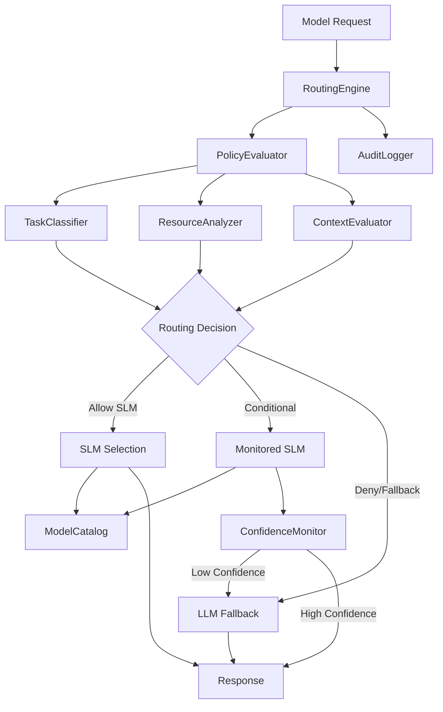
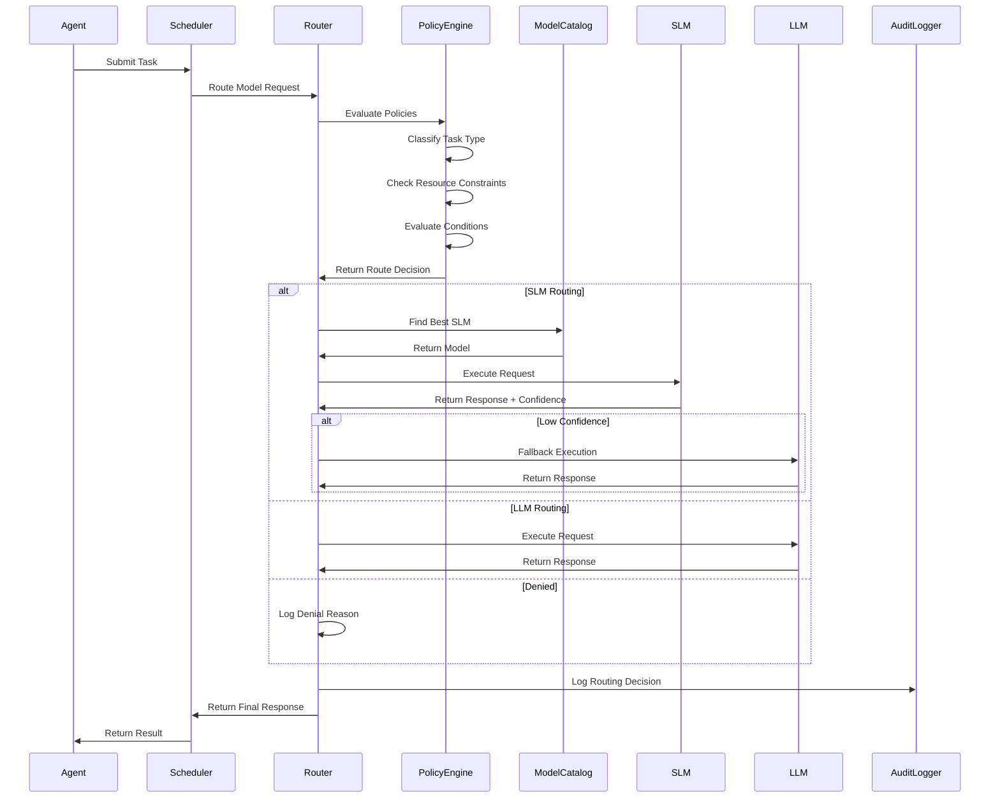

# Policy-Driven Router Design

## Overview

The Policy-Driven Router is a critical component of Symbiont's SLM-first feature flag system. It sits in front of model execution calls and intelligently routes requests between Small Language Models (SLMs) and full Large Language Models (LLMs) based on configurable policies, task types, resource constraints, and confidence thresholds.

## Architecture

### Core Components



### Module Structure

```
crates/runtime/src/routing/
├── mod.rs              # Public API and module exports
├── engine.rs           # Core RoutingEngine implementation
├── policy.rs           # Policy evaluation logic
├── classifier.rs       # Task classification
├── decision.rs         # Routing decision types
├── confidence.rs       # Confidence monitoring
├── config.rs          # Configuration structures
└── error.rs           # Error handling
```

## Core Interfaces

### RoutingEngine Trait

```rust
#[async_trait]
pub trait RoutingEngine: Send + Sync {
    /// Route a model request based on configured policies
    async fn route_request(
        &self,
        context: &RoutingContext,
    ) -> Result<RouteDecision, RoutingError>;
    
    /// Execute the routing decision and handle fallbacks
    async fn execute_with_routing(
        &self,
        context: RoutingContext,
        request: ModelRequest,
    ) -> Result<ModelResponse, RoutingError>;
    
    /// Validate routing policies
    fn validate_policies(&self) -> Result<(), RoutingError>;
    
    /// Get routing statistics
    async fn get_routing_stats(&self) -> RoutingStatistics;
}
```

### Routing Decision Types

```rust
#[derive(Debug, Clone)]
pub enum RouteDecision {
    /// Route to SLM with specific model
    UseSLM {
        model_id: String,
        monitoring: MonitoringLevel,
        fallback_on_failure: bool,
    },
    /// Route to LLM provider
    UseLLM {
        provider: LLMProvider,
        reason: String,
    },
    /// Deny the request
    Deny {
        reason: String,
        policy_violated: String,
    },
}

#[derive(Debug, Clone)]
pub enum MonitoringLevel {
    None,
    Basic,
    Enhanced { confidence_threshold: f64 },
}
```

### Routing Context

```rust
#[derive(Debug, Clone)]
pub struct RoutingContext {
    /// Request identification
    pub request_id: String,
    pub agent_id: AgentId,
    pub timestamp: chrono::DateTime<chrono::Utc>,
    
    /// Task information
    pub task_type: TaskType,
    pub prompt: String,
    pub expected_output_type: OutputType,
    
    /// Resource constraints
    pub max_execution_time: Option<Duration>,
    pub resource_limits: Option<ResourceConstraints>,
    
    /// Agent context
    pub agent_capabilities: Vec<String>,
    pub agent_security_level: SecurityLevel,
    
    /// Additional metadata
    pub metadata: HashMap<String, String>,
}

#[derive(Debug, Clone, Serialize, Deserialize)]
pub enum TaskType {
    Intent,
    Extract,
    Template,
    BoilerplateCode,
    CodeGeneration,
    Reasoning,
    Analysis,
    Summarization,
    Translation,
    QA,
    Custom(String),
}
```

## Policy Schema

### Core Policy Structure

```rust
#[derive(Debug, Clone, Serialize, Deserialize)]
pub struct RoutingPolicyConfig {
    /// Global routing settings
    pub global_settings: GlobalRoutingSettings,
    /// Ordered list of routing rules
    pub rules: Vec<RoutingRule>,
    /// Default action when no rules match
    pub default_action: RouteAction,
    /// LLM fallback configuration
    pub fallback_config: FallbackConfig,
}

#[derive(Debug, Clone, Serialize, Deserialize)]
pub struct GlobalRoutingSettings {
    /// Enable/disable SLM routing globally
    pub slm_routing_enabled: bool,
    /// Always audit routing decisions
    pub always_audit: bool,
    /// Global confidence threshold for SLM responses
    pub global_confidence_threshold: f64,
    /// Maximum retry attempts for failed SLM calls
    pub max_slm_retries: u32,
}

#[derive(Debug, Clone, Serialize, Deserialize)]
pub struct RoutingRule {
    /// Rule identifier
    pub name: String,
    /// Rule priority (higher = evaluated first)
    pub priority: u32,
    /// Conditions that must be met
    pub conditions: RoutingConditions,
    /// Action to take if conditions match
    pub action: RouteAction,
    /// Whether this rule can be overridden
    pub override_allowed: bool,
}

#[derive(Debug, Clone, Serialize, Deserialize)]
pub struct RoutingConditions {
    /// Task types this rule applies to
    pub task_types: Option<Vec<TaskType>>,
    /// Agent IDs this rule applies to
    pub agent_ids: Option<Vec<String>>,
    /// Resource requirements
    pub resource_constraints: Option<ResourceConstraints>,
    /// Security level requirements
    pub security_level: Option<SecurityLevel>,
    /// Custom condition expressions
    pub custom_conditions: Option<Vec<String>>,
}

#[derive(Debug, Clone, Serialize, Deserialize)]
pub enum RouteAction {
    /// Use SLM with specified preferences
    UseSLM {
        model_preference: ModelPreference,
        monitoring_level: MonitoringLevel,
        fallback_on_low_confidence: bool,
        confidence_threshold: Option<f64>,
    },
    /// Use LLM provider
    UseLLM {
        provider: LLMProvider,
        model: Option<String>,
    },
    /// Deny request
    Deny {
        reason: String,
    },
}

#[derive(Debug, Clone, Serialize, Deserialize)]
pub enum ModelPreference {
    /// Prefer specialist models for the task type
    Specialist,
    /// Prefer general-purpose models
    Generalist,
    /// Use specific model by ID
    Specific { model_id: String },
    /// Use best available model for requirements
    BestAvailable,
}
```

### Task Classification

```rust
#[derive(Debug, Clone)]
pub struct TaskClassifier {
    /// Classification patterns
    patterns: HashMap<TaskType, Vec<ClassificationPattern>>,
    /// ML-based classifier (future enhancement)
    ml_classifier: Option<Box<dyn MLClassifier>>,
}

#[derive(Debug, Clone)]
pub struct ClassificationPattern {
    /// Keywords that indicate this task type
    pub keywords: Vec<String>,
    /// Regex patterns for classification
    pub patterns: Vec<String>,
    /// Weight for this pattern
    pub weight: f64,
}

impl TaskClassifier {
    /// Classify a task based on prompt content
    pub fn classify_task(&self, prompt: &str, context: &RoutingContext) -> TaskType {
        // Implementation would use keyword matching, patterns, and context
        // to determine the most likely task type
    }
}
```

## Configuration Integration

### Router Configuration in Main Config

```rust
// Addition to crates/runtime/src/config.rs
#[derive(Debug, Clone, Serialize, Deserialize)]
pub struct Config {
    // ... existing fields ...
    
    /// Router configuration
    pub routing: Option<RoutingConfig>,
}

#[derive(Debug, Clone, Serialize, Deserialize)]
pub struct RoutingConfig {
    /// Enable the policy-driven router
    pub enabled: bool,
    /// Routing policy configuration
    pub policy: RoutingPolicyConfig,
    /// Task classification settings
    pub classification: TaskClassificationConfig,
    /// LLM provider configurations
    pub llm_providers: HashMap<String, LLMProviderConfig>,
}
```

### TOML Configuration Example

```toml
[routing]
enabled = true

[routing.policy.global_settings]
slm_routing_enabled = true
always_audit = true
global_confidence_threshold = 0.85
max_slm_retries = 2

# High-priority rule: Security-sensitive tasks always use LLM
[[routing.policy.rules]]
name = "security_tasks_to_llm"
priority = 100
override_allowed = false

[routing.policy.rules.conditions]
task_types = ["Analysis", "Reasoning"]
agent_ids = ["security_scanner", "threat_analyzer"]

[routing.policy.rules.action]
UseLLM = { provider = "openai", model = "gpt-4" }

# Medium-priority rule: Code generation to specialist SLM
[[routing.policy.rules]]
name = "code_generation_to_slm"
priority = 50
override_allowed = true

[routing.policy.rules.conditions]
task_types = ["CodeGeneration", "BoilerplateCode"]

[routing.policy.rules.action]
UseSLM = {
    model_preference = "Specialist",
    monitoring_level = { Enhanced = { confidence_threshold = 0.8 } },
    fallback_on_low_confidence = true,
    confidence_threshold = 0.8
}

# Low-priority rule: Simple tasks to generalist SLM
[[routing.policy.rules]]
name = "simple_tasks_to_generalist"
priority = 10
override_allowed = true

[routing.policy.rules.conditions]
task_types = ["Intent", "Extract", "Template"]

[routing.policy.rules.action]
UseSLM = {
    model_preference = "Generalist",
    monitoring_level = "Basic",
    fallback_on_low_confidence = true
}

# Default action for unmatched requests
[routing.policy.default_action]
UseLLM = { provider = "openai", model = "gpt-3.5-turbo" }

# Fallback configuration
[routing.policy.fallback_config]
enabled = true
max_attempts = 3
timeout = "30s"

[routing.policy.fallback_config.providers]
primary = "openai"
secondary = "anthropic"

# LLM Provider configurations
[routing.llm_providers.openai]
api_key_env = "OPENAI_API_KEY"
base_url = "https://api.openai.com/v1"
default_model = "gpt-3.5-turbo"
timeout = "60s"

[routing.llm_providers.anthropic]
api_key_env = "ANTHROPIC_API_KEY"
base_url = "https://api.anthropic.com"
default_model = "claude-3-sonnet-20240229"
timeout = "60s"
```

## Integration Points

### 1. Scheduler Integration

```rust
// In crates/runtime/src/scheduler/mod.rs

impl DefaultAgentScheduler {
    async fn start_scheduler_loop(&self) {
        // ... existing code ...
        
        // Add router integration before task execution
        if let Some(router) = &self.routing_engine {
            let routing_context = self.build_routing_context(&task).await?;
            let route_decision = router.route_request(&routing_context).await?;
            
            // Execute with routing decision
            let result = router.execute_with_routing(
                routing_context,
                ModelRequest::from_task(&task)
            ).await?;
        }
    }
}
```

### 2. Tool Invocation Integration

```rust
// In crates/runtime/src/integrations/tool_invocation.rs

impl DefaultToolInvocationEnforcer {
    async fn execute_tool_with_enforcement(&self, /* ... */) -> Result<InvocationResult, ToolInvocationError> {
        // ... existing enforcement checks ...
        
        // Add routing for model-based tools
        if tool.requires_model_execution() {
            let routing_context = RoutingContext::from_tool_context(&context);
            let route_decision = self.routing_engine
                .route_request(&routing_context)
                .await?;
                
            // Execute based on routing decision
            match route_decision {
                RouteDecision::UseSLM { model_id, .. } => {
                    // Execute with SLM
                }
                RouteDecision::UseLLM { provider, .. } => {
                    // Execute with LLM
                }
                RouteDecision::Deny { reason, .. } => {
                    return Err(ToolInvocationError::RoutingDenied { reason });
                }
            }
        }
    }
}
```

### 3. ModelCatalog Integration

```rust
// Enhanced ModelCatalog methods for router support

impl ModelCatalog {
    /// Find best SLM for task type and requirements
    pub fn find_best_slm_for_task(
        &self,
        task_type: &TaskType,
        preference: &ModelPreference,
        resource_constraints: Option<&ResourceConstraints>,
        agent_id: Option<&str>,
    ) -> Option<&Model> {
        match preference {
            ModelPreference::Specialist => {
                self.find_specialist_models_for_task(task_type, agent_id)
                    .into_iter()
                    .filter(|m| self.meets_resource_constraints(m, resource_constraints))
                    .min_by_key(|m| m.resource_requirements.min_memory_mb)
            }
            ModelPreference::Generalist => {
                self.find_generalist_models(agent_id)
                    .into_iter()
                    .filter(|m| self.meets_resource_constraints(m, resource_constraints))
                    .min_by_key(|m| m.resource_requirements.min_memory_mb)
            }
            ModelPreference::Specific { model_id } => {
                self.get_model(model_id)
            }
            ModelPreference::BestAvailable => {
                self.find_best_model_for_requirements(
                    &self.task_type_to_capabilities(task_type),
                    resource_constraints.map(|rc| rc.max_memory_mb),
                    agent_id,
                )
            }
        }
    }
    
    fn task_type_to_capabilities(&self, task_type: &TaskType) -> Vec<ModelCapability> {
        match task_type {
            TaskType::CodeGeneration | TaskType::BoilerplateCode => {
                vec![ModelCapability::CodeGeneration, ModelCapability::TextGeneration]
            }
            TaskType::Reasoning | TaskType::Analysis => {
                vec![ModelCapability::Reasoning, ModelCapability::TextGeneration]
            }
            _ => vec![ModelCapability::TextGeneration],
        }
    }
}
```

## Sequence Diagram



## Error Handling

```rust
#[derive(Debug, Error)]
pub enum RoutingError {
    #[error("Policy evaluation failed: {reason}")]
    PolicyEvaluationFailed { reason: String },
    
    #[error("No suitable model found for task: {task_type:?}")]
    NoSuitableModel { task_type: TaskType },
    
    #[error("Model execution failed: {model_id} - {reason}")]
    ModelExecutionFailed { model_id: String, reason: String },
    
    #[error("LLM fallback failed: {provider} - {reason}")]
    LLMFallbackFailed { provider: String, reason: String },
    
    #[error("Routing denied by policy: {policy} - {reason}")]
    RoutingDenied { policy: String, reason: String },
    
    #[error("Task classification failed: {reason}")]
    ClassificationFailed { reason: String },
    
    #[error("Configuration error: {key} - {reason}")]
    ConfigurationError { key: String, reason: String },
    
    #[error("Resource constraint violation: {constraint}")]
    ResourceConstraintViolation { constraint: String },
}
```

## Confidence Monitoring

```rust
#[derive(Debug, Clone)]
pub struct ConfidenceMonitor {
    thresholds: HashMap<TaskType, f64>,
    fallback_enabled: bool,
}

impl ConfidenceMonitor {
    /// Evaluate response confidence
    pub async fn evaluate_confidence(
        &self,
        response: &ModelResponse,
        task_type: &TaskType,
        context: &RoutingContext,
    ) -> Result<ConfidenceEvaluation, RoutingError> {
        let confidence_score = self.calculate_confidence_score(response, context).await?;
        let threshold = self.get_threshold_for_task(task_type);
        
        Ok(ConfidenceEvaluation {
            score: confidence_score,
            threshold,
            meets_threshold: confidence_score >= threshold,
            factors: self.identify_confidence_factors(response),
        })
    }
    
    async fn calculate_confidence_score(
        &self,
        response: &ModelResponse,
        context: &RoutingContext,
    ) -> Result<f64, RoutingError> {
        // Simple confidence calculation based on response length
        let base_score = if response.text.len() > 100 { 0.8 } else { 0.4 };
        // Adjust based on task type
        let adjustment = match context.task_type {
            TaskType::Reasoning | TaskType::Analysis => 0.1,
            _ => 0.0,
        };
        Ok(base_score + adjustment)
    }
}

#[derive(Debug, Clone)]
pub struct ConfidenceEvaluation {
    pub score: f64,
    pub threshold: f64,
    pub meets_threshold: bool,
    pub factors: Vec<ConfidenceFactor>,
}
```

## Audit Logging

Following the established pattern from `ModelLogger`, the router will provide comprehensive audit trails:

```rust
impl RoutingEngine for DefaultRoutingEngine {
    async fn execute_with_routing(
        &self,
        context: RoutingContext,
        request: ModelRequest,
    ) -> Result<ModelResponse, RoutingError> {
        let start_time = Instant::now();
        let route_decision = self.route_request(&context).await?;
        
        // Log routing decision
        if let Some(ref logger) = self.audit_logger {
            logger.log_routing_decision(
                &context,
                &route_decision,
                &self.get_policy_context(),
            ).await?;
        }
        
        // Execute and handle response
        let response = match route_decision {
            RouteDecision::UseSLM { .. } => {
                self.execute_slm_route(&context, &request, &route_decision).await?
            }
            RouteDecision::UseLLM { .. } => {
                self.execute_llm_route(&context, &request, &route_decision).await?
            }
            RouteDecision::Deny { reason, .. } => {
                return Err(RoutingError::RoutingDenied { 
                    policy: "configured_policy".to_string(), 
                    reason 
                });
            }
        };
        
        // Log final outcome
        if let Some(ref logger) = self.audit_logger {
            logger.log_routing_outcome(
                &context,
                &route_decision,
                &response,
                start_time.elapsed(),
            ).await?;
        }
        
        Ok(response)
    }
}
```

## Implementation Plan

1. **Phase 1: Core Infrastructure**
   - Create routing module structure
   - Implement basic RoutingEngine trait
   - Add configuration schema to main config

2. **Phase 2: Policy Engine**
   - Implement policy evaluation logic
   - Add task classification system
   - Create configuration validation

3. **Phase 3: Model Integration**
   - Integrate with ModelCatalog
   - Implement SLM execution path
   - Add confidence monitoring

4. **Phase 4: LLM Fallback**
   - Implement LLM provider integrations
   - Add fallback logic and retry mechanisms
   - Implement comprehensive error handling

5. **Phase 5: Integration**
   - Integrate with Scheduler
   - Integrate with Tool Invocation system
   - Add comprehensive audit logging

6. **Phase 6: Testing & Documentation**
   - Unit tests for all components
   - Integration tests with existing systems
   - Performance benchmarks
   - Documentation and examples

This design provides a robust, configurable, and secure foundation for intelligent model routing in Symbiont's SLM-first architecture while maintaining consistency with established patterns and practices.