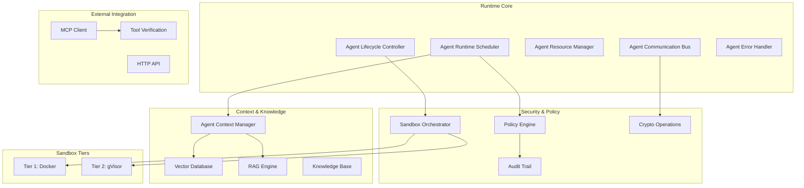
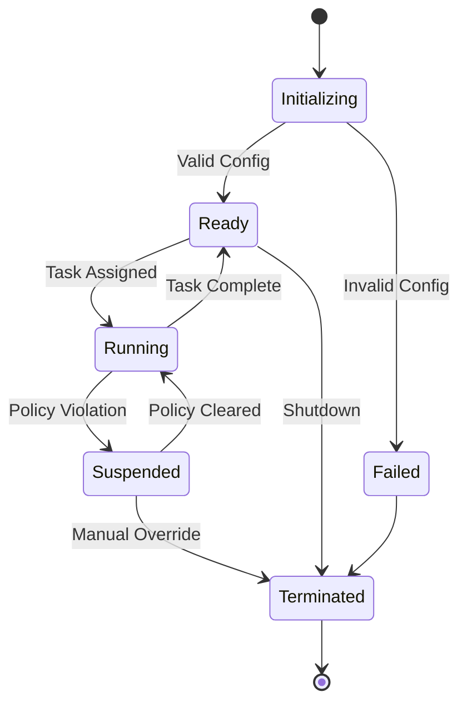
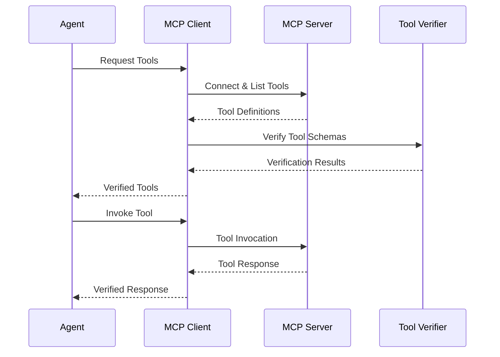

# Runtime-Architektur
{: .no_toc }

Verstehen Sie die Architektur des Symbi-Laufzeitsystems und die Kernkomponenten.
{: .fs-6 .fw-300 }

## Inhaltsverzeichnis
{: .no_toc .text-delta }

1. TOC
{:toc}

---

## 🌐 Andere Sprachen
{: .no_toc}

[English](runtime-architecture.md) | [中文简体](runtime-architecture.zh-cn.md) | [Español](runtime-architecture.es.md) | [Português](runtime-architecture.pt.md) | [日本語](runtime-architecture.ja.md) | **Deutsch**

---

## Überblick

Das Symbi-Laufzeitsystem bietet eine sichere, skalierbare und richtlinienorientierte Ausführungsumgebung für autonome Agenten. Auf Rust für Leistung und Sicherheit aufgebaut, implementiert es ein mehrstufiges Sicherheitsmodell mit umfassenden Audit-Funktionen.

### Grundprinzipien

- **Sicherheit per Standard**: Jede Operation unterliegt der Richtliniendurchsetzung
- **Zero Trust**: Alle Komponenten und Kommunikationen werden verifiziert
- **Vollständige Auditierbarkeit**: Jede Aktion wird mit kryptographischer Integrität protokolliert
- **Richtliniengesteuert**: Deklarative Richtlinien steuern das gesamte Systemverhalten
- **Hohe Leistung**: Native Rust-Implementierung für Produktionsarbeitslasten

---

## Systemarchitektur



---

## Kernkomponenten

### Agent Runtime Scheduler

Der zentrale Orchestrator, der für die Verwaltung der Agentenausführung verantwortlich ist.

**Hauptverantwortlichkeiten:**
- **Task-Scheduling**: Prioritätsbasierte Planung mit Ressourcenbewusstsein
- **Lastverteilung**: Verteilung auf verfügbare Ressourcen
- **Ressourcenzuteilung**: Speicher-, CPU- und I/O-Zuweisung
- **Richtlinienkoordination**: Integration mit Richtliniendurchsetzung

**Leistungsmerkmale:**
- Unterstützung für 10.000+ gleichzeitige Agenten
- Sub-Millisekunden-Planungsentscheidungen
- Prioritätsbasierte Verdrängung
- Ressourcenbewusste Platzierung

```rust
pub struct AgentScheduler {
    priority_queues: Vec<PriorityQueue<AgentTask>>,
    resource_pool: ResourcePool,
    policy_engine: Arc<PolicyEngine>,
    load_balancer: LoadBalancer,
}

impl AgentScheduler {
    pub async fn schedule_agent(&self, config: AgentConfig) -> Result<AgentId>;
    pub async fn get_system_status(&self) -> SystemStatus;
}
```

### Agent Lifecycle Controller

Verwaltet den vollständigen Lebenszyklus von Agenten von der Initialisierung bis zur Beendigung.

**Lebenszyklus-Zustände:**
1. **Initialisierung**: DSL-Parsing und Konfigurationsvalidierung
2. **Bereit**: Warten auf Aufgabenzuweisung
3. **Laufend**: Aktive Ausführung von Aufgaben
4. **Suspendiert**: Pausiert aufgrund von Richtlinienverletzung oder Ressourcenbeschränkungen
5. **Beendet**: Ordnungsgemäßes Herunterfahren oder erzwungener Stopp



### Ressourcenverwaltung

**Verwaltete Ressourcentypen:**
- **Speicher**: Heap-Zuteilung mit Grenzen und Überwachung
- **CPU**: Kernzuteilung und Nutzungsverfolgung
- **Festplatten-I/O**: Lese-/Schreibbandbreitengrenzen
- **Netzwerk-I/O**: Bandbreiten- und Verbindungsgrenzen
- **Ausführungszeit**: Timeout-Durchsetzung

**Ressourcenzuteilungsstrategien:**
- **First Fit**: Schnellste Zuteilung für Niedriglatenz-Szenarien
- **Best Fit**: Optimale Nutzung für Ressourceneffizienz
- **Prioritätsbasiert**: Ressourcengarantie für kritische Agenten

```rust
pub struct ResourceLimits {
    pub memory_mb: usize,
    pub cpu_cores: f32,
    pub disk_io_mbps: usize,
    pub network_io_mbps: usize,
    pub execution_timeout: Duration,
}
```

---

## Mehrstufige Sicherheit

### Sandbox-Architektur

Die Laufzeit implementiert zwei Sicherheitsstufen basierend auf dem Operationsrisiko:

#### Stufe 1: Docker-Isolation
**Anwendungsfall**: Risikoarme Operationen, Entwicklungsaufgaben
- Container-basierte Isolation
- Ressourcengrenzen und Capability-Entfernung
- Netzwerkisolation und schreibgeschützte Dateisysteme
- Geeignet für vertrauenswürdigen Code mit minimalen Sicherheitsanforderungen

#### Stufe 2: gVisor-Isolation
**Anwendungsfall**: Standard-Produktionsaufgaben, Datenverarbeitung
- Userspace-Kernel mit Systemaufruf-Abfangung
- Speicherschutz und I/O-Virtualisierung
- Verbesserte Sicherheit mit minimalen Leistungsauswirkungen
- Standard-Stufe für die meisten Agentenoperationen

> **Hinweis**: Zusätzliche Isolationsstufen sind in Enterprise-Editionen für maximale Sicherheitsanforderungen verfügbar.

### Risikobewertung

Das System bestimmt automatisch die angemessene Sicherheitsstufe:

```rust
pub fn assess_security_tier(agent_config: &AgentConfig) -> SecurityTier {
    let risk_factors = RiskAssessment {
        data_sensitivity: assess_data_sensitivity(&agent_config.inputs),
        code_trust_level: assess_code_trust(&agent_config.source),
        network_access: agent_config.requires_network,
        file_system_access: agent_config.requires_filesystem,
        external_integrations: !agent_config.external_apis.is_empty(),
    };
    
    match calculate_risk_score(risk_factors) {
        score if score < 0.5 => SecurityTier::Tier1,
        _ => SecurityTier::Tier2,
    }
}
```

---

## Kommunikationssystem

### Nachrichtentypen

Die Laufzeit unterstützt mehrere Kommunikationsmuster:

**Direktnachrichten**: Punkt-zu-Punkt-Kommunikation mit Zustellungsgarantien
```rust
let response = agent_bus.send_message(
    target_agent_id, 
    SecureMessage::new(payload)
).await?;
```

**Publish-Subscribe**: Themenbasierte Ereignisverteilung
```rust
agent_bus.publish("data_processing.completed", event_data).await?;
agent_bus.subscribe("security.alerts", alert_handler).await?;
```

**Request-Response**: Synchrone Kommunikation mit Timeout
```rust
let result = agent_bus.request(
    target_agent, 
    request_payload,
    timeout_duration
).await?;
```

### Sicherheitsfeatures

**Nachrichtenverschlüsselung**: AES-256-GCM für Payload-Schutz
**Digitale Signaturen**: Ed25519-Signaturen für Authentizität
**Nachrichtenrouting**: Richtlinienbasierte Routing-Kontrollen
**Rate Limiting**: Pro-Agent-Nachrichtenraten-Durchsetzung

```rust
pub struct SecureMessage {
    pub id: MessageId,
    pub sender: AgentId,
    pub recipient: Option<AgentId>,
    pub encrypted_payload: Vec<u8>,
    pub signature: Ed25519Signature,
    pub timestamp: SystemTime,
}
```

---

## Kontext- und Wissenssysteme

### Agent Context Manager

Bietet persistente Speicher- und Wissensverwaltung für Agenten.

**Kontexttypen:**
- **Kurzzeitgedächtnis**: Kürzliche Interaktionen und unmittelbarer Kontext
- **Langzeitgedächtnis**: Persistentes Wissen und gelernte Muster
- **Arbeitsgedächtnis**: Aktive Verarbeitung und temporärer Zustand
- **Geteiltes Wissen**: Agentenübergreifender Wissensaustausch

```rust
pub trait ContextManager {
    async fn store_context(&self, agent_id: AgentId, context: AgentContext) -> Result<ContextId>;
    async fn retrieve_context(&self, agent_id: AgentId, query: ContextQuery) -> Result<Vec<ContextItem>>;
    async fn search_knowledge(&self, agent_id: AgentId, query: &str) -> Result<Vec<KnowledgeItem>>;
}
```

### RAG Engine Integration

**RAG-Pipeline:**
1. **Query-Analyse**: Verständnis der Informationsbedürfnisse des Agenten
2. **Vektorsuche**: Semantische Ähnlichkeitssuche in der Wissensbasis
3. **Dokumentenabruf**: Abruf relevanter Wissensdokumente
4. **Kontextranking**: Relevanz-Scoring und Filterung
5. **Antwortgenerierung**: Kontexterweiterte Antwortsynthese

**Leistungsziele:**
- Kontextabruf: <50ms im Durchschnitt
- Vektorsuche: <100ms für 1M+ Einbettungen
- RAG-Pipeline: <500ms Ende-zu-Ende

### Vektordatenbank

**Unterstützte Operationen:**
- **Semantische Suche**: Ähnlichkeitsbasierter Dokumentenabruf
- **Metadatenfilterung**: Beschränkungsbasierte Suchverfeinerung
- **Batch-Operationen**: Effiziente Massenoperationen
- **Echtzeit-Updates**: Dynamische Wissensbasis-Updates

**Vektordatenbank-Abstraktion:**

Symbi verwendet ein austauschbares Vektordatenbank-Backend. **LanceDB** ist der konfigurationsfreie Standard (eingebettet, kein externer Dienst erforderlich). **Qdrant** ist als optionales Backend hinter dem Feature-Flag `vector-qdrant` verfügbar.

| Backend | Feature-Flag | Konfiguration | Anwendungsfall |
|---------|-------------|---------------|----------------|
| LanceDB (Standard) | _integriert_ | Keine (Zero-Config) | Entwicklung, Einzelknoten, eingebettete Deployments |
| Qdrant | `vector-qdrant` | `SYMBIONT_VECTOR_HOST` | Verteilte Produktionscluster |

```rust
pub struct VectorConfig {
    pub backend: VectorBackend,       // LanceDB (Standard) oder Qdrant
    pub dimension: usize,             // 1536 für OpenAI-Einbettungen
    pub distance_metric: DistanceMetric::Cosine,
    pub index_type: IndexType::HNSW,
    pub data_path: PathBuf,           // LanceDB-Speicherpfad
}
```

---

## MCP-Integration

### Model Context Protocol Client

Ermöglicht Agenten den sicheren Zugriff auf externe Tools und Ressourcen.

**Kernfähigkeiten:**
- **Server-Erkennung**: Automatische Erkennung verfügbarer MCP-Server
- **Tool-Management**: Dynamische Tool-Erkennung und -Ausführung
- **Ressourcenzugriff**: Sicherer Zugriff auf externe Datenquellen
- **Protokollbehandlung**: Vollständige MCP-Spezifikationskonformität

### Tool-Erkennungsprozess



### Tool-Verifizierung mit SchemaPin

**Verifizierungsprozess:**
1. **Schema-Erkennung**: Tool-Schema vom MCP-Server abrufen
2. **Signaturverifizierung**: Kryptographische Signatur verifizieren
3. **Trust-on-First-Use**: Vertrauenswürdige Schlüssel für zukünftige Verifizierung anheften
4. **Richtliniendurchsetzung**: Tool-Nutzungsrichtlinien anwenden
5. **Audit-Protokollierung**: Alle Tool-Interaktionen protokollieren

```rust
pub struct ToolVerifier {
    key_store: SchemaPinKeyStore,
    policy_engine: Arc<PolicyEngine>,
    audit_logger: AuditLogger,
}

impl ToolVerifier {
    pub async fn verify_tool(&self, tool: &MCPTool) -> VerificationResult;
    pub async fn enforce_policies(&self, agent_id: AgentId, tool: &MCPTool) -> PolicyResult;
}
```

---

## Richtliniendurchsetzung

### Policy Engine Architektur

**Richtlinientypen:**
- **Zugriffskontrolle**: Wer kann auf welche Ressourcen zugreifen
- **Datenfluss**: Wie Daten durch das System fließen
- **Ressourcennutzung**: Grenzen für Rechenressourcen
- **Audit-Anforderungen**: Was wie protokolliert werden muss

**Richtlinienbewertung:**
```rust
pub enum PolicyDecision {
    Allow,
    Deny { reason: String },
    AllowWithConditions { conditions: Vec<PolicyCondition> },
}

pub trait PolicyEngine {
    async fn evaluate_policy(&self, context: PolicyContext, action: Action) -> PolicyDecision;
    async fn register_policy(&self, policy: Policy) -> Result<PolicyId>;
}
```

### Echtzeitdurchsetzung

**Durchsetzungspunkte:**
- Agentenerstellung und -konfiguration
- Nachrichtensendung und -routing
- Ressourcenzuteilungsanfragen
- Externe Tool-Ausführung
- Datenzugriffsoperationen

**Leistung:**
- Richtlinienbewertung: <1ms pro Entscheidung
- Batch-Bewertung: 10.000+ Entscheidungen pro Sekunde
- Echtzeit-Updates: Richtlinienänderungen sofort propagiert

---

## Audit und Compliance

### Kryptographische Audit-Spur

**Audit-Event-Struktur:**
```rust
pub struct AuditEvent {
    pub event_id: Uuid,
    pub timestamp: SystemTime,
    pub agent_id: AgentId,
    pub event_type: AuditEventType,
    pub details: AuditDetails,
    pub signature: Ed25519Signature,
    pub chain_hash: Hash,
}
```

**Integritätsgarantien:**
- **Digitale Signaturen**: Ed25519-Signaturen für alle Events
- **Hash-Verkettung**: Events verknüpft in unveränderlicher Kette
- **Zeitstempel-Verifizierung**: Kryptographische Zeitstempel
- **Batch-Verifizierung**: Effiziente Massenverifizierung

### Compliance-Features

**Regulatorische Unterstützung:**
- **HIPAA**: Gesundheitsdatenschutz-Compliance
- **GDPR**: Europäische Datenschutzanforderungen
- **SOX**: Finanzaudit-Spur-Anforderungen
- **Angepasst**: Konfigurierbare Compliance-Frameworks

**Audit-Fähigkeiten:**
- Echtzeit-Event-Streaming
- Historische Event-Abfragen
- Compliance-Berichtserstellung
- Integritätsverifizierung

---

## Leistungsmerkmale

### Skalierbarkeitsmetriken

**Agentenverwaltung:**
- **Gleichzeitige Agenten**: 10.000+ simultane Agenten
- **Agentenstart**: <1s für Standard-Agenten
- **Speichernutzung**: 1-5MB pro Agent (variiert je nach Konfiguration)
- **CPU-Overhead**: <5% System-Overhead für Laufzeit

**Kommunikationsleistung:**
- **Nachrichtendurchsatz**: 100.000+ Nachrichten/Sekunde
- **Nachrichtenlatenz**: <10ms für lokales Routing
- **Verschlüsselungs-Overhead**: <1ms pro Nachricht
- **Memory Pooling**: Zero-Allocation-Nachrichtenübertragung

**Kontext & Wissen:**
- **Kontextabruf**: <50ms im Durchschnitt
- **Vektorsuche**: <100ms für 1M+ Einbettungen
- **Wissens-Updates**: Echtzeit mit <10ms Latenz
- **Speichereffizienz**: Komprimierte Einbettungen mit 80% Größenreduktion

### Ressourcenverwaltung

**Speicherverwaltung:**
- **Zuweisungsstrategie**: Pool-basierte Zuweisung für Leistung
- **Garbage Collection**: Inkrementelle Bereinigung mit begrenzten Pausenzeiten
- **Speicherschutz**: Guard-Pages und Overflow-Erkennung
- **Leck-Prävention**: Automatische Bereinigung und Überwachung

**CPU-Auslastung:**
- **Scheduler-Overhead**: <2% CPU für 10.000 Agenten
- **Kontextwechsel**: Hardware-unterstützte virtuelle Threads
- **Lastverteilung**: Dynamische Lastverteilung
- **Prioritäts-Scheduling**: Echtzeit- und Batch-Verarbeitungsebenen

---

## Konfiguration

### Laufzeit-Konfiguration

```toml
[runtime]
max_concurrent_agents = 10000
scheduler_threads = 8
message_buffer_size = 1048576
gc_interval_ms = 100

[security]
default_sandbox_tier = "gvisor"
enforce_policies = true
audit_enabled = true
crypto_provider = "ring"

[context]
vector_backend = "lancedb"            # "lancedb" (Standard) oder "qdrant"
vector_data_path = "./data/vectors"   # LanceDB-Speicherpfad
embedding_dimension = 1536
context_cache_size = "1GB"
knowledge_retention_days = 365

# Optional: nur erforderlich wenn vector_backend = "qdrant"
# [context.qdrant]
# host = "localhost"
# port = 6334

[mcp]
discovery_enabled = true
tool_verification = "strict"
connection_timeout_s = 30
max_concurrent_connections = 100
```

### Umgebungsvariablen

```bash
# Core runtime
export SYMBI_LOG_LEVEL=info
export SYMBI_RUNTIME_MODE=production
export SYMBI_CONFIG_PATH=/etc/symbi/config.toml

# Security
export SYMBI_CRYPTO_PROVIDER=ring
export SYMBI_AUDIT_STORAGE=/var/log/symbi/audit

# Vektordatenbank (LanceDB ist der konfigurationsfreie Standard)
export SYMBIONT_VECTOR_BACKEND=lancedb          # oder "qdrant"
export SYMBIONT_VECTOR_DATA_PATH=./data/vectors # LanceDB-Speicherpfad

# Optional: nur erforderlich bei Verwendung des Qdrant-Backends
# export SYMBIONT_VECTOR_HOST=localhost
# export SYMBIONT_VECTOR_PORT=6334

# Externe Abhängigkeiten
export OPENAI_API_KEY=your_api_key_here
export MCP_SERVER_DISCOVERY=enabled
```

---

## Überwachung und Observabilität

### Metriken-Sammlung

**Systemmetriken:**
- Agentenzahl und Ressourcennutzung
- Nachrichtendurchsatz und -latenz
- Richtlinienbewertungsleistung
- Sicherheitsereignisraten

**Geschäftsmetriken:**
- Aufgabenabschlussraten
- Fehlerhäufigkeiten nach Typ
- Ressourcennutzungseffizienz
- Compliance-Audit-Ergebnisse

**Integration:**
- **Prometheus**: Metriken-Sammlung und Alarmierung
- **Grafana**: Visualisierung und Dashboards
- **Jaeger**: Verteiltes Tracing
- **ELK Stack**: Log-Aggregation und -Analyse

### Gesundheitsüberwachung

```rust
pub struct HealthStatus {
    pub overall_status: SystemStatus,
    pub component_health: HashMap<String, ComponentHealth>,
    pub resource_utilization: ResourceUtilization,
    pub recent_errors: Vec<ErrorSummary>,
}

pub async fn health_check() -> HealthStatus {
    // Comprehensive system health assessment
}
```

---

## Deployment

### Container-Deployment

```dockerfile
FROM rust:1.88-slim as builder
WORKDIR /app
COPY . .
RUN cargo build --release --features production

FROM debian:bookworm-slim
RUN apt-get update && apt-get install -y ca-certificates
COPY --from=builder /app/target/release/symbi /usr/local/bin/
EXPOSE 8080
CMD ["symbi", "mcp", "--config", "/etc/symbi/config.toml"]
```

### Kubernetes-Deployment

```yaml
apiVersion: apps/v1
kind: Deployment
metadata:
  name: symbi-runtime
spec:
  replicas: 3
  selector:
    matchLabels:
      app: symbi-runtime
  template:
    metadata:
      labels:
        app: symbi-runtime
    spec:
      containers:
      - name: runtime
        image: ghcr.io/thirdkeyai/symbi:latest
        ports:
        - containerPort: 8080
        env:
        - name: SYMBI_RUNTIME_MODE
          value: "production"
        resources:
          requests:
            memory: "1Gi"
            cpu: "500m"
          limits:
            memory: "4Gi"
            cpu: "2"
```

---

## Entwicklung und Testing

### Lokale Entwicklung

```bash
# Abhängigkeiten starten (LanceDB ist eingebettet — kein externer Dienst nötig)
docker-compose up -d redis postgres

# Run in development mode
RUST_LOG=debug cargo run --example full_system

# Run tests
cargo test --all --features test-utils
```

### Integrationstests

Die Laufzeit umfasst umfassende Test-Suites:

- **Unit Tests**: Komponenten-Level-Tests
- **Integration Tests**: Komponenten-übergreifende Tests
- **Performance Tests**: Last- und Stresstests
- **Security Tests**: Penetrations- und Compliance-Tests

```bash
# Run all test suites
cargo test --workspace

# Run performance benchmarks
cargo bench

# Run security tests
cargo test --features security-tests
```

---

## Nächste Schritte

- **[Sicherheitsmodell](security-model.de.md)** - Tieferer Einblick in die Sicherheitsimplementierung
- **[Beitragen](contributing.de.md)** - Entwicklungs- und Beitragsrichtlinien
- **[API-Referenz](api-reference.de.md)** - Vollständige API-Dokumentation
- **[Beispiele](https://github.com/thirdkeyai/symbiont/tree/main/runtime/examples)** - Laufzeit-Beispiele und Tutorials

Die Laufzeit-Architektur bietet eine robuste Grundlage für den Aufbau sicherer, skalierbarer KI-Agenten. Ihr modulares Design und das umfassende Sicherheitsmodell machen sie sowohl für Entwicklungs- als auch für Produktionsumgebungen geeignet.