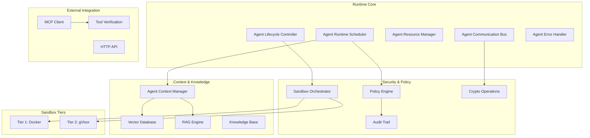
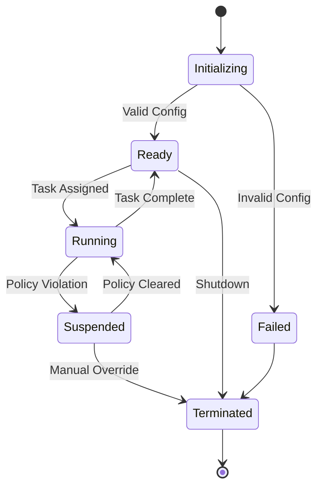
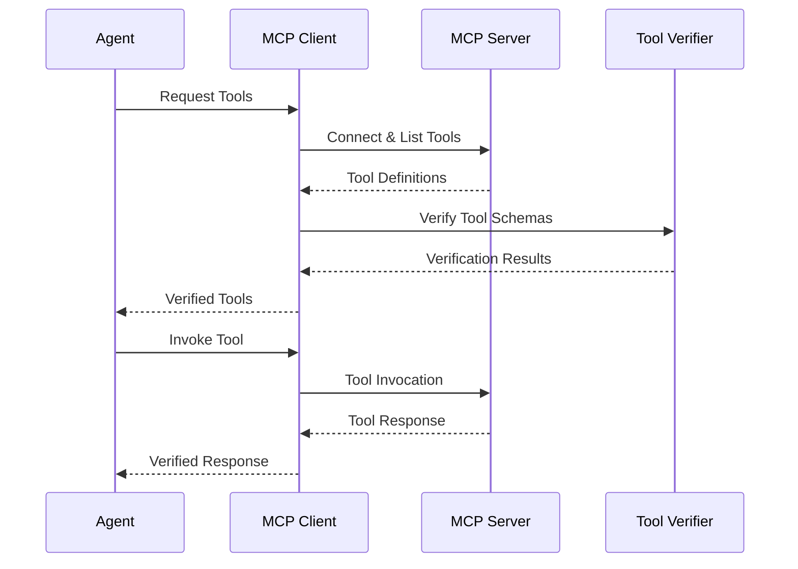

# Arquitectura del Runtime
{: .no_toc }

## 🌐 Otros idiomas
{: .no_toc}

[English](runtime-architecture.md) | [中文简体](runtime-architecture.zh-cn.md) | **Español** | [Português](runtime-architecture.pt.md) | [日本語](runtime-architecture.ja.md) | [Deutsch](runtime-architecture.de.md)

---

Comprenda la arquitectura del sistema de runtime de Symbi y los componentes principales.
{: .fs-6 .fw-300 }

## Tabla de contenidos
{: .no_toc .text-delta }

1. TOC
{:toc}

---

## Visión General

El sistema de runtime de Symbi proporciona un entorno de ejecución seguro, escalable y consciente de políticas para agentes autónomos. Construido sobre Rust para rendimiento y seguridad, implementa un modelo de seguridad de múltiples niveles con capacidades de auditoría integral.

### Principios Fundamentales

- **Seguridad por Defecto**: Cada operación está sujeta a la aplicación de políticas
- **Confianza Cero**: Todos los componentes y comunicaciones son verificados
- **Auditoría Completa**: Cada acción se registra con integridad criptográfica
- **Dirigido por Políticas**: Las políticas declarativas controlan todo el comportamiento del sistema
- **Alto Rendimiento**: Implementación nativa en Rust para cargas de trabajo de producción

---

## Arquitectura del Sistema



---

## Componentes Principales

### Programador de Runtime del Agente

El orquestador central responsable de gestionar la ejecución de agentes.

**Responsabilidades Principales:**
- **Programación de Tareas**: Programación basada en prioridades con conocimiento de recursos
- **Balanceador de Carga**: Distribución entre recursos disponibles
- **Asignación de Recursos**: Asignación de memoria, CPU e I/O
- **Coordinación de Políticas**: Integración con la aplicación de políticas

**Características de Rendimiento:**
- Soporte para más de 10,000 agentes concurrentes
- Decisiones de programación sub-milisegundo
- Apropiación basada en prioridades
- Colocación consciente de recursos

```rust
pub struct AgentScheduler {
    priority_queues: Vec<PriorityQueue<AgentTask>>,
    resource_pool: ResourcePool,
    policy_engine: Arc<PolicyEngine>,
    load_balancer: LoadBalancer,
}

impl AgentScheduler {
    pub async fn schedule_agent(&self, config: AgentConfig) -> Result<AgentId>;
    pub async fn get_system_status(&self) -> SystemStatus;
}
```

### Controlador del Ciclo de Vida del Agente

Gestiona el ciclo de vida completo de los agentes desde la inicialización hasta la terminación.

**Estados del Ciclo de Vida:**
1. **Inicializando**: Análisis de DSL y validación de configuración
2. **Listo**: Esperando asignación de tareas
3. **Ejecutándose**: Ejecutando activamente tareas
4. **Suspendido**: Pausado debido a violación de política o restricciones de recursos
5. **Terminado**: Apagado graceful o forzadamente detenido



### Gestión de Recursos

**Tipos de Recursos Gestionados:**
- **Memoria**: Asignación de heap con límites y monitoreo
- **CPU**: Asignación de núcleos y seguimiento de utilización
- **E/S de Disco**: Límites de ancho de banda de lectura/escritura
- **E/S de Red**: Límites de ancho de banda y conexiones
- **Tiempo de Ejecución**: Aplicación de timeout

**Estrategias de Asignación de Recursos:**
- **Primer Ajuste**: Asignación más rápida para escenarios de baja latencia
- **Mejor Ajuste**: Utilización óptima para eficiencia de recursos
- **Basado en Prioridades**: Garantizar recursos para agentes críticos

```rust
pub struct ResourceLimits {
    pub memory_mb: usize,
    pub cpu_cores: f32,
    pub disk_io_mbps: usize,
    pub network_io_mbps: usize,
    pub execution_timeout: Duration,
}
```

---

## Seguridad Multi-Nivel

### Arquitectura de Sandbox

El runtime implementa dos niveles de seguridad basados en el riesgo de la operación:

#### Nivel 1: Aislamiento Docker
**Caso de Uso**: Operaciones de bajo riesgo, tareas de desarrollo
- Aislamiento basado en contenedores
- Límites de recursos y eliminación de capacidades
- Aislamiento de red y sistemas de archivos de solo lectura
- Adecuado para código confiable con requisitos mínimos de seguridad

#### Nivel 2: Aislamiento gVisor
**Caso de Uso**: Tareas de producción estándar, procesamiento de datos
- Kernel de espacio de usuario con intercepción de llamadas del sistema
- Protección de memoria y virtualización de E/S
- Seguridad mejorada con impacto mínimo en el rendimiento
- Nivel predeterminado para la mayoría de operaciones de agentes

> **Nota**: Niveles adicionales de aislamiento están disponibles en las ediciones Enterprise para requisitos máximos de seguridad.

### Evaluación de Riesgos

El sistema determina automáticamente el nivel de seguridad apropiado:

```rust
pub fn assess_security_tier(agent_config: &AgentConfig) -> SecurityTier {
    let risk_factors = RiskAssessment {
        data_sensitivity: assess_data_sensitivity(&agent_config.inputs),
        code_trust_level: assess_code_trust(&agent_config.source),
        network_access: agent_config.requires_network,
        file_system_access: agent_config.requires_filesystem,
        external_integrations: !agent_config.external_apis.is_empty(),
    };
    
    match calculate_risk_score(risk_factors) {
        score if score < 0.5 => SecurityTier::Tier1,
        _ => SecurityTier::Tier2,
    }
}
```

---

## Sistema de Comunicación

### Tipos de Mensajes

El runtime soporta múltiples patrones de comunicación:

**Mensajería Directa**: Comunicación punto a punto con garantías de entrega
```rust
let response = agent_bus.send_message(
    target_agent_id, 
    SecureMessage::new(payload)
).await?;
```

**Publicar-Suscribir**: Distribución de eventos basada en temas
```rust
agent_bus.publish("data_processing.completed", event_data).await?;
agent_bus.subscribe("security.alerts", alert_handler).await?;
```

**Solicitud-Respuesta**: Comunicación síncrona con timeout
```rust
let result = agent_bus.request(
    target_agent, 
    request_payload,
    timeout_duration
).await?;
```

### Características de Seguridad

**Cifrado de Mensajes**: AES-256-GCM para protección de carga útil
**Firmas Digitales**: Firmas Ed25519 para autenticidad
**Enrutamiento de Mensajes**: Controles de enrutamiento basados en políticas
**Limitación de Velocidad**: Aplicación de velocidad de mensaje por agente

```rust
pub struct SecureMessage {
    pub id: MessageId,
    pub sender: AgentId,
    pub recipient: Option<AgentId>,
    pub encrypted_payload: Vec<u8>,
    pub signature: Ed25519Signature,
    pub timestamp: SystemTime,
}
```

---

## Sistemas de Contexto y Conocimiento

### Gestor de Contexto del Agente

Proporciona gestión de memoria persistente y conocimiento para agentes.

**Tipos de Contexto:**
- **Memoria a Corto Plazo**: Interacciones recientes y contexto inmediato
- **Memoria a Largo Plazo**: Conocimiento persistente y patrones aprendidos
- **Memoria de Trabajo**: Procesamiento activo y estado temporal
- **Conocimiento Compartido**: Intercambio de conocimiento entre agentes

```rust
pub trait ContextManager {
    async fn store_context(&self, agent_id: AgentId, context: AgentContext) -> Result<ContextId>;
    async fn retrieve_context(&self, agent_id: AgentId, query: ContextQuery) -> Result<Vec<ContextItem>>;
    async fn search_knowledge(&self, agent_id: AgentId, query: &str) -> Result<Vec<KnowledgeItem>>;
}
```

### Integración del Motor RAG

**Pipeline RAG:**
1. **Análisis de Consulta**: Comprensión de las necesidades de información del agente
2. **Búsqueda Vectorial**: Búsqueda de similitud semántica en la base de conocimiento
3. **Recuperación de Documentos**: Obtención de documentos de conocimiento relevantes
4. **Clasificación de Contexto**: Puntuación de relevancia y filtrado
5. **Generación de Respuesta**: Síntesis de respuesta aumentada por contexto

**Objetivos de Rendimiento:**
- Recuperación de contexto: <50ms promedio
- Búsqueda vectorial: <100ms para más de 1M embeddings
- Pipeline RAG: <500ms de extremo a extremo

### Base de Datos Vectorial

**Operaciones Soportadas:**
- **Búsqueda Semántica**: Recuperación de documentos basada en similitud
- **Filtrado de Metadatos**: Refinamiento de búsqueda basado en restricciones
- **Operaciones por Lotes**: Operaciones masivas eficientes
- **Actualizaciones en Tiempo Real**: Actualizaciones dinámicas de la base de conocimiento

**Integración con Qdrant:**
```rust
pub struct VectorConfig {
    pub dimension: usize,           // 1536 for OpenAI embeddings
    pub distance_metric: DistanceMetric::Cosine,
    pub index_type: IndexType::HNSW,
    pub ef_construct: 200,
    pub m: 16,
}
```

---

## Integración MCP

### Cliente del Protocolo de Contexto del Modelo

Permite a los agentes acceder a herramientas y recursos externos de forma segura.

**Capacidades Principales:**
- **Descubrimiento de Servidores**: Descubrimiento automático de servidores MCP disponibles
- **Gestión de Herramientas**: Descubrimiento dinámico de herramientas e invocación
- **Acceso a Recursos**: Acceso seguro a fuentes de datos externas
- **Manejo de Protocolo**: Cumplimiento completo de la especificación MCP

### Proceso de Descubrimiento de Herramientas



### Verificación de Herramientas con SchemaPin

**Proceso de Verificación:**
1. **Descubrimiento de Esquema**: Recuperar esquema de herramienta del servidor MCP
2. **Verificación de Firma**: Verificar firma criptográfica
3. **Confianza en Primer Uso**: Anclar claves confiables para verificación futura
4. **Aplicación de Políticas**: Aplicar políticas de uso de herramientas
5. **Registro de Auditoría**: Registrar todas las interacciones de herramientas

```rust
pub struct ToolVerifier {
    key_store: SchemaPinKeyStore,
    policy_engine: Arc<PolicyEngine>,
    audit_logger: AuditLogger,
}

impl ToolVerifier {
    pub async fn verify_tool(&self, tool: &MCPTool) -> VerificationResult;
    pub async fn enforce_policies(&self, agent_id: AgentId, tool: &MCPTool) -> PolicyResult;
}
```

---

## Aplicación de Políticas

### Arquitectura del Motor de Políticas

**Tipos de Políticas:**
- **Control de Acceso**: Quién puede acceder a qué recursos
- **Flujo de Datos**: Cómo se mueven los datos a través del sistema
- **Uso de Recursos**: Límites en recursos computacionales
- **Requisitos de Auditoría**: Qué debe registrarse y cómo

**Evaluación de Políticas:**
```rust
pub enum PolicyDecision {
    Allow,
    Deny { reason: String },
    AllowWithConditions { conditions: Vec<PolicyCondition> },
}

pub trait PolicyEngine {
    async fn evaluate_policy(&self, context: PolicyContext, action: Action) -> PolicyDecision;
    async fn register_policy(&self, policy: Policy) -> Result<PolicyId>;
}
```

### Aplicación en Tiempo Real

**Puntos de Aplicación:**
- Creación y configuración de agentes
- Envío y enrutamiento de mensajes
- Solicitudes de asignación de recursos
- Invocación de herramientas externas
- Operaciones de acceso a datos

**Rendimiento:**
- Evaluación de políticas: <1ms por decisión
- Evaluación por lotes: más de 10,000 decisiones por segundo
- Actualizaciones en tiempo real: Cambios de política propagados instantáneamente

---

## Auditoría y Cumplimiento

### Rastro de Auditoría Criptográfico

**Estructura de Eventos de Auditoría:**
```rust
pub struct AuditEvent {
    pub event_id: Uuid,
    pub timestamp: SystemTime,
    pub agent_id: AgentId,
    pub event_type: AuditEventType,
    pub details: AuditDetails,
    pub signature: Ed25519Signature,
    pub chain_hash: Hash,
}
```

**Garantías de Integridad:**
- **Firmas Digitales**: Firmas Ed25519 en todos los eventos
- **Encadenamiento de Hash**: Eventos vinculados en cadena inmutable
- **Verificación de Timestamp**: Timestamps criptográficos
- **Verificación por Lotes**: Verificación masiva eficiente

### Características de Cumplimiento

**Soporte Regulatorio:**
- **HIPAA**: Cumplimiento de protección de datos de salud
- **GDPR**: Requisitos europeos de protección de datos
- **SOX**: Requisitos de rastro de auditoría financiera
- **Personalizado**: Marcos de cumplimiento configurables

**Capacidades de Auditoría:**
- Transmisión de eventos en tiempo real
- Consulta de eventos históricos
- Generación de informes de cumplimiento
- Verificación de integridad

---

## Características de Rendimiento

### Métricas de Escalabilidad

**Gestión de Agentes:**
- **Agentes Concurrentes**: Más de 10,000 agentes simultáneos
- **Inicio de Agente**: <1s para agentes estándar
- **Uso de Memoria**: 1-5MB por agente (varía según configuración)
- **Sobrecarga de CPU**: <5% de sobrecarga del sistema para el runtime

**Rendimiento de Comunicación:**
- **Throughput de Mensajes**: Más de 100,000 mensajes/segundo
- **Latencia de Mensajes**: <10ms para enrutamiento local
- **Sobrecarga de Cifrado**: <1ms por mensaje
- **Pool de Memoria**: Paso de mensajes sin asignación

**Contexto y Conocimiento:**
- **Recuperación de Contexto**: <50ms promedio
- **Búsqueda Vectorial**: <100ms para más de 1M embeddings
- **Actualizaciones de Conocimiento**: Tiempo real con latencia <10ms
- **Eficiencia de Almacenamiento**: Embeddings comprimidos con reducción del 80% en tamaño

### Gestión de Recursos

**Gestión de Memoria:**
- **Estrategia de Asignación**: Asignación basada en pool para rendimiento
- **Recolección de Basura**: Limpieza incremental con tiempos de pausa acotados
- **Protección de Memoria**: Páginas de guarda y detección de desbordamiento
- **Prevención de Fugas**: Limpieza automática y monitoreo

**Utilización de CPU:**
- **Sobrecarga del Programador**: <2% CPU para 10,000 agentes
- **Cambio de Contexto**: Hilos virtuales asistidos por hardware
- **Balanceador de Carga**: Distribución dinámica de carga
- **Programación por Prioridades**: Niveles de procesamiento en tiempo real y por lotes

---

## Configuración

### Configuración del Runtime

```toml
[runtime]
max_concurrent_agents = 10000
scheduler_threads = 8
message_buffer_size = 1048576
gc_interval_ms = 100

[security]
default_sandbox_tier = "gvisor"
enforce_policies = true
audit_enabled = true
crypto_provider = "ring"

[context]
vector_db_url = "http://localhost:6333"
embedding_dimension = 1536
context_cache_size = "1GB"
knowledge_retention_days = 365

[mcp]
discovery_enabled = true
tool_verification = "strict"
connection_timeout_s = 30
max_concurrent_connections = 100
```

### Variables de Entorno

```bash
# Core runtime
export SYMBI_LOG_LEVEL=info
export SYMBI_RUNTIME_MODE=production
export SYMBI_CONFIG_PATH=/etc/symbi/config.toml

# Security
export SYMBI_CRYPTO_PROVIDER=ring
export SYMBI_AUDIT_STORAGE=/var/log/symbi/audit

# External dependencies
export QDRANT_URL=http://localhost:6333
export OPENAI_API_KEY=your_api_key_here
export MCP_SERVER_DISCOVERY=enabled
```

---

## Monitoreo y Observabilidad

### Recolección de Métricas

**Métricas del Sistema:**
- Conteo de agentes y uso de recursos
- Throughput y latencia de mensajes
- Rendimiento de evaluación de políticas
- Tasas de eventos de seguridad

**Métricas de Negocio:**
- Tasas de finalización de tareas
- Frecuencias de error por tipo
- Eficiencia de utilización de recursos
- Resultados de auditoría de cumplimiento

**Integración:**
- **Prometheus**: Recolección de métricas y alertas
- **Grafana**: Visualización y dashboards
- **Jaeger**: Trazado distribuido
- **ELK Stack**: Agregación y análisis de logs

### Monitoreo de Salud

```rust
pub struct HealthStatus {
    pub overall_status: SystemStatus,
    pub component_health: HashMap<String, ComponentHealth>,
    pub resource_utilization: ResourceUtilization,
    pub recent_errors: Vec<ErrorSummary>,
}

pub async fn health_check() -> HealthStatus {
    // Comprehensive system health assessment
}
```

---

## Despliegue

### Despliegue en Contenedor

```dockerfile
FROM rust:1.88-slim as builder
WORKDIR /app
COPY . .
RUN cargo build --release --features production

FROM debian:bookworm-slim
RUN apt-get update && apt-get install -y ca-certificates
COPY --from=builder /app/target/release/symbi /usr/local/bin/
EXPOSE 8080
CMD ["symbi", "mcp", "--config", "/etc/symbi/config.toml"]
```

### Despliegue en Kubernetes

```yaml
apiVersion: apps/v1
kind: Deployment
metadata:
  name: symbi-runtime
spec:
  replicas: 3
  selector:
    matchLabels:
      app: symbi-runtime
  template:
    metadata:
      labels:
        app: symbi-runtime
    spec:
      containers:
      - name: runtime
        image: ghcr.io/thirdkeyai/symbi:latest
        ports:
        - containerPort: 8080
        env:
        - name: SYMBI_RUNTIME_MODE
          value: "production"
        resources:
          requests:
            memory: "1Gi"
            cpu: "500m"
          limits:
            memory: "4Gi"
            cpu: "2"
```

---

## Desarrollo y Pruebas

### Desarrollo Local

```bash
# Start dependencies
docker-compose up -d qdrant redis postgres

# Run in development mode
RUST_LOG=debug cargo run --example full_system

# Run tests
cargo test --all --features test-utils
```

### Pruebas de Integración

El runtime incluye suites de pruebas comprehensivas:

- **Pruebas Unitarias**: Pruebas a nivel de componente
- **Pruebas de Integración**: Pruebas entre componentes
- **Pruebas de Rendimiento**: Pruebas de carga y estrés
- **Pruebas de Seguridad**: Pruebas de penetración y cumplimiento

```bash
# Run all test suites
cargo test --workspace

# Run performance benchmarks
cargo bench

# Run security tests
cargo test --features security-tests
```

---

## Próximos Pasos

- **[Modelo de Seguridad](security-model.es.md)** - Profundización en la implementación de seguridad
- **[Contribuyendo](contributing.es.md)** - Pautas de desarrollo y contribución
- **[Referencia de API](api-reference.es.md)** - Documentación completa de API
- **[Ejemplos](https://github.com/thirdkeyai/symbiont/tree/main/runtime/examples)** - Ejemplos y tutoriales del runtime

La arquitectura del runtime proporciona una base robusta para construir agentes de IA seguros y escalables. Su diseño modular y modelo de seguridad integral lo hacen adecuado tanto para entornos de desarrollo como de producción.