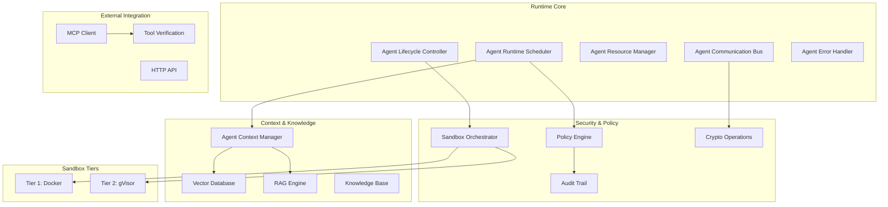
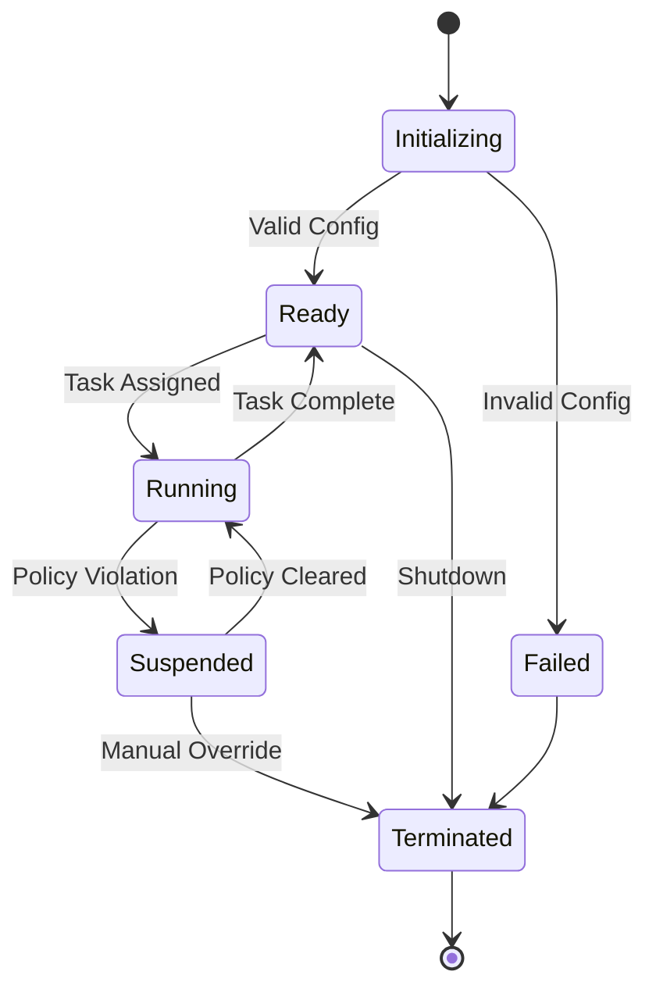
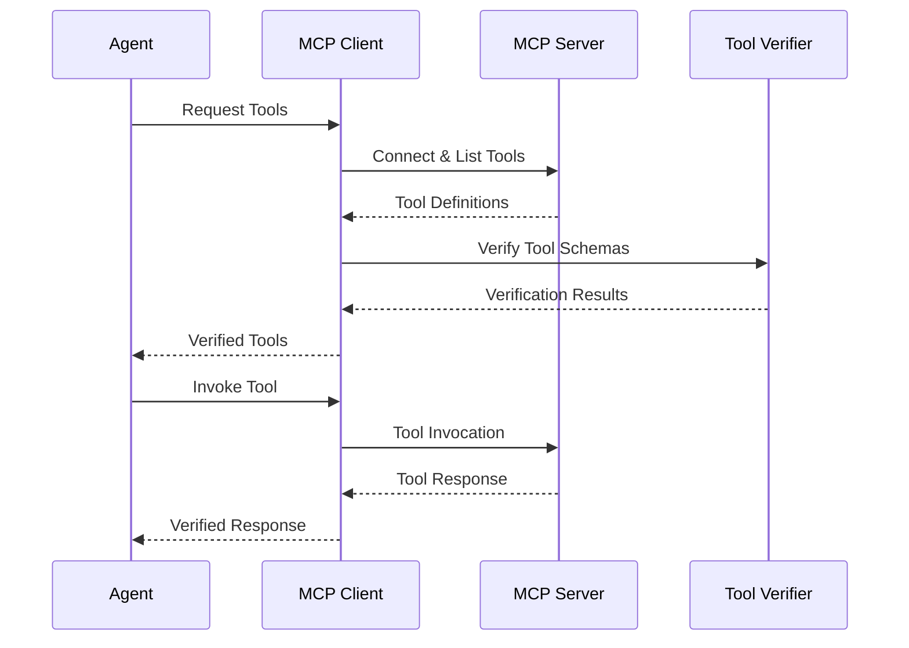

# ランタイムアーキテクチャ
{: .no_toc }

Symbi ランタイムシステムアーキテクチャとコアコンポーネントを理解する。
{: .fs-6 .fw-300 }

## 目次
{: .no_toc .text-delta }

1. TOC
{:toc}

---

## 🌐 他の言語
{: .no_toc}

[English](runtime-architecture.md) | [中文简体](runtime-architecture.zh-cn.md) | [Español](runtime-architecture.es.md) | [Português](runtime-architecture.pt.md) | **日本語** | [Deutsch](runtime-architecture.de.md)

---

## 概要

Symbi ランタイムシステムは、自律エージェント向けに安全でスケーラブル、かつポリシー対応の実行環境を提供します。パフォーマンスと安全性のためにRustで構築され、包括的な監査機能を備えた多層セキュリティモデルを実装しています。

### コア原則

- **デフォルトセキュリティ**: すべての操作がポリシー実行の対象
- **ゼロトラスト**: すべてのコンポーネントと通信が検証される
- **完全な監査可能性**: すべてのアクションが暗号学的完全性をもって記録される
- **ポリシー駆動**: 宣言的ポリシーがすべてのシステム動作を制御
- **高パフォーマンス**: 本番ワークロード向けのRustネイティブ実装

---

## システムアーキテクチャ



---

## コアコンポーネント

### エージェントランタイムスケジューラー

エージェントの実行を管理する中央オーケストレーター。

**主要責任:**
- **タスクスケジューリング**: リソース認識を備えた優先度ベースのスケジューリング
- **負荷分散**: 利用可能なリソース間での配布
- **リソース割り当て**: メモリ、CPU、I/Oの割り当て
- **ポリシー協調**: ポリシー実行との統合

**パフォーマンス特性:**
- 10,000以上の同時エージェントをサポート
- サブミリ秒のスケジューリング決定
- 優先度ベースのプリエンプション
- リソース認識配置

```rust
pub struct AgentScheduler {
    priority_queues: Vec<PriorityQueue<AgentTask>>,
    resource_pool: ResourcePool,
    policy_engine: Arc<PolicyEngine>,
    load_balancer: LoadBalancer,
}

impl AgentScheduler {
    pub async fn schedule_agent(&self, config: AgentConfig) -> Result<AgentId>;
    pub async fn get_system_status(&self) -> SystemStatus;
}
```

### エージェントライフサイクルコントローラー

初期化から終了までのエージェントの完全なライフサイクルを管理。

**ライフサイクル状態:**
1. **初期化中**: DSL解析と設定検証
2. **準備完了**: タスク割り当て待ち
3. **実行中**: アクティブにタスクを実行
4. **中断中**: ポリシー違反またはリソース制約により一時停止
5. **終了**: 正常なシャットダウンまたは強制停止



### リソース管理

**管理されるリソースタイプ:**
- **メモリ**: 制限と監視付きヒープ割り当て
- **CPU**: コア割り当てと使用率追跡
- **ディスクI/O**: 読み書き帯域幅制限
- **ネットワークI/O**: 帯域幅と接続制限
- **実行時間**: タイムアウト実行

**リソース割り当て戦略:**
- **ファーストフィット**: 低レイテンシシナリオ向けの最速割り当て
- **ベストフィット**: リソース効率性のための最適利用
- **優先度ベース**: 重要エージェントのリソース保証

```rust
pub struct ResourceLimits {
    pub memory_mb: usize,
    pub cpu_cores: f32,
    pub disk_io_mbps: usize,
    pub network_io_mbps: usize,
    pub execution_timeout: Duration,
}
```

---

## 多層セキュリティ

### サンドボックスアーキテクチャ

ランタイムは操作リスクに基づいて2つのセキュリティ層を実装:

#### 層1: Docker分離
**使用例**: 低リスク操作、開発タスク
- コンテナベース分離
- リソース制限と機能削除
- ネットワーク分離と読み取り専用ファイルシステム
- 最小限のセキュリティ要件を持つ信頼できるコードに適用

#### 層2: gVisor分離
**使用例**: 標準本番タスク、データ処理
- システムコール傍受付きユーザー空間カーネル
- メモリ保護とI/O仮想化
- 最小限のパフォーマンス影響で強化されたセキュリティ
- ほとんどのエージェント操作のデフォルト層

> **注意**: エンタープライズエディションでは最大セキュリティ要件向けの追加分離層が利用可能。

### リスク評価

システムは適切なセキュリティ層を自動決定:

```rust
pub fn assess_security_tier(agent_config: &AgentConfig) -> SecurityTier {
    let risk_factors = RiskAssessment {
        data_sensitivity: assess_data_sensitivity(&agent_config.inputs),
        code_trust_level: assess_code_trust(&agent_config.source),
        network_access: agent_config.requires_network,
        file_system_access: agent_config.requires_filesystem,
        external_integrations: !agent_config.external_apis.is_empty(),
    };
    
    match calculate_risk_score(risk_factors) {
        score if score < 0.5 => SecurityTier::Tier1,
        _ => SecurityTier::Tier2,
    }
}
```

---

## 通信システム

### メッセージタイプ

ランタイムは複数の通信パターンをサポート:

**ダイレクトメッセージング**: 配信保証付きポイントツーポイント通信
```rust
let response = agent_bus.send_message(
    target_agent_id, 
    SecureMessage::new(payload)
).await?;
```

**パブリッシュ・サブスクライブ**: トピックベースのイベント配布
```rust
agent_bus.publish("data_processing.completed", event_data).await?;
agent_bus.subscribe("security.alerts", alert_handler).await?;
```

**リクエスト・レスポンス**: タイムアウト付き同期通信
```rust
let result = agent_bus.request(
    target_agent, 
    request_payload,
    timeout_duration
).await?;
```

### セキュリティ機能

**メッセージ暗号化**: ペイロード保護のためのAES-256-GCM
**デジタル署名**: 真正性のためのEd25519署名
**メッセージルーティング**: ポリシーベースのルーティング制御
**レート制限**: エージェント毎のメッセージレート実行

```rust
pub struct SecureMessage {
    pub id: MessageId,
    pub sender: AgentId,
    pub recipient: Option<AgentId>,
    pub encrypted_payload: Vec<u8>,
    pub signature: Ed25519Signature,
    pub timestamp: SystemTime,
}
```

---

## コンテキスト＆ナレッジシステム

### エージェントコンテキストマネージャー

エージェント向けの永続メモリとナレッジ管理を提供。

**コンテキストタイプ:**
- **短期記憶**: 最近のやり取りと即座のコンテキスト
- **長期記憶**: 永続的な知識と学習パターン
- **作業記憶**: アクティブな処理と一時的な状態
- **共有知識**: エージェント間のナレッジ共有

```rust
pub trait ContextManager {
    async fn store_context(&self, agent_id: AgentId, context: AgentContext) -> Result<ContextId>;
    async fn retrieve_context(&self, agent_id: AgentId, query: ContextQuery) -> Result<Vec<ContextItem>>;
    async fn search_knowledge(&self, agent_id: AgentId, query: &str) -> Result<Vec<KnowledgeItem>>;
}
```

### RAGエンジン統合

**RAGパイプライン:**
1. **クエリ分析**: エージェントの情報ニーズの理解
2. **ベクトル検索**: ナレッジベースでの意味的類似検索
3. **文書検索**: 関連するナレッジ文書の取得
4. **コンテキストランキング**: 関連性スコアリングとフィルタリング
5. **レスポンス生成**: コンテキスト拡張レスポンス合成

**パフォーマンス目標:**
- コンテキスト検索: 平均50ms未満
- ベクトル検索: 100万以上の埋め込みで100ms未満
- RAGパイプライン: エンドツーエンド500ms未満

### ベクトルデータベース

**サポートされる操作:**
- **意味検索**: 類似性ベースの文書検索
- **メタデータフィルタリング**: 制約ベースの検索絞り込み
- **バッチ操作**: 効率的な一括操作
- **リアルタイム更新**: 動的なナレッジベース更新

**Qdrant統合:**
```rust
pub struct VectorConfig {
    pub dimension: usize,           // 1536 for OpenAI embeddings
    pub distance_metric: DistanceMetric::Cosine,
    pub index_type: IndexType::HNSW,
    pub ef_construct: 200,
    pub m: 16,
}
```

---

## MCP統合

### モデルコンテキストプロトコルクライアント

エージェントが外部ツールとリソースに安全にアクセスできるようにする。

**コア機能:**
- **サーバー発見**: 利用可能なMCPサーバーの自動発見
- **ツール管理**: 動的ツール発見と呼び出し
- **リソースアクセス**: 外部データソースへの安全なアクセス
- **プロトコル処理**: MCP仕様の完全準拠

### ツール発見プロセス



### SchemaPinによるツール検証

**検証プロセス:**
1. **スキーマ発見**: MCPサーバーからツールスキーマを取得
2. **署名検証**: 暗号署名の検証
3. **初回使用時信頼**: 将来の検証のための信頼キーの固定
4. **ポリシー実行**: ツール使用ポリシーの適用
5. **監査ログ記録**: すべてのツールやり取りの記録

```rust
pub struct ToolVerifier {
    key_store: SchemaPinKeyStore,
    policy_engine: Arc<PolicyEngine>,
    audit_logger: AuditLogger,
}

impl ToolVerifier {
    pub async fn verify_tool(&self, tool: &MCPTool) -> VerificationResult;
    pub async fn enforce_policies(&self, agent_id: AgentId, tool: &MCPTool) -> PolicyResult;
}
```

---

## ポリシー実行

### ポリシーエンジンアーキテクチャ

**ポリシータイプ:**
- **アクセス制御**: 誰がどのリソースにアクセスできるか
- **データフロー**: データがシステムを通してどう動くか
- **リソース使用**: 計算リソースの制限
- **監査要件**: 何がどのように記録されるべきか

**ポリシー評価:**
```rust
pub enum PolicyDecision {
    Allow,
    Deny { reason: String },
    AllowWithConditions { conditions: Vec<PolicyCondition> },
}

pub trait PolicyEngine {
    async fn evaluate_policy(&self, context: PolicyContext, action: Action) -> PolicyDecision;
    async fn register_policy(&self, policy: Policy) -> Result<PolicyId>;
}
```

### リアルタイム実行

**実行ポイント:**
- エージェント作成と設定
- メッセージ送信とルーティング
- リソース割り当て要求
- 外部ツール呼び出し
- データアクセス操作

**パフォーマンス:**
- ポリシー評価: 決定あたり1ms未満
- バッチ評価: 毎秒10,000以上の決定
- リアルタイム更新: ポリシー変更の即座の伝播

---

## 監査とコンプライアンス

### 暗号監査証跡

**監査イベント構造:**
```rust
pub struct AuditEvent {
    pub event_id: Uuid,
    pub timestamp: SystemTime,
    pub agent_id: AgentId,
    pub event_type: AuditEventType,
    pub details: AuditDetails,
    pub signature: Ed25519Signature,
    pub chain_hash: Hash,
}
```

**完全性保証:**
- **デジタル署名**: すべてのイベントでのEd25519署名
- **ハッシュチェーン**: 不変チェーンでリンクされたイベント
- **タイムスタンプ検証**: 暗号タイムスタンプ
- **バッチ検証**: 効率的な一括検証

### コンプライアンス機能

**規制サポート:**
- **HIPAA**: 健康データ保護コンプライアンス
- **GDPR**: ヨーロッパデータ保護要件
- **SOX**: 財務監査証跡要件
- **カスタム**: 設定可能なコンプライアンスフレームワーク

**監査機能:**
- リアルタイムイベントストリーミング
- 履歴イベントクエリ
- コンプライアンスレポート生成
- 完全性検証

---

## パフォーマンス特性

### スケーラビリティメトリクス

**エージェント管理:**
- **同時エージェント**: 10,000以上の同時エージェント
- **エージェント起動**: 標準エージェントで1秒未満
- **メモリ使用量**: エージェントあたり1-5MB（設定により変動）
- **CPUオーバーヘッド**: ランタイムのシステムオーバーヘッド5%未満

**通信パフォーマンス:**
- **メッセージスループット**: 毎秒100,000メッセージ以上
- **メッセージレイテンシ**: ローカルルーティングで10ms未満
- **暗号化オーバーヘッド**: メッセージあたり1ms未満
- **メモリプーリング**: ゼロアロケーションメッセージパッシング

**コンテキスト＆ナレッジ:**
- **コンテキスト検索**: 平均50ms未満
- **ベクトル検索**: 100万以上の埋め込みで100ms未満
- **ナレッジ更新**: 10ms未満のレイテンシでリアルタイム
- **ストレージ効率**: 80%のサイズ削減で圧縮埋め込み

### リソース管理

**メモリ管理:**
- **割り当て戦略**: パフォーマンス向けのプールベース割り当て
- **ガベージコレクション**: 境界付き一時停止時間での増分クリーンアップ
- **メモリ保護**: ガードページとオーバーフロー検出
- **リーク防止**: 自動クリーンアップと監視

**CPU使用率:**
- **スケジューラーオーバーヘッド**: 10,000エージェントでCPU2%未満
- **コンテキストスイッチ**: ハードウェア支援仮想スレッド
- **負荷分散**: 動的負荷分散
- **優先度スケジューリング**: リアルタイムとバッチ処理層

---

## 設定

### ランタイム設定

```toml
[runtime]
max_concurrent_agents = 10000
scheduler_threads = 8
message_buffer_size = 1048576
gc_interval_ms = 100

[security]
default_sandbox_tier = "gvisor"
enforce_policies = true
audit_enabled = true
crypto_provider = "ring"

[context]
vector_db_url = "http://localhost:6333"
embedding_dimension = 1536
context_cache_size = "1GB"
knowledge_retention_days = 365

[mcp]
discovery_enabled = true
tool_verification = "strict"
connection_timeout_s = 30
max_concurrent_connections = 100
```

### 環境変数

```bash
# Core runtime
export SYMBI_LOG_LEVEL=info
export SYMBI_RUNTIME_MODE=production
export SYMBI_CONFIG_PATH=/etc/symbi/config.toml

# Security
export SYMBI_CRYPTO_PROVIDER=ring
export SYMBI_AUDIT_STORAGE=/var/log/symbi/audit

# External dependencies
export QDRANT_URL=http://localhost:6333
export OPENAI_API_KEY=your_api_key_here
export MCP_SERVER_DISCOVERY=enabled
```

---

## 監視と可観測性

### メトリクス収集

**システムメトリクス:**
- エージェント数とリソース使用量
- メッセージスループットとレイテンシ
- ポリシー評価パフォーマンス
- セキュリティイベント率

**ビジネスメトリクス:**
- タスク完了率
- タイプ別エラー頻度
- リソース利用効率
- コンプライアンス監査結果

**統合:**
- **Prometheus**: メトリクス収集とアラート
- **Grafana**: 可視化とダッシュボード
- **Jaeger**: 分散トレーシング
- **ELKスタック**: ログ集約と分析

### ヘルス監視

```rust
pub struct HealthStatus {
    pub overall_status: SystemStatus,
    pub component_health: HashMap<String, ComponentHealth>,
    pub resource_utilization: ResourceUtilization,
    pub recent_errors: Vec<ErrorSummary>,
}

pub async fn health_check() -> HealthStatus {
    // Comprehensive system health assessment
}
```

---

## デプロイメント

### コンテナデプロイメント

```dockerfile
FROM rust:1.88-slim as builder
WORKDIR /app
COPY . .
RUN cargo build --release --features production

FROM debian:bookworm-slim
RUN apt-get update && apt-get install -y ca-certificates
COPY --from=builder /app/target/release/symbi /usr/local/bin/
EXPOSE 8080
CMD ["symbi", "mcp", "--config", "/etc/symbi/config.toml"]
```

### Kubernetesデプロイメント

```yaml
apiVersion: apps/v1
kind: Deployment
metadata:
  name: symbi-runtime
spec:
  replicas: 3
  selector:
    matchLabels:
      app: symbi-runtime
  template:
    metadata:
      labels:
        app: symbi-runtime
    spec:
      containers:
      - name: runtime
        image: ghcr.io/thirdkeyai/symbi:latest
        ports:
        - containerPort: 8080
        env:
        - name: SYMBI_RUNTIME_MODE
          value: "production"
        resources:
          requests:
            memory: "1Gi"
            cpu: "500m"
          limits:
            memory: "4Gi"
            cpu: "2"
```

---

## 開発とテスト

### ローカル開発

```bash
# Start dependencies
docker-compose up -d qdrant redis postgres

# Run in development mode
RUST_LOG=debug cargo run --example full_system

# Run tests
cargo test --all --features test-utils
```

### 統合テスト

ランタイムには包括的なテストスイートが含まれています:

- **ユニットテスト**: コンポーネントレベルのテスト
- **統合テスト**: クロスコンポーネントテスト
- **パフォーマンステスト**: 負荷とストレステスト
- **セキュリティテスト**: 侵入とコンプライアンステスト

```bash
# Run all test suites
cargo test --workspace

# Run performance benchmarks
cargo bench

# Run security tests
cargo test --features security-tests
```

---

## 次のステップ

- **[セキュリティモデル](security-model.ja.md)** - セキュリティ実装の詳細
- **[コントリビューション](contributing.ja.md)** - 開発とコントリビューションガイドライン
- **[APIリファレンス](api-reference.ja.md)** - 完全なAPI文書
- **[例](https://github.com/thirdkeyai/symbiont/tree/main/runtime/examples)** - ランタイムの例とチュートリアル

ランタイムアーキテクチャは、安全でスケーラブルなAIエージェントを構築するための堅牢な基盤を提供します。そのモジュラー設計と包括的なセキュリティモデルにより、開発環境と本番環境の両方に適しています。