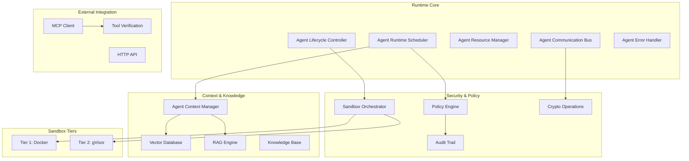
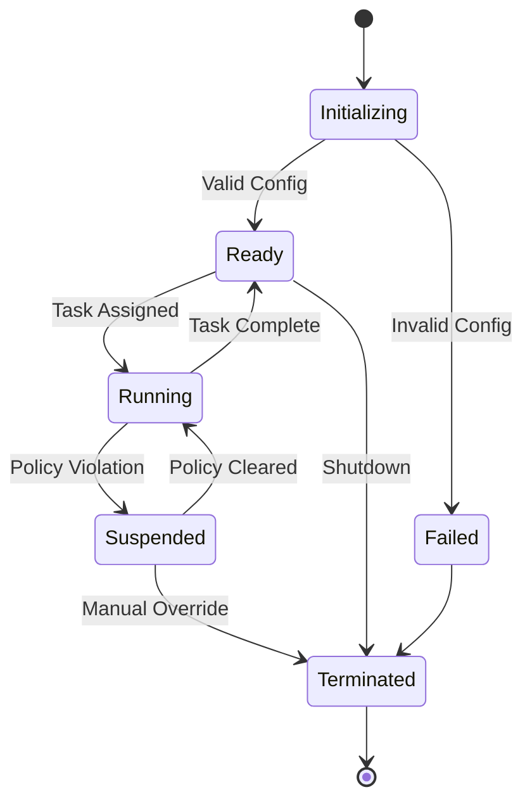
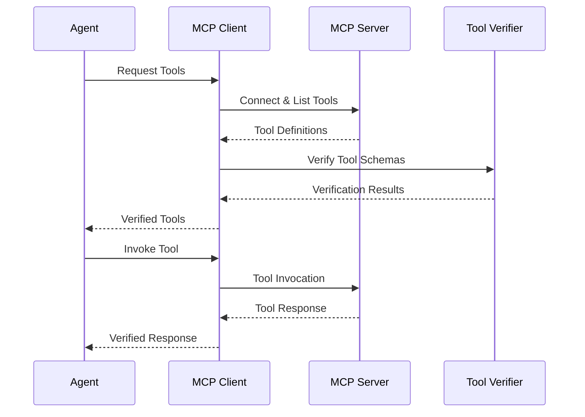

# Runtime Architecture
{: .no_toc }

Understanding the Symbiont runtime system architecture and core components.
{: .fs-6 .fw-300 }

## Table of contents
{: .no_toc .text-delta }

1. TOC
{:toc}

---

## Overview

The Symbiont runtime system provides a secure, scalable, and policy-aware execution environment for autonomous agents. Built on Rust for performance and safety, it implements a multi-tier security model with comprehensive audit capabilities.

### Core Principles

- **Security by Default**: Every operation is subject to policy enforcement
- **Zero Trust**: All components and communications are verified
- **Complete Auditability**: Every action is logged with cryptographic integrity
- **Policy-Driven**: Declarative policies control all system behavior
- **High Performance**: Rust-native implementation for production workloads

---

## System Architecture



---

## Core Components

### Agent Runtime Scheduler

The central orchestrator responsible for managing agent execution.

**Key Responsibilities:**
- **Task Scheduling**: Priority-based scheduling with resource awareness
- **Load Balancing**: Distribution across available resources
- **Resource Allocation**: Memory, CPU, and I/O assignment
- **Policy Coordination**: Integration with policy enforcement

**Performance Characteristics:**
- Support for 10,000+ concurrent agents
- Sub-millisecond scheduling decisions
- Priority-based preemption
- Resource-aware placement

```rust
pub struct AgentScheduler {
    priority_queues: Vec<PriorityQueue<AgentTask>>,
    resource_pool: ResourcePool,
    policy_engine: Arc<PolicyEngine>,
    load_balancer: LoadBalancer,
}

impl AgentScheduler {
    pub async fn schedule_agent(&self, config: AgentConfig) -> Result<AgentId>;
    pub async fn get_system_status(&self) -> SystemStatus;
}
```

### Agent Lifecycle Controller

Manages the complete lifecycle of agents from initialization to termination.

**Lifecycle States:**
1. **Initializing**: Parsing DSL and validating configuration
2. **Ready**: Waiting for task assignment
3. **Running**: Actively executing tasks
4. **Suspended**: Paused due to policy violation or resource constraints
5. **Terminated**: Gracefully shutdown or forcibly stopped



### Resource Management

**Resource Types Managed:**
- **Memory**: Heap allocation with limits and monitoring
- **CPU**: Core allocation and utilization tracking
- **Disk I/O**: Read/write bandwidth limits
- **Network I/O**: Bandwidth and connection limits
- **Execution Time**: Timeout enforcement

**Resource Allocation Strategies:**
- **First Fit**: Fastest allocation for low-latency scenarios
- **Best Fit**: Optimal utilization for resource efficiency
- **Priority-Based**: Guarantee resources for critical agents

```rust
pub struct ResourceLimits {
    pub memory_mb: usize,
    pub cpu_cores: f32,
    pub disk_io_mbps: usize,
    pub network_io_mbps: usize,
    pub execution_timeout: Duration,
}
```

---

## Multi-Tier Security

### Sandbox Architecture

The runtime implements two security tiers based on operation risk:

#### Tier 1: Docker Isolation
**Use Case**: Low-risk operations, development tasks
- Container-based isolation
- Resource limits and capability dropping
- Network isolation and read-only filesystems
- Suitable for trusted code with minimal security requirements

#### Tier 2: gVisor Isolation
**Use Case**: Standard production tasks, data processing
- User-space kernel with system call interception
- Memory protection and I/O virtualization
- Enhanced security with minimal performance impact
- Default tier for most agent operations

> **Note**: Additional isolation tiers are available in Enterprise editions for maximum security requirements.

### Risk Assessment

The system automatically determines the appropriate security tier:

```rust
pub fn assess_security_tier(agent_config: &AgentConfig) -> SecurityTier {
    let risk_factors = RiskAssessment {
        data_sensitivity: assess_data_sensitivity(&agent_config.inputs),
        code_trust_level: assess_code_trust(&agent_config.source),
        network_access: agent_config.requires_network,
        file_system_access: agent_config.requires_filesystem,
        external_integrations: !agent_config.external_apis.is_empty(),
    };
    
    match calculate_risk_score(risk_factors) {
        score if score < 0.5 => SecurityTier::Tier1,
        _ => SecurityTier::Tier2,
    }
}
```

---

## Communication System

### Message Types

The runtime supports multiple communication patterns:

**Direct Messaging**: Point-to-point communication with delivery guarantees
```rust
let response = agent_bus.send_message(
    target_agent_id, 
    SecureMessage::new(payload)
).await?;
```

**Publish-Subscribe**: Topic-based event distribution
```rust
agent_bus.publish("data_processing.completed", event_data).await?;
agent_bus.subscribe("security.alerts", alert_handler).await?;
```

**Request-Response**: Synchronous communication with timeout
```rust
let result = agent_bus.request(
    target_agent, 
    request_payload,
    timeout_duration
).await?;
```

### Security Features

**Message Encryption**: AES-256-GCM for payload protection
**Digital Signatures**: Ed25519 signatures for authenticity
**Message Routing**: Policy-based routing controls
**Rate Limiting**: Per-agent message rate enforcement

```rust
pub struct SecureMessage {
    pub id: MessageId,
    pub sender: AgentId,
    pub recipient: Option<AgentId>,
    pub encrypted_payload: Vec<u8>,
    pub signature: Ed25519Signature,
    pub timestamp: SystemTime,
}
```

---

## Context & Knowledge Systems

### Agent Context Manager

Provides persistent memory and knowledge management for agents.

**Context Types:**
- **Short-term Memory**: Recent interactions and immediate context
- **Long-term Memory**: Persistent knowledge and learned patterns  
- **Working Memory**: Active processing and temporary state
- **Shared Knowledge**: Cross-agent knowledge sharing

```rust
pub trait ContextManager {
    async fn store_context(&self, agent_id: AgentId, context: AgentContext) -> Result<ContextId>;
    async fn retrieve_context(&self, agent_id: AgentId, query: ContextQuery) -> Result<Vec<ContextItem>>;
    async fn search_knowledge(&self, agent_id: AgentId, query: &str) -> Result<Vec<KnowledgeItem>>;
}
```

### RAG Engine Integration

**RAG Pipeline:**
1. **Query Analysis**: Understanding agent information needs
2. **Vector Search**: Semantic similarity search in knowledge base
3. **Document Retrieval**: Fetching relevant knowledge documents
4. **Context Ranking**: Relevance scoring and filtering
5. **Response Generation**: Context-augmented response synthesis

**Performance Targets:**
- Context retrieval: <50ms average
- Vector search: <100ms for 1M+ embeddings
- RAG pipeline: <500ms end-to-end

### Vector Database

**Supported Operations:**
- **Semantic Search**: Similarity-based document retrieval
- **Metadata Filtering**: Constraint-based search refinement
- **Batch Operations**: Efficient bulk operations
- **Real-time Updates**: Dynamic knowledge base updates

**Integration with Qdrant:**
```rust
pub struct VectorConfig {
    pub dimension: usize,           // 1536 for OpenAI embeddings
    pub distance_metric: DistanceMetric::Cosine,
    pub index_type: IndexType::HNSW,
    pub ef_construct: 200,
    pub m: 16,
}
```

---

## MCP Integration

### Model Context Protocol Client

Enables agents to access external tools and resources securely.

**Core Capabilities:**
- **Server Discovery**: Automatic discovery of available MCP servers
- **Tool Management**: Dynamic tool discovery and invocation
- **Resource Access**: Secure access to external data sources
- **Protocol Handling**: Full MCP specification compliance

### Tool Discovery Process



### Tool Verification with SchemaPin

**Verification Process:**
1. **Schema Discovery**: Retrieve tool schema from MCP server
2. **Signature Verification**: Verify cryptographic signature
3. **Trust-On-First-Use**: Pin trusted keys for future verification
4. **Policy Enforcement**: Apply tool usage policies
5. **Audit Logging**: Log all tool interactions

```rust
pub struct ToolVerifier {
    key_store: SchemaPinKeyStore,
    policy_engine: Arc<PolicyEngine>,
    audit_logger: AuditLogger,
}

impl ToolVerifier {
    pub async fn verify_tool(&self, tool: &MCPTool) -> VerificationResult;
    pub async fn enforce_policies(&self, agent_id: AgentId, tool: &MCPTool) -> PolicyResult;
}
```

---

## Policy Enforcement

### Policy Engine Architecture

**Policy Types:**
- **Access Control**: Who can access what resources
- **Data Flow**: How data moves through the system
- **Resource Usage**: Limits on computational resources
- **Audit Requirements**: What must be logged and how

**Policy Evaluation:**
```rust
pub enum PolicyDecision {
    Allow,
    Deny { reason: String },
    AllowWithConditions { conditions: Vec<PolicyCondition> },
}

pub trait PolicyEngine {
    async fn evaluate_policy(&self, context: PolicyContext, action: Action) -> PolicyDecision;
    async fn register_policy(&self, policy: Policy) -> Result<PolicyId>;
}
```

### Real-time Enforcement

**Enforcement Points:**
- Agent creation and configuration
- Message sending and routing
- Resource allocation requests
- External tool invocation
- Data access operations

**Performance:**
- Policy evaluation: <1ms per decision
- Batch evaluation: 10,000+ decisions per second
- Real-time updates: Policy changes propagated instantly

---

## Audit and Compliance

### Cryptographic Audit Trail

**Audit Event Structure:**
```rust
pub struct AuditEvent {
    pub event_id: Uuid,
    pub timestamp: SystemTime,
    pub agent_id: AgentId,
    pub event_type: AuditEventType,
    pub details: AuditDetails,
    pub signature: Ed25519Signature,
    pub chain_hash: Hash,
}
```

**Integrity Guarantees:**
- **Digital Signatures**: Ed25519 signatures on all events
- **Hash Chaining**: Events linked in immutable chain
- **Timestamp Verification**: Cryptographic timestamps
- **Batch Verification**: Efficient bulk verification

### Compliance Features

**Regulatory Support:**
- **HIPAA**: Healthcare data protection compliance
- **GDPR**: European data protection requirements
- **SOX**: Financial audit trail requirements
- **Custom**: Configurable compliance frameworks

**Audit Capabilities:**
- Real-time event streaming
- Historical event querying
- Compliance report generation
- Integrity verification

---

## Performance Characteristics

### Scalability Metrics

**Agent Management:**
- **Concurrent Agents**: 10,000+ simultaneous agents
- **Agent Startup**: <1s for standard agents
- **Memory Usage**: 1-5MB per agent (varies by configuration)
- **CPU Overhead**: <5% system overhead for runtime

**Communication Performance:**
- **Message Throughput**: 100,000+ messages/second
- **Message Latency**: <10ms for local routing
- **Encryption Overhead**: <1ms per message
- **Memory Pooling**: Zero-allocation message passing

**Context & Knowledge:**
- **Context Retrieval**: <50ms average
- **Vector Search**: <100ms for 1M+ embeddings
- **Knowledge Updates**: Real-time with <10ms latency
- **Storage Efficiency**: Compressed embeddings with 80% size reduction

### Resource Management

**Memory Management:**
- **Allocation Strategy**: Pool-based allocation for performance
- **Garbage Collection**: Incremental cleanup with bounded pause times
- **Memory Protection**: Guard pages and overflow detection
- **Leak Prevention**: Automatic cleanup and monitoring

**CPU Utilization:**
- **Scheduler Overhead**: <2% CPU for 10,000 agents
- **Context Switching**: Hardware-assisted virtual threads
- **Load Balancing**: Dynamic load distribution
- **Priority Scheduling**: Real-time and batch processing tiers

---

## Configuration

### Runtime Configuration

```toml
[runtime]
max_concurrent_agents = 10000
scheduler_threads = 8
message_buffer_size = 1048576
gc_interval_ms = 100

[security]
default_sandbox_tier = "gvisor"
enforce_policies = true
audit_enabled = true
crypto_provider = "ring"

[context]
vector_db_url = "http://localhost:6333"
embedding_dimension = 1536
context_cache_size = "1GB"
knowledge_retention_days = 365

[mcp]
discovery_enabled = true
tool_verification = "strict"
connection_timeout_s = 30
max_concurrent_connections = 100
```

### Environment Variables

```bash
# Core runtime
export SYMBIONT_LOG_LEVEL=info
export SYMBIONT_RUNTIME_MODE=production
export SYMBIONT_CONFIG_PATH=/etc/symbiont/config.toml

# Security
export SYMBIONT_CRYPTO_PROVIDER=ring
export SYMBIONT_AUDIT_STORAGE=/var/log/symbiont/audit

# External dependencies
export QDRANT_URL=http://localhost:6333
export OPENAI_API_KEY=your_api_key_here
export MCP_SERVER_DISCOVERY=enabled
```

---

## Monitoring and Observability

### Metrics Collection

**System Metrics:**
- Agent count and resource usage
- Message throughput and latency
- Policy evaluation performance
- Security event rates

**Business Metrics:**
- Task completion rates
- Error frequencies by type
- Resource utilization efficiency
- Compliance audit results

**Integration:**
- **Prometheus**: Metrics collection and alerting
- **Grafana**: Visualization and dashboards
- **Jaeger**: Distributed tracing
- **ELK Stack**: Log aggregation and analysis

### Health Monitoring

```rust
pub struct HealthStatus {
    pub overall_status: SystemStatus,
    pub component_health: HashMap<String, ComponentHealth>,
    pub resource_utilization: ResourceUtilization,
    pub recent_errors: Vec<ErrorSummary>,
}

pub async fn health_check() -> HealthStatus {
    // Comprehensive system health assessment
}
```

---

## Deployment

### Container Deployment

```dockerfile
FROM rust:1.88-slim as builder
WORKDIR /app
COPY . .
RUN cargo build --release --features production

FROM debian:bookworm-slim
RUN apt-get update && apt-get install -y ca-certificates
COPY --from=builder /app/target/release/symbiont /usr/local/bin/
EXPOSE 8080
CMD ["symbiont", "--config", "/etc/symbiont/config.toml"]
```

### Kubernetes Deployment

```yaml
apiVersion: apps/v1
kind: Deployment
metadata:
  name: symbiont-runtime
spec:
  replicas: 3
  selector:
    matchLabels:
      app: symbiont-runtime
  template:
    metadata:
      labels:
        app: symbiont-runtime
    spec:
      containers:
      - name: runtime
        image: symbiont/runtime:latest
        ports:
        - containerPort: 8080
        env:
        - name: SYMBIONT_RUNTIME_MODE
          value: "production"
        resources:
          requests:
            memory: "1Gi"
            cpu: "500m"
          limits:
            memory: "4Gi"
            cpu: "2"
```

---

## Development and Testing

### Local Development

```bash
# Start dependencies
docker-compose up -d qdrant redis postgres

# Run in development mode
RUST_LOG=debug cargo run --example full_system

# Run tests
cargo test --all --features test-utils
```

### Integration Testing

The runtime includes comprehensive test suites:

- **Unit Tests**: Component-level testing
- **Integration Tests**: Cross-component testing  
- **Performance Tests**: Load and stress testing
- **Security Tests**: Penetration and compliance testing

```bash
# Run all test suites
cargo test --workspace

# Run performance benchmarks
cargo bench

# Run security tests
cargo test --features security-tests
```

---

## Next Steps

- **[Security Model](/security-model)** - Deep dive into security implementation
- **[Contributing](/contributing)** - Development and contribution guidelines
- **[API Reference](/api-reference)** - Complete API documentation
- **[Examples](https://github.com/thirdkey/symbiont/tree/main/runtime/examples)** - Runtime examples and tutorials

The runtime architecture provides a robust foundation for building secure, scalable AI agents. Its modular design and comprehensive security model make it suitable for both development and production environments.