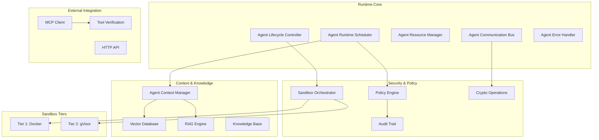
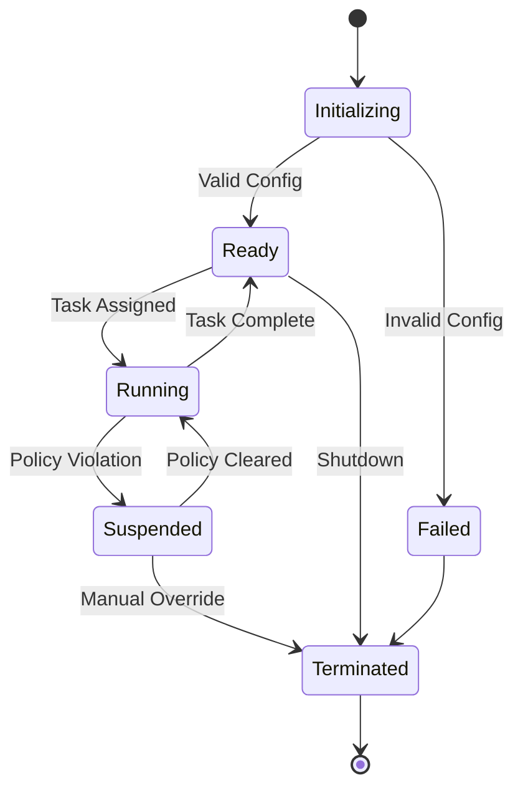
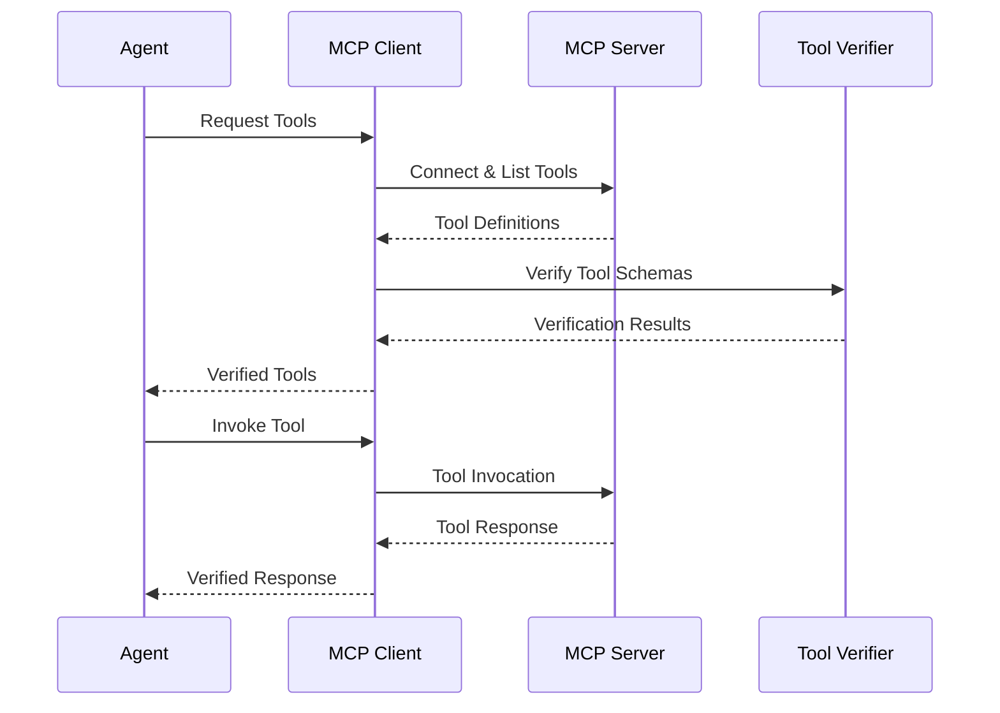

# Arquitetura de Runtime
{: .no_toc }

Compreenda a arquitetura do sistema de runtime Symbi e os componentes principais.
{: .fs-6 .fw-300 }

## Índice
{: .no_toc .text-delta }

1. TOC
{:toc}

---

## 🌐 Outros idiomas

[English](runtime-architecture.md) | [中文简体](runtime-architecture.zh-cn.md) | [Español](runtime-architecture.es.md) | **Português** | [日本語](runtime-architecture.ja.md) | [Deutsch](runtime-architecture.de.md)

---

## Visão Geral

O sistema de runtime Symbi fornece um ambiente de execução seguro, escalável e consciente de políticas para agentes autônomos. Construído em Rust para performance e segurança, implementa um modelo de segurança multi-camadas com capacidades abrangentes de auditoria.

### Princípios Fundamentais

- **Segurança por Padrão**: Toda operação está sujeita à aplicação de políticas
- **Confiança Zero**: Todos os componentes e comunicações são verificados
- **Auditabilidade Completa**: Toda ação é registrada com integridade criptográfica
- **Dirigido por Políticas**: Políticas declarativas controlam todo o comportamento do sistema
- **Alto Desempenho**: Implementação nativa em Rust para cargas de trabalho de produção

---

## Arquitetura do Sistema



---

## Componentes Principais

### Agendador de Runtime do Agente

O orquestrador central responsável por gerenciar a execução de agentes.

**Responsabilidades Principais:**
- **Agendamento de Tarefas**: Agendamento baseado em prioridade com consciência de recursos
- **Balanceamento de Carga**: Distribuição entre recursos disponíveis
- **Alocação de Recursos**: Atribuição de memória, CPU e E/S
- **Coordenação de Políticas**: Integração com aplicação de políticas

**Características de Performance:**
- Suporte para mais de 10.000 agentes concorrentes
- Decisões de agendamento sub-milissegundo
- Preempção baseada em prioridade
- Posicionamento consciente de recursos

```rust
pub struct AgentScheduler {
    priority_queues: Vec<PriorityQueue<AgentTask>>,
    resource_pool: ResourcePool,
    policy_engine: Arc<PolicyEngine>,
    load_balancer: LoadBalancer,
}

impl AgentScheduler {
    pub async fn schedule_agent(&self, config: AgentConfig) -> Result<AgentId>;
    pub async fn get_system_status(&self) -> SystemStatus;
}
```

### Controlador do Ciclo de Vida do Agente

Gerencia o ciclo de vida completo dos agentes desde a inicialização até o encerramento.

**Estados do Ciclo de Vida:**
1. **Inicializando**: Análise de DSL e validação de configuração
2. **Pronto**: Aguardando atribuição de tarefa
3. **Executando**: Executando ativamente tarefas
4. **Suspenso**: Pausado devido à violação de política ou restrições de recursos
5. **Encerrado**: Desligamento gracioso ou parada forçada



### Gerenciamento de Recursos

**Tipos de Recursos Gerenciados:**
- **Memória**: Alocação de heap com limites e monitoramento
- **CPU**: Alocação de núcleos e rastreamento de utilização
- **E/S de Disco**: Limites de largura de banda de leitura/escrita
- **E/S de Rede**: Limites de largura de banda e conexões
- **Tempo de Execução**: Aplicação de timeout

**Estratégias de Alocação de Recursos:**
- **Primeiro Ajuste**: Alocação mais rápida para cenários de baixa latência
- **Melhor Ajuste**: Utilização ótima para eficiência de recursos
- **Baseado em Prioridade**: Garantir recursos para agentes críticos

```rust
pub struct ResourceLimits {
    pub memory_mb: usize,
    pub cpu_cores: f32,
    pub disk_io_mbps: usize,
    pub network_io_mbps: usize,
    pub execution_timeout: Duration,
}
```

---

## Segurança Multi-Camadas

### Arquitetura de Sandbox

O runtime implementa duas camadas de segurança baseadas no risco da operação:

#### Camada 1: Isolamento Docker
**Caso de Uso**: Operações de baixo risco, tarefas de desenvolvimento
- Isolamento baseado em contêiner
- Limites de recursos e remoção de capacidades
- Isolamento de rede e sistemas de arquivos somente leitura
- Adequado para código confiável com requisitos mínimos de segurança

#### Camada 2: Isolamento gVisor
**Caso de Uso**: Tarefas de produção padrão, processamento de dados
- Kernel de espaço do usuário com interceptação de chamadas do sistema
- Proteção de memória e virtualização de E/S
- Segurança aprimorada com impacto mínimo na performance
- Camada padrão para a maioria das operações de agentes

> **Nota**: Camadas adicionais de isolamento estão disponíveis nas edições Enterprise para requisitos máximos de segurança.

### Avaliação de Risco

O sistema determina automaticamente a camada de segurança apropriada:

```rust
pub fn assess_security_tier(agent_config: &AgentConfig) -> SecurityTier {
    let risk_factors = RiskAssessment {
        data_sensitivity: assess_data_sensitivity(&agent_config.inputs),
        code_trust_level: assess_code_trust(&agent_config.source),
        network_access: agent_config.requires_network,
        file_system_access: agent_config.requires_filesystem,
        external_integrations: !agent_config.external_apis.is_empty(),
    };
    
    match calculate_risk_score(risk_factors) {
        score if score < 0.5 => SecurityTier::Tier1,
        _ => SecurityTier::Tier2,
    }
}
```

---

## Sistema de Comunicação

### Tipos de Mensagens

O runtime suporta múltiplos padrões de comunicação:

**Mensageria Direta**: Comunicação ponto a ponto com garantias de entrega
```rust
let response = agent_bus.send_message(
    target_agent_id, 
    SecureMessage::new(payload)
).await?;
```

**Publicar-Assinar**: Distribuição de eventos baseada em tópicos
```rust
agent_bus.publish("data_processing.completed", event_data).await?;
agent_bus.subscribe("security.alerts", alert_handler).await?;
```

**Requisição-Resposta**: Comunicação síncrona com timeout
```rust
let result = agent_bus.request(
    target_agent, 
    request_payload,
    timeout_duration
).await?;
```

### Recursos de Segurança

**Criptografia de Mensagens**: AES-256-GCM para proteção de payload
**Assinaturas Digitais**: Assinaturas Ed25519 para autenticidade
**Roteamento de Mensagens**: Controles de roteamento baseados em políticas
**Limitação de Taxa**: Aplicação de taxa de mensagem por agente

```rust
pub struct SecureMessage {
    pub id: MessageId,
    pub sender: AgentId,
    pub recipient: Option<AgentId>,
    pub encrypted_payload: Vec<u8>,
    pub signature: Ed25519Signature,
    pub timestamp: SystemTime,
}
```

---

## Sistemas de Contexto e Conhecimento

### Gerenciador de Contexto do Agente

Fornece gerenciamento de memória persistente e conhecimento para agentes.

**Tipos de Contexto:**
- **Memória de Curto Prazo**: Interações recentes e contexto imediato
- **Memória de Longo Prazo**: Conhecimento persistente e padrões aprendidos
- **Memória de Trabalho**: Processamento ativo e estado temporário
- **Conhecimento Compartilhado**: Compartilhamento de conhecimento entre agentes

```rust
pub trait ContextManager {
    async fn store_context(&self, agent_id: AgentId, context: AgentContext) -> Result<ContextId>;
    async fn retrieve_context(&self, agent_id: AgentId, query: ContextQuery) -> Result<Vec<ContextItem>>;
    async fn search_knowledge(&self, agent_id: AgentId, query: &str) -> Result<Vec<KnowledgeItem>>;
}
```

### Integração do Motor RAG

**Pipeline RAG:**
1. **Análise de Consulta**: Compreensão das necessidades de informação do agente
2. **Busca Vetorial**: Busca de similaridade semântica na base de conhecimento
3. **Recuperação de Documentos**: Obtenção de documentos de conhecimento relevantes
4. **Classificação de Contexto**: Pontuação de relevância e filtragem
5. **Geração de Resposta**: Síntese de resposta aumentada por contexto

**Metas de Performance:**
- Recuperação de contexto: <50ms em média
- Busca vetorial: <100ms para mais de 1M embeddings
- Pipeline RAG: <500ms ponta a ponta

### Banco de Dados Vetorial

**Operações Suportadas:**
- **Busca Semântica**: Recuperação de documentos baseada em similaridade
- **Filtragem de Metadados**: Refinamento de busca baseado em restrições
- **Operações em Lote**: Operações em massa eficientes
- **Atualizações em Tempo Real**: Atualizações dinâmicas da base de conhecimento

**Integração com Qdrant:**
```rust
pub struct VectorConfig {
    pub dimension: usize,           // 1536 for OpenAI embeddings
    pub distance_metric: DistanceMetric::Cosine,
    pub index_type: IndexType::HNSW,
    pub ef_construct: 200,
    pub m: 16,
}
```

---

## Integração MCP

### Cliente do Protocolo de Contexto do Modelo

Permite que agentes acessem ferramentas e recursos externos de forma segura.

**Capacidades Principais:**
- **Descoberta de Servidores**: Descoberta automática de servidores MCP disponíveis
- **Gerenciamento de Ferramentas**: Descoberta dinâmica de ferramentas e invocação
- **Acesso a Recursos**: Acesso seguro a fontes de dados externas
- **Manipulação de Protocolo**: Conformidade completa com especificação MCP

### Processo de Descoberta de Ferramentas



### Verificação de Ferramentas com SchemaPin

**Processo de Verificação:**
1. **Descoberta de Schema**: Recuperar schema de ferramenta do servidor MCP
2. **Verificação de Assinatura**: Verificar assinatura criptográfica
3. **Confiança no Primeiro Uso**: Fixar chaves confiáveis para verificação futura
4. **Aplicação de Políticas**: Aplicar políticas de uso de ferramentas
5. **Log de Auditoria**: Registrar todas as interações de ferramentas

```rust
pub struct ToolVerifier {
    key_store: SchemaPinKeyStore,
    policy_engine: Arc<PolicyEngine>,
    audit_logger: AuditLogger,
}

impl ToolVerifier {
    pub async fn verify_tool(&self, tool: &MCPTool) -> VerificationResult;
    pub async fn enforce_policies(&self, agent_id: AgentId, tool: &MCPTool) -> PolicyResult;
}
```

---

## Aplicação de Políticas

### Arquitetura do Motor de Políticas

**Tipos de Políticas:**
- **Controle de Acesso**: Quem pode acessar quais recursos
- **Fluxo de Dados**: Como os dados se movem através do sistema
- **Uso de Recursos**: Limites em recursos computacionais
- **Requisitos de Auditoria**: O que deve ser registrado e como

**Avaliação de Políticas:**
```rust
pub enum PolicyDecision {
    Allow,
    Deny { reason: String },
    AllowWithConditions { conditions: Vec<PolicyCondition> },
}

pub trait PolicyEngine {
    async fn evaluate_policy(&self, context: PolicyContext, action: Action) -> PolicyDecision;
    async fn register_policy(&self, policy: Policy) -> Result<PolicyId>;
}
```

### Aplicação em Tempo Real

**Pontos de Aplicação:**
- Criação e configuração de agentes
- Envio e roteamento de mensagens
- Solicitações de alocação de recursos
- Invocação de ferramentas externas
- Operações de acesso a dados

**Performance:**
- Avaliação de políticas: <1ms por decisão
- Avaliação em lote: mais de 10.000 decisões por segundo
- Atualizações em tempo real: Mudanças de política propagadas instantaneamente

---

## Auditoria e Conformidade

### Trilha de Auditoria Criptográfica

**Estrutura de Eventos de Auditoria:**
```rust
pub struct AuditEvent {
    pub event_id: Uuid,
    pub timestamp: SystemTime,
    pub agent_id: AgentId,
    pub event_type: AuditEventType,
    pub details: AuditDetails,
    pub signature: Ed25519Signature,
    pub chain_hash: Hash,
}
```

**Garantias de Integridade:**
- **Assinaturas Digitais**: Assinaturas Ed25519 em todos os eventos
- **Encadeamento de Hash**: Eventos vinculados em cadeia imutável
- **Verificação de Timestamp**: Timestamps criptográficos
- **Verificação em Lote**: Verificação em massa eficiente

### Recursos de Conformidade

**Suporte Regulatório:**
- **HIPAA**: Conformidade de proteção de dados de saúde
- **GDPR**: Requisitos europeus de proteção de dados
- **SOX**: Requisitos de trilha de auditoria financeira
- **Personalizado**: Frameworks de conformidade configuráveis

**Capacidades de Auditoria:**
- Streaming de eventos em tempo real
- Consulta de eventos históricos
- Geração de relatórios de conformidade
- Verificação de integridade

---

## Características de Performance

### Métricas de Escalabilidade

**Gerenciamento de Agentes:**
- **Agentes Concorrentes**: Mais de 10.000 agentes simultâneos
- **Inicialização de Agente**: <1s para agentes padrão
- **Uso de Memória**: 1-5MB por agente (varia conforme configuração)
- **Overhead de CPU**: <5% de overhead do sistema para o runtime

**Performance de Comunicação:**
- **Throughput de Mensagens**: Mais de 100.000 mensagens/segundo
- **Latência de Mensagens**: <10ms para roteamento local
- **Overhead de Criptografia**: <1ms por mensagem
- **Pool de Memória**: Passagem de mensagens sem alocação

**Contexto e Conhecimento:**
- **Recuperação de Contexto**: <50ms em média
- **Busca Vetorial**: <100ms para mais de 1M embeddings
- **Atualizações de Conhecimento**: Tempo real com latência <10ms
- **Eficiência de Armazenamento**: Embeddings comprimidos com redução de 80% no tamanho

### Gerenciamento de Recursos

**Gerenciamento de Memória:**
- **Estratégia de Alocação**: Alocação baseada em pool para performance
- **Coleta de Lixo**: Limpeza incremental com tempos de pausa limitados
- **Proteção de Memória**: Páginas de guarda e detecção de overflow
- **Prevenção de Vazamentos**: Limpeza automática e monitoramento

**Utilização de CPU:**
- **Overhead do Agendador**: <2% CPU para 10.000 agentes
- **Troca de Contexto**: Threads virtuais assistidas por hardware
- **Balanceamento de Carga**: Distribuição dinâmica de carga
- **Agendamento por Prioridade**: Camadas de processamento em tempo real e em lote

---

## Configuração

### Configuração do Runtime

```toml
[runtime]
max_concurrent_agents = 10000
scheduler_threads = 8
message_buffer_size = 1048576
gc_interval_ms = 100

[security]
default_sandbox_tier = "gvisor"
enforce_policies = true
audit_enabled = true
crypto_provider = "ring"

[context]
vector_db_url = "http://localhost:6333"
embedding_dimension = 1536
context_cache_size = "1GB"
knowledge_retention_days = 365

[mcp]
discovery_enabled = true
tool_verification = "strict"
connection_timeout_s = 30
max_concurrent_connections = 100
```

### Variáveis de Ambiente

```bash
# Core runtime
export SYMBI_LOG_LEVEL=info
export SYMBI_RUNTIME_MODE=production
export SYMBI_CONFIG_PATH=/etc/symbi/config.toml

# Security
export SYMBI_CRYPTO_PROVIDER=ring
export SYMBI_AUDIT_STORAGE=/var/log/symbi/audit

# External dependencies
export QDRANT_URL=http://localhost:6333
export OPENAI_API_KEY=your_api_key_here
export MCP_SERVER_DISCOVERY=enabled
```

---

## Monitoramento e Observabilidade

### Coleta de Métricas

**Métricas do Sistema:**
- Contagem de agentes e uso de recursos
- Throughput e latência de mensagens
- Performance de avaliação de políticas
- Taxas de eventos de segurança

**Métricas de Negócio:**
- Taxas de conclusão de tarefas
- Frequências de erro por tipo
- Eficiência de utilização de recursos
- Resultados de auditoria de conformidade

**Integração:**
- **Prometheus**: Coleta de métricas e alertas
- **Grafana**: Visualização e dashboards
- **Jaeger**: Rastreamento distribuído
- **ELK Stack**: Agregação e análise de logs

### Monitoramento de Saúde

```rust
pub struct HealthStatus {
    pub overall_status: SystemStatus,
    pub component_health: HashMap<String, ComponentHealth>,
    pub resource_utilization: ResourceUtilization,
    pub recent_errors: Vec<ErrorSummary>,
}

pub async fn health_check() -> HealthStatus {
    // Comprehensive system health assessment
}
```

---

## Implantação

### Implantação em Contêiner

```dockerfile
FROM rust:1.88-slim as builder
WORKDIR /app
COPY . .
RUN cargo build --release --features production

FROM debian:bookworm-slim
RUN apt-get update && apt-get install -y ca-certificates
COPY --from=builder /app/target/release/symbi /usr/local/bin/
EXPOSE 8080
CMD ["symbi", "mcp", "--config", "/etc/symbi/config.toml"]
```

### Implantação no Kubernetes

```yaml
apiVersion: apps/v1
kind: Deployment
metadata:
  name: symbi-runtime
spec:
  replicas: 3
  selector:
    matchLabels:
      app: symbi-runtime
  template:
    metadata:
      labels:
        app: symbi-runtime
    spec:
      containers:
      - name: runtime
        image: ghcr.io/thirdkeyai/symbi:latest
        ports:
        - containerPort: 8080
        env:
        - name: SYMBI_RUNTIME_MODE
          value: "production"
        resources:
          requests:
            memory: "1Gi"
            cpu: "500m"
          limits:
            memory: "4Gi"
            cpu: "2"
```

---

## Desenvolvimento e Testes

### Desenvolvimento Local

```bash
# Start dependencies
docker-compose up -d qdrant redis postgres

# Run in development mode
RUST_LOG=debug cargo run --example full_system

# Run tests
cargo test --all --features test-utils
```

### Testes de Integração

O runtime inclui suítes de testes abrangentes:

- **Testes Unitários**: Testes em nível de componente
- **Testes de Integração**: Testes entre componentes
- **Testes de Performance**: Testes de carga e estresse
- **Testes de Segurança**: Testes de penetração e conformidade

```bash
# Run all test suites
cargo test --workspace

# Run performance benchmarks
cargo bench

# Run security tests
cargo test --features security-tests
```

---

## Próximos Passos

- **[Modelo de Segurança](security-model.pt.md)** - Mergulho profundo na implementação de segurança
- **[Contribuindo](contributing.pt.md)** - Diretrizes de desenvolvimento e contribuição
- **[Referência da API](api-reference.pt.md)** - Documentação completa da API
- **[Exemplos](https://github.com/thirdkeyai/symbiont/tree/main/runtime/examples)** - Exemplos e tutoriais do runtime

A arquitetura do runtime fornece uma base robusta para construir agentes de IA seguros e escaláveis. Seu design modular e modelo de segurança abrangente o tornam adequado tanto para ambientes de desenvolvimento quanto de produção.