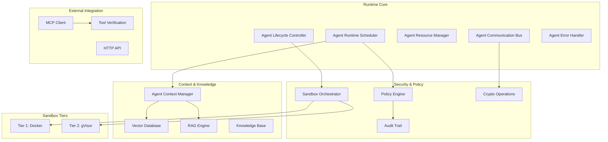
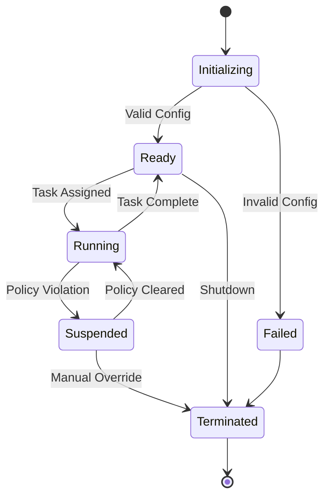
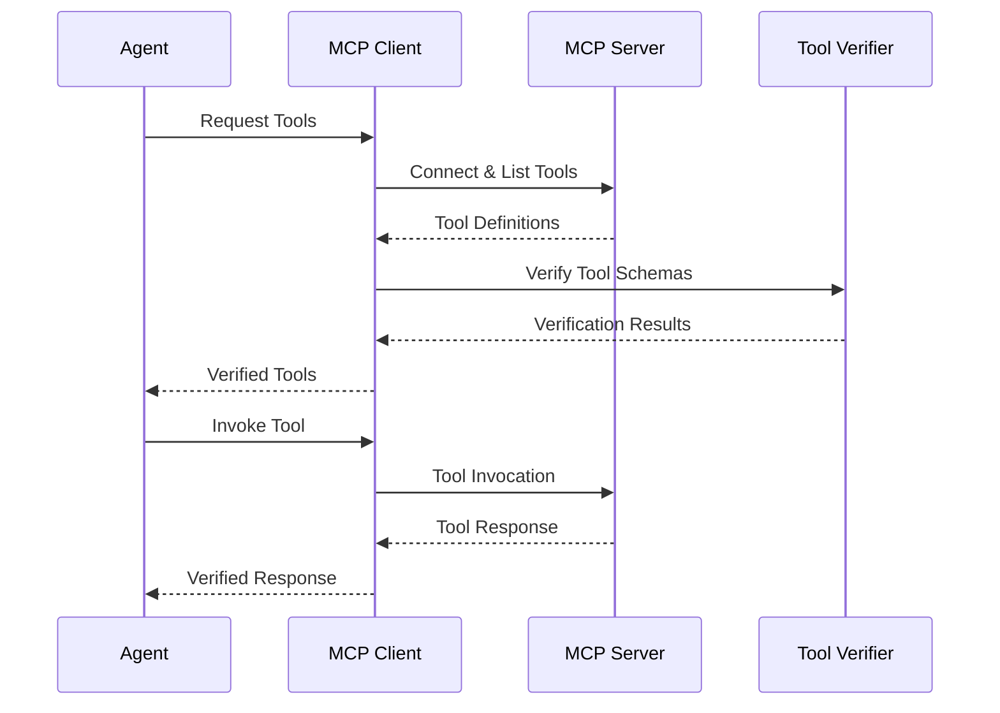

# 运行时架构
{: .no_toc }

## 🌐 其他语言

[English](runtime-architecture.md) | **中文简体** | [Español](runtime-architecture.es.md) | [Português](runtime-architecture.pt.md) | [日本語](runtime-architecture.ja.md) | [Deutsch](runtime-architecture.de.md)

---

了解 Symbi 运行时系统架构和核心组件。
{: .fs-6 .fw-300 }

## 目录
{: .no_toc .text-delta }

1. TOC
{:toc}

---

## 概述

Symbi 运行时系统为自主代理提供安全、可扩展且策略感知的执行环境。基于 Rust 构建以确保性能和安全性，它实现了具有全面审计功能的多层安全模型。

### 核心原则

- **默认安全**：每个操作都受策略执行的约束
- **零信任**：所有组件和通信都经过验证
- **完全可审计性**：每个动作都记录在具有加密完整性的日志中
- **策略驱动**：声明性策略控制所有系统行为
- **高性能**：针对生产工作负载的 Rust 原生实现

---

## 系统架构



---

## 核心组件

### 代理运行时调度器

负责管理代理执行的中央编排器。

**主要职责：**
- **任务调度**：基于优先级的调度，具有资源感知能力
- **负载均衡**：在可用资源间分配
- **资源分配**：内存、CPU 和 I/O 分配
- **策略协调**：与策略执行集成

**性能特征：**
- 支持 10,000+ 个并发代理
- 亚毫秒级调度决策
- 基于优先级的抢占
- 资源感知的放置

```rust
pub struct AgentScheduler {
    priority_queues: Vec<PriorityQueue<AgentTask>>,
    resource_pool: ResourcePool,
    policy_engine: Arc<PolicyEngine>,
    load_balancer: LoadBalancer,
}

impl AgentScheduler {
    pub async fn schedule_agent(&self, config: AgentConfig) -> Result<AgentId>;
    pub async fn get_system_status(&self) -> SystemStatus;
}
```

### 代理生命周期控制器

管理代理从初始化到终止的完整生命周期。

**生命周期状态：**
1. **初始化中**：解析 DSL 并验证配置
2. **就绪**：等待任务分配
3. **运行中**：主动执行任务
4. **暂停**：由于策略违规或资源约束而暂停
5. **已终止**：优雅关闭或强制停止



### 资源管理

**管理的资源类型：**
- **内存**：具有限制和监控的堆分配
- **CPU**：核心分配和利用率跟踪
- **磁盘 I/O**：读/写带宽限制
- **网络 I/O**：带宽和连接限制
- **执行时间**：超时执行

**资源分配策略：**
- **首次适应**：低延迟场景的最快分配
- **最佳适应**：资源效率的最优利用
- **基于优先级**：为关键代理保证资源

```rust
pub struct ResourceLimits {
    pub memory_mb: usize,
    pub cpu_cores: f32,
    pub disk_io_mbps: usize,
    pub network_io_mbps: usize,
    pub execution_timeout: Duration,
}
```

---

## 多层安全

### 沙箱架构

运行时基于操作风险实现两个安全层：

#### 第 1 层：Docker 隔离
**用例**：低风险操作、开发任务
- 基于容器的隔离
- 资源限制和能力下降
- 网络隔离和只读文件系统
- 适用于具有最小安全要求的可信代码

#### 第 2 层：gVisor 隔离
**用例**：标准生产任务、数据处理
- 具有系统调用拦截的用户空间内核
- 内存保护和 I/O 虚拟化
- 增强安全性，性能影响最小
- 大多数代理操作的默认层

> **注意**：企业版中提供了额外的隔离层，以满足最大安全要求。

### 风险评估

系统自动确定适当的安全层：

```rust
pub fn assess_security_tier(agent_config: &AgentConfig) -> SecurityTier {
    let risk_factors = RiskAssessment {
        data_sensitivity: assess_data_sensitivity(&agent_config.inputs),
        code_trust_level: assess_code_trust(&agent_config.source),
        network_access: agent_config.requires_network,
        file_system_access: agent_config.requires_filesystem,
        external_integrations: !agent_config.external_apis.is_empty(),
    };
    
    match calculate_risk_score(risk_factors) {
        score if score < 0.5 => SecurityTier::Tier1,
        _ => SecurityTier::Tier2,
    }
}
```

---

## 通信系统

### 消息类型

运行时支持多种通信模式：

**直接消息传递**：具有传递保证的点对点通信
```rust
let response = agent_bus.send_message(
    target_agent_id, 
    SecureMessage::new(payload)
).await?;
```

**发布-订阅**：基于主题的事件分发
```rust
agent_bus.publish("data_processing.completed", event_data).await?;
agent_bus.subscribe("security.alerts", alert_handler).await?;
```

**请求-响应**：具有超时的同步通信
```rust
let result = agent_bus.request(
    target_agent, 
    request_payload,
    timeout_duration
).await?;
```

### 安全功能

**消息加密**：用于载荷保护的 AES-256-GCM
**数字签名**：用于真实性的 Ed25519 签名
**消息路由**：基于策略的路由控制
**速率限制**：每个代理的消息速率执行

```rust
pub struct SecureMessage {
    pub id: MessageId,
    pub sender: AgentId,
    pub recipient: Option<AgentId>,
    pub encrypted_payload: Vec<u8>,
    pub signature: Ed25519Signature,
    pub timestamp: SystemTime,
}
```

---

## 上下文和知识系统

### 代理上下文管理器

为代理提供持久内存和知识管理。

**上下文类型：**
- **短期记忆**：最近的交互和即时上下文
- **长期记忆**：持久知识和学习模式
- **工作记忆**：主动处理和临时状态
- **共享知识**：跨代理知识共享

```rust
pub trait ContextManager {
    async fn store_context(&self, agent_id: AgentId, context: AgentContext) -> Result<ContextId>;
    async fn retrieve_context(&self, agent_id: AgentId, query: ContextQuery) -> Result<Vec<ContextItem>>;
    async fn search_knowledge(&self, agent_id: AgentId, query: &str) -> Result<Vec<KnowledgeItem>>;
}
```

### RAG 引擎集成

**RAG 管道：**
1. **查询分析**：理解代理信息需求
2. **向量搜索**：知识库中的语义相似性搜索
3. **文档检索**：获取相关知识文档
4. **上下文排序**：相关性评分和过滤
5. **响应生成**：上下文增强的响应合成

**性能目标：**
- 上下文检索：平均 <50ms
- 向量搜索：100 万+ 嵌入 <100ms
- RAG 管道：端到端 <500ms

### 向量数据库

**支持的操作：**
- **语义搜索**：基于相似性的文档检索
- **元数据过滤**：基于约束的搜索细化
- **批量操作**：高效的批量操作
- **实时更新**：动态知识库更新

**与 Qdrant 集成：**
```rust
pub struct VectorConfig {
    pub dimension: usize,           // 1536 for OpenAI embeddings
    pub distance_metric: DistanceMetric::Cosine,
    pub index_type: IndexType::HNSW,
    pub ef_construct: 200,
    pub m: 16,
}
```

---

## MCP 集成

### 模型上下文协议客户端

使代理能够安全地访问外部工具和资源。

**核心功能：**
- **服务器发现**：可用 MCP 服务器的自动发现
- **工具管理**：动态工具发现和调用
- **资源访问**：对外部数据源的安全访问
- **协议处理**：完全符合 MCP 规范

### 工具发现过程



### 使用 SchemaPin 的工具验证

**验证过程：**
1. **模式发现**：从 MCP 服务器检索工具模式
2. **签名验证**：验证加密签名
3. **首次使用信任**：固定可信密钥以供将来验证
4. **策略执行**：应用工具使用策略
5. **审计日志记录**：记录所有工具交互

```rust
pub struct ToolVerifier {
    key_store: SchemaPinKeyStore,
    policy_engine: Arc<PolicyEngine>,
    audit_logger: AuditLogger,
}

impl ToolVerifier {
    pub async fn verify_tool(&self, tool: &MCPTool) -> VerificationResult;
    pub async fn enforce_policies(&self, agent_id: AgentId, tool: &MCPTool) -> PolicyResult;
}
```

---

## 策略执行

### 策略引擎架构

**策略类型：**
- **访问控制**：谁可以访问什么资源
- **数据流**：数据如何在系统中流动
- **资源使用**：计算资源的限制
- **审计要求**：必须记录什么以及如何记录

**策略评估：**
```rust
pub enum PolicyDecision {
    Allow,
    Deny { reason: String },
    AllowWithConditions { conditions: Vec<PolicyCondition> },
}

pub trait PolicyEngine {
    async fn evaluate_policy(&self, context: PolicyContext, action: Action) -> PolicyDecision;
    async fn register_policy(&self, policy: Policy) -> Result<PolicyId>;
}
```

### 实时执行

**执行点：**
- 代理创建和配置
- 消息发送和路由
- 资源分配请求
- 外部工具调用
- 数据访问操作

**性能：**
- 策略评估：每次决策 <1ms
- 批量评估：每秒 10,000+ 次决策
- 实时更新：策略更改立即传播

---

## 审计和合规性

### 加密审计追踪

**审计事件结构：**
```rust
pub struct AuditEvent {
    pub event_id: Uuid,
    pub timestamp: SystemTime,
    pub agent_id: AgentId,
    pub event_type: AuditEventType,
    pub details: AuditDetails,
    pub signature: Ed25519Signature,
    pub chain_hash: Hash,
}
```

**完整性保证：**
- **数字签名**：所有事件的 Ed25519 签名
- **哈希链**：事件在不可变链中链接
- **时间戳验证**：加密时间戳
- **批量验证**：高效的批量验证

### 合规性功能

**监管支持：**
- **HIPAA**：医疗数据保护合规性
- **GDPR**：欧洲数据保护要求
- **SOX**：财务审计追踪要求
- **自定义**：可配置的合规性框架

**审计功能：**
- 实时事件流
- 历史事件查询
- 合规性报告生成
- 完整性验证

---

## 性能特征

### 可扩展性指标

**代理管理：**
- **并发代理**：10,000+ 个同时代理
- **代理启动**：标准代理 <1s
- **内存使用**：每个代理 1-5MB（根据配置而变）
- **CPU 开销**：运行时的系统开销 <5%

**通信性能：**
- **消息吞吐量**：100,000+ 消息/秒
- **消息延迟**：本地路由 <10ms
- **加密开销**：每条消息 <1ms
- **内存池**：零分配消息传递

**上下文和知识：**
- **上下文检索**：平均 <50ms
- **向量搜索**：100 万+ 嵌入 <100ms
- **知识更新**：实时，延迟 <10ms
- **存储效率**：压缩嵌入，大小减少 80%

### 资源管理

**内存管理：**
- **分配策略**：基于池的分配以提高性能
- **垃圾收集**：具有有界暂停时间的增量清理
- **内存保护**：保护页和溢出检测
- **泄漏预防**：自动清理和监控

**CPU 利用率：**
- **调度器开销**：10,000 个代理的 CPU <2%
- **上下文切换**：硬件辅助虚拟线程
- **负载均衡**：动态负载分配
- **优先级调度**：实时和批处理层

---

## 配置

### 运行时配置

```toml
[runtime]
max_concurrent_agents = 10000
scheduler_threads = 8
message_buffer_size = 1048576
gc_interval_ms = 100

[security]
default_sandbox_tier = "gvisor"
enforce_policies = true
audit_enabled = true
crypto_provider = "ring"

[context]
vector_db_url = "http://localhost:6333"
embedding_dimension = 1536
context_cache_size = "1GB"
knowledge_retention_days = 365

[mcp]
discovery_enabled = true
tool_verification = "strict"
connection_timeout_s = 30
max_concurrent_connections = 100
```

### 环境变量

```bash
# Core runtime
export SYMBI_LOG_LEVEL=info
export SYMBI_RUNTIME_MODE=production
export SYMBI_CONFIG_PATH=/etc/symbi/config.toml

# Security
export SYMBI_CRYPTO_PROVIDER=ring
export SYMBI_AUDIT_STORAGE=/var/log/symbi/audit

# External dependencies
export QDRANT_URL=http://localhost:6333
export OPENAI_API_KEY=your_api_key_here
export MCP_SERVER_DISCOVERY=enabled
```

---

## 监控和可观测性

### 指标收集

**系统指标：**
- 代理计数和资源使用情况
- 消息吞吐量和延迟
- 策略评估性能
- 安全事件率

**业务指标：**
- 任务完成率
- 按类型划分的错误频率
- 资源利用效率
- 合规性审计结果

**集成：**
- **Prometheus**：指标收集和警报
- **Grafana**：可视化和仪表板
- **Jaeger**：分布式跟踪
- **ELK Stack**：日志聚合和分析

### 健康监控

```rust
pub struct HealthStatus {
    pub overall_status: SystemStatus,
    pub component_health: HashMap<String, ComponentHealth>,
    pub resource_utilization: ResourceUtilization,
    pub recent_errors: Vec<ErrorSummary>,
}

pub async fn health_check() -> HealthStatus {
    // Comprehensive system health assessment
}
```

---

## 部署

### 容器部署

```dockerfile
FROM rust:1.88-slim as builder
WORKDIR /app
COPY . .
RUN cargo build --release --features production

FROM debian:bookworm-slim
RUN apt-get update && apt-get install -y ca-certificates
COPY --from=builder /app/target/release/symbi /usr/local/bin/
EXPOSE 8080
CMD ["symbi", "mcp", "--config", "/etc/symbi/config.toml"]
```

### Kubernetes 部署

```yaml
apiVersion: apps/v1
kind: Deployment
metadata:
  name: symbi-runtime
spec:
  replicas: 3
  selector:
    matchLabels:
      app: symbi-runtime
  template:
    metadata:
      labels:
        app: symbi-runtime
    spec:
      containers:
      - name: runtime
        image: ghcr.io/thirdkeyai/symbi:latest
        ports:
        - containerPort: 8080
        env:
        - name: SYMBI_RUNTIME_MODE
          value: "production"
        resources:
          requests:
            memory: "1Gi"
            cpu: "500m"
          limits:
            memory: "4Gi"
            cpu: "2"
```

---

## 开发和测试

### 本地开发

```bash
# Start dependencies
docker-compose up -d qdrant redis postgres

# Run in development mode
RUST_LOG=debug cargo run --example full_system

# Run tests
cargo test --all --features test-utils
```

### 集成测试

运行时包括全面的测试套件：

- **单元测试**：组件级测试
- **集成测试**：跨组件测试
- **性能测试**：负载和压力测试
- **安全测试**：渗透和合规性测试

```bash
# Run all test suites
cargo test --workspace

# Run performance benchmarks
cargo bench

# Run security tests
cargo test --features security-tests
```

---

## 下一步

- **[安全模型](security-model.zh-cn.md)** - 深入了解安全实现
- **[贡献指南](contributing.zh-cn.md)** - 开发和贡献指南
- **[API 参考](api-reference.zh-cn.md)** - 完整的 API 文档
- **[示例](https://github.com/thirdkeyai/symbiont/tree/main/runtime/examples)** - 运行时示例和教程

运行时架构为构建安全、可扩展的 AI 代理提供了坚实的基础。其模块化设计和全面的安全模型使其适用于开发和生产环境。