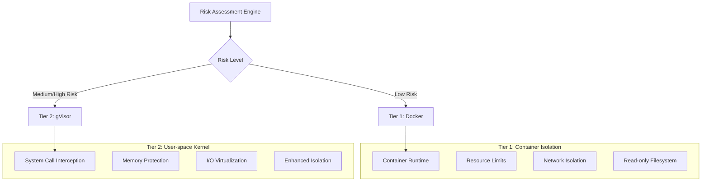
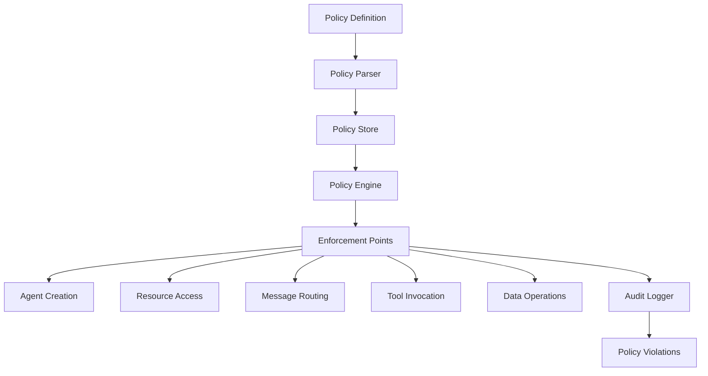
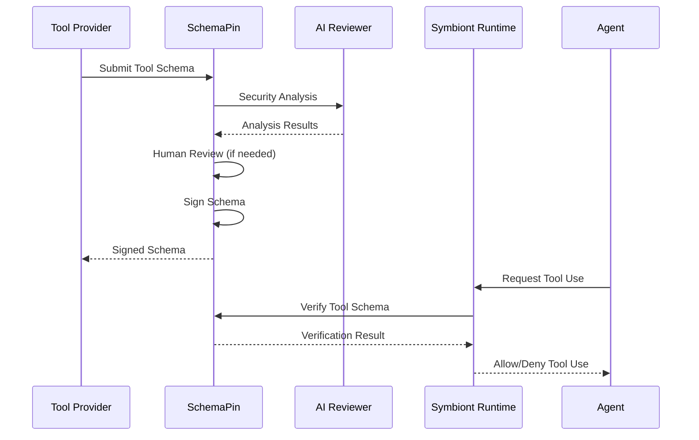
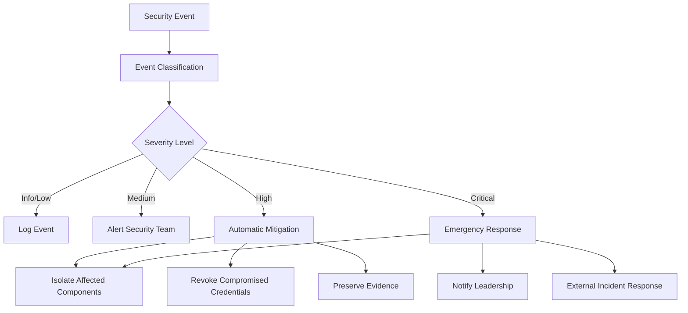

# Sicherheitsmodell
{: .no_toc }

## 🌐 Andere Sprachen
{: .no_toc}

[English](security-model.md) | [中文简体](security-model.zh-cn.md) | [Español](security-model.es.md) | [Português](security-model.pt.md) | [日本語](security-model.ja.md) | **Deutsch**

---

Umfassende Sicherheitsarchitektur, die Zero-Trust, richtliniengesteuerten Schutz für KI-Agenten gewährleistet.
{: .fs-6 .fw-300 }

## Inhaltsverzeichnis
{: .no_toc .text-delta }

1. TOC
{:toc}

---

## Überblick

Symbiont implementiert eine sicherheitsorientierte Architektur, die für regulierte und hochsichere Umgebungen entwickelt wurde. Das Sicherheitsmodell basiert auf Zero-Trust-Prinzipien mit umfassender Richtliniendurchsetzung, mehrstufiger Sandbox und kryptographischer Auditierbarkeit.

### Sicherheitsprinzipien

- **Zero Trust**: Alle Komponenten und Kommunikationen werden verifiziert
- **Defense in Depth**: Mehrere Sicherheitsschichten ohne Single Point of Failure
- **Richtliniengesteuert**: Deklarative Sicherheitsrichtlinien zur Laufzeit durchgesetzt
- **Vollständige Auditierbarkeit**: Jede Operation mit kryptographischer Integrität protokolliert
- **Least Privilege**: Minimale für den Betrieb erforderliche Berechtigungen

---

## Mehrstufige Sandbox

Die Laufzeitumgebung implementiert zwei Isolationsstufen basierend auf Risikobewertung:



> **Hinweis**: Zusätzliche Isolationsstufen mit Hardware-Virtualisierung sind in Enterprise-Editionen verfügbar.

### Stufe 1: Docker-Isolation

**Anwendungsfälle:**
- Vertrauenswürdige Entwicklungsaufgaben
- Datenverarbeitung mit geringer Sensibilität
- Interne Tool-Operationen

**Sicherheitsmerkmale:**
```yaml
docker_security:
  memory_limit: "512MB"
  cpu_limit: "0.5"
  network_mode: "none"
  read_only_root: true
  security_opts:
    - "no-new-privileges:true"
    - "seccomp:default"
  capabilities:
    drop: ["ALL"]
    add: ["SETUID", "SETGID"]
```

**Bedrohungsschutz:**
- Prozessisolation vom Host
- Ressourcenerschöpfungsschutz
- Netzwerkzugriffskontrolle
- Dateisystemschutz

### Stufe 2: gVisor-Isolation

**Anwendungsfälle:**
- Standard-Produktionsworkloads
- Verarbeitung sensibler Daten
- Integration externer Tools

**Sicherheitsmerkmale:**
- Benutzerbereich-Kernel-Implementierung
- Systemaufruf-Filterung und -Übersetzung
- Speicherschutzgrenzen
- E/A-Anfrageverifizierung

**Konfiguration:**
```yaml
gvisor_security:
  runtime: "runsc"
  platform: "ptrace"
  network: "sandbox"
  file_access: "exclusive"
  debug: false
  strace: false
```

**Erweiteter Schutz:**
- Kernel-Sicherheitslücken-Isolation
- Systemaufruf-Abfangung
- Speicherkorruptions-Prävention
- Seitenkanalangriff-Minderung

> **Enterprise-Feature**: Erweiterte Isolation mit Hardware-Virtualisierung (Firecracker) ist in Enterprise-Editionen für maximale Sicherheitsanforderungen verfügbar.

### Risikobewertungsalgorithmus

```rust
pub struct RiskAssessment {
    data_sensitivity: f32,      // 0.0 = public, 1.0 = top secret
    code_trust_level: f32,      // 0.0 = untrusted, 1.0 = verified
    network_access: bool,       // Requires external network
    filesystem_access: bool,    // Requires filesystem write
    external_apis: bool,        // Uses external services
}

pub fn calculate_risk_score(assessment: RiskAssessment) -> f32 {
    let base_score = assessment.data_sensitivity * 0.4
        + (1.0 - assessment.code_trust_level) * 0.3;
    
    let access_penalty = if assessment.network_access { 0.1 } else { 0.0 }
        + if assessment.filesystem_access { 0.1 } else { 0.0 }
        + if assessment.external_apis { 0.1 } else { 0.0 };
    
    (base_score + access_penalty).min(1.0)
}
```

---

## Richtlinien-Engine

### Richtlinienarchitektur

Die Richtlinien-Engine bietet deklarative Sicherheitskontrollen mit Laufzeitdurchsetzung:



### Richtlinientypen

#### Zugriffskontrollrichtlinien

Definieren, wer unter welchen Bedingungen auf welche Ressourcen zugreifen kann:

```rust
policy secure_data_access {
    allow: read(sensitive_data) if (
        user.clearance >= "secret" &&
        user.need_to_know.contains(data.classification) &&
        session.mfa_verified == true
    )
    
    deny: export(data) if data.contains_pii == true
    
    require: [
        user.background_check.current,
        session.secure_connection,
        audit_trail = "detailed"
    ]
}
```

#### Datenflussrichtlinien

Kontrollieren, wie Daten durch das System fließen:

```rust
policy data_flow_control {
    allow: transform(data) if (
        source.classification <= target.classification &&
        user.transform_permissions.contains(operation.type)
    )
    
    deny: aggregate(datasets) if (
        any(datasets, |d| d.privacy_level > operation.privacy_budget)
    )
    
    require: differential_privacy for statistical_operations
}
```

#### Ressourcennutzungsrichtlinien

Verwalten die Zuweisung von Rechenressourcen:

```rust
policy resource_governance {
    allow: allocate(resources) if (
        user.resource_quota.remaining >= resources.total &&
        operation.priority <= user.max_priority
    )
    
    deny: long_running_operations if system.maintenance_mode
    
    require: supervisor_approval for high_memory_operations
}
```

### Richtlinienbewertungs-Engine

```rust
pub trait PolicyEngine {
    async fn evaluate_policy(
        &self, 
        context: PolicyContext, 
        action: Action
    ) -> PolicyDecision;
    
    async fn register_policy(&self, policy: Policy) -> Result<PolicyId>;
    async fn update_policy(&self, policy_id: PolicyId, policy: Policy) -> Result<()>;
}

pub enum PolicyDecision {
    Allow,
    Deny { reason: String },
    AllowWithConditions { conditions: Vec<PolicyCondition> },
    RequireApproval { approver: String },
}
```

### Leistungsoptimierung

**Richtlinien-Caching:**
- Kompilierte Richtlinienbewertung für Leistung
- LRU-Cache für häufige Entscheidungen
- Batch-Bewertung für Massenoperationen
- Submillisekunden-Bewertungszeiten

**Inkrementelle Updates:**
- Echtzeit-Richtlinienaktualisierungen ohne Neustart
- Versionierte Richtlinienbereitstellung
- Rollback-Fähigkeiten für Richtlinienfehler

---

## Kryptographische Sicherheit

### Digitale Signaturen

Alle sicherheitsrelevanten Operationen sind kryptographisch signiert:

**Signaturalgorithmus:** Ed25519 (RFC 8032)
- **Schlüsselgröße:** 256-Bit private Schlüssel, 256-Bit öffentliche Schlüssel
- **Signaturgröße:** 512 Bits (64 Bytes)
- **Leistung:** 70.000+ Signaturen/Sekunde, 25.000+ Verifikationen/Sekunde

```rust
pub struct CryptographicSignature {
    pub algorithm: SignatureAlgorithm::Ed25519,
    pub public_key: PublicKey,
    pub signature: [u8; 64],
    pub timestamp: SystemTime,
}

impl AuditEvent {
    pub fn sign(&mut self, private_key: &PrivateKey) -> Result<()> {
        let message = self.serialize_for_signing()?;
        self.signature = private_key.sign(&message);
        Ok(())
    }
    
    pub fn verify(&self, public_key: &PublicKey) -> bool {
        let message = self.serialize_for_signing().unwrap();
        public_key.verify(&message, &self.signature)
    }
}
```

### Schlüsselverwaltung

**Schlüsselspeicherung:**
- Hardware Security Module (HSM) Integration
- Secure Enclave Unterstützung für Schlüsselschutz
- Schlüsselrotation mit konfigurierbaren Intervallen
- Verteilte Schlüsselsicherung und -wiederherstellung

**Schlüsselhierarchie:**
- Root-Signierschlüssel für Systemoperationen
- Pro-Agent-Schlüssel für Operationssignierung
- Ephemere Schlüssel für Sitzungsverschlüsselung
- Externe Schlüssel für Tool-Verifikation

```rust
pub struct KeyManager {
    hsm: HardwareSecurityModule,
    key_store: SecureKeyStore,
    rotation_policy: KeyRotationPolicy,
}

impl KeyManager {
    pub async fn generate_agent_keys(&self, agent_id: AgentId) -> Result<KeyPair>;
    pub async fn rotate_keys(&self, key_id: KeyId) -> Result<KeyPair>;
    pub async fn revoke_key(&self, key_id: KeyId) -> Result<()>;
}
```

### Verschlüsselungsstandards

**Symmetrische Verschlüsselung:** AES-256-GCM
- 256-Bit-Schlüssel mit authentifizierter Verschlüsselung
- Eindeutige Nonces für jede Verschlüsselungsoperation
- Zugehörige Daten für Kontextbindung

**Asymmetrische Verschlüsselung:** X25519 + ChaCha20-Poly1305
- Elliptische Kurven-Schlüsselaustausch
- Stream-Verschlüsselung mit authentifizierter Verschlüsselung
- Perfect Forward Secrecy

**Nachrichtenverschlüsselung:**
```rust
pub fn encrypt_message(
    plaintext: &[u8], 
    recipient_public_key: &PublicKey,
    sender_private_key: &PrivateKey
) -> Result<EncryptedMessage> {
    let shared_secret = sender_private_key.diffie_hellman(recipient_public_key);
    let nonce = generate_random_nonce();
    let ciphertext = ChaCha20Poly1305::new(&shared_secret)
        .encrypt(&nonce, plaintext)?;
    
    Ok(EncryptedMessage {
        nonce,
        ciphertext,
        sender_public_key: sender_private_key.public_key(),
    })
}
```

---

## Audit und Compliance

### Kryptographische Audit-Spur

Jede sicherheitsrelevante Operation generiert ein unveränderliches Audit-Event:

```rust
pub struct AuditEvent {
    pub event_id: Uuid,
    pub timestamp: SystemTime,
    pub agent_id: AgentId,
    pub event_type: AuditEventType,
    pub details: serde_json::Value,
    pub signature: Ed25519Signature,
    pub previous_hash: Hash,
    pub event_hash: Hash,
}
```

**Audit-Event-Typen:**
- Agent-Lebenszyklus-Events (Erstellung, Beendigung)
- Richtlinienbewertungsentscheidungen
- Ressourcenzuweisung und -nutzung
- Nachrichten-Versendung und -Routing
- Externe Tool-Aufrufe
- Sicherheitsverletzungen und Warnungen

### Hash-Verkettung

Events sind in einer unveränderlichen Kette verknüpft:

```rust
impl AuditChain {
    pub fn append_event(&mut self, mut event: AuditEvent) -> Result<()> {
        event.previous_hash = self.last_hash;
        event.event_hash = self.calculate_event_hash(&event);
        event.sign(&self.signing_key)?;
        
        self.events.push(event.clone());
        self.last_hash = event.event_hash;
        
        self.verify_chain_integrity()?;
        Ok(())
    }
    
    pub fn verify_integrity(&self) -> Result<bool> {
        for (i, event) in self.events.iter().enumerate() {
            // Verify signature
            if !event.verify(&self.public_key) {
                return Ok(false);
            }
            
            // Verify hash chain
            if i > 0 && event.previous_hash != self.events[i-1].event_hash {
                return Ok(false);
            }
        }
        Ok(true)
    }
}
```

### Compliance-Features

**Regulatorische Unterstützung:**

**HIPAA (Gesundheitswesen):**
- PHI-Zugriffsprotokolle mit Benutzeridentifikation
- Datenminimierungsdurchsetzung
- Datenschutzverletzungserkennung und -benachrichtigung
- Audit-Spur-Aufbewahrung für 6 Jahre

**GDPR (Datenschutz):**
- Personendatenverarbeitungsprotokolle
- Einverständnisverifikationsverfolgung
- Betroffenenrechtsdurchsetzung
- Datenaufbewahrungsrichtlinien-Compliance

**SOX (Finanzwesen):**
- Interne Kontrolldokumentation
- Änderungsmanagement-Verfolgung
- Zugriffskontrollverifikation
- Finanzdatenschutz

**Benutzerdefinierte Compliance:**
```rust
pub struct ComplianceFramework {
    pub name: String,
    pub audit_requirements: Vec<AuditRequirement>,
    pub retention_policy: RetentionPolicy,
    pub access_controls: Vec<AccessControl>,
    pub data_protection: DataProtectionRules,
}

impl ComplianceFramework {
    pub fn validate_compliance(&self, audit_trail: &AuditChain) -> ComplianceReport;
    pub fn generate_compliance_report(&self, period: TimePeriod) -> Report;
}
```

---

## Tool-Sicherheit mit SchemaPin

### Tool-Verifikationsprozess

Externe Tools werden mit kryptographischen Signaturen verifiziert:



### Trust-On-First-Use (TOFU)

**Schlüssel-Pinning-Prozess:**
1. Erste Begegnung mit einem Tool-Anbieter
2. Öffentlichen Schlüssel des Anbieters über externe Kanäle verifizieren
3. Öffentlichen Schlüssel im lokalen Trust Store anheften
4. Angehefteten Schlüssel für alle zukünftigen Verifikationen verwenden

```rust
pub struct TOFUKeyStore {
    pinned_keys: HashMap<ProviderId, PinnedKey>,
    trust_policies: Vec<TrustPolicy>,
}

impl TOFUKeyStore {
    pub async fn pin_key(&mut self, provider: ProviderId, key: PublicKey) -> Result<()> {
        if self.pinned_keys.contains_key(&provider) {
            return Err("Key already pinned for provider");
        }
        
        self.pinned_keys.insert(provider, PinnedKey {
            public_key: key,
            pinned_at: SystemTime::now(),
            trust_level: TrustLevel::Unverified,
        });
        
        Ok(())
    }
    
    pub fn verify_tool(&self, tool: &MCPTool) -> VerificationResult {
        if let Some(pinned_key) = self.pinned_keys.get(&tool.provider_id) {
            if pinned_key.public_key.verify(&tool.schema_hash, &tool.signature) {
                VerificationResult::Trusted
            } else {
                VerificationResult::SignatureInvalid
            }
        } else {
            VerificationResult::UnknownProvider
        }
    }
}
```

### KI-gesteuerte Tool-Überprüfung

Automatisierte Sicherheitsanalyse vor Tool-Genehmigung:

**Analysekomponenten:**
- **Sicherheitslücken-Erkennung**: Musterabgleich gegen bekannte Sicherheitslücken-Signaturen
- **Schädlicher Code-Erkennung**: ML-basierte Identifikation von bösartigem Verhalten
- **Ressourcennutzungsanalyse**: Bewertung von Rechenressourcenanforderungen
- **Datenschutz-Folgenabschätzung**: Datenbehandlung und Datenschutzauswirkungen

```rust
pub struct SecurityAnalyzer {
    vulnerability_patterns: VulnerabilityDatabase,
    ml_detector: MaliciousCodeDetector,
    resource_analyzer: ResourceAnalyzer,
    privacy_assessor: PrivacyAssessor,
}

impl SecurityAnalyzer {
    pub async fn analyze_tool(&self, tool: &MCPTool) -> SecurityAnalysis {
        let mut findings = Vec::new();
        
        // Vulnerability pattern matching
        findings.extend(self.vulnerability_patterns.scan(&tool.schema));
        
        // ML-based detection
        let ml_result = self.ml_detector.analyze(&tool.schema).await?;
        findings.extend(ml_result.findings);
        
        // Resource usage analysis
        let resource_risk = self.resource_analyzer.assess(&tool.schema);
        
        // Privacy impact assessment
        let privacy_impact = self.privacy_assessor.evaluate(&tool.schema);
        
        SecurityAnalysis {
            tool_id: tool.id.clone(),
            risk_score: calculate_risk_score(&findings),
            findings,
            resource_requirements: resource_risk,
            privacy_impact,
            recommendation: self.generate_recommendation(&findings),
        }
    }
}
```

---

## Netzwerksicherheit

### Sichere Kommunikation

**Transport Layer Security:**
- TLS 1.3 für alle externe Kommunikation
- Mutual TLS (mTLS) für Service-zu-Service-Kommunikation
- Zertifikat-Pinning für bekannte Services
- Perfect Forward Secrecy

**Nachrichten-Level-Sicherheit:**
- Ende-zu-Ende-Verschlüsselung für Agent-Nachrichten
- Message Authentication Codes (MAC)
- Replay-Angriff-Prävention mit Zeitstempeln
- Nachrichten-Reihenfolgen-Garantien

```rust
pub struct SecureChannel {
    encryption_key: [u8; 32],
    mac_key: [u8; 32],
    send_counter: AtomicU64,
    recv_counter: AtomicU64,
}

impl SecureChannel {
    pub fn encrypt_message(&self, plaintext: &[u8]) -> Result<Vec<u8>> {
        let counter = self.send_counter.fetch_add(1, Ordering::SeqCst);
        let nonce = self.generate_nonce(counter);
        
        let ciphertext = ChaCha20Poly1305::new(&self.encryption_key)
            .encrypt(&nonce, plaintext)?;
        
        let mac = Hmac::<Sha256>::new_from_slice(&self.mac_key)?
            .chain_update(&ciphertext)
            .chain_update(&counter.to_le_bytes())
            .finalize()
            .into_bytes();
        
        Ok([ciphertext, mac.to_vec()].concat())
    }
}
```

### Netzwerkisolation

**Sandbox-Netzwerkkontrolle:**
- Standardmäßig kein Netzwerkzugriff
- Explizite Whitelist für externe Verbindungen
- Traffic-Überwachung und Anomalieerkennung
- DNS-Filterung und -Validierung

**Netzwerkrichtlinien:**
```yaml
network_policy:
  default_action: "deny"
  allowed_destinations:
    - domain: "api.openai.com"
      ports: [443]
      protocol: "https"
    - ip_range: "10.0.0.0/8"
      ports: [6333]  # Qdrant
      protocol: "http"
  
  monitoring:
    log_all_connections: true
    detect_anomalies: true
    rate_limiting: true
```

---

## Incident Response

### Sicherheitsereignis-Erkennung

**Automatisierte Erkennung:**
- Richtlinienverletzungsüberwachung
- Anomales Verhaltenserkennung
- Ressourcennutzungsanomalien
- Fehlgeschlagene Authentifizierungsverfolgung

**Alert-Klassifikation:**
```rust
pub enum SecurityEventSeverity {
    Info,       // Normal security events
    Low,        // Minor policy violations
    Medium,     // Suspicious behavior
    High,       // Confirmed security issues
    Critical,   // Active security breaches
}

pub struct SecurityEvent {
    pub id: Uuid,
    pub timestamp: SystemTime,
    pub severity: SecurityEventSeverity,
    pub category: SecurityEventCategory,
    pub description: String,
    pub affected_components: Vec<ComponentId>,
    pub recommended_actions: Vec<String>,
}
```

### Incident Response Workflow



### Wiederherstellungsverfahren

**Automatisierte Wiederherstellung:**
- Agent-Neustart mit sauberem Zustand
- Schlüsselrotation für kompromittierte Anmeldedaten
- Richtlinienaktualisierungen zur Wiederholungsverhinderung
- Systemgesundheitsverifikation

**Manuelle Wiederherstellung:**
- Forensische Analyse von Sicherheitsereignissen
- Ursachenanalyse und Remediation
- Sicherheitskontrollaktualisierungen
- Vorfallsdokumentation und Lessons Learned

---

## Sicherheits-Best-Practices

### Entwicklungsrichtlinien

1. **Secure by Default**: Alle Sicherheitsfeatures standardmäßig aktiviert
2. **Principle of Least Privilege**: Minimale Berechtigungen für alle Operationen
3. **Defense in Depth**: Mehrere Sicherheitsschichten mit Redundanz
4. **Fail Securely**: Sicherheitsfehler sollten Zugriff verweigern, nicht gewähren
5. **Audit Everything**: Vollständige Protokollierung sicherheitsrelevanter Operationen

### Deployment-Sicherheit

**Umgebungshärtung:**
```bash
# Disable unnecessary services
systemctl disable cups bluetooth

# Kernel hardening
echo "kernel.dmesg_restrict=1" >> /etc/sysctl.conf
echo "kernel.kptr_restrict=2" >> /etc/sysctl.conf

# File system security
mount -o remount,nodev,nosuid,noexec /tmp
```

**Container-Sicherheit:**
```dockerfile
# Use minimal base image
FROM scratch
COPY --from=builder /app/symbiont /bin/symbiont

# Run as non-root user
USER 1000:1000

# Set security options
LABEL security.no-new-privileges=true
```

### Operative Sicherheit

**Überwachungs-Checkliste:**
- [ ] Echtzeit-Sicherheitsereignisüberwachung
- [ ] Richtlinienverletzungsverfolgung
- [ ] Ressourcennutzungsanomalieerkennnung
- [ ] Fehlgeschlagene Authentifizierungsüberwachung
- [ ] Zertifikatsablaufverfolgung

**Wartungsverfahren:**
- Regelmäßige Sicherheitsupdates und Patches
- Geplante Schlüsselrotation
- Richtlinienüberprüfung und -aktualisierungen
- Sicherheitsaudit und Penetrationstests
- Incident Response Plan Tests

---

## Sicherheitskonfiguration

### Umgebungsvariablen

```bash
# Cryptographic settings
export SYMBIONT_CRYPTO_PROVIDER=ring
export SYMBIONT_KEY_STORE_TYPE=hsm
export SYMBIONT_HSM_CONFIG_PATH=/etc/symbiont/hsm.conf

# Audit settings
export SYMBIONT_AUDIT_ENABLED=true
export SYMBIONT_AUDIT_STORAGE=/var/audit/symbiont
export SYMBIONT_AUDIT_RETENTION_DAYS=2555  # 7 years

# Security policies
export SYMBIONT_POLICY_ENFORCEMENT=strict
export SYMBIONT_DEFAULT_SANDBOX_TIER=gvisor
export SYMBIONT_TOFU_ENABLED=true
```

### Sicherheitskonfigurationsdatei

```toml
[security]
# Cryptographic settings
crypto_provider = "ring"
signature_algorithm = "ed25519"
encryption_algorithm = "chacha20_poly1305"

# Key management
key_rotation_interval_days = 90
hsm_enabled = true
hsm_config_path = "/etc/symbiont/hsm.conf"

# Audit settings
audit_enabled = true
audit_storage_path = "/var/audit/symbiont"
audit_retention_days = 2555
audit_compression = true

# Sandbox security
default_sandbox_tier = "gvisor"
sandbox_escape_detection = true
resource_limit_enforcement = "strict"

# Network security
tls_min_version = "1.3"
certificate_pinning = true
network_isolation = true

# Policy enforcement
policy_enforcement_mode = "strict"
policy_violation_action = "deny_and_alert"
emergency_override_enabled = false

[tofu]
enabled = true
key_verification_required = true
trust_on_first_use_timeout_hours = 24
automatic_key_pinning = false
```

---

## Sicherheitsmetriken

### Key Performance Indicators

**Sicherheitsoperationen:**
- Richtlinienbewertungslatenz: Durchschnitt <1ms
- Audit-Event-Generierungsrate: 10.000+ Events/Sekunde
- Sicherheitsvorfallreaktionszeit: <5 Minuten
- Kryptographischer Operationsdurchsatz: 70.000+ Ops/Sekunde

**Compliance-Metriken:**
- Richtlinien-Compliance-Rate: >99,9%
- Audit-Spur-Integrität: 100%
- Sicherheitsereignis-False-Positive-Rate: <1%
- Vorfallauflösungszeit: <24 Stunden

**Risikobewertung:**
- Sicherheitslücken-Patch-Zeit: <48 Stunden
- Sicherheitskontrolleffektivität: >95%
- Bedrohungserkennungsgenauigkeit: >99%
- Recovery Time Objective: <1 Stunde

---

## Zukünftige Verbesserungen

### Erweiterte Kryptographie

**Post-Quantum-Kryptographie:**
- NIST-genehmigte Post-Quantum-Algorithmen
- Hybride klassische/Post-Quantum-Schemas
- Migrationspläne für Quantenbedrohungen

**Homomorphe Verschlüsselung:**
- Datenschutzwahrende Berechnung auf verschlüsselten Daten
- CKKS-Schema für approximative Arithmetik
- Integration mit Machine Learning Workflows

**Zero-Knowledge Proofs:**
- zk-SNARKs für Berechnungsverifikation
- Datenschutzwahrende Authentifizierung
- Compliance-Beweisgenerierung

### KI-verstärkte Sicherheit

**Verhaltensanalyse:**
- Machine Learning für Anomalieerkennung
- Prädiktive Sicherheitsanalysen
- Adaptive Bedrohungsreaktion

**Automatisierte Antwort:**
- Selbstheilende Sicherheitskontrollen
- Dynamische Richtliniengenerierung
- Intelligente Vorfallklassifizierung

---

## Nächste Schritte

- **[Beiträge](/contributing)** - Sicherheitsentwicklungsrichtlinien
- **[Runtime-Architektur](/runtime-architecture)** - Technische Implementierungsdetails
- **[API-Referenz](/api-reference)** - Sicherheits-API-Dokumentation
- **[Compliance-Leitfaden](/compliance)** - Regulatorische Compliance-Informationen

Das Symbiont-Sicherheitsmodell bietet unternehmenstauglichen Schutz für regulierte Industrien und Hochsicherheitsumgebungen. Sein geschichteter Ansatz gewährleistet robusten Schutz vor sich entwickelnden Bedrohungen bei gleichzeitiger Aufrechterhaltung der betrieblichen Effizienz.