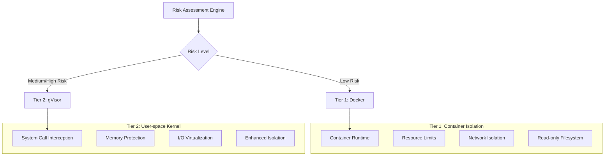
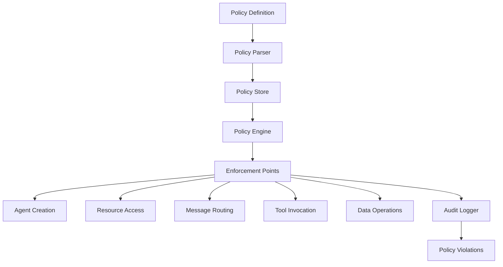
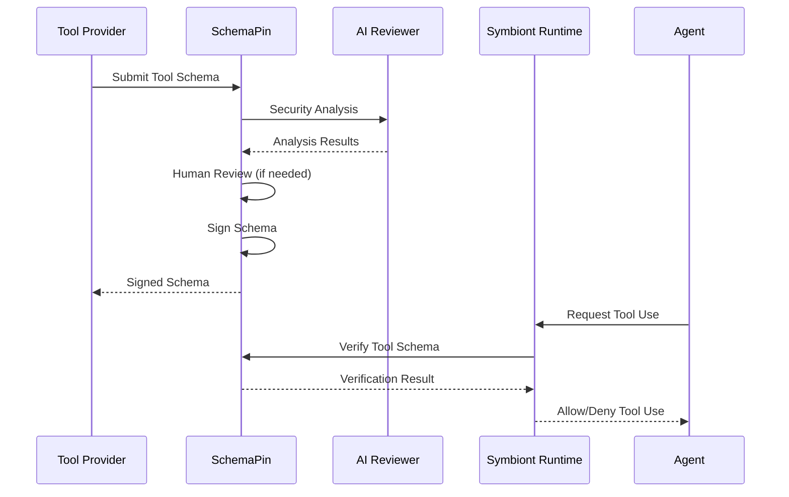
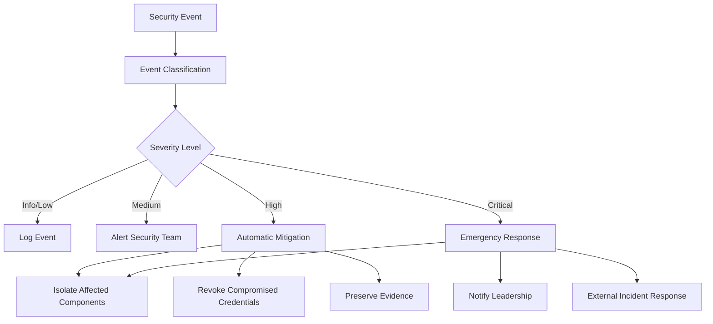

# Modelo de Seguridad
{: .no_toc }

Arquitectura de seguridad integral que garantiza protección de confianza cero e impulsada por políticas para agentes de IA.
{: .fs-6 .fw-300 }

## 🌐 Otros idiomas

[English](security-model.md) | [中文简体](security-model.zh-cn.md) | **Español** | [Português](security-model.pt.md) | [日本語](security-model.ja.md) | [Deutsch](security-model.de.md)

---

## Tabla de contenidos
{: .no_toc .text-delta }

1. TOC
{:toc}

---

## Descripción General

Symbiont implementa una arquitectura de seguridad primero diseñada para entornos regulados y de alta seguridad. El modelo de seguridad se basa en principios de confianza cero con cumplimiento integral de políticas, sandboxing de múltiples niveles y auditabilidad criptográfica.

### Principios de Seguridad

- **Confianza Cero**: Todos los componentes y comunicaciones son verificados
- **Defensa en Profundidad**: Múltiples capas de seguridad sin un único punto de falla
- **Impulsado por Políticas**: Políticas de seguridad declarativas aplicadas en tiempo de ejecución
- **Auditabilidad Completa**: Cada operación registrada con integridad criptográfica
- **Privilegio Mínimo**: Permisos mínimos requeridos para la operación

---

## Sandboxing de Múltiples Niveles

El tiempo de ejecución implementa dos niveles de aislamiento basados en la evaluación de riesgo:



> **Nota**: Niveles de aislamiento adicionales con virtualización de hardware están disponibles en las ediciones Enterprise.

### Nivel 1: Aislamiento Docker

**Casos de Uso:**
- Tareas de desarrollo confiables
- Procesamiento de datos de baja sensibilidad
- Operaciones de herramientas internas

**Características de Seguridad:**
```yaml
docker_security:
  memory_limit: "512MB"
  cpu_limit: "0.5"
  network_mode: "none"
  read_only_root: true
  security_opts:
    - "no-new-privileges:true"
    - "seccomp:default"
  capabilities:
    drop: ["ALL"]
    add: ["SETUID", "SETGID"]
```

**Protección contra Amenazas:**
- Aislamiento de procesos del host
- Prevención de agotamiento de recursos
- Control de acceso a la red
- Protección del sistema de archivos

### Nivel 2: Aislamiento gVisor

**Casos de Uso:**
- Cargas de trabajo de producción estándar
- Procesamiento de datos sensibles
- Integración de herramientas externas

**Características de Seguridad:**
- Implementación de kernel en espacio de usuario
- Filtrado y traducción de llamadas del sistema
- Límites de protección de memoria
- Validación de solicitudes de E/S

**Configuración:**
```yaml
gvisor_security:
  runtime: "runsc"
  platform: "ptrace"
  network: "sandbox"
  file_access: "exclusive"
  debug: false
  strace: false
```

**Protección Avanzada:**
- Aislamiento de vulnerabilidades del kernel
- Interceptación de llamadas del sistema
- Prevención de corrupción de memoria
- Mitigación de ataques de canal lateral

> **Característica Enterprise**: El aislamiento avanzado con virtualización de hardware (Firecracker) está disponible en las ediciones Enterprise para los requisitos de seguridad máxima.

### Algoritmo de Evaluación de Riesgo

```rust
pub struct RiskAssessment {
    data_sensitivity: f32,      // 0.0 = public, 1.0 = top secret
    code_trust_level: f32,      // 0.0 = untrusted, 1.0 = verified
    network_access: bool,       // Requires external network
    filesystem_access: bool,    // Requires filesystem write
    external_apis: bool,        // Uses external services
}

pub fn calculate_risk_score(assessment: RiskAssessment) -> f32 {
    let base_score = assessment.data_sensitivity * 0.4
        + (1.0 - assessment.code_trust_level) * 0.3;
    
    let access_penalty = if assessment.network_access { 0.1 } else { 0.0 }
        + if assessment.filesystem_access { 0.1 } else { 0.0 }
        + if assessment.external_apis { 0.1 } else { 0.0 };
    
    (base_score + access_penalty).min(1.0)
}
```

---

## Motor de Políticas

### Arquitectura de Políticas

El motor de políticas proporciona controles de seguridad declarativos con aplicación en tiempo de ejecución:



### Tipos de Políticas

#### Políticas de Control de Acceso

Definen quién puede acceder a qué recursos bajo qué condiciones:

```rust
policy secure_data_access {
    allow: read(sensitive_data) if (
        user.clearance >= "secret" &&
        user.need_to_know.contains(data.classification) &&
        session.mfa_verified == true
    )
    
    deny: export(data) if data.contains_pii == true
    
    require: [
        user.background_check.current,
        session.secure_connection,
        audit_trail = "detailed"
    ]
}
```

#### Políticas de Flujo de Datos

Controlan cómo se mueven los datos a través del sistema:

```rust
policy data_flow_control {
    allow: transform(data) if (
        source.classification <= target.classification &&
        user.transform_permissions.contains(operation.type)
    )
    
    deny: aggregate(datasets) if (
        any(datasets, |d| d.privacy_level > operation.privacy_budget)
    )
    
    require: differential_privacy for statistical_operations
}
```

#### Políticas de Uso de Recursos

Gestionan la asignación de recursos computacionales:

```rust
policy resource_governance {
    allow: allocate(resources) if (
        user.resource_quota.remaining >= resources.total &&
        operation.priority <= user.max_priority
    )
    
    deny: long_running_operations if system.maintenance_mode
    
    require: supervisor_approval for high_memory_operations
}
```

### Motor de Evaluación de Políticas

```rust
pub trait PolicyEngine {
    async fn evaluate_policy(
        &self, 
        context: PolicyContext, 
        action: Action
    ) -> PolicyDecision;
    
    async fn register_policy(&self, policy: Policy) -> Result<PolicyId>;
    async fn update_policy(&self, policy_id: PolicyId, policy: Policy) -> Result<()>;
}

pub enum PolicyDecision {
    Allow,
    Deny { reason: String },
    AllowWithConditions { conditions: Vec<PolicyCondition> },
    RequireApproval { approver: String },
}
```

### Optimización de Rendimiento

**Caché de Políticas:**
- Evaluación de políticas compiladas para rendimiento
- Caché LRU para decisiones frecuentes
- Evaluación por lotes para operaciones masivas
- Tiempos de evaluación de sub-milisegundos

**Actualizaciones Incrementales:**
- Actualizaciones de políticas en tiempo real sin reinicio
- Implementación de políticas versionadas
- Capacidades de rollback para errores de políticas

---

## Seguridad Criptográfica

### Firmas Digitales

Todas las operaciones relevantes para la seguridad están firmadas criptográficamente:

**Algoritmo de Firma:** Ed25519 (RFC 8032)
- **Tamaño de Clave:** Claves privadas de 256 bits, claves públicas de 256 bits
- **Tamaño de Firma:** 512 bits (64 bytes)
- **Rendimiento:** 70,000+ firmas/segundo, 25,000+ verificaciones/segundo

```rust
pub struct CryptographicSignature {
    pub algorithm: SignatureAlgorithm::Ed25519,
    pub public_key: PublicKey,
    pub signature: [u8; 64],
    pub timestamp: SystemTime,
}

impl AuditEvent {
    pub fn sign(&mut self, private_key: &PrivateKey) -> Result<()> {
        let message = self.serialize_for_signing()?;
        self.signature = private_key.sign(&message);
        Ok(())
    }
    
    pub fn verify(&self, public_key: &PublicKey) -> bool {
        let message = self.serialize_for_signing().unwrap();
        public_key.verify(&message, &self.signature)
    }
}
```

### Gestión de Claves

**Almacenamiento de Claves:**
- Integración de Módulo de Seguridad de Hardware (HSM)
- Soporte de enclave seguro para protección de claves
- Rotación de claves con intervalos configurables
- Copia de seguridad y recuperación de claves distribuidas

**Jerarquía de Claves:**
- Claves de firma raíz para operaciones del sistema
- Claves por agente para firma de operaciones
- Claves efímeras para cifrado de sesión
- Claves externas para verificación de herramientas

```rust
pub struct KeyManager {
    hsm: HardwareSecurityModule,
    key_store: SecureKeyStore,
    rotation_policy: KeyRotationPolicy,
}

impl KeyManager {
    pub async fn generate_agent_keys(&self, agent_id: AgentId) -> Result<KeyPair>;
    pub async fn rotate_keys(&self, key_id: KeyId) -> Result<KeyPair>;
    pub async fn revoke_key(&self, key_id: KeyId) -> Result<()>;
}
```

### Estándares de Cifrado

**Cifrado Simétrico:** AES-256-GCM
- Claves de 256 bits con cifrado autenticado
- Nonces únicos para cada operación de cifrado
- Datos asociados para vinculación de contexto

**Cifrado Asimétrico:** X25519 + ChaCha20-Poly1305
- Intercambio de claves de curva elíptica
- Cifrado de flujo con cifrado autenticado
- Secreto perfecto hacia adelante

**Cifrado de Mensajes:**
```rust
pub fn encrypt_message(
    plaintext: &[u8], 
    recipient_public_key: &PublicKey,
    sender_private_key: &PrivateKey
) -> Result<EncryptedMessage> {
    let shared_secret = sender_private_key.diffie_hellman(recipient_public_key);
    let nonce = generate_random_nonce();
    let ciphertext = ChaCha20Poly1305::new(&shared_secret)
        .encrypt(&nonce, plaintext)?;
    
    Ok(EncryptedMessage {
        nonce,
        ciphertext,
        sender_public_key: sender_private_key.public_key(),
    })
}
```

---

## Auditoría y Cumplimiento

### Rastro de Auditoría Criptográfica

Cada operación relevante para la seguridad genera un evento de auditoría inmutable:

```rust
pub struct AuditEvent {
    pub event_id: Uuid,
    pub timestamp: SystemTime,
    pub agent_id: AgentId,
    pub event_type: AuditEventType,
    pub details: serde_json::Value,
    pub signature: Ed25519Signature,
    pub previous_hash: Hash,
    pub event_hash: Hash,
}
```

**Tipos de Eventos de Auditoría:**
- Eventos del ciclo de vida del agente (creación, terminación)
- Decisiones de evaluación de políticas
- Asignación y uso de recursos
- Envío y enrutamiento de mensajes
- Invocaciones de herramientas externas
- Violaciones de seguridad y alertas

### Encadenamiento de Hash

Los eventos están vinculados en una cadena inmutable:

```rust
impl AuditChain {
    pub fn append_event(&mut self, mut event: AuditEvent) -> Result<()> {
        event.previous_hash = self.last_hash;
        event.event_hash = self.calculate_event_hash(&event);
        event.sign(&self.signing_key)?;
        
        self.events.push(event.clone());
        self.last_hash = event.event_hash;
        
        self.verify_chain_integrity()?;
        Ok(())
    }
    
    pub fn verify_integrity(&self) -> Result<bool> {
        for (i, event) in self.events.iter().enumerate() {
            // Verify signature
            if !event.verify(&self.public_key) {
                return Ok(false);
            }
            
            // Verify hash chain
            if i > 0 && event.previous_hash != self.events[i-1].event_hash {
                return Ok(false);
            }
        }
        Ok(true)
    }
}
```

### Características de Cumplimiento

**Soporte Regulatorio:**

**HIPAA (Salud):**
- Registro de acceso a PHI con identificación de usuario
- Aplicación de minimización de datos
- Detección y notificación de brechas
- Retención de rastro de auditoría por 6 años

**GDPR (Privacidad):**
- Registros de procesamiento de datos personales
- Seguimiento de verificación de consentimiento
- Aplicación de derechos del sujeto de datos
- Cumplimiento de política de retención de datos

**SOX (Financiero):**
- Documentación de controles internos
- Seguimiento de gestión de cambios
- Verificación de controles de acceso
- Protección de datos financieros

**Cumplimiento Personalizado:**
```rust
pub struct ComplianceFramework {
    pub name: String,
    pub audit_requirements: Vec<AuditRequirement>,
    pub retention_policy: RetentionPolicy,
    pub access_controls: Vec<AccessControl>,
    pub data_protection: DataProtectionRules,
}

impl ComplianceFramework {
    pub fn validate_compliance(&self, audit_trail: &AuditChain) -> ComplianceReport;
    pub fn generate_compliance_report(&self, period: TimePeriod) -> Report;
}
```

---

## Seguridad de Herramientas con SchemaPin

### Proceso de Verificación de Herramientas

Las herramientas externas se verifican usando firmas criptográficas:



### Confianza en Primer Uso (TOFU)

**Proceso de Fijación de Claves:**
1. Primer encuentro con un proveedor de herramientas
2. Verificar la clave pública del proveedor a través de canales externos
3. Fijar la clave pública en el almacén de confianza local
4. Usar la clave fijada para todas las verificaciones futuras

```rust
pub struct TOFUKeyStore {
    pinned_keys: HashMap<ProviderId, PinnedKey>,
    trust_policies: Vec<TrustPolicy>,
}

impl TOFUKeyStore {
    pub async fn pin_key(&mut self, provider: ProviderId, key: PublicKey) -> Result<()> {
        if self.pinned_keys.contains_key(&provider) {
            return Err("Key already pinned for provider");
        }
        
        self.pinned_keys.insert(provider, PinnedKey {
            public_key: key,
            pinned_at: SystemTime::now(),
            trust_level: TrustLevel::Unverified,
        });
        
        Ok(())
    }
    
    pub fn verify_tool(&self, tool: &MCPTool) -> VerificationResult {
        if let Some(pinned_key) = self.pinned_keys.get(&tool.provider_id) {
            if pinned_key.public_key.verify(&tool.schema_hash, &tool.signature) {
                VerificationResult::Trusted
            } else {
                VerificationResult::SignatureInvalid
            }
        } else {
            VerificationResult::UnknownProvider
        }
    }
}
```

### Revisión de Herramientas Impulsada por IA

Análisis de seguridad automatizado antes de la aprobación de herramientas:

**Componentes de Análisis:**
- **Detección de Vulnerabilidades**: Coincidencia de patrones contra firmas de vulnerabilidades conocidas
- **Detección de Código Malicioso**: Identificación de comportamientos maliciosos basada en ML
- **Análisis de Uso de Recursos**: Evaluación de requisitos de recursos computacionales
- **Evaluación de Impacto en Privacidad**: Manejo de datos e implicaciones de privacidad

```rust
pub struct SecurityAnalyzer {
    vulnerability_patterns: VulnerabilityDatabase,
    ml_detector: MaliciousCodeDetector,
    resource_analyzer: ResourceAnalyzer,
    privacy_assessor: PrivacyAssessor,
}

impl SecurityAnalyzer {
    pub async fn analyze_tool(&self, tool: &MCPTool) -> SecurityAnalysis {
        let mut findings = Vec::new();
        
        // Vulnerability pattern matching
        findings.extend(self.vulnerability_patterns.scan(&tool.schema));
        
        // ML-based detection
        let ml_result = self.ml_detector.analyze(&tool.schema).await?;
        findings.extend(ml_result.findings);
        
        // Resource usage analysis
        let resource_risk = self.resource_analyzer.assess(&tool.schema);
        
        // Privacy impact assessment
        let privacy_impact = self.privacy_assessor.evaluate(&tool.schema);
        
        SecurityAnalysis {
            tool_id: tool.id.clone(),
            risk_score: calculate_risk_score(&findings),
            findings,
            resource_requirements: resource_risk,
            privacy_impact,
            recommendation: self.generate_recommendation(&findings),
        }
    }
}
```

---

## Seguridad de Red

### Comunicación Segura

**Seguridad de Capa de Transporte:**
- TLS 1.3 para todas las comunicaciones externas
- TLS mutuo (mTLS) para comunicación servicio a servicio
- Fijación de certificados para servicios conocidos
- Secreto perfecto hacia adelante

**Seguridad a Nivel de Mensaje:**
- Cifrado de extremo a extremo para mensajes de agentes
- Códigos de autenticación de mensajes (MAC)
- Prevención de ataques de repetición con marcas de tiempo
- Garantías de ordenamiento de mensajes

```rust
pub struct SecureChannel {
    encryption_key: [u8; 32],
    mac_key: [u8; 32],
    send_counter: AtomicU64,
    recv_counter: AtomicU64,
}

impl SecureChannel {
    pub fn encrypt_message(&self, plaintext: &[u8]) -> Result<Vec<u8>> {
        let counter = self.send_counter.fetch_add(1, Ordering::SeqCst);
        let nonce = self.generate_nonce(counter);
        
        let ciphertext = ChaCha20Poly1305::new(&self.encryption_key)
            .encrypt(&nonce, plaintext)?;
        
        let mac = Hmac::<Sha256>::new_from_slice(&self.mac_key)?
            .chain_update(&ciphertext)
            .chain_update(&counter.to_le_bytes())
            .finalize()
            .into_bytes();
        
        Ok([ciphertext, mac.to_vec()].concat())
    }
}
```

### Aislamiento de Red

**Control de Red del Sandbox:**
- Sin acceso a red por defecto
- Lista de permitidos explícita para conexiones externas
- Monitoreo de tráfico y detección de anomalías
- Filtrado y validación de DNS

**Políticas de Red:**
```yaml
network_policy:
  default_action: "deny"
  allowed_destinations:
    - domain: "api.openai.com"
      ports: [443]
      protocol: "https"
    - ip_range: "10.0.0.0/8"
      ports: [6333]  # Qdrant
      protocol: "http"
  
  monitoring:
    log_all_connections: true
    detect_anomalies: true
    rate_limiting: true
```

---

## Respuesta a Incidentes

### Detección de Eventos de Seguridad

**Detección Automatizada:**
- Monitoreo de violaciones de políticas
- Detección de comportamiento anómalo
- Anomalías de uso de recursos
- Seguimiento de autenticación fallida

**Clasificación de Alertas:**
```rust
pub enum SecurityEventSeverity {
    Info,       // Normal security events
    Low,        // Minor policy violations
    Medium,     // Suspicious behavior
    High,       // Confirmed security issues
    Critical,   // Active security breaches
}

pub struct SecurityEvent {
    pub id: Uuid,
    pub timestamp: SystemTime,
    pub severity: SecurityEventSeverity,
    pub category: SecurityEventCategory,
    pub description: String,
    pub affected_components: Vec<ComponentId>,
    pub recommended_actions: Vec<String>,
}
```

### Flujo de Trabajo de Respuesta a Incidentes



### Procedimientos de Recuperación

**Recuperación Automatizada:**
- Reinicio de agente con estado limpio
- Rotación de claves para credenciales comprometidas
- Actualizaciones de políticas para prevenir recurrencia
- Verificación de salud del sistema

**Recuperación Manual:**
- Análisis forense de eventos de seguridad
- Análisis de causa raíz y remediación
- Actualizaciones de controles de seguridad
- Documentación de incidentes y lecciones aprendidas

---

## Mejores Prácticas de Seguridad

### Directrices de Desarrollo

1. **Seguro por Defecto**: Todas las características de seguridad habilitadas por defecto
2. **Principio de Privilegio Mínimo**: Permisos mínimos para todas las operaciones
3. **Defensa en Profundidad**: Múltiples capas de seguridad con redundancia
4. **Fallar de Forma Segura**: Las fallas de seguridad deben denegar el acceso, no otorgarlo
5. **Auditar Todo**: Registro completo de operaciones relevantes para la seguridad

### Seguridad de Implementación

**Endurecimiento del Entorno:**
```bash
# Disable unnecessary services
systemctl disable cups bluetooth

# Kernel hardening
echo "kernel.dmesg_restrict=1" >> /etc/sysctl.conf
echo "kernel.kptr_restrict=2" >> /etc/sysctl.conf

# File system security
mount -o remount,nodev,nosuid,noexec /tmp
```

**Seguridad de Contenedores:**
```dockerfile
# Use minimal base image
FROM scratch
COPY --from=builder /app/symbiont /bin/symbiont

# Run as non-root user
USER 1000:1000

# Set security options
LABEL security.no-new-privileges=true
```

### Seguridad Operacional

**Lista de Verificación de Monitoreo:**
- [ ] Monitoreo de eventos de seguridad en tiempo real
- [ ] Seguimiento de violaciones de políticas
- [ ] Detección de anomalías de uso de recursos
- [ ] Monitoreo de autenticación fallida
- [ ] Seguimiento de expiración de certificados

**Procedimientos de Mantenimiento:**
- Actualizaciones y parches de seguridad regulares
- Rotación de claves programada
- Revisión y actualizaciones de políticas
- Auditoría de seguridad y pruebas de penetración
- Pruebas del plan de respuesta a incidentes

---

## Configuración de Seguridad

### Variables de Entorno

```bash
# Cryptographic settings
export SYMBIONT_CRYPTO_PROVIDER=ring
export SYMBIONT_KEY_STORE_TYPE=hsm
export SYMBIONT_HSM_CONFIG_PATH=/etc/symbiont/hsm.conf

# Audit settings
export SYMBIONT_AUDIT_ENABLED=true
export SYMBIONT_AUDIT_STORAGE=/var/audit/symbiont
export SYMBIONT_AUDIT_RETENTION_DAYS=2555  # 7 years

# Security policies
export SYMBIONT_POLICY_ENFORCEMENT=strict
export SYMBIONT_DEFAULT_SANDBOX_TIER=gvisor
export SYMBIONT_TOFU_ENABLED=true
```

### Archivo de Configuración de Seguridad

```toml
[security]
# Cryptographic settings
crypto_provider = "ring"
signature_algorithm = "ed25519"
encryption_algorithm = "chacha20_poly1305"

# Key management
key_rotation_interval_days = 90
hsm_enabled = true
hsm_config_path = "/etc/symbiont/hsm.conf"

# Audit settings
audit_enabled = true
audit_storage_path = "/var/audit/symbiont"
audit_retention_days = 2555
audit_compression = true

# Sandbox security
default_sandbox_tier = "gvisor"
sandbox_escape_detection = true
resource_limit_enforcement = "strict"

# Network security
tls_min_version = "1.3"
certificate_pinning = true
network_isolation = true

# Policy enforcement
policy_enforcement_mode = "strict"
policy_violation_action = "deny_and_alert"
emergency_override_enabled = false

[tofu]
enabled = true
key_verification_required = true
trust_on_first_use_timeout_hours = 24
automatic_key_pinning = false
```

---

## Métricas de Seguridad

### Indicadores Clave de Rendimiento

**Operaciones de Seguridad:**
- Latencia de evaluación de políticas: promedio <1ms
- Tasa de generación de eventos de auditoría: 10,000+ eventos/segundo
- Tiempo de respuesta a incidentes de seguridad: <5 minutos
- Rendimiento de operaciones criptográficas: 70,000+ ops/segundo

**Métricas de Cumplimiento:**
- Tasa de cumplimiento de políticas: >99.9%
- Integridad del rastro de auditoría: 100%
- Tasa de falsos positivos de eventos de seguridad: <1%
- Tiempo de resolución de incidentes: <24 horas

**Evaluación de Riesgo:**
- Tiempo de parcheo de vulnerabilidades: <48 horas
- Efectividad de controles de seguridad: >95%
- Precisión de detección de amenazas: >99%
- Objetivo de tiempo de recuperación: <1 hora

---

## Mejoras Futuras

### Criptografía Avanzada

**Criptografía Post-Cuántica:**
- Algoritmos post-cuánticos aprobados por NIST
- Esquemas híbridos clásicos/post-cuánticos
- Planificación de migración para amenazas cuánticas

**Cifrado Homomórfico:**
- Computación que preserva la privacidad en datos cifrados
- Esquema CKKS para aritmética aproximada
- Integración con flujos de trabajo de aprendizaje automático

**Pruebas de Conocimiento Cero:**
- zk-SNARKs para verificación de computación
- Autenticación que preserva la privacidad
- Generación de pruebas de cumplimiento

### Seguridad Mejorada por IA

**Análisis de Comportamiento:**
- Aprendizaje automático para detección de anomalías
- Análisis de seguridad predictiva
- Respuesta adaptativa a amenazas

**Respuesta Automatizada:**
- Controles de seguridad auto-curativos
- Generación dinámica de políticas
- Clasificación inteligente de incidentes

---

## Próximos Pasos

- **[Contribuir](/contributing)** - Directrices de desarrollo de seguridad
- **[Arquitectura de Tiempo de Ejecución](/runtime-architecture)** - Detalles de implementación técnica
- **[Referencia de API](/api-reference)** - Documentación de API de seguridad
- **[Guía de Cumplimiento](/compliance)** - Información de cumplimiento regulatorio

El modelo de seguridad de Symbiont proporciona protección de grado empresarial adecuada para industrias reguladas y entornos de alta seguridad. Su enfoque en capas asegura una protección robusta contra amenazas en evolución mientras mantiene la eficiencia operacional.