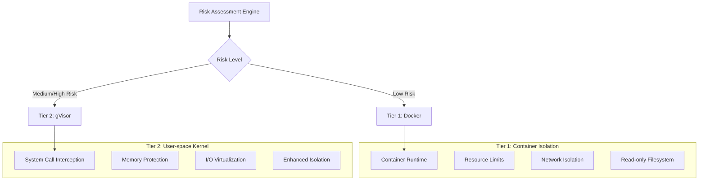
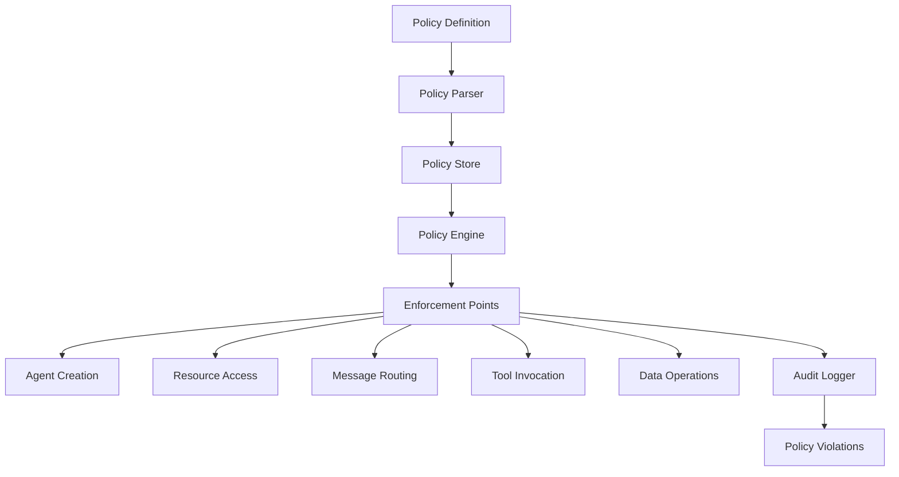
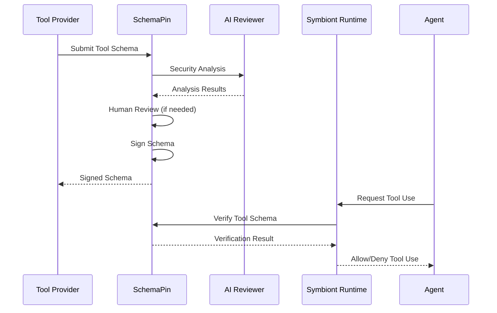
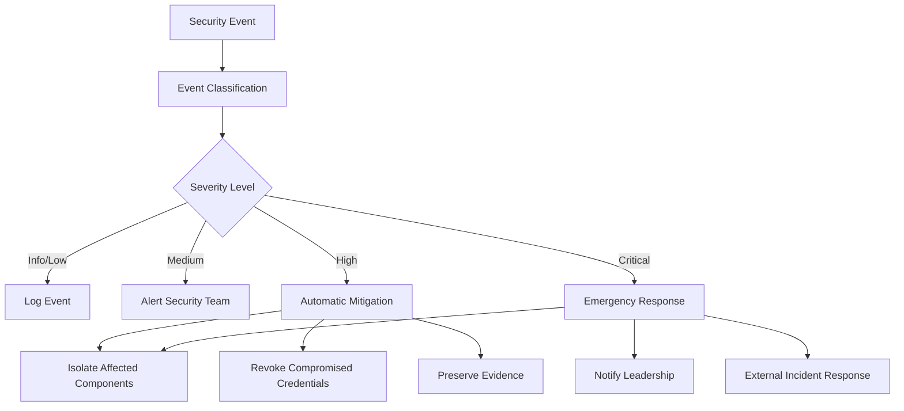

# セキュリティモデル
{: .no_toc }

## 🌐 他の言語

[English](security-model.md) | [中文简体](security-model.zh-cn.md) | [Español](security-model.es.md) | [Português](security-model.pt.md) | **日本語** | [Deutsch](security-model.de.md)

---

AI エージェントに対してゼロトラスト、ポリシー駆動型保護を確保する包括的なセキュリティアーキテクチャ。
{: .fs-6 .fw-300 }

## 目次
{: .no_toc .text-delta }

1. TOC
{:toc}

---

## 概要

Symbiont は、規制された高保証環境向けに設計されたセキュリティファーストアーキテクチャを実装しています。セキュリティモデルは、包括的なポリシー実行、マルチティアサンドボックス、暗号学的監査可能性を備えたゼロトラスト原則に基づいて構築されています。

### セキュリティ原則

- **ゼロトラスト**：すべてのコンポーネントと通信が検証される
- **多層防御**：単一障害点のない複数のセキュリティ層
- **ポリシー駆動型**：実行時に適用される宣言的セキュリティポリシー
- **完全監査可能性**：暗号学的整合性を持つすべての操作ログ
- **最小権限**：操作に必要な最小限の権限

---

## マルチティアサンドボックス

ランタイムは、リスク評価に基づいて2つの分離ティアを実装します：



> **注意**：ハードウェア仮想化を使用した追加の分離ティアは Enterprise エディションで利用可能です。

### ティア1：Docker 分離

**使用例：**
- 信頼できる開発タスク
- 低感度データ処理
- 内部ツール操作

**セキュリティ機能：**
```yaml
docker_security:
  memory_limit: "512MB"
  cpu_limit: "0.5"
  network_mode: "none"
  read_only_root: true
  security_opts:
    - "no-new-privileges:true"
    - "seccomp:default"
  capabilities:
    drop: ["ALL"]
    add: ["SETUID", "SETGID"]
```

**脅威保護：**
- ホストからのプロセス分離
- リソース枯渇防止
- ネットワークアクセス制御
- ファイルシステム保護

### ティア2：gVisor 分離

**使用例：**
- 標準本番ワークロード
- 機密データ処理
- 外部ツール統合

**セキュリティ機能：**
- ユーザー空間カーネル実装
- システムコールフィルタリングと変換
- メモリ保護境界
- I/O リクエスト検証

**設定：**
```yaml
gvisor_security:
  runtime: "runsc"
  platform: "ptrace"
  network: "sandbox"
  file_access: "exclusive"
  debug: false
  strace: false
```

**高度な保護：**
- カーネル脆弱性分離
- システムコール傍受
- メモリ破損防止
- サイドチャネル攻撃緩和

> **Enterprise 機能**：最大セキュリティ要件のためのハードウェア仮想化（Firecracker）による高度な分離は Enterprise エディションで利用可能です。

### リスク評価アルゴリズム

```rust
pub struct RiskAssessment {
    data_sensitivity: f32,      // 0.0 = public, 1.0 = top secret
    code_trust_level: f32,      // 0.0 = untrusted, 1.0 = verified
    network_access: bool,       // Requires external network
    filesystem_access: bool,    // Requires filesystem write
    external_apis: bool,        // Uses external services
}

pub fn calculate_risk_score(assessment: RiskAssessment) -> f32 {
    let base_score = assessment.data_sensitivity * 0.4
        + (1.0 - assessment.code_trust_level) * 0.3;
    
    let access_penalty = if assessment.network_access { 0.1 } else { 0.0 }
        + if assessment.filesystem_access { 0.1 } else { 0.0 }
        + if assessment.external_apis { 0.1 } else { 0.0 };
    
    (base_score + access_penalty).min(1.0)
}
```

---

## ポリシーエンジン

### ポリシーアーキテクチャ

ポリシーエンジンは、実行時適用による宣言的セキュリティ制御を提供します：



### ポリシータイプ

#### アクセス制御ポリシー

どの条件下で誰がどのリソースにアクセスできるかを定義します：

```rust
policy secure_data_access {
    allow: read(sensitive_data) if (
        user.clearance >= "secret" &&
        user.need_to_know.contains(data.classification) &&
        session.mfa_verified == true
    )
    
    deny: export(data) if data.contains_pii == true
    
    require: [
        user.background_check.current,
        session.secure_connection,
        audit_trail = "detailed"
    ]
}
```

#### データフローポリシー

システム内でのデータの移動方法を制御します：

```rust
policy data_flow_control {
    allow: transform(data) if (
        source.classification <= target.classification &&
        user.transform_permissions.contains(operation.type)
    )
    
    deny: aggregate(datasets) if (
        any(datasets, |d| d.privacy_level > operation.privacy_budget)
    )
    
    require: differential_privacy for statistical_operations
}
```

#### リソース使用ポリシー

計算リソース割り当てを管理します：

```rust
policy resource_governance {
    allow: allocate(resources) if (
        user.resource_quota.remaining >= resources.total &&
        operation.priority <= user.max_priority
    )
    
    deny: long_running_operations if system.maintenance_mode
    
    require: supervisor_approval for high_memory_operations
}
```

### ポリシー評価エンジン

```rust
pub trait PolicyEngine {
    async fn evaluate_policy(
        &self, 
        context: PolicyContext, 
        action: Action
    ) -> PolicyDecision;
    
    async fn register_policy(&self, policy: Policy) -> Result<PolicyId>;
    async fn update_policy(&self, policy_id: PolicyId, policy: Policy) -> Result<()>;
}

pub enum PolicyDecision {
    Allow,
    Deny { reason: String },
    AllowWithConditions { conditions: Vec<PolicyCondition> },
    RequireApproval { approver: String },
}
```

### パフォーマンス最適化

**ポリシーキャッシュ：**
- パフォーマンスのためのコンパイル済みポリシー評価
- 頻繁な決定のための LRU キャッシュ
- 一括操作のためのバッチ評価
- サブミリ秒評価時間

**増分更新：**
- 再起動なしのリアルタイムポリシー更新
- バージョン管理されたポリシーデプロイメント
- ポリシーエラーのロールバック機能

---

## 暗号学的セキュリティ

### デジタル署名

すべてのセキュリティ関連操作は暗号学的に署名されます：

**署名アルゴリズム：** Ed25519（RFC 8032）
- **キーサイズ：** 256 ビット秘密鍵、256 ビット公開鍵
- **署名サイズ：** 512 ビット（64 バイト）
- **パフォーマンス：** 70,000+ 署名/秒、25,000+ 検証/秒

```rust
pub struct CryptographicSignature {
    pub algorithm: SignatureAlgorithm::Ed25519,
    pub public_key: PublicKey,
    pub signature: [u8; 64],
    pub timestamp: SystemTime,
}

impl AuditEvent {
    pub fn sign(&mut self, private_key: &PrivateKey) -> Result<()> {
        let message = self.serialize_for_signing()?;
        self.signature = private_key.sign(&message);
        Ok(())
    }
    
    pub fn verify(&self, public_key: &PublicKey) -> bool {
        let message = self.serialize_for_signing().unwrap();
        public_key.verify(&message, &self.signature)
    }
}
```

### キー管理

**キー保存：**
- ハードウェアセキュリティモジュール（HSM）統合
- キー保護のためのセキュアエンクレーブサポート
- 設定可能な間隔でのキーローテーション
- 分散キーバックアップと復旧

**キー階層：**
- システム操作のためのルート署名キー
- 操作署名のためのエージェント別キー
- セッション暗号化のための一時キー
- ツール検証のための外部キー

```rust
pub struct KeyManager {
    hsm: HardwareSecurityModule,
    key_store: SecureKeyStore,
    rotation_policy: KeyRotationPolicy,
}

impl KeyManager {
    pub async fn generate_agent_keys(&self, agent_id: AgentId) -> Result<KeyPair>;
    pub async fn rotate_keys(&self, key_id: KeyId) -> Result<KeyPair>;
    pub async fn revoke_key(&self, key_id: KeyId) -> Result<()>;
}
```

### 暗号化標準

**対称暗号化：** AES-256-GCM
- 認証付き暗号化を持つ 256 ビットキー
- 各暗号化操作のユニークナンス
- コンテキストバインディングのための関連データ

**非対称暗号化：** X25519 + ChaCha20-Poly1305
- 楕円曲線キー交換
- 認証付き暗号化を持つストリーム暗号
- 完全前方秘匿性

**メッセージ暗号化：**
```rust
pub fn encrypt_message(
    plaintext: &[u8], 
    recipient_public_key: &PublicKey,
    sender_private_key: &PrivateKey
) -> Result<EncryptedMessage> {
    let shared_secret = sender_private_key.diffie_hellman(recipient_public_key);
    let nonce = generate_random_nonce();
    let ciphertext = ChaCha20Poly1305::new(&shared_secret)
        .encrypt(&nonce, plaintext)?;
    
    Ok(EncryptedMessage {
        nonce,
        ciphertext,
        sender_public_key: sender_private_key.public_key(),
    })
}
```

---

## 監査とコンプライアンス

### 暗号学的監査証跡

すべてのセキュリティ関連操作は不変の監査イベントを生成します：

```rust
pub struct AuditEvent {
    pub event_id: Uuid,
    pub timestamp: SystemTime,
    pub agent_id: AgentId,
    pub event_type: AuditEventType,
    pub details: serde_json::Value,
    pub signature: Ed25519Signature,
    pub previous_hash: Hash,
    pub event_hash: Hash,
}
```

**監査イベントタイプ：**
- エージェントライフサイクルイベント（作成、終了）
- ポリシー評価決定
- リソース割り当てと使用
- メッセージ送信とルーティング
- 外部ツール呼び出し
- セキュリティ違反とアラート

### ハッシュチェーン

イベントは不変チェーンでリンクされます：

```rust
impl AuditChain {
    pub fn append_event(&mut self, mut event: AuditEvent) -> Result<()> {
        event.previous_hash = self.last_hash;
        event.event_hash = self.calculate_event_hash(&event);
        event.sign(&self.signing_key)?;
        
        self.events.push(event.clone());
        self.last_hash = event.event_hash;
        
        self.verify_chain_integrity()?;
        Ok(())
    }
    
    pub fn verify_integrity(&self) -> Result<bool> {
        for (i, event) in self.events.iter().enumerate() {
            // Verify signature
            if !event.verify(&self.public_key) {
                return Ok(false);
            }
            
            // Verify hash chain
            if i > 0 && event.previous_hash != self.events[i-1].event_hash {
                return Ok(false);
            }
        }
        Ok(true)
    }
}
```

### コンプライアンス機能

**規制サポート：**

**HIPAA（ヘルスケア）：**
- ユーザー識別を含む PHI アクセスログ
- データ最小化適用
- 侵害検出と通知
- 6 年間の監査証跡保持

**GDPR（プライバシー）：**
- 個人データ処理ログ
- 同意検証追跡
- データ主体権利適用
- データ保持ポリシーコンプライアンス

**SOX（金融）：**
- 内部統制文書化
- 変更管理追跡
- アクセス制御検証
- 金融データ保護

**カスタムコンプライアンス：**
```rust
pub struct ComplianceFramework {
    pub name: String,
    pub audit_requirements: Vec<AuditRequirement>,
    pub retention_policy: RetentionPolicy,
    pub access_controls: Vec<AccessControl>,
    pub data_protection: DataProtectionRules,
}

impl ComplianceFramework {
    pub fn validate_compliance(&self, audit_trail: &AuditChain) -> ComplianceReport;
    pub fn generate_compliance_report(&self, period: TimePeriod) -> Report;
}
```

---

## SchemaPin によるツールセキュリティ

### ツール検証プロセス

外部ツールは暗号署名を使用して検証されます：



### 初回使用時信頼（TOFU）

**キーピニングプロセス：**
1. ツールプロバイダーとの初回接触
2. 外部チャネルを通じてプロバイダーの公開鍵を検証
3. ローカル信頼ストアに公開鍵をピン留め
4. 将来のすべての検証にピン留めされたキーを使用

```rust
pub struct TOFUKeyStore {
    pinned_keys: HashMap<ProviderId, PinnedKey>,
    trust_policies: Vec<TrustPolicy>,
}

impl TOFUKeyStore {
    pub async fn pin_key(&mut self, provider: ProviderId, key: PublicKey) -> Result<()> {
        if self.pinned_keys.contains_key(&provider) {
            return Err("Key already pinned for provider");
        }
        
        self.pinned_keys.insert(provider, PinnedKey {
            public_key: key,
            pinned_at: SystemTime::now(),
            trust_level: TrustLevel::Unverified,
        });
        
        Ok(())
    }
    
    pub fn verify_tool(&self, tool: &MCPTool) -> VerificationResult {
        if let Some(pinned_key) = self.pinned_keys.get(&tool.provider_id) {
            if pinned_key.public_key.verify(&tool.schema_hash, &tool.signature) {
                VerificationResult::Trusted
            } else {
                VerificationResult::SignatureInvalid
            }
        } else {
            VerificationResult::UnknownProvider
        }
    }
}
```

### AI 駆動ツールレビュー

ツール承認前の自動セキュリティ分析：

**分析コンポーネント：**
- **脆弱性検出**：既知の脆弱性シグネチャに対するパターンマッチング
- **悪意のあるコード検出**：ML ベースの悪意のある動作識別
- **リソース使用分析**：計算リソース要件の評価
- **プライバシー影響評価**：データ処理とプライバシーへの影響

```rust
pub struct SecurityAnalyzer {
    vulnerability_patterns: VulnerabilityDatabase,
    ml_detector: MaliciousCodeDetector,
    resource_analyzer: ResourceAnalyzer,
    privacy_assessor: PrivacyAssessor,
}

impl SecurityAnalyzer {
    pub async fn analyze_tool(&self, tool: &MCPTool) -> SecurityAnalysis {
        let mut findings = Vec::new();
        
        // Vulnerability pattern matching
        findings.extend(self.vulnerability_patterns.scan(&tool.schema));
        
        // ML-based detection
        let ml_result = self.ml_detector.analyze(&tool.schema).await?;
        findings.extend(ml_result.findings);
        
        // Resource usage analysis
        let resource_risk = self.resource_analyzer.assess(&tool.schema);
        
        // Privacy impact assessment
        let privacy_impact = self.privacy_assessor.evaluate(&tool.schema);
        
        SecurityAnalysis {
            tool_id: tool.id.clone(),
            risk_score: calculate_risk_score(&findings),
            findings,
            resource_requirements: resource_risk,
            privacy_impact,
            recommendation: self.generate_recommendation(&findings),
        }
    }
}
```

---

## ネットワークセキュリティ

### セキュア通信

**トランスポート層セキュリティ：**
- すべての外部通信に TLS 1.3
- サービス間通信のための相互 TLS（mTLS）
- 既知のサービスの証明書ピニング
- 完全前方秘匿性

**メッセージレベルセキュリティ：**
- エージェントメッセージのエンドツーエンド暗号化
- メッセージ認証コード（MAC）
- タイムスタンプによるリプレイ攻撃防止
- メッセージ順序保証

```rust
pub struct SecureChannel {
    encryption_key: [u8; 32],
    mac_key: [u8; 32],
    send_counter: AtomicU64,
    recv_counter: AtomicU64,
}

impl SecureChannel {
    pub fn encrypt_message(&self, plaintext: &[u8]) -> Result<Vec<u8>> {
        let counter = self.send_counter.fetch_add(1, Ordering::SeqCst);
        let nonce = self.generate_nonce(counter);
        
        let ciphertext = ChaCha20Poly1305::new(&self.encryption_key)
            .encrypt(&nonce, plaintext)?;
        
        let mac = Hmac::<Sha256>::new_from_slice(&self.mac_key)?
            .chain_update(&ciphertext)
            .chain_update(&counter.to_le_bytes())
            .finalize()
            .into_bytes();
        
        Ok([ciphertext, mac.to_vec()].concat())
    }
}
```

### ネットワーク分離

**サンドボックスネットワーク制御：**
- デフォルトでネットワークアクセスなし
- 外部接続の明示的許可リスト
- トラフィック監視と異常検出
- DNS フィルタリングと検証

**ネットワークポリシー：**
```yaml
network_policy:
  default_action: "deny"
  allowed_destinations:
    - domain: "api.openai.com"
      ports: [443]
      protocol: "https"
    - ip_range: "10.0.0.0/8"
      ports: [6333]  # Qdrant
      protocol: "http"
  
  monitoring:
    log_all_connections: true
    detect_anomalies: true
    rate_limiting: true
```

---

## インシデント対応

### セキュリティイベント検出

**自動検出：**
- ポリシー違反監視
- 異常行動検出
- リソース使用異常
- 認証失敗追跡

**アラート分類：**
```rust
pub enum SecurityEventSeverity {
    Info,       // Normal security events
    Low,        // Minor policy violations
    Medium,     // Suspicious behavior
    High,       // Confirmed security issues
    Critical,   // Active security breaches
}

pub struct SecurityEvent {
    pub id: Uuid,
    pub timestamp: SystemTime,
    pub severity: SecurityEventSeverity,
    pub category: SecurityEventCategory,
    pub description: String,
    pub affected_components: Vec<ComponentId>,
    pub recommended_actions: Vec<String>,
}
```

### インシデント対応ワークフロー



### 復旧手順

**自動復旧：**
- クリーンな状態でのエージェント再起動
- 侵害された認証情報のキーローテーション
- 再発防止のためのポリシー更新
- システムヘルス検証

**手動復旧：**
- セキュリティイベントのフォレンジック分析
- 根本原因分析と修復
- セキュリティ制御更新
- インシデント文書化と教訓

---

## セキュリティベストプラクティス

### 開発ガイドライン

1. **デフォルトでセキュア**：すべてのセキュリティ機能をデフォルトで有効化
2. **最小権限の原則**：すべての操作に最小限の権限
3. **多層防御**：冗長性を持つ複数のセキュリティ層
4. **セキュアな失敗**：セキュリティ失敗はアクセスを許可ではなく拒否すべき
5. **すべてを監査**：セキュリティ関連操作の完全ログ

### デプロイメントセキュリティ

**環境ハードニング：**
```bash
# Disable unnecessary services
systemctl disable cups bluetooth

# Kernel hardening
echo "kernel.dmesg_restrict=1" >> /etc/sysctl.conf
echo "kernel.kptr_restrict=2" >> /etc/sysctl.conf

# File system security
mount -o remount,nodev,nosuid,noexec /tmp
```

**コンテナセキュリティ：**
```dockerfile
# Use minimal base image
FROM scratch
COPY --from=builder /app/symbiont /bin/symbiont

# Run as non-root user
USER 1000:1000

# Set security options
LABEL security.no-new-privileges=true
```

### 運用セキュリティ

**監視チェックリスト：**
- [ ] リアルタイムセキュリティイベント監視
- [ ] ポリシー違反追跡
- [ ] リソース使用異常検出
- [ ] 認証失敗監視
- [ ] 証明書有効期限追跡

**メンテナンス手順：**
- 定期的なセキュリティ更新とパッチ
- スケジュールされたキーローテーション
- ポリシーレビューと更新
- セキュリティ監査と侵入テスト
- インシデント対応計画テスト

---

## セキュリティ設定

### 環境変数

```bash
# Cryptographic settings
export SYMBIONT_CRYPTO_PROVIDER=ring
export SYMBIONT_KEY_STORE_TYPE=hsm
export SYMBIONT_HSM_CONFIG_PATH=/etc/symbiont/hsm.conf

# Audit settings
export SYMBIONT_AUDIT_ENABLED=true
export SYMBIONT_AUDIT_STORAGE=/var/audit/symbiont
export SYMBIONT_AUDIT_RETENTION_DAYS=2555  # 7 years

# Security policies
export SYMBIONT_POLICY_ENFORCEMENT=strict
export SYMBIONT_DEFAULT_SANDBOX_TIER=gvisor
export SYMBIONT_TOFU_ENABLED=true
```

### セキュリティ設定ファイル

```toml
[security]
# Cryptographic settings
crypto_provider = "ring"
signature_algorithm = "ed25519"
encryption_algorithm = "chacha20_poly1305"

# Key management
key_rotation_interval_days = 90
hsm_enabled = true
hsm_config_path = "/etc/symbiont/hsm.conf"

# Audit settings
audit_enabled = true
audit_storage_path = "/var/audit/symbiont"
audit_retention_days = 2555
audit_compression = true

# Sandbox security
default_sandbox_tier = "gvisor"
sandbox_escape_detection = true
resource_limit_enforcement = "strict"

# Network security
tls_min_version = "1.3"
certificate_pinning = true
network_isolation = true

# Policy enforcement
policy_enforcement_mode = "strict"
policy_violation_action = "deny_and_alert"
emergency_override_enabled = false

[tofu]
enabled = true
key_verification_required = true
trust_on_first_use_timeout_hours = 24
automatic_key_pinning = false
```

---

## セキュリティメトリクス

### 主要パフォーマンス指標

**セキュリティ操作：**
- ポリシー評価レイテンシ：平均 <1ms
- 監査イベント生成率：10,000+ イベント/秒
- セキュリティインシデント応答時間：<5 分
- 暗号操作スループット：70,000+ 操作/秒

**コンプライアンスメトリクス：**
- ポリシーコンプライアンス率：>99.9%
- 監査証跡整合性：100%
- セキュリティイベント偽陽性率：<1%
- インシデント解決時間：<24 時間

**リスク評価：**
- 脆弱性パッチ適用時間：<48 時間
- セキュリティ制御有効性：>95%
- 脅威検出精度：>99%
- 復旧時間目標：<1 時間

---

## 将来の改良

### 高度な暗号学

**ポスト量子暗号：**
- NIST 承認のポスト量子アルゴリズム
- 古典/ポスト量子ハイブリッドスキーム
- 量子脅威の移行計画

**準同型暗号：**
- 暗号化データでのプライバシー保護計算
- 近似算術のための CKKS スキーム
- 機械学習ワークフローとの統合

**ゼロ知識証明：**
- 計算検証のための zk-SNARKs
- プライバシー保護認証
- コンプライアンス証明生成

### AI 強化セキュリティ

**行動分析：**
- 異常検出のための機械学習
- 予測的セキュリティ分析
- 適応的脅威対応

**自動応答：**
- 自己修復セキュリティ制御
- 動的ポリシー生成
- インテリジェントインシデント分類

---

## 次のステップ

- **[コントリビューション](/contributing)** - セキュリティ開発ガイドライン
- **[ランタイムアーキテクチャ](/runtime-architecture)** - 技術実装詳細
- **[API リファレンス](/api-reference)** - セキュリティ API ドキュメント
- **[コンプライアンスガイド](/compliance)** - 規制コンプライアンス情報

Symbiont セキュリティモデルは、規制産業と高保証環境に適したエンタープライズグレードの保護を提供します。その階層アプローチは、運用効率を維持しながら進化する脅威に対する堅牢な保護を確保します。