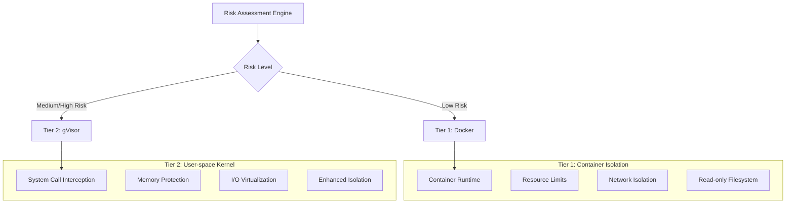
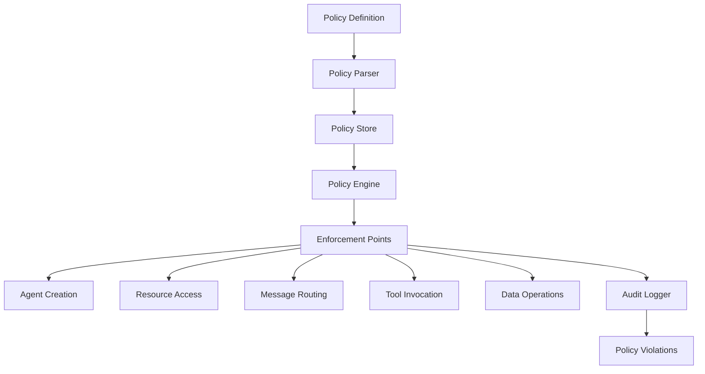
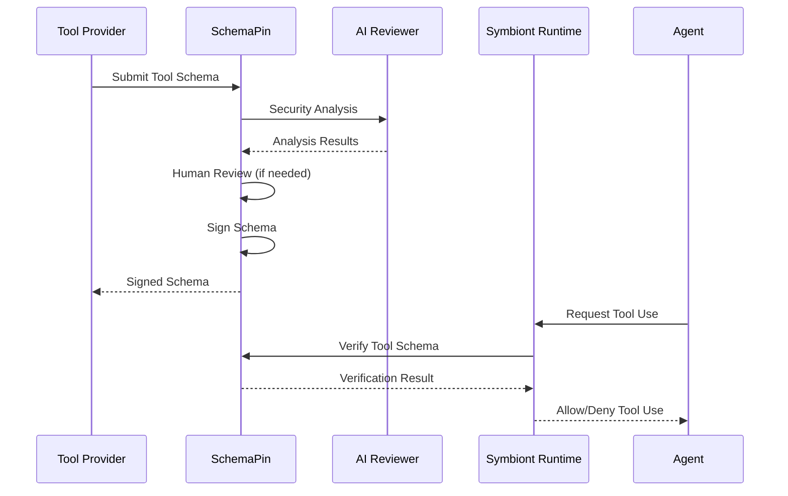
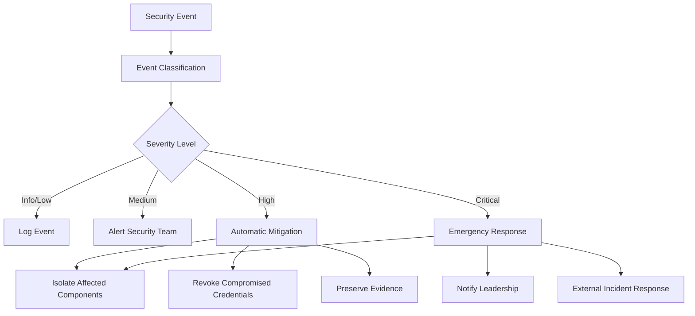

# Security Model
{: .no_toc }

Comprehensive security architecture ensuring zero-trust, policy-driven protection for AI agents.
{: .fs-6 .fw-300 }

## Table of contents
{: .no_toc .text-delta }

1. TOC
{:toc}

---

## Overview

Symbiont implements a security-first architecture designed for regulated and high-assurance environments. The security model is built on zero-trust principles with comprehensive policy enforcement, multi-tier sandboxing, and cryptographic auditability.

### Security Principles

- **Zero Trust**: All components and communications are verified
- **Defense in Depth**: Multiple security layers with no single point of failure
- **Policy-Driven**: Declarative security policies enforced at runtime
- **Complete Auditability**: Every operation logged with cryptographic integrity
- **Least Privilege**: Minimal permissions required for operation

---

## Multi-Tier Sandboxing

The runtime implements two isolation tiers based on risk assessment:



> **Note**: Additional isolation tiers with hardware virtualization are available in Enterprise editions.

### Tier 1: Docker Isolation

**Use Cases:**
- Trusted development tasks
- Low-sensitivity data processing
- Internal tool operations

**Security Features:**
```yaml
docker_security:
  memory_limit: "512MB"
  cpu_limit: "0.5"
  network_mode: "none"
  read_only_root: true
  security_opts:
    - "no-new-privileges:true"
    - "seccomp:default"
  capabilities:
    drop: ["ALL"]
    add: ["SETUID", "SETGID"]
```

**Threat Protection:**
- Process isolation from host
- Resource exhaustion prevention
- Network access control
- Filesystem protection

### Tier 2: gVisor Isolation

**Use Cases:**
- Standard production workloads
- Sensitive data processing
- External tool integration

**Security Features:**
- User-space kernel implementation
- System call filtering and translation
- Memory protection boundaries
- I/O request validation

**Configuration:**
```yaml
gvisor_security:
  runtime: "runsc"
  platform: "ptrace"
  network: "sandbox"
  file_access: "exclusive"
  debug: false
  strace: false
```

**Advanced Protection:**
- Kernel vulnerability isolation
- System call interception
- Memory corruption prevention
- Side-channel attack mitigation

> **Enterprise Feature**: Advanced isolation with hardware virtualization (Firecracker) is available in Enterprise editions for maximum security requirements.

### Risk Assessment Algorithm

```rust
pub struct RiskAssessment {
    data_sensitivity: f32,      // 0.0 = public, 1.0 = top secret
    code_trust_level: f32,      // 0.0 = untrusted, 1.0 = verified
    network_access: bool,       // Requires external network
    filesystem_access: bool,    // Requires filesystem write
    external_apis: bool,        // Uses external services
}

pub fn calculate_risk_score(assessment: RiskAssessment) -> f32 {
    let base_score = assessment.data_sensitivity * 0.4
        + (1.0 - assessment.code_trust_level) * 0.3;
    
    let access_penalty = if assessment.network_access { 0.1 } else { 0.0 }
        + if assessment.filesystem_access { 0.1 } else { 0.0 }
        + if assessment.external_apis { 0.1 } else { 0.0 };
    
    (base_score + access_penalty).min(1.0)
}
```

---

## Policy Engine

### Policy Architecture

The policy engine provides declarative security controls with runtime enforcement:



### Policy Types

#### Access Control Policies

Define who can access what resources under which conditions:

```rust
policy secure_data_access {
    allow: read(sensitive_data) if (
        user.clearance >= "secret" &&
        user.need_to_know.contains(data.classification) &&
        session.mfa_verified == true
    )
    
    deny: export(data) if data.contains_pii == true
    
    require: [
        user.background_check.current,
        session.secure_connection,
        audit_trail = "detailed"
    ]
}
```

#### Data Flow Policies

Control how data moves through the system:

```rust
policy data_flow_control {
    allow: transform(data) if (
        source.classification <= target.classification &&
        user.transform_permissions.contains(operation.type)
    )
    
    deny: aggregate(datasets) if (
        any(datasets, |d| d.privacy_level > operation.privacy_budget)
    )
    
    require: differential_privacy for statistical_operations
}
```

#### Resource Usage Policies

Manage computational resource allocation:

```rust
policy resource_governance {
    allow: allocate(resources) if (
        user.resource_quota.remaining >= resources.total &&
        operation.priority <= user.max_priority
    )
    
    deny: long_running_operations if system.maintenance_mode
    
    require: supervisor_approval for high_memory_operations
}
```

### Policy Evaluation Engine

```rust
pub trait PolicyEngine {
    async fn evaluate_policy(
        &self, 
        context: PolicyContext, 
        action: Action
    ) -> PolicyDecision;
    
    async fn register_policy(&self, policy: Policy) -> Result<PolicyId>;
    async fn update_policy(&self, policy_id: PolicyId, policy: Policy) -> Result<()>;
}

pub enum PolicyDecision {
    Allow,
    Deny { reason: String },
    AllowWithConditions { conditions: Vec<PolicyCondition> },
    RequireApproval { approver: String },
}
```

### Performance Optimization

**Policy Caching:**
- Compiled policy evaluation for performance
- LRU cache for frequent decisions
- Batch evaluation for bulk operations
- Sub-millisecond evaluation times

**Incremental Updates:**
- Real-time policy updates without restart
- Versioned policy deployment
- Rollback capabilities for policy errors

---

## Cryptographic Security

### Digital Signatures

All security-relevant operations are cryptographically signed:

**Signature Algorithm:** Ed25519 (RFC 8032)
- **Key Size:** 256-bit private keys, 256-bit public keys
- **Signature Size:** 512 bits (64 bytes)
- **Performance:** 70,000+ signatures/second, 25,000+ verifications/second

```rust
pub struct CryptographicSignature {
    pub algorithm: SignatureAlgorithm::Ed25519,
    pub public_key: PublicKey,
    pub signature: [u8; 64],
    pub timestamp: SystemTime,
}

impl AuditEvent {
    pub fn sign(&mut self, private_key: &PrivateKey) -> Result<()> {
        let message = self.serialize_for_signing()?;
        self.signature = private_key.sign(&message);
        Ok(())
    }
    
    pub fn verify(&self, public_key: &PublicKey) -> bool {
        let message = self.serialize_for_signing().unwrap();
        public_key.verify(&message, &self.signature)
    }
}
```

### Key Management

**Key Storage:**
- Hardware Security Module (HSM) integration
- Secure enclave support for key protection
- Key rotation with configurable intervals
- Distributed key backup and recovery

**Key Hierarchy:**
- Root signing keys for system operations
- Per-agent keys for operation signing
- Ephemeral keys for session encryption
- External keys for tool verification

```rust
pub struct KeyManager {
    hsm: HardwareSecurityModule,
    key_store: SecureKeyStore,
    rotation_policy: KeyRotationPolicy,
}

impl KeyManager {
    pub async fn generate_agent_keys(&self, agent_id: AgentId) -> Result<KeyPair>;
    pub async fn rotate_keys(&self, key_id: KeyId) -> Result<KeyPair>;
    pub async fn revoke_key(&self, key_id: KeyId) -> Result<()>;
}
```

### Encryption Standards

**Symmetric Encryption:** AES-256-GCM
- 256-bit keys with authenticated encryption
- Unique nonces for each encryption operation
- Associated data for context binding

**Asymmetric Encryption:** X25519 + ChaCha20-Poly1305
- Elliptic curve key exchange
- Stream cipher with authenticated encryption
- Perfect forward secrecy

**Message Encryption:**
```rust
pub fn encrypt_message(
    plaintext: &[u8], 
    recipient_public_key: &PublicKey,
    sender_private_key: &PrivateKey
) -> Result<EncryptedMessage> {
    let shared_secret = sender_private_key.diffie_hellman(recipient_public_key);
    let nonce = generate_random_nonce();
    let ciphertext = ChaCha20Poly1305::new(&shared_secret)
        .encrypt(&nonce, plaintext)?;
    
    Ok(EncryptedMessage {
        nonce,
        ciphertext,
        sender_public_key: sender_private_key.public_key(),
    })
}
```

---

## Audit and Compliance

### Cryptographic Audit Trail

Every security-relevant operation generates an immutable audit event:

```rust
pub struct AuditEvent {
    pub event_id: Uuid,
    pub timestamp: SystemTime,
    pub agent_id: AgentId,
    pub event_type: AuditEventType,
    pub details: serde_json::Value,
    pub signature: Ed25519Signature,
    pub previous_hash: Hash,
    pub event_hash: Hash,
}
```

**Audit Event Types:**
- Agent lifecycle events (creation, termination)
- Policy evaluation decisions
- Resource allocation and usage
- Message sending and routing
- External tool invocations
- Security violations and alerts

### Hash Chaining

Events are linked in an immutable chain:

```rust
impl AuditChain {
    pub fn append_event(&mut self, mut event: AuditEvent) -> Result<()> {
        event.previous_hash = self.last_hash;
        event.event_hash = self.calculate_event_hash(&event);
        event.sign(&self.signing_key)?;
        
        self.events.push(event.clone());
        self.last_hash = event.event_hash;
        
        self.verify_chain_integrity()?;
        Ok(())
    }
    
    pub fn verify_integrity(&self) -> Result<bool> {
        for (i, event) in self.events.iter().enumerate() {
            // Verify signature
            if !event.verify(&self.public_key) {
                return Ok(false);
            }
            
            // Verify hash chain
            if i > 0 && event.previous_hash != self.events[i-1].event_hash {
                return Ok(false);
            }
        }
        Ok(true)
    }
}
```

### Compliance Features

**Regulatory Support:**

**HIPAA (Healthcare):**
- PHI access logging with user identification
- Data minimization enforcement
- Breach detection and notification
- Audit trail retention for 6 years

**GDPR (Privacy):**
- Personal data processing logs
- Consent verification tracking
- Data subject rights enforcement
- Data retention policy compliance

**SOX (Financial):**
- Internal control documentation
- Change management tracking
- Access control verification
- Financial data protection

**Custom Compliance:**
```rust
pub struct ComplianceFramework {
    pub name: String,
    pub audit_requirements: Vec<AuditRequirement>,
    pub retention_policy: RetentionPolicy,
    pub access_controls: Vec<AccessControl>,
    pub data_protection: DataProtectionRules,
}

impl ComplianceFramework {
    pub fn validate_compliance(&self, audit_trail: &AuditChain) -> ComplianceReport;
    pub fn generate_compliance_report(&self, period: TimePeriod) -> Report;
}
```

---

## Tool Security with SchemaPin

### Tool Verification Process

External tools are verified using cryptographic signatures:



### Trust-On-First-Use (TOFU)

**Key Pinning Process:**
1. First encounter with a tool provider
2. Verify provider's public key through external channels
3. Pin the public key in local trust store
4. Use pinned key for all future verifications

```rust
pub struct TOFUKeyStore {
    pinned_keys: HashMap<ProviderId, PinnedKey>,
    trust_policies: Vec<TrustPolicy>,
}

impl TOFUKeyStore {
    pub async fn pin_key(&mut self, provider: ProviderId, key: PublicKey) -> Result<()> {
        if self.pinned_keys.contains_key(&provider) {
            return Err("Key already pinned for provider");
        }
        
        self.pinned_keys.insert(provider, PinnedKey {
            public_key: key,
            pinned_at: SystemTime::now(),
            trust_level: TrustLevel::Unverified,
        });
        
        Ok(())
    }
    
    pub fn verify_tool(&self, tool: &MCPTool) -> VerificationResult {
        if let Some(pinned_key) = self.pinned_keys.get(&tool.provider_id) {
            if pinned_key.public_key.verify(&tool.schema_hash, &tool.signature) {
                VerificationResult::Trusted
            } else {
                VerificationResult::SignatureInvalid
            }
        } else {
            VerificationResult::UnknownProvider
        }
    }
}
```

### AI-Driven Tool Review

Automated security analysis before tool approval:

**Analysis Components:**
- **Vulnerability Detection**: Pattern matching against known vulnerability signatures
- **Malicious Code Detection**: ML-based malicious behavior identification
- **Resource Usage Analysis**: Assessment of computational resource requirements
- **Privacy Impact Assessment**: Data handling and privacy implications

```rust
pub struct SecurityAnalyzer {
    vulnerability_patterns: VulnerabilityDatabase,
    ml_detector: MaliciousCodeDetector,
    resource_analyzer: ResourceAnalyzer,
    privacy_assessor: PrivacyAssessor,
}

impl SecurityAnalyzer {
    pub async fn analyze_tool(&self, tool: &MCPTool) -> SecurityAnalysis {
        let mut findings = Vec::new();
        
        // Vulnerability pattern matching
        findings.extend(self.vulnerability_patterns.scan(&tool.schema));
        
        // ML-based detection
        let ml_result = self.ml_detector.analyze(&tool.schema).await?;
        findings.extend(ml_result.findings);
        
        // Resource usage analysis
        let resource_risk = self.resource_analyzer.assess(&tool.schema);
        
        // Privacy impact assessment
        let privacy_impact = self.privacy_assessor.evaluate(&tool.schema);
        
        SecurityAnalysis {
            tool_id: tool.id.clone(),
            risk_score: calculate_risk_score(&findings),
            findings,
            resource_requirements: resource_risk,
            privacy_impact,
            recommendation: self.generate_recommendation(&findings),
        }
    }
}
```

---

## Network Security

### Secure Communication

**Transport Layer Security:**
- TLS 1.3 for all external communications
- Mutual TLS (mTLS) for service-to-service communication
- Certificate pinning for known services
- Perfect forward secrecy

**Message-Level Security:**
- End-to-end encryption for agent messages
- Message authentication codes (MAC)
- Replay attack prevention with timestamps
- Message ordering guarantees

```rust
pub struct SecureChannel {
    encryption_key: [u8; 32],
    mac_key: [u8; 32],
    send_counter: AtomicU64,
    recv_counter: AtomicU64,
}

impl SecureChannel {
    pub fn encrypt_message(&self, plaintext: &[u8]) -> Result<Vec<u8>> {
        let counter = self.send_counter.fetch_add(1, Ordering::SeqCst);
        let nonce = self.generate_nonce(counter);
        
        let ciphertext = ChaCha20Poly1305::new(&self.encryption_key)
            .encrypt(&nonce, plaintext)?;
        
        let mac = Hmac::<Sha256>::new_from_slice(&self.mac_key)?
            .chain_update(&ciphertext)
            .chain_update(&counter.to_le_bytes())
            .finalize()
            .into_bytes();
        
        Ok([ciphertext, mac.to_vec()].concat())
    }
}
```

### Network Isolation

**Sandbox Network Control:**
- No network access by default
- Explicit allow-list for external connections
- Traffic monitoring and anomaly detection
- DNS filtering and validation

**Network Policies:**
```yaml
network_policy:
  default_action: "deny"
  allowed_destinations:
    - domain: "api.openai.com"
      ports: [443]
      protocol: "https"
    - ip_range: "10.0.0.0/8"
      ports: [6333]  # Qdrant
      protocol: "http"
  
  monitoring:
    log_all_connections: true
    detect_anomalies: true
    rate_limiting: true
```

---

## Incident Response

### Security Event Detection

**Automated Detection:**
- Policy violation monitoring
- Anomalous behavior detection
- Resource usage anomalies
- Failed authentication tracking

**Alert Classification:**
```rust
pub enum SecurityEventSeverity {
    Info,       // Normal security events
    Low,        // Minor policy violations
    Medium,     // Suspicious behavior
    High,       // Confirmed security issues
    Critical,   // Active security breaches
}

pub struct SecurityEvent {
    pub id: Uuid,
    pub timestamp: SystemTime,
    pub severity: SecurityEventSeverity,
    pub category: SecurityEventCategory,
    pub description: String,
    pub affected_components: Vec<ComponentId>,
    pub recommended_actions: Vec<String>,
}
```

### Incident Response Workflow



### Recovery Procedures

**Automated Recovery:**
- Agent restart with clean state
- Key rotation for compromised credentials
- Policy updates to prevent recurrence
- System health verification

**Manual Recovery:**
- Forensic analysis of security events
- Root cause analysis and remediation
- Security control updates
- Incident documentation and lessons learned

---

## Security Best Practices

### Development Guidelines

1. **Secure by Default**: All security features enabled by default
2. **Principle of Least Privilege**: Minimal permissions for all operations
3. **Defense in Depth**: Multiple security layers with redundancy
4. **Fail Securely**: Security failures should deny access, not grant it
5. **Audit Everything**: Complete logging of security-relevant operations

### Deployment Security

**Environment Hardening:**
```bash
# Disable unnecessary services
systemctl disable cups bluetooth

# Kernel hardening
echo "kernel.dmesg_restrict=1" >> /etc/sysctl.conf
echo "kernel.kptr_restrict=2" >> /etc/sysctl.conf

# File system security
mount -o remount,nodev,nosuid,noexec /tmp
```

**Container Security:**
```dockerfile
# Use minimal base image
FROM scratch
COPY --from=builder /app/symbiont /bin/symbiont

# Run as non-root user
USER 1000:1000

# Set security options
LABEL security.no-new-privileges=true
```

### Operational Security

**Monitoring Checklist:**
- [ ] Real-time security event monitoring
- [ ] Policy violation tracking
- [ ] Resource usage anomaly detection
- [ ] Failed authentication monitoring
- [ ] Certificate expiration tracking

**Maintenance Procedures:**
- Regular security updates and patches
- Key rotation on schedule
- Policy review and updates
- Security audit and penetration testing
- Incident response plan testing

---

## Security Configuration

### Environment Variables

```bash
# Cryptographic settings
export SYMBIONT_CRYPTO_PROVIDER=ring
export SYMBIONT_KEY_STORE_TYPE=hsm
export SYMBIONT_HSM_CONFIG_PATH=/etc/symbiont/hsm.conf

# Audit settings
export SYMBIONT_AUDIT_ENABLED=true
export SYMBIONT_AUDIT_STORAGE=/var/audit/symbiont
export SYMBIONT_AUDIT_RETENTION_DAYS=2555  # 7 years

# Security policies
export SYMBIONT_POLICY_ENFORCEMENT=strict
export SYMBIONT_DEFAULT_SANDBOX_TIER=gvisor
export SYMBIONT_TOFU_ENABLED=true
```

### Security Configuration File

```toml
[security]
# Cryptographic settings
crypto_provider = "ring"
signature_algorithm = "ed25519"
encryption_algorithm = "chacha20_poly1305"

# Key management
key_rotation_interval_days = 90
hsm_enabled = true
hsm_config_path = "/etc/symbiont/hsm.conf"

# Audit settings
audit_enabled = true
audit_storage_path = "/var/audit/symbiont"
audit_retention_days = 2555
audit_compression = true

# Sandbox security
default_sandbox_tier = "gvisor"
sandbox_escape_detection = true
resource_limit_enforcement = "strict"

# Network security
tls_min_version = "1.3"
certificate_pinning = true
network_isolation = true

# Policy enforcement
policy_enforcement_mode = "strict"
policy_violation_action = "deny_and_alert"
emergency_override_enabled = false

[tofu]
enabled = true
key_verification_required = true
trust_on_first_use_timeout_hours = 24
automatic_key_pinning = false
```

---

## Security Metrics

### Key Performance Indicators

**Security Operations:**
- Policy evaluation latency: <1ms average
- Audit event generation rate: 10,000+ events/second
- Security incident response time: <5 minutes
- Cryptographic operation throughput: 70,000+ ops/second

**Compliance Metrics:**
- Policy compliance rate: >99.9%
- Audit trail integrity: 100%
- Security event false positive rate: <1%
- Incident resolution time: <24 hours

**Risk Assessment:**
- Vulnerability patching time: <48 hours
- Security control effectiveness: >95%
- Threat detection accuracy: >99%
- Recovery time objective: <1 hour

---

## Future Enhancements

### Advanced Cryptography

**Post-Quantum Cryptography:**
- NIST-approved post-quantum algorithms
- Hybrid classical/post-quantum schemes
- Migration planning for quantum threats

**Homomorphic Encryption:**
- Privacy-preserving computation on encrypted data
- CKKS scheme for approximate arithmetic
- Integration with machine learning workflows

**Zero-Knowledge Proofs:**
- zk-SNARKs for computation verification
- Privacy-preserving authentication
- Compliance proof generation

### AI-Enhanced Security

**Behavior Analysis:**
- Machine learning for anomaly detection
- Predictive security analytics
- Adaptive threat response

**Automated Response:**
- Self-healing security controls
- Dynamic policy generation
- Intelligent incident classification

---

## Next Steps

- **[Contributing](/contributing)** - Security development guidelines
- **[Runtime Architecture](/runtime-architecture)** - Technical implementation details
- **[API Reference](/api-reference)** - Security API documentation
- **[Compliance Guide](/compliance)** - Regulatory compliance information

The Symbiont security model provides enterprise-grade protection suitable for regulated industries and high-assurance environments. Its layered approach ensures robust protection against evolving threats while maintaining operational efficiency.