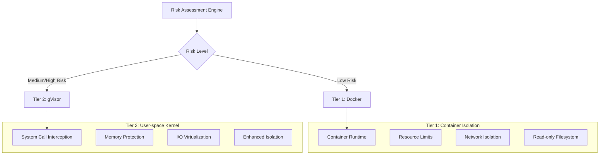
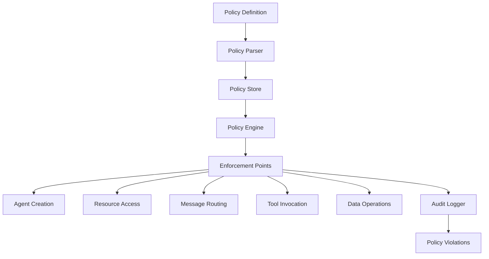
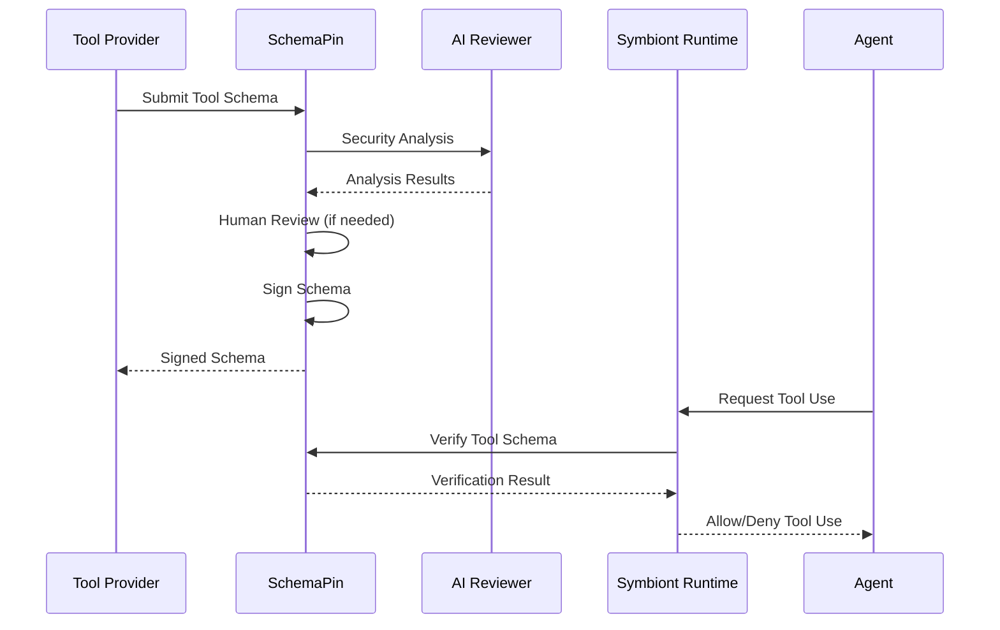
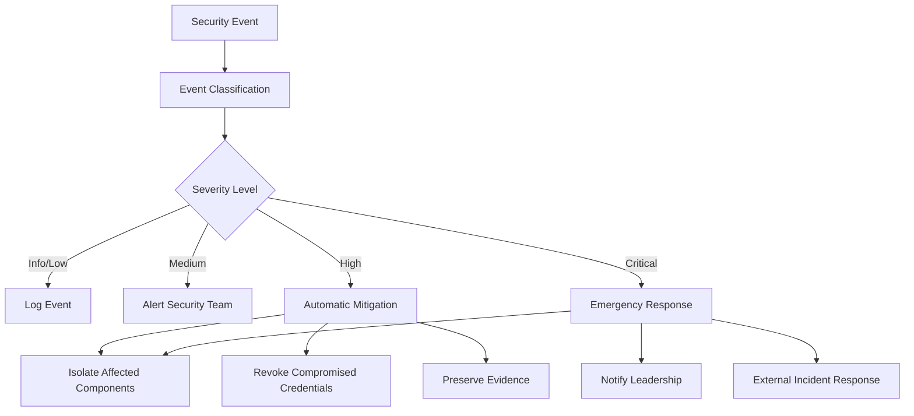

# Modelo de Segurança
{: .no_toc }

## 🌐 Outros idiomas
{: .no_toc}

[English](security-model.md) | [中文简体](security-model.zh-cn.md) | [Español](security-model.es.md) | **Português** | [日本語](security-model.ja.md) | [Deutsch](security-model.de.md)

---

Arquitetura de segurança abrangente garantindo proteção de confiança zero e orientada por políticas para agentes de IA.
{: .fs-6 .fw-300 }

## Índice
{: .no_toc .text-delta }

1. TOC
{:toc}

---

## Visão Geral

O Symbiont implementa uma arquitetura de segurança em primeiro lugar projetada para ambientes regulamentados e de alta garantia. O modelo de segurança é construído sobre princípios de confiança zero com aplicação abrangente de políticas, sandboxing de várias camadas e auditabilidade criptográfica.

### Princípios de Segurança

- **Confiança Zero**: Todos os componentes e comunicações são verificados
- **Defesa em Profundidade**: Múltiplas camadas de segurança sem ponto único de falha
- **Orientado por Políticas**: Políticas de segurança declarativas aplicadas em tempo de execução
- **Auditabilidade Completa**: Cada operação registrada com integridade criptográfica
- **Menor Privilégio**: Permissões mínimas necessárias para operação

---

## Sandboxing de Múltiplas Camadas

O runtime implementa duas camadas de isolamento baseadas na avaliação de risco:



> **Nota**: Camadas de isolamento adicionais com virtualização de hardware estão disponíveis nas edições Enterprise.

### Camada 1: Isolamento Docker

**Casos de Uso:**
- Tarefas de desenvolvimento confiáveis
- Processamento de dados de baixa sensibilidade
- Operações de ferramentas internas

**Recursos de Segurança:**
```yaml
docker_security:
  memory_limit: "512MB"
  cpu_limit: "0.5"
  network_mode: "none"
  read_only_root: true
  security_opts:
    - "no-new-privileges:true"
    - "seccomp:default"
  capabilities:
    drop: ["ALL"]
    add: ["SETUID", "SETGID"]
```

**Proteção contra Ameaças:**
- Isolamento de processos do host
- Prevenção de esgotamento de recursos
- Controle de acesso à rede
- Proteção do sistema de arquivos

### Camada 2: Isolamento gVisor

**Casos de Uso:**
- Cargas de trabalho de produção padrão
- Processamento de dados sensíveis
- Integração de ferramentas externas

**Recursos de Segurança:**
- Implementação de kernel em espaço de usuário
- Filtragem e tradução de chamadas do sistema
- Limites de proteção de memória
- Validação de solicitações de E/S

**Configuração:**
```yaml
gvisor_security:
  runtime: "runsc"
  platform: "ptrace"
  network: "sandbox"
  file_access: "exclusive"
  debug: false
  strace: false
```

**Proteção Avançada:**
- Isolamento de vulnerabilidades do kernel
- Interceptação de chamadas do sistema
- Prevenção de corrupção de memória
- Mitigação de ataques de canal lateral

> **Recurso Enterprise**: Isolamento avançado com virtualização de hardware (Firecracker) está disponível nas edições Enterprise para requisitos máximos de segurança.

### Algoritmo de Avaliação de Risco

```rust
pub struct RiskAssessment {
    data_sensitivity: f32,      // 0.0 = public, 1.0 = top secret
    code_trust_level: f32,      // 0.0 = untrusted, 1.0 = verified
    network_access: bool,       // Requires external network
    filesystem_access: bool,    // Requires filesystem write
    external_apis: bool,        // Uses external services
}

pub fn calculate_risk_score(assessment: RiskAssessment) -> f32 {
    let base_score = assessment.data_sensitivity * 0.4
        + (1.0 - assessment.code_trust_level) * 0.3;
    
    let access_penalty = if assessment.network_access { 0.1 } else { 0.0 }
        + if assessment.filesystem_access { 0.1 } else { 0.0 }
        + if assessment.external_apis { 0.1 } else { 0.0 };
    
    (base_score + access_penalty).min(1.0)
}
```

---

## Motor de Políticas

### Arquitetura de Políticas

O motor de políticas fornece controles de segurança declarativos com aplicação em tempo de execução:



### Tipos de Políticas

#### Políticas de Controle de Acesso

Definem quem pode acessar quais recursos sob quais condições:

```rust
policy secure_data_access {
    allow: read(sensitive_data) if (
        user.clearance >= "secret" &&
        user.need_to_know.contains(data.classification) &&
        session.mfa_verified == true
    )
    
    deny: export(data) if data.contains_pii == true
    
    require: [
        user.background_check.current,
        session.secure_connection,
        audit_trail = "detailed"
    ]
}
```

#### Políticas de Fluxo de Dados

Controlam como os dados se movem através do sistema:

```rust
policy data_flow_control {
    allow: transform(data) if (
        source.classification <= target.classification &&
        user.transform_permissions.contains(operation.type)
    )
    
    deny: aggregate(datasets) if (
        any(datasets, |d| d.privacy_level > operation.privacy_budget)
    )
    
    require: differential_privacy for statistical_operations
}
```

#### Políticas de Uso de Recursos

Gerenciam alocação de recursos computacionais:

```rust
policy resource_governance {
    allow: allocate(resources) if (
        user.resource_quota.remaining >= resources.total &&
        operation.priority <= user.max_priority
    )
    
    deny: long_running_operations if system.maintenance_mode
    
    require: supervisor_approval for high_memory_operations
}
```

### Motor de Avaliação de Políticas

```rust
pub trait PolicyEngine {
    async fn evaluate_policy(
        &self, 
        context: PolicyContext, 
        action: Action
    ) -> PolicyDecision;
    
    async fn register_policy(&self, policy: Policy) -> Result<PolicyId>;
    async fn update_policy(&self, policy_id: PolicyId, policy: Policy) -> Result<()>;
}

pub enum PolicyDecision {
    Allow,
    Deny { reason: String },
    AllowWithConditions { conditions: Vec<PolicyCondition> },
    RequireApproval { approver: String },
}
```

### Otimização de Performance

**Cache de Políticas:**
- Avaliação de políticas compiladas para performance
- Cache LRU para decisões frequentes
- Avaliação em lote para operações em massa
- Tempos de avaliação sub-milissegundo

**Atualizações Incrementais:**
- Atualizações de políticas em tempo real sem reinicialização
- Implantação de políticas versionadas
- Capacidades de rollback para erros de políticas

---

## Segurança Criptográfica

### Assinaturas Digitais

Todas as operações relevantes para segurança são assinadas criptograficamente:

**Algoritmo de Assinatura:** Ed25519 (RFC 8032)
- **Tamanho da Chave:** Chaves privadas de 256 bits, chaves públicas de 256 bits
- **Tamanho da Assinatura:** 512 bits (64 bytes)
- **Performance:** 70,000+ assinaturas/segundo, 25,000+ verificações/segundo

```rust
pub struct CryptographicSignature {
    pub algorithm: SignatureAlgorithm::Ed25519,
    pub public_key: PublicKey,
    pub signature: [u8; 64],
    pub timestamp: SystemTime,
}

impl AuditEvent {
    pub fn sign(&mut self, private_key: &PrivateKey) -> Result<()> {
        let message = self.serialize_for_signing()?;
        self.signature = private_key.sign(&message);
        Ok(())
    }
    
    pub fn verify(&self, public_key: &PublicKey) -> bool {
        let message = self.serialize_for_signing().unwrap();
        public_key.verify(&message, &self.signature)
    }
}
```

### Gerenciamento de Chaves

**Armazenamento de Chaves:**
- Integração com Módulo de Segurança de Hardware (HSM)
- Suporte a enclave seguro para proteção de chaves
- Rotação de chaves com intervalos configuráveis
- Backup e recuperação de chaves distribuídos

**Hierarquia de Chaves:**
- Chaves de assinatura raiz para operações do sistema
- Chaves por agente para assinatura de operações
- Chaves efêmeras para criptografia de sessão
- Chaves externas para verificação de ferramentas

```rust
pub struct KeyManager {
    hsm: HardwareSecurityModule,
    key_store: SecureKeyStore,
    rotation_policy: KeyRotationPolicy,
}

impl KeyManager {
    pub async fn generate_agent_keys(&self, agent_id: AgentId) -> Result<KeyPair>;
    pub async fn rotate_keys(&self, key_id: KeyId) -> Result<KeyPair>;
    pub async fn revoke_key(&self, key_id: KeyId) -> Result<()>;
}
```

### Padrões de Criptografia

**Criptografia Simétrica:** AES-256-GCM
- Chaves de 256 bits com criptografia autenticada
- Nonces únicos para cada operação de criptografia
- Dados associados para vinculação de contexto

**Criptografia Assimétrica:** X25519 + ChaCha20-Poly1305
- Troca de chaves de curva elíptica
- Cifra de fluxo com criptografia autenticada
- Sigilo perfeito para frente

**Criptografia de Mensagens:**
```rust
pub fn encrypt_message(
    plaintext: &[u8], 
    recipient_public_key: &PublicKey,
    sender_private_key: &PrivateKey
) -> Result<EncryptedMessage> {
    let shared_secret = sender_private_key.diffie_hellman(recipient_public_key);
    let nonce = generate_random_nonce();
    let ciphertext = ChaCha20Poly1305::new(&shared_secret)
        .encrypt(&nonce, plaintext)?;
    
    Ok(EncryptedMessage {
        nonce,
        ciphertext,
        sender_public_key: sender_private_key.public_key(),
    })
}
```

---

## Auditoria e Conformidade

### Trilha de Auditoria Criptográfica

Cada operação relevante para segurança gera um evento de auditoria imutável:

```rust
pub struct AuditEvent {
    pub event_id: Uuid,
    pub timestamp: SystemTime,
    pub agent_id: AgentId,
    pub event_type: AuditEventType,
    pub details: serde_json::Value,
    pub signature: Ed25519Signature,
    pub previous_hash: Hash,
    pub event_hash: Hash,
}
```

**Tipos de Eventos de Auditoria:**
- Eventos do ciclo de vida do agente (criação, término)
- Decisões de avaliação de políticas
- Alocação e uso de recursos
- Envio e roteamento de mensagens
- Invocações de ferramentas externas
- Violações de segurança e alertas

### Encadeamento de Hash

Eventos são vinculados em uma cadeia imutável:

```rust
impl AuditChain {
    pub fn append_event(&mut self, mut event: AuditEvent) -> Result<()> {
        event.previous_hash = self.last_hash;
        event.event_hash = self.calculate_event_hash(&event);
        event.sign(&self.signing_key)?;
        
        self.events.push(event.clone());
        self.last_hash = event.event_hash;
        
        self.verify_chain_integrity()?;
        Ok(())
    }
    
    pub fn verify_integrity(&self) -> Result<bool> {
        for (i, event) in self.events.iter().enumerate() {
            // Verify signature
            if !event.verify(&self.public_key) {
                return Ok(false);
            }
            
            // Verify hash chain
            if i > 0 && event.previous_hash != self.events[i-1].event_hash {
                return Ok(false);
            }
        }
        Ok(true)
    }
}
```

### Recursos de Conformidade

**Suporte Regulatório:**

**HIPAA (Saúde):**
- Registro de acesso a PHI com identificação do usuário
- Aplicação de minimização de dados
- Detecção e notificação de violações
- Retenção de trilha de auditoria por 6 anos

**GDPR (Privacidade):**
- Logs de processamento de dados pessoais
- Rastreamento de verificação de consentimento
- Aplicação de direitos do titular dos dados
- Conformidade com política de retenção de dados

**SOX (Financeiro):**
- Documentação de controles internos
- Rastreamento de gerenciamento de mudanças
- Verificação de controles de acesso
- Proteção de dados financeiros

**Conformidade Personalizada:**
```rust
pub struct ComplianceFramework {
    pub name: String,
    pub audit_requirements: Vec<AuditRequirement>,
    pub retention_policy: RetentionPolicy,
    pub access_controls: Vec<AccessControl>,
    pub data_protection: DataProtectionRules,
}

impl ComplianceFramework {
    pub fn validate_compliance(&self, audit_trail: &AuditChain) -> ComplianceReport;
    pub fn generate_compliance_report(&self, period: TimePeriod) -> Report;
}
```

---

## Segurança de Ferramentas com SchemaPin

### Processo de Verificação de Ferramentas

Ferramentas externas são verificadas usando assinaturas criptográficas:



### Confiança no Primeiro Uso (TOFU)

**Processo de Fixação de Chaves:**
1. Primeiro encontro com um provedor de ferramentas
2. Verificar a chave pública do provedor através de canais externos
3. Fixar a chave pública no armazenamento de confiança local
4. Usar a chave fixada para todas as verificações futuras

```rust
pub struct TOFUKeyStore {
    pinned_keys: HashMap<ProviderId, PinnedKey>,
    trust_policies: Vec<TrustPolicy>,
}

impl TOFUKeyStore {
    pub async fn pin_key(&mut self, provider: ProviderId, key: PublicKey) -> Result<()> {
        if self.pinned_keys.contains_key(&provider) {
            return Err("Key already pinned for provider");
        }
        
        self.pinned_keys.insert(provider, PinnedKey {
            public_key: key,
            pinned_at: SystemTime::now(),
            trust_level: TrustLevel::Unverified,
        });
        
        Ok(())
    }
    
    pub fn verify_tool(&self, tool: &MCPTool) -> VerificationResult {
        if let Some(pinned_key) = self.pinned_keys.get(&tool.provider_id) {
            if pinned_key.public_key.verify(&tool.schema_hash, &tool.signature) {
                VerificationResult::Trusted
            } else {
                VerificationResult::SignatureInvalid
            }
        } else {
            VerificationResult::UnknownProvider
        }
    }
}
```

### Revisão de Ferramentas Orientada por IA

Análise de segurança automatizada antes da aprovação de ferramentas:

**Componentes de Análise:**
- **Detecção de Vulnerabilidades**: Correspondência de padrões contra assinaturas de vulnerabilidades conhecidas
- **Detecção de Código Malicioso**: Identificação de comportamento malicioso baseada em ML
- **Análise de Uso de Recursos**: Avaliação de requisitos de recursos computacionais
- **Avaliação de Impacto na Privacidade**: Manuseio de dados e implicações de privacidade

```rust
pub struct SecurityAnalyzer {
    vulnerability_patterns: VulnerabilityDatabase,
    ml_detector: MaliciousCodeDetector,
    resource_analyzer: ResourceAnalyzer,
    privacy_assessor: PrivacyAssessor,
}

impl SecurityAnalyzer {
    pub async fn analyze_tool(&self, tool: &MCPTool) -> SecurityAnalysis {
        let mut findings = Vec::new();
        
        // Vulnerability pattern matching
        findings.extend(self.vulnerability_patterns.scan(&tool.schema));
        
        // ML-based detection
        let ml_result = self.ml_detector.analyze(&tool.schema).await?;
        findings.extend(ml_result.findings);
        
        // Resource usage analysis
        let resource_risk = self.resource_analyzer.assess(&tool.schema);
        
        // Privacy impact assessment
        let privacy_impact = self.privacy_assessor.evaluate(&tool.schema);
        
        SecurityAnalysis {
            tool_id: tool.id.clone(),
            risk_score: calculate_risk_score(&findings),
            findings,
            resource_requirements: resource_risk,
            privacy_impact,
            recommendation: self.generate_recommendation(&findings),
        }
    }
}
```

---

## Segurança de Rede

### Comunicação Segura

**Segurança de Camada de Transporte:**
- TLS 1.3 para todas as comunicações externas
- TLS mútuo (mTLS) para comunicação serviço-a-serviço
- Fixação de certificados para serviços conhecidos
- Sigilo perfeito para frente

**Segurança em Nível de Mensagem:**
- Criptografia ponta-a-ponta para mensagens de agentes
- Códigos de autenticação de mensagem (MAC)
- Prevenção de ataques de replay com timestamps
- Garantias de ordenação de mensagens

```rust
pub struct SecureChannel {
    encryption_key: [u8; 32],
    mac_key: [u8; 32],
    send_counter: AtomicU64,
    recv_counter: AtomicU64,
}

impl SecureChannel {
    pub fn encrypt_message(&self, plaintext: &[u8]) -> Result<Vec<u8>> {
        let counter = self.send_counter.fetch_add(1, Ordering::SeqCst);
        let nonce = self.generate_nonce(counter);
        
        let ciphertext = ChaCha20Poly1305::new(&self.encryption_key)
            .encrypt(&nonce, plaintext)?;
        
        let mac = Hmac::<Sha256>::new_from_slice(&self.mac_key)?
            .chain_update(&ciphertext)
            .chain_update(&counter.to_le_bytes())
            .finalize()
            .into_bytes();
        
        Ok([ciphertext, mac.to_vec()].concat())
    }
}
```

### Isolamento de Rede

**Controle de Rede do Sandbox:**
- Sem acesso à rede por padrão
- Lista de permissões explícita para conexões externas
- Monitoramento de tráfego e detecção de anomalias
- Filtragem e validação de DNS

**Políticas de Rede:**
```yaml
network_policy:
  default_action: "deny"
  allowed_destinations:
    - domain: "api.openai.com"
      ports: [443]
      protocol: "https"
    - ip_range: "10.0.0.0/8"
      ports: [6333]  # Qdrant (only needed if using optional Qdrant backend)
      protocol: "http"
  
  monitoring:
    log_all_connections: true
    detect_anomalies: true
    rate_limiting: true
```

---

## Resposta a Incidentes

### Detecção de Eventos de Segurança

**Detecção Automatizada:**
- Monitoramento de violações de políticas
- Detecção de comportamento anômalo
- Anomalias de uso de recursos
- Rastreamento de autenticação falhada

**Classificação de Alertas:**
```rust
pub enum SecurityEventSeverity {
    Info,       // Normal security events
    Low,        // Minor policy violations
    Medium,     // Suspicious behavior
    High,       // Confirmed security issues
    Critical,   // Active security breaches
}

pub struct SecurityEvent {
    pub id: Uuid,
    pub timestamp: SystemTime,
    pub severity: SecurityEventSeverity,
    pub category: SecurityEventCategory,
    pub description: String,
    pub affected_components: Vec<ComponentId>,
    pub recommended_actions: Vec<String>,
}
```

### Fluxo de Trabalho de Resposta a Incidentes



### Procedimentos de Recuperação

**Recuperação Automatizada:**
- Reinicialização de agente com estado limpo
- Rotação de chaves para credenciais comprometidas
- Atualizações de políticas para prevenir recorrência
- Verificação de saúde do sistema

**Recuperação Manual:**
- Análise forense de eventos de segurança
- Análise de causa raiz e remediação
- Atualizações de controles de segurança
- Documentação de incidentes e lições aprendidas

---

## Melhores Práticas de Segurança

### Diretrizes de Desenvolvimento

1. **Seguro por Padrão**: Todos os recursos de segurança habilitados por padrão
2. **Princípio do Menor Privilégio**: Permissões mínimas para todas as operações
3. **Defesa em Profundidade**: Múltiplas camadas de segurança com redundância
4. **Falhar com Segurança**: Falhas de segurança devem negar acesso, não conceder
5. **Auditar Tudo**: Registro completo de operações relevantes para segurança

### Segurança de Implantação

**Endurecimento do Ambiente:**
```bash
# Disable unnecessary services
systemctl disable cups bluetooth

# Kernel hardening
echo "kernel.dmesg_restrict=1" >> /etc/sysctl.conf
echo "kernel.kptr_restrict=2" >> /etc/sysctl.conf

# File system security
mount -o remount,nodev,nosuid,noexec /tmp
```

**Segurança de Contêineres:**
```dockerfile
# Use minimal base image
FROM scratch
COPY --from=builder /app/symbiont /bin/symbiont

# Run as non-root user
USER 1000:1000

# Set security options
LABEL security.no-new-privileges=true
```

### Segurança Operacional

**Lista de Verificação de Monitoramento:**
- [ ] Monitoramento de eventos de segurança em tempo real
- [ ] Rastreamento de violações de políticas
- [ ] Detecção de anomalias de uso de recursos
- [ ] Monitoramento de autenticação falhada
- [ ] Rastreamento de expiração de certificados

**Procedimentos de Manutenção:**
- Atualizações e patches de segurança regulares
- Rotação de chaves programada
- Revisão e atualizações de políticas
- Auditoria de segurança e testes de penetração
- Testes do plano de resposta a incidentes

---

## Configuração de Segurança

### Variáveis de Ambiente

```bash
# Cryptographic settings
export SYMBIONT_CRYPTO_PROVIDER=ring
export SYMBIONT_KEY_STORE_TYPE=hsm
export SYMBIONT_HSM_CONFIG_PATH=/etc/symbiont/hsm.conf

# Audit settings
export SYMBIONT_AUDIT_ENABLED=true
export SYMBIONT_AUDIT_STORAGE=/var/audit/symbiont
export SYMBIONT_AUDIT_RETENTION_DAYS=2555  # 7 years

# Security policies
export SYMBIONT_POLICY_ENFORCEMENT=strict
export SYMBIONT_DEFAULT_SANDBOX_TIER=gvisor
export SYMBIONT_TOFU_ENABLED=true
```

### Arquivo de Configuração de Segurança

```toml
[security]
# Cryptographic settings
crypto_provider = "ring"
signature_algorithm = "ed25519"
encryption_algorithm = "chacha20_poly1305"

# Key management
key_rotation_interval_days = 90
hsm_enabled = true
hsm_config_path = "/etc/symbiont/hsm.conf"

# Audit settings
audit_enabled = true
audit_storage_path = "/var/audit/symbiont"
audit_retention_days = 2555
audit_compression = true

# Sandbox security
default_sandbox_tier = "gvisor"
sandbox_escape_detection = true
resource_limit_enforcement = "strict"

# Network security
tls_min_version = "1.3"
certificate_pinning = true
network_isolation = true

# Policy enforcement
policy_enforcement_mode = "strict"
policy_violation_action = "deny_and_alert"
emergency_override_enabled = false

[tofu]
enabled = true
key_verification_required = true
trust_on_first_use_timeout_hours = 24
automatic_key_pinning = false
```

---

## Métricas de Segurança

### Indicadores-Chave de Performance

**Operações de Segurança:**
- Latência de avaliação de políticas: média <1ms
- Taxa de geração de eventos de auditoria: 10,000+ eventos/segundo
- Tempo de resposta a incidentes de segurança: <5 minutos
- Throughput de operações criptográficas: 70,000+ ops/segundo

**Métricas de Conformidade:**
- Taxa de conformidade de políticas: >99.9%
- Integridade da trilha de auditoria: 100%
- Taxa de falsos positivos de eventos de segurança: <1%
- Tempo de resolução de incidentes: <24 horas

**Avaliação de Risco:**
- Tempo de aplicação de patches de vulnerabilidades: <48 horas
- Efetividade dos controles de segurança: >95%
- Precisão de detecção de ameaças: >99%
- Objetivo de tempo de recuperação: <1 hora

---

## Melhorias Futuras

### Criptografia Avançada

**Criptografia Pós-Quântica:**
- Algoritmos pós-quânticos aprovados pelo NIST
- Esquemas híbridos clássico/pós-quântico
- Planejamento de migração para ameaças quânticas

**Criptografia Homomórfica:**
- Computação que preserva privacidade em dados criptografados
- Esquema CKKS para aritmética aproximada
- Integração com fluxos de trabalho de aprendizado de máquina

**Provas de Conhecimento Zero:**
- zk-SNARKs para verificação de computação
- Autenticação que preserva privacidade
- Geração de provas de conformidade

### Segurança Aprimorada por IA

**Análise de Comportamento:**
- Aprendizado de máquina para detecção de anomalias
- Análise de segurança preditiva
- Resposta adaptativa a ameaças

**Resposta Automatizada:**
- Controles de segurança auto-curativos
- Geração dinâmica de políticas
- Classificação inteligente de incidentes

---

## Próximos Passos

- **[Contribuir](/contributing)** - Diretrizes de desenvolvimento de segurança
- **[Arquitetura de Runtime](/runtime-architecture)** - Detalhes de implementação técnica
- **[Referência da API](/api-reference)** - Documentação da API de segurança
- **[Guia de Conformidade](/compliance)** - Informações de conformidade regulatória

O modelo de segurança do Symbiont fornece proteção de nível empresarial adequada para indústrias regulamentadas e ambientes de alta garantia. Sua abordagem em camadas garante proteção robusta contra ameaças em evolução, mantendo a eficiência operacional.