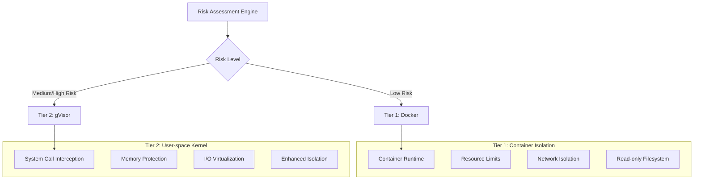
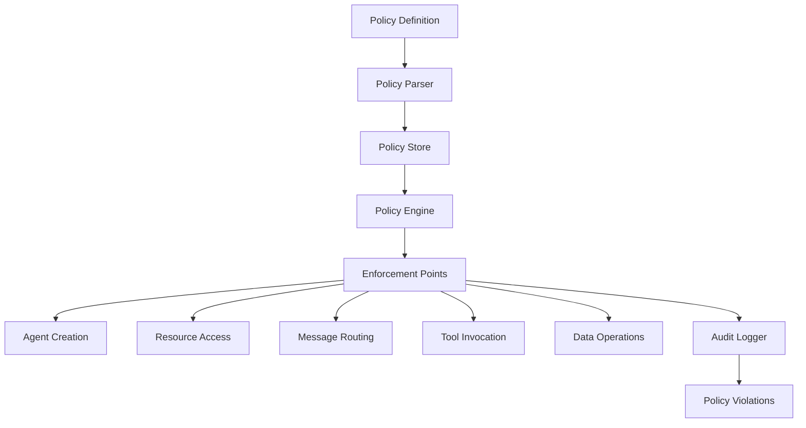
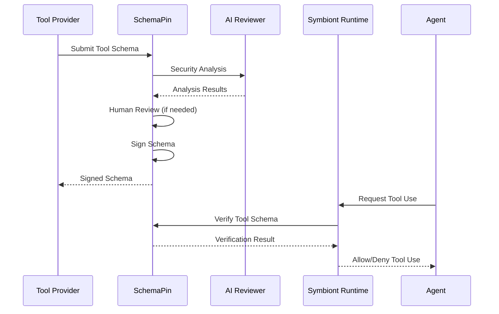
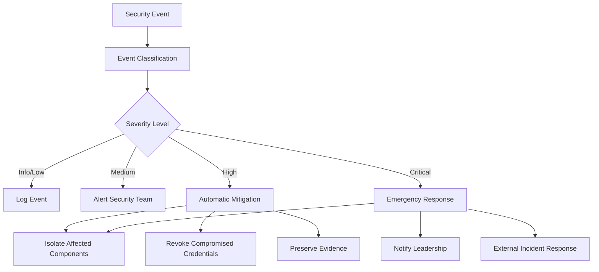

# 安全模型
{: .no_toc }

全面的安全架构，确保为 AI 代理提供零信任、策略驱动的保护。
{: .fs-6 .fw-300 }

## 🌐 其他语言

[English](security-model.md) | **中文简体** | [Español](security-model.es.md) | [Português](security-model.pt.md) | [日本語](security-model.ja.md) | [Deutsch](security-model.de.md)

---

## 目录
{: .no_toc .text-delta }

1. TOC
{:toc}

---

## 概述

Symbiont 实现了专为受监管和高保障环境设计的安全优先架构。该安全模型建立在零信任原则之上，具有全面的策略执行、多层沙箱和密码学可审计性。

### 安全原则

- **零信任**：所有组件和通信都经过验证
- **纵深防御**：多个安全层，无单点故障
- **策略驱动**：在运行时强制执行声明性安全策略
- **完整审计性**：每个操作都记录并具有密码学完整性
- **最小权限**：操作所需的最小权限

---

## 多层沙箱

运行时基于风险评估实现两个隔离层级：



> **注意**：企业版中提供具有硬件虚拟化的附加隔离层级。

### 第一层：Docker 隔离

**使用场景：**
- 可信开发任务
- 低敏感度数据处理
- 内部工具操作

**安全功能：**
```yaml
docker_security:
  memory_limit: "512MB"
  cpu_limit: "0.5"
  network_mode: "none"
  read_only_root: true
  security_opts:
    - "no-new-privileges:true"
    - "seccomp:default"
  capabilities:
    drop: ["ALL"]
    add: ["SETUID", "SETGID"]
```

**威胁防护：**
- 与主机的进程隔离
- 资源耗尽预防
- 网络访问控制
- 文件系统保护

### 第二层：gVisor 隔离

**使用场景：**
- 标准生产工作负载
- 敏感数据处理
- 外部工具集成

**安全功能：**
- 用户空间内核实现
- 系统调用过滤和转换
- 内存保护边界
- I/O 请求验证

**配置：**
```yaml
gvisor_security:
  runtime: "runsc"
  platform: "ptrace"
  network: "sandbox"
  file_access: "exclusive"
  debug: false
  strace: false
```

**高级保护：**
- 内核漏洞隔离
- 系统调用拦截
- 内存损坏预防
- 侧信道攻击缓解

> **企业功能**：企业版中提供具有硬件虚拟化（Firecracker）的高级隔离，可满足最高安全要求。

### 风险评估算法

```rust
pub struct RiskAssessment {
    data_sensitivity: f32,      // 0.0 = public, 1.0 = top secret
    code_trust_level: f32,      // 0.0 = untrusted, 1.0 = verified
    network_access: bool,       // Requires external network
    filesystem_access: bool,    // Requires filesystem write
    external_apis: bool,        // Uses external services
}

pub fn calculate_risk_score(assessment: RiskAssessment) -> f32 {
    let base_score = assessment.data_sensitivity * 0.4
        + (1.0 - assessment.code_trust_level) * 0.3;
    
    let access_penalty = if assessment.network_access { 0.1 } else { 0.0 }
        + if assessment.filesystem_access { 0.1 } else { 0.0 }
        + if assessment.external_apis { 0.1 } else { 0.0 };
    
    (base_score + access_penalty).min(1.0)
}
```

---

## 策略引擎

### 策略架构

策略引擎通过运行时强制执行提供声明性安全控制：



### 策略类型

#### 访问控制策略

定义谁可以在什么条件下访问什么资源：

```rust
policy secure_data_access {
    allow: read(sensitive_data) if (
        user.clearance >= "secret" &&
        user.need_to_know.contains(data.classification) &&
        session.mfa_verified == true
    )
    
    deny: export(data) if data.contains_pii == true
    
    require: [
        user.background_check.current,
        session.secure_connection,
        audit_trail = "detailed"
    ]
}
```

#### 数据流策略

控制数据在系统中的流动方式：

```rust
policy data_flow_control {
    allow: transform(data) if (
        source.classification <= target.classification &&
        user.transform_permissions.contains(operation.type)
    )
    
    deny: aggregate(datasets) if (
        any(datasets, |d| d.privacy_level > operation.privacy_budget)
    )
    
    require: differential_privacy for statistical_operations
}
```

#### 资源使用策略

管理计算资源分配：

```rust
policy resource_governance {
    allow: allocate(resources) if (
        user.resource_quota.remaining >= resources.total &&
        operation.priority <= user.max_priority
    )
    
    deny: long_running_operations if system.maintenance_mode
    
    require: supervisor_approval for high_memory_operations
}
```

### 策略评估引擎

```rust
pub trait PolicyEngine {
    async fn evaluate_policy(
        &self, 
        context: PolicyContext, 
        action: Action
    ) -> PolicyDecision;
    
    async fn register_policy(&self, policy: Policy) -> Result<PolicyId>;
    async fn update_policy(&self, policy_id: PolicyId, policy: Policy) -> Result<()>;
}

pub enum PolicyDecision {
    Allow,
    Deny { reason: String },
    AllowWithConditions { conditions: Vec<PolicyCondition> },
    RequireApproval { approver: String },
}
```

### 性能优化

**策略缓存：**
- 编译策略评估以提高性能
- 频繁决策的 LRU 缓存
- 批量操作的批量评估
- 亚毫秒级评估时间

**增量更新：**
- 实时策略更新无需重启
- 版本化策略部署
- 策略错误的回滚功能

---

## 密码学安全

### 数字签名

所有安全相关操作都经过密码学签名：

**签名算法：** Ed25519（RFC 8032）
- **密钥大小：** 256 位私钥，256 位公钥
- **签名大小：** 512 位（64 字节）
- **性能：** 70,000+ 签名/秒，25,000+ 验证/秒

```rust
pub struct CryptographicSignature {
    pub algorithm: SignatureAlgorithm::Ed25519,
    pub public_key: PublicKey,
    pub signature: [u8; 64],
    pub timestamp: SystemTime,
}

impl AuditEvent {
    pub fn sign(&mut self, private_key: &PrivateKey) -> Result<()> {
        let message = self.serialize_for_signing()?;
        self.signature = private_key.sign(&message);
        Ok(())
    }
    
    pub fn verify(&self, public_key: &PublicKey) -> bool {
        let message = self.serialize_for_signing().unwrap();
        public_key.verify(&message, &self.signature)
    }
}
```

### 密钥管理

**密钥存储：**
- 硬件安全模块（HSM）集成
- 密钥保护的安全飞地支持
- 可配置间隔的密钥轮换
- 分布式密钥备份和恢复

**密钥层次结构：**
- 系统操作的根签名密钥
- 操作签名的每代理密钥
- 会话加密的临时密钥
- 工具验证的外部密钥

```rust
pub struct KeyManager {
    hsm: HardwareSecurityModule,
    key_store: SecureKeyStore,
    rotation_policy: KeyRotationPolicy,
}

impl KeyManager {
    pub async fn generate_agent_keys(&self, agent_id: AgentId) -> Result<KeyPair>;
    pub async fn rotate_keys(&self, key_id: KeyId) -> Result<KeyPair>;
    pub async fn revoke_key(&self, key_id: KeyId) -> Result<()>;
}
```

### 加密标准

**对称加密：** AES-256-GCM
- 具有认证加密的 256 位密钥
- 每次加密操作的唯一随机数
- 上下文绑定的关联数据

**非对称加密：** X25519 + ChaCha20-Poly1305
- 椭圆曲线密钥交换
- 具有认证加密的流密码
- 完美前向保密

**消息加密：**
```rust
pub fn encrypt_message(
    plaintext: &[u8], 
    recipient_public_key: &PublicKey,
    sender_private_key: &PrivateKey
) -> Result<EncryptedMessage> {
    let shared_secret = sender_private_key.diffie_hellman(recipient_public_key);
    let nonce = generate_random_nonce();
    let ciphertext = ChaCha20Poly1305::new(&shared_secret)
        .encrypt(&nonce, plaintext)?;
    
    Ok(EncryptedMessage {
        nonce,
        ciphertext,
        sender_public_key: sender_private_key.public_key(),
    })
}
```

---

## 审计和合规

### 密码学审计轨迹

每个安全相关操作都会生成不可变的审计事件：

```rust
pub struct AuditEvent {
    pub event_id: Uuid,
    pub timestamp: SystemTime,
    pub agent_id: AgentId,
    pub event_type: AuditEventType,
    pub details: serde_json::Value,
    pub signature: Ed25519Signature,
    pub previous_hash: Hash,
    pub event_hash: Hash,
}
```

**审计事件类型：**
- 代理生命周期事件（创建、终止）
- 策略评估决策
- 资源分配和使用
- 消息发送和路由
- 外部工具调用
- 安全违规和警报

### 哈希链

事件在不可变链中链接：

```rust
impl AuditChain {
    pub fn append_event(&mut self, mut event: AuditEvent) -> Result<()> {
        event.previous_hash = self.last_hash;
        event.event_hash = self.calculate_event_hash(&event);
        event.sign(&self.signing_key)?;
        
        self.events.push(event.clone());
        self.last_hash = event.event_hash;
        
        self.verify_chain_integrity()?;
        Ok(())
    }
    
    pub fn verify_integrity(&self) -> Result<bool> {
        for (i, event) in self.events.iter().enumerate() {
            // Verify signature
            if !event.verify(&self.public_key) {
                return Ok(false);
            }
            
            // Verify hash chain
            if i > 0 && event.previous_hash != self.events[i-1].event_hash {
                return Ok(false);
            }
        }
        Ok(true)
    }
}
```

### 合规功能

**监管支持：**

**HIPAA（医疗保健）：**
- 带有用户身份识别的 PHI 访问记录
- 数据最小化强制执行
- 违规检测和通知
- 6 年审计轨迹保留

**GDPR（隐私）：**
- 个人数据处理日志
- 同意验证跟踪
- 数据主体权利强制执行
- 数据保留策略合规

**SOX（金融）：**
- 内部控制文档
- 变更管理跟踪
- 访问控制验证
- 财务数据保护

**自定义合规：**
```rust
pub struct ComplianceFramework {
    pub name: String,
    pub audit_requirements: Vec<AuditRequirement>,
    pub retention_policy: RetentionPolicy,
    pub access_controls: Vec<AccessControl>,
    pub data_protection: DataProtectionRules,
}

impl ComplianceFramework {
    pub fn validate_compliance(&self, audit_trail: &AuditChain) -> ComplianceReport;
    pub fn generate_compliance_report(&self, period: TimePeriod) -> Report;
}
```

---

## 使用 SchemaPin 的工具安全

### 工具验证过程

使用密码学签名验证外部工具：



### 首次使用信任（TOFU）

**密钥固定过程：**
1. 首次遇到工具提供商
2. 通过外部渠道验证提供商的公钥
3. 在本地信任存储中固定公钥
4. 使用固定密钥进行所有未来验证

```rust
pub struct TOFUKeyStore {
    pinned_keys: HashMap<ProviderId, PinnedKey>,
    trust_policies: Vec<TrustPolicy>,
}

impl TOFUKeyStore {
    pub async fn pin_key(&mut self, provider: ProviderId, key: PublicKey) -> Result<()> {
        if self.pinned_keys.contains_key(&provider) {
            return Err("Key already pinned for provider");
        }
        
        self.pinned_keys.insert(provider, PinnedKey {
            public_key: key,
            pinned_at: SystemTime::now(),
            trust_level: TrustLevel::Unverified,
        });
        
        Ok(())
    }
    
    pub fn verify_tool(&self, tool: &MCPTool) -> VerificationResult {
        if let Some(pinned_key) = self.pinned_keys.get(&tool.provider_id) {
            if pinned_key.public_key.verify(&tool.schema_hash, &tool.signature) {
                VerificationResult::Trusted
            } else {
                VerificationResult::SignatureInvalid
            }
        } else {
            VerificationResult::UnknownProvider
        }
    }
}
```

### AI 驱动的工具审查

工具批准前的自动化安全分析：

**分析组件：**
- **漏洞检测**：针对已知漏洞签名的模式匹配
- **恶意代码检测**：基于机器学习的恶意行为识别
- **资源使用分析**：计算资源需求评估
- **隐私影响评估**：数据处理和隐私影响

```rust
pub struct SecurityAnalyzer {
    vulnerability_patterns: VulnerabilityDatabase,
    ml_detector: MaliciousCodeDetector,
    resource_analyzer: ResourceAnalyzer,
    privacy_assessor: PrivacyAssessor,
}

impl SecurityAnalyzer {
    pub async fn analyze_tool(&self, tool: &MCPTool) -> SecurityAnalysis {
        let mut findings = Vec::new();
        
        // Vulnerability pattern matching
        findings.extend(self.vulnerability_patterns.scan(&tool.schema));
        
        // ML-based detection
        let ml_result = self.ml_detector.analyze(&tool.schema).await?;
        findings.extend(ml_result.findings);
        
        // Resource usage analysis
        let resource_risk = self.resource_analyzer.assess(&tool.schema);
        
        // Privacy impact assessment
        let privacy_impact = self.privacy_assessor.evaluate(&tool.schema);
        
        SecurityAnalysis {
            tool_id: tool.id.clone(),
            risk_score: calculate_risk_score(&findings),
            findings,
            resource_requirements: resource_risk,
            privacy_impact,
            recommendation: self.generate_recommendation(&findings),
        }
    }
}
```

---

## 网络安全

### 安全通信

**传输层安全：**
- 所有外部通信使用 TLS 1.3
- 服务间通信的双向 TLS（mTLS）
- 已知服务的证书固定
- 完美前向保密

**消息级安全：**
- 代理消息的端到端加密
- 消息认证码（MAC）
- 带时间戳的重放攻击预防
- 消息排序保证

```rust
pub struct SecureChannel {
    encryption_key: [u8; 32],
    mac_key: [u8; 32],
    send_counter: AtomicU64,
    recv_counter: AtomicU64,
}

impl SecureChannel {
    pub fn encrypt_message(&self, plaintext: &[u8]) -> Result<Vec<u8>> {
        let counter = self.send_counter.fetch_add(1, Ordering::SeqCst);
        let nonce = self.generate_nonce(counter);
        
        let ciphertext = ChaCha20Poly1305::new(&self.encryption_key)
            .encrypt(&nonce, plaintext)?;
        
        let mac = Hmac::<Sha256>::new_from_slice(&self.mac_key)?
            .chain_update(&ciphertext)
            .chain_update(&counter.to_le_bytes())
            .finalize()
            .into_bytes();
        
        Ok([ciphertext, mac.to_vec()].concat())
    }
}
```

### 网络隔离

**沙箱网络控制：**
- 默认无网络访问
- 外部连接的显式允许列表
- 流量监控和异常检测
- DNS 过滤和验证

**网络策略：**
```yaml
network_policy:
  default_action: "deny"
  allowed_destinations:
    - domain: "api.openai.com"
      ports: [443]
      protocol: "https"
    - ip_range: "10.0.0.0/8"
      ports: [6333]  # Qdrant
      protocol: "http"
  
  monitoring:
    log_all_connections: true
    detect_anomalies: true
    rate_limiting: true
```

---

## 事件响应

### 安全事件检测

**自动化检测：**
- 策略违规监控
- 异常行为检测
- 资源使用异常
- 认证失败跟踪

**警报分类：**
```rust
pub enum SecurityEventSeverity {
    Info,       // Normal security events
    Low,        // Minor policy violations
    Medium,     // Suspicious behavior
    High,       // Confirmed security issues
    Critical,   // Active security breaches
}

pub struct SecurityEvent {
    pub id: Uuid,
    pub timestamp: SystemTime,
    pub severity: SecurityEventSeverity,
    pub category: SecurityEventCategory,
    pub description: String,
    pub affected_components: Vec<ComponentId>,
    pub recommended_actions: Vec<String>,
}
```

### 事件响应工作流



### 恢复程序

**自动化恢复：**
- 使用清洁状态重启代理
- 受损凭据的密钥轮换
- 策略更新以防止再次发生
- 系统健康验证

**手动恢复：**
- 安全事件的取证分析
- 根本原因分析和修复
- 安全控制更新
- 事件文档和经验教训

---

## 安全最佳实践

### 开发指南

1. **默认安全**：默认启用所有安全功能
2. **最小权限原则**：所有操作的最小权限
3. **纵深防御**：具有冗余的多个安全层
4. **安全失败**：安全失败应拒绝访问，而非授予访问
5. **审计一切**：安全相关操作的完整记录

### 部署安全

**环境加固：**
```bash
# Disable unnecessary services
systemctl disable cups bluetooth

# Kernel hardening
echo "kernel.dmesg_restrict=1" >> /etc/sysctl.conf
echo "kernel.kptr_restrict=2" >> /etc/sysctl.conf

# File system security
mount -o remount,nodev,nosuid,noexec /tmp
```

**容器安全：**
```dockerfile
# Use minimal base image
FROM scratch
COPY --from=builder /app/symbiont /bin/symbiont

# Run as non-root user
USER 1000:1000

# Set security options
LABEL security.no-new-privileges=true
```

### 运营安全

**监控检查清单：**
- [ ] 实时安全事件监控
- [ ] 策略违规跟踪
- [ ] 资源使用异常检测
- [ ] 认证失败监控
- [ ] 证书到期跟踪

**维护程序：**
- 定期安全更新和补丁
- 按计划进行密钥轮换
- 策略审查和更新
- 安全审计和渗透测试
- 事件响应计划测试

---

## 安全配置

### 环境变量

```bash
# Cryptographic settings
export SYMBIONT_CRYPTO_PROVIDER=ring
export SYMBIONT_KEY_STORE_TYPE=hsm
export SYMBIONT_HSM_CONFIG_PATH=/etc/symbiont/hsm.conf

# Audit settings
export SYMBIONT_AUDIT_ENABLED=true
export SYMBIONT_AUDIT_STORAGE=/var/audit/symbiont
export SYMBIONT_AUDIT_RETENTION_DAYS=2555  # 7 years

# Security policies
export SYMBIONT_POLICY_ENFORCEMENT=strict
export SYMBIONT_DEFAULT_SANDBOX_TIER=gvisor
export SYMBIONT_TOFU_ENABLED=true
```

### 安全配置文件

```toml
[security]
# Cryptographic settings
crypto_provider = "ring"
signature_algorithm = "ed25519"
encryption_algorithm = "chacha20_poly1305"

# Key management
key_rotation_interval_days = 90
hsm_enabled = true
hsm_config_path = "/etc/symbiont/hsm.conf"

# Audit settings
audit_enabled = true
audit_storage_path = "/var/audit/symbiont"
audit_retention_days = 2555
audit_compression = true

# Sandbox security
default_sandbox_tier = "gvisor"
sandbox_escape_detection = true
resource_limit_enforcement = "strict"

# Network security
tls_min_version = "1.3"
certificate_pinning = true
network_isolation = true

# Policy enforcement
policy_enforcement_mode = "strict"
policy_violation_action = "deny_and_alert"
emergency_override_enabled = false

[tofu]
enabled = true
key_verification_required = true
trust_on_first_use_timeout_hours = 24
automatic_key_pinning = false
```

---

## 安全指标

### 关键绩效指标

**安全操作：**
- 策略评估延迟：平均 <1ms
- 审计事件生成率：10,000+ 事件/秒
- 安全事件响应时间：<5 分钟
- 密码学操作吞吐量：70,000+ 操作/秒

**合规指标：**
- 策略合规率：>99.9%
- 审计轨迹完整性：100%
- 安全事件误报率：<1%
- 事件解决时间：<24 小时

**风险评估：**
- 漏洞修补时间：<48 小时
- 安全控制有效性：>95%
- 威胁检测准确率：>99%
- 恢复时间目标：<1 小时

---

## 未来增强

### 高级密码学

**后量子密码学：**
- NIST 批准的后量子算法
- 经典/后量子混合方案
- 量子威胁的迁移规划

**同态加密：**
- 对加密数据的隐私保护计算
- 近似算术的 CKKS 方案
- 与机器学习工作流的集成

**零知识证明：**
- 用于计算验证的 zk-SNARKs
- 隐私保护认证
- 合规证明生成

### AI 增强安全

**行为分析：**
- 用于异常检测的机器学习
- 预测性安全分析
- 自适应威胁响应

**自动化响应：**
- 自愈安全控制
- 动态策略生成
- 智能事件分类

---

## 下一步

- **[贡献指南](/contributing)** - 安全开发指南
- **[运行时架构](/runtime-architecture)** - 技术实现详情
- **[API 参考](/api-reference)** - 安全 API 文档
- **[合规指南](/compliance)** - 监管合规信息

Symbiont 安全模型提供适用于受监管行业和高保障环境的企业级保护。其分层方法确保对不断演进的威胁提供强大保护，同时保持运营效率。