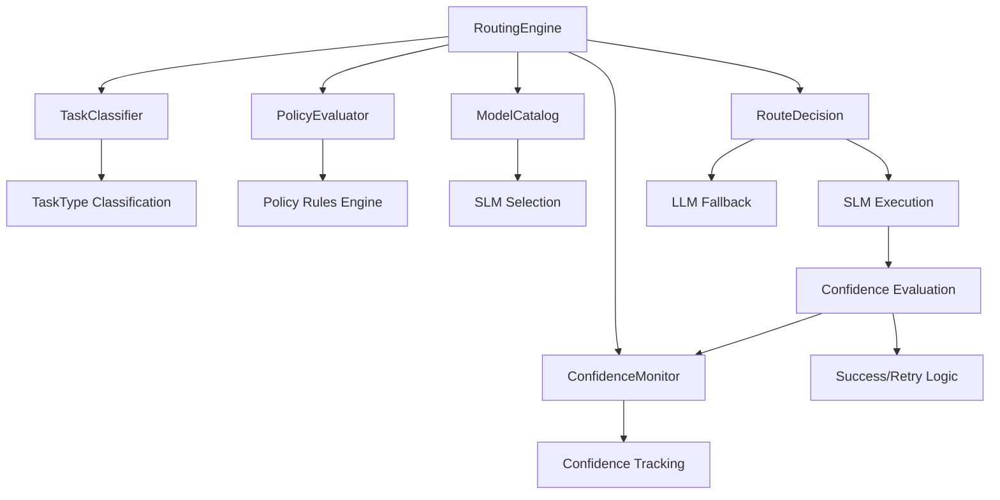
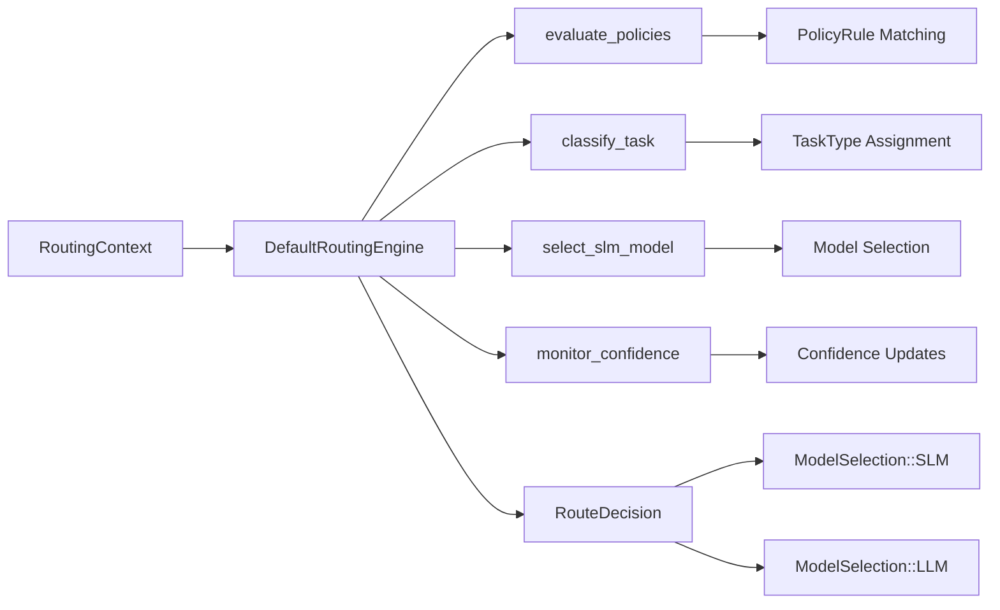

# Policy-Driven Router for SLM-First Architecture

## Overview

This document outlines the implementation of a comprehensive Policy-Driven Routing system for Symbiont's SLM-first architecture. The system intelligently routes requests between Small Language Models (SLMs) and Large Language Models (LLMs) based on configurable policies, task classification, confidence monitoring, and capability matching.

## Design Goals

1. **Intelligent Routing**: Automatic SLM-first routing with LLM fallback based on confidence and policies
2. **Policy-Driven Decisions**: Configurable rules for routing logic with multiple policy types
3. **Task Classification**: Automatic categorization of requests into task types for optimal model selection
4. **Confidence Monitoring**: Adaptive learning system that tracks model performance and confidence
5. **Thread-Safe Architecture**: Async-first design with proper concurrency handling
6. **Comprehensive Integration**: Deep integration with scheduler, tool invocation, and model catalog systems

## System Architecture

### Routing Engine Overview



### Core Components



## Implemented Rust Structures

### Core Routing Configuration

```rust
/// Routing configuration for SLM-first architecture
#[derive(Debug, Clone, serde::Serialize, serde::Deserialize)]
pub struct RoutingConfig {
    /// Enable intelligent routing
    pub enabled: bool,
    /// Global routing policies
    pub policies: Vec<PolicyRule>,
    /// Confidence thresholds for routing decisions
    pub confidence_thresholds: ConfidenceConfig,
    /// Task classification settings
    pub classification: ClassificationConfig,
    /// SLM selection preferences
    pub slm_preferences: SlmPreferences,
    /// LLM fallback configuration
    pub llm_fallback: LlmFallbackConfig,
}

/// Policy rule for routing decisions
#[derive(Debug, Clone, serde::Serialize, serde::Deserialize)]
pub struct PolicyRule {
    pub id: String,
    pub description: String,
    pub task_types: Vec<TaskType>,
    pub conditions: Vec<PolicyCondition>,
    pub action: PolicyAction,
    pub priority: u8,
}

/// Task types for intelligent routing
#[derive(Debug, Clone, PartialEq, Eq, Hash, serde::Serialize, serde::Deserialize)]
pub enum TaskType {
    Intent,
    Extract,
    Template,
    BoilerplateCode,
    CodeGeneration,
    Reasoning,
    Analysis,
    Summarization,
    Translation,
    QA,
    Custom(String),
}
```

### Routing Engine and Decision Types

```rust
/// Core routing engine trait
#[async_trait::async_trait]
pub trait RoutingEngine: Send + Sync {
    async fn route_request(&self, context: &RoutingContext) -> RoutingResult<RouteDecision>;
    async fn evaluate_confidence(&self, context: &RoutingContext, result: &ModelResponse) -> RoutingResult<f64>;
    fn update_config(&mut self, config: RoutingConfig) -> RoutingResult<()>;
}

/// Routing context for decision making
#[derive(Debug, Clone)]
pub struct RoutingContext {
    pub request_id: String,
    pub agent_id: AgentId,
    pub task_type: TaskType,
    pub content: String,
    pub metadata: HashMap<String, String>,
    pub timestamp: chrono::DateTime<chrono::Utc>,
}

/// Route decision output
#[derive(Debug, Clone)]
pub struct RouteDecision {
    pub selection: ModelSelection,
    pub confidence: f64,
    pub reasoning: String,
    pub policies_applied: Vec<String>,
    pub fallback_available: bool,
    pub metadata: HashMap<String, String>,
}

/// Model selection type
#[derive(Debug, Clone, PartialEq)]
pub enum ModelSelection {
    SLM { model_id: String, provider: String },
    LLM { provider_type: LlmProviderType },
    Skip { reason: String },
}
```

### Confidence Monitoring and Policy Engine

```rust
/// Confidence monitoring system
pub struct ConfidenceMonitor {
    confidence_history: Arc<RwLock<Vec<ConfidenceEntry>>>,
    config: ConfidenceConfig,
}

#[derive(Debug, Clone)]
pub struct ConfidenceEntry {
    pub model_id: String,
    pub task_type: TaskType,
    pub confidence: f64,
    pub actual_quality: Option<f64>,
    pub timestamp: chrono::DateTime<chrono::Utc>,
    pub metadata: HashMap<String, String>,
}

/// Policy evaluation engine
pub struct PolicyEvaluator {
    rules: Vec<PolicyRule>,
    config: PolicyConfig,
}

/// Policy conditions for rule matching
#[derive(Debug, Clone, serde::Serialize, serde::Deserialize)]
pub enum PolicyCondition {
    TaskTypeEquals(TaskType),
    TaskComplexityLevel(u8),
    ContentLengthRange { min: usize, max: usize },
    RequiredCapabilities(Vec<ModelCapability>),
    TimeOfDay { start: chrono::NaiveTime, end: chrono::NaiveTime },
    AgentIdMatches(String),
    Custom { key: String, value: String },
}

/// Policy actions for routing decisions
#[derive(Debug, Clone, serde::Serialize, serde::Deserialize)]
pub enum PolicyAction {
    PreferSLM { min_confidence: f64 },
    RequireLLM { reason: String },
    Skip { reason: String },
    Custom { action: String, parameters: HashMap<String, String> },
}
```

### Security and Validation

```rust
#[derive(Debug, Clone, Serialize, Deserialize)]
pub struct SecuritySettings {
    /// Enable additional syscall filtering
    pub strict_syscall_filtering: bool,
    /// Disable debugging interfaces
    pub disable_debugging: bool,
    /// Enable audit logging
    pub enable_audit_logging: bool,
    /// Encryption requirements
    pub require_encryption: bool,
}

impl SlmFirstConfig {
    /// Validate the SLM configuration
    pub fn validate(&self) -> Result<(), ConfigError> {
        // Validate default sandbox profile exists
        if !self.sandbox_profiles.contains_key(&self.default_sandbox_profile) {
            return Err(ConfigError::InvalidValue {
                key: "slm_first.default_sandbox_profile".to_string(),
                reason: format!("Profile '{}' not found in sandbox_profiles", 
                               self.default_sandbox_profile),
            });
        }

        // Validate model definitions have unique IDs
        let mut model_ids = std::collections::HashSet::new();
        for model in &self.model_allow_lists.global_models {
            if !model_ids.insert(&model.id) {
                return Err(ConfigError::InvalidValue {
                    key: "slm_first.model_allow_lists.global_models".to_string(),
                    reason: format!("Duplicate model ID: {}", model.id),
                });
            }
        }

        // Validate agent model mappings reference existing models
        for (agent_id, model_ids) in &self.model_allow_lists.agent_model_maps {
            for model_id in model_ids {
                if !self.model_allow_lists.global_models
                    .iter().any(|m| &m.id == model_id) {
                    return Err(ConfigError::InvalidValue {
                        key: format!("slm_first.model_allow_lists.agent_model_maps.{}", agent_id),
                        reason: format!("Model ID '{}' not found in global_models", model_id),
                    });
                }
            }
        }

        // Validate sandbox profiles
        for (profile_name, profile) in &self.sandbox_profiles {
            profile.validate()
                .map_err(|e| ConfigError::InvalidValue {
                    key: format!("slm_first.sandbox_profiles.{}", profile_name),
                    reason: e.to_string(),
                })?;
        }

        Ok(())
    }

    /// Get allowed models for a specific agent
    pub fn get_allowed_models(&self, agent_id: &str) -> Vec<&ModelDefinition> {
        // Check agent-specific mappings first
        if let Some(model_ids) = self.model_allow_lists.agent_model_maps.get(agent_id) {
            self.model_allow_lists.global_models
                .iter()
                .filter(|model| model_ids.contains(&model.id))
                .collect()
        } else {
            // Fall back to all global models if no specific mapping
            self.model_allow_lists.global_models.iter().collect()
        }
    }
}

impl SandboxProfile {
    /// Validate sandbox profile configuration
    pub fn validate(&self) -> Result<(), Box<dyn std::error::Error>> {
        // Validate resource constraints
        if self.resources.max_memory_mb == 0 {
            return Err("max_memory_mb must be > 0".into());
        }
        if self.resources.max_cpu_cores <= 0.0 {
            return Err("max_cpu_cores must be > 0".into());
        }

        // Validate filesystem paths
        for path in &self.filesystem.read_paths {
            if path.is_empty() {
                return Err("read_paths cannot contain empty strings".into());
            }
        }

        // Validate process limits
        if self.process_limits.max_execution_time_seconds == 0 {
            return Err("max_execution_time_seconds must be > 0".into());
        }

        Ok(())
    }

    /// Create a secure default profile
    pub fn secure_default() -> Self {
        Self {
            resources: ResourceConstraints {
                max_memory_mb: 512,
                max_cpu_cores: 1.0,
                max_disk_mb: 100,
                gpu_access: GpuAccess::None,
                max_io_bandwidth_mbps: Some(10),
            },
            filesystem: FilesystemControls {
                read_paths: vec!["/tmp/sandbox/*".to_string()],
                write_paths: vec!["/tmp/sandbox/output/*".to_string()],
                denied_paths: vec!["/etc/*".to_string(), "/proc/*".to_string()],
                allow_temp_files: true,
                max_file_size_mb: 10,
            },
            process_limits: ProcessLimits {
                max_child_processes: 0,
                max_execution_time_seconds: 300,
                allowed_syscalls: vec!["read".to_string(), "write".to_string(), "open".to_string()],
                process_priority: 19,
            },
            network: NetworkPolicy {
                access_mode: NetworkAccessMode::None,
                allowed_destinations: vec![],
                max_bandwidth_mbps: None,
            },
            security: SecuritySettings {
                strict_syscall_filtering: true,
                disable_debugging: true,
                enable_audit_logging: true,
                require_encryption: true,
            },
        }
    }

    /// Create a standard default profile (less restrictive)
    pub fn standard_default() -> Self {
        Self {
            resources: ResourceConstraints {
                max_memory_mb: 1024,
                max_cpu_cores: 2.0,
                max_disk_mb: 500,
                gpu_access: GpuAccess::Shared { max_memory_mb: 1024 },
                max_io_bandwidth_mbps: Some(50),
            },
            filesystem: FilesystemControls {
                read_paths: vec!["/tmp/*".to_string(), "/home/sandbox/*".to_string()],
                write_paths: vec!["/tmp/*".to_string(), "/home/sandbox/*".to_string()],
                denied_paths: vec!["/etc/passwd".to_string(), "/etc/shadow".to_string()],
                allow_temp_files: true,
                max_file_size_mb: 100,
            },
            process_limits: ProcessLimits {
                max_child_processes: 5,
                max_execution_time_seconds: 600,
                allowed_syscalls: vec![], // Empty means allow all
                process_priority: 0,
            },
            network: NetworkPolicy {
                access_mode: NetworkAccessMode::Restricted,
                allowed_destinations: vec![
                    NetworkDestination {
                        host: "api.openai.com".to_string(),
                        port: Some(443),
                        protocol: Some(NetworkProtocol::HTTPS),
                    },
                ],
                max_bandwidth_mbps: Some(100),
            },
            security: SecuritySettings {
                strict_syscall_filtering: false,
                disable_debugging: false,
                enable_audit_logging: true,
                require_encryption: false,
            },
        }
    }
}
```

## Integration with Existing Config

The SLM configuration integrates into the existing `Config` struct:

```rust
/// Updated main application configuration
#[derive(Debug, Clone, Serialize, Deserialize)]
pub struct Config {
    /// API configuration
    pub api: ApiConfig,
    /// Database configuration
    pub database: DatabaseConfig,
    /// Logging configuration
    pub logging: LoggingConfig,
    /// Security configuration
    pub security: SecurityConfig,
    /// Storage configuration
    pub storage: StorageConfig,
    /// SLM-first configuration
    pub slm_first: SlmFirstConfig,
}

impl Default for Config {
    fn default() -> Self {
        Self {
            api: ApiConfig::default(),
            database: DatabaseConfig::default(),
            logging: LoggingConfig::default(),
            security: SecurityConfig::default(),
            storage: StorageConfig::default(),
            slm_first: SlmFirstConfig::default(),
        }
    }
}

impl Config {
    /// Enhanced validation including SLM config
    pub fn validate(&self) -> Result<(), ConfigError> {
        // Existing validation...
        
        // Validate SLM configuration if enabled
        if self.slm_first.enabled {
            self.slm_first.validate()?;
        }
        
        Ok(())
    }
}
```

## Example TOML Configuration

```toml
# Example symbi.toml with SLM-first configuration

[api]
port = 8080
host = "127.0.0.1"
timeout_seconds = 60
max_body_size = 16777216

[database]
qdrant_url = "http://localhost:6333"
qdrant_collection = "agent_knowledge"
vector_dimension = 1536

[logging]
level = "info"
format = "Pretty"
structured = false

[security]
enable_compression = true
enable_backups = true
enable_safety_checks = true

[storage]
context_path = "./agent_storage"
git_clone_path = "./temp_repos"
backup_path = "./backups"
max_context_size_mb = 100

# SLM-First Configuration
[slm_first]
enabled = true
default_sandbox_profile = "secure"

# Global Model Definitions
[[slm_first.model_allow_lists.global_models]]
id = "llama2-7b"
name = "Llama 2 7B"
provider = { HuggingFace = { model_path = "meta-llama/Llama-2-7b-hf" } }
capabilities = ["TextGeneration", "Reasoning"]

[slm_first.model_allow_lists.global_models.resource_requirements]
min_memory_mb = 16384
preferred_cpu_cores = 4.0

[[slm_first.model_allow_lists.global_models]]
id = "codellama-7b"
name = "Code Llama 7B"
provider = { HuggingFace = { model_path = "codellama/CodeLlama-7b-hf" } }
capabilities = ["CodeGeneration", "TextGeneration"]

[slm_first.model_allow_lists.global_models.resource_requirements]
min_memory_mb = 16384
preferred_cpu_cores = 4.0
gpu_requirements = { min_vram_mb = 8192, compute_capability = "7.0" }

# Agent-Specific Model Mappings
[slm_first.model_allow_lists.agent_model_maps]
"security_scanner" = ["llama2-7b"]
"code_generator" = ["codellama-7b", "llama2-7b"]
"data_processor" = ["llama2-7b"]

[slm_first.model_allow_lists]
allow_runtime_overrides = false

# Sandbox Profile Definitions
[slm_first.sandbox_profiles.secure]
[slm_first.sandbox_profiles.secure.resources]
max_memory_mb = 512
max_cpu_cores = 1.0
max_disk_mb = 100
gpu_access = "None"
max_io_bandwidth_mbps = 10

[slm_first.sandbox_profiles.secure.filesystem]
read_paths = ["/tmp/sandbox/*"]
write_paths = ["/tmp/sandbox/output/*"]
denied_paths = ["/etc/*", "/proc/*", "/sys/*"]
allow_temp_files = true
max_file_size_mb = 10

[slm_first.sandbox_profiles.secure.process_limits]
max_child_processes = 0
max_execution_time_seconds = 300
allowed_syscalls = ["read", "write", "open", "close", "mmap", "munmap"]
process_priority = 19

[slm_first.sandbox_profiles.secure.network]
access_mode = "None"
allowed_destinations = []

[slm_first.sandbox_profiles.secure.security]
strict_syscall_filtering = true
disable_debugging = true
enable_audit_logging = true
require_encryption = true

# Standard Profile (Less Restrictive)
[slm_first.sandbox_profiles.standard]
[slm_first.sandbox_profiles.standard.resources]
max_memory_mb = 1024
max_cpu_cores = 2.0
max_disk_mb = 500
gpu_access = { Shared = { max_memory_mb = 1024 } }
max_io_bandwidth_mbps = 50

[slm_first.sandbox_profiles.standard.filesystem]
read_paths = ["/tmp/*", "/home/sandbox/*"]
write_paths = ["/tmp/*", "/home/sandbox/*"]
denied_paths = ["/etc/passwd", "/etc/shadow"]
allow_temp_files = true
max_file_size_mb = 100

[slm_first.sandbox_profiles.standard.process_limits]
max_child_processes = 5
max_execution_time_seconds = 600
allowed_syscalls = []  # Empty means allow all
process_priority = 0

[slm_first.sandbox_profiles.standard.network]
access_mode = "Restricted"
max_bandwidth_mbps = 100

[[slm_first.sandbox_profiles.standard.network.allowed_destinations]]
host = "api.openai.com"
port = 443
protocol = "HTTPS"

[[slm_first.sandbox_profiles.standard.network.allowed_destinations]]
host = "huggingface.co"
port = 443
protocol = "HTTPS"

[slm_first.sandbox_profiles.standard.security]
strict_syscall_filtering = false
disable_debugging = false
enable_audit_logging = true
require_encryption = false
```

## Design Rationale

### 1. Hierarchical Model Allow Lists

**Problem**: Different agents need access to different models based on their function and security requirements.

**Solution**: Three-tier hierarchy:
- **Global Models**: System-wide model definitions with capabilities and requirements
- **Agent-Specific Mappings**: Per-agent model access control
- **Runtime Overrides**: Optional API-based dynamic reconfiguration

**Benefits**:
- Centralized model management
- Granular access control
- Operational flexibility
- Clear audit trail

### 2. Comprehensive Sandbox Profiles

**Problem**: SLM runners need strict resource and security constraints to prevent abuse.

**Solution**: Named profiles with full resource, filesystem, process, and network controls.

**Benefits**:
- Reusable security configurations
- Defense in depth
- Resource predictability
- Clear security boundaries

### 3. Configuration Integration

**Problem**: New features must integrate seamlessly with existing configuration patterns.

**Solution**: Follow established patterns:
- Serde-based serialization
- Environment variable overrides
- Validation with descriptive errors
- Secure handling of sensitive data

**Benefits**:
- Consistent developer experience
- Backward compatibility
- Operational familiarity
- Maintainability

## Environment Variable Overrides

The configuration supports environment variable overrides following the existing pattern:

```bash
# Enable SLM-first mode
export SLM_FIRST_ENABLED=true

# Override default sandbox profile
export SLM_FIRST_DEFAULT_SANDBOX_PROFILE=standard

# Runtime override capability
export SLM_FIRST_ALLOW_RUNTIME_OVERRIDES=true
```

## Implementation Considerations

1. **Performance**: Model loading and sandbox creation should be lazy-loaded
2. **Security**: All filesystem paths should be canonicalized and validated
3. **Monitoring**: Resource usage should be tracked and reported
4. **Extensibility**: New model providers and sandbox features should be easy to add
5. **Testing**: Comprehensive unit tests for validation logic and edge cases

## Migration Path

1. Add `SlmFirstConfig` to existing `Config` struct with default disabled
2. Implement validation logic with comprehensive error messages
3. Add environment variable support
4. Create example configurations and documentation
5. Implement runtime API endpoints for dynamic configuration
6. Add monitoring and logging for SLM operations

This design provides a robust, secure, and extensible foundation for SLM-first capabilities in Symbiont while maintaining consistency with existing patterns and practices.