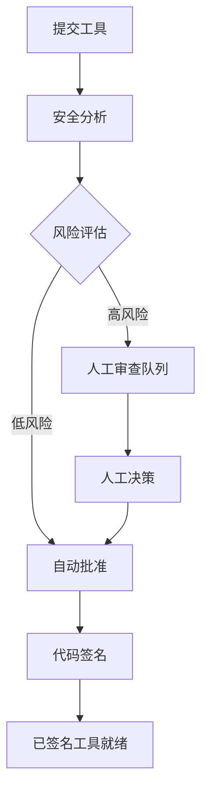

# API 参考

本文档为 Symbiont 运行时 API 提供全面的文档。Symbiont 项目提供两个针对不同用例和开发阶段设计的独立 API 系统。

## 概述

Symbiont 提供两个 API 接口：

1. **运行时 HTTP API** - 完整的 API，用于直接运行时交互、智能体管理和工作流执行
2. **工具审查 API（生产环境）** - 全面的、生产就绪的 AI 驱动工具审查和签名工作流 API

---

## 运行时 HTTP API

运行时 HTTP API 提供对 Symbiont 运行时的直接访问，用于工作流执行、智能体管理和系统监控。当启用 `http-api` 特性时，所有端点均已完全实现并可用于生产环境。

### 基础 URL
```
http://127.0.0.1:8080/api/v1
```

### 身份验证

智能体管理端点需要 Bearer 令牌认证。请设置 `API_AUTH_TOKEN` 环境变量，并在 Authorization 头中包含令牌：

```
Authorization: Bearer <your-token>
```

**受保护端点：**
- 所有 `/api/v1/agents/*` 端点需要认证
- `/api/v1/health`、`/api/v1/workflows/execute` 和 `/api/v1/metrics` 端点不需要认证

### 可用端点

#### 健康检查
```http
GET /api/v1/health
```

返回当前系统健康状态和基本运行时信息。

**响应（200 OK）：**
```json
{
  "status": "healthy",
  "uptime_seconds": 3600,
  "timestamp": "2024-01-15T10:30:00Z",
  "version": "1.0.0"
}
```

**响应（500 内部服务器错误）：**
```json
{
  "status": "unhealthy",
  "error": "Database connection failed",
  "timestamp": "2024-01-15T10:30:00Z"
}
```

### 可用端点

#### 工作流执行
```http
POST /api/v1/workflows/execute
```

使用指定参数执行工作流。

**请求体：**
```json
{
  "workflow_id": "string",
  "parameters": {},
  "agent_id": "optional-agent-id"
}
```

**响应（200 OK）：**
```json
{
  "result": "workflow execution result"
}
```

#### 智能体管理

所有智能体管理端点需要通过 `Authorization: Bearer <token>` 头进行认证。

##### 列出智能体
```http
GET /api/v1/agents
Authorization: Bearer <your-token>
```

检索运行时中所有活跃智能体的列表。

**响应（200 OK）：**
```json
[
  "agent-id-1",
  "agent-id-2",
  "agent-id-3"
]
```

##### 获取智能体状态
```http
GET /api/v1/agents/{id}/status
Authorization: Bearer <your-token>
```

获取特定智能体的详细状态信息，包括实时执行指标。

**响应（200 OK）：**
```json
{
  "agent_id": "uuid",
  "state": "running|ready|waiting|failed|completed|terminated",
  "last_activity": "2024-01-15T10:30:00Z",
  "scheduled_at": "2024-01-15T10:00:00Z",
  "resource_usage": {
    "memory_usage": 268435456,
    "cpu_usage": 15.5,
    "active_tasks": 1
  },
  "execution_context": {
    "execution_mode": "ephemeral|persistent|scheduled|event_driven",
    "process_id": 12345,
    "uptime": "00:15:30",
    "health_status": "healthy|unhealthy"
  }
}
```

**新的智能体状态：**
- `running`：智能体正在活跃执行，有运行中的进程
- `ready`：智能体已初始化并准备就绪
- `waiting`：智能体在执行队列中等待
- `failed`：智能体执行失败或健康检查失败
- `completed`：智能体任务成功完成
- `terminated`：智能体已被优雅关闭或强制终止

##### 创建智能体
```http
POST /api/v1/agents
Authorization: Bearer <your-token>
```

使用提供的配置创建新智能体。

**请求体：**
```json
{
  "name": "my-agent",
  "dsl": "agent definition in DSL format"
}
```

**响应（200 OK）：**
```json
{
  "id": "uuid",
  "status": "created"
}
```

##### 更新智能体
```http
PUT /api/v1/agents/{id}
Authorization: Bearer <your-token>
```

更新现有智能体的配置。至少需要提供一个字段。

**请求体：**
```json
{
  "name": "updated-agent-name",
  "dsl": "updated agent definition in DSL format"
}
```

**响应（200 OK）：**
```json
{
  "id": "uuid",
  "status": "updated"
}
```

##### 删除智能体
```http
DELETE /api/v1/agents/{id}
Authorization: Bearer <your-token>
```

从运行时中删除现有智能体。

**响应（200 OK）：**
```json
{
  "id": "uuid",
  "status": "deleted"
}
```

##### 执行智能体
```http
POST /api/v1/agents/{id}/execute
Authorization: Bearer <your-token>
```

触发特定智能体的执行。

**请求体：**
```json
{}
```

**响应（200 OK）：**
```json
{
  "execution_id": "uuid",
  "status": "execution_started"
}
```

##### 获取智能体执行历史
```http
GET /api/v1/agents/{id}/history
Authorization: Bearer <your-token>
```

检索特定智能体的执行历史。

**响应（200 OK）：**
```json
{
  "history": [
    {
      "execution_id": "uuid",
      "status": "completed",
      "timestamp": "2024-01-15T10:30:00Z"
    }
  ]
}
```

##### 智能体心跳
```http
POST /api/v1/agents/{id}/heartbeat
Authorization: Bearer <your-token>
```

从运行中的智能体发送心跳以更新其健康状态。

##### 推送事件到智能体
```http
POST /api/v1/agents/{id}/events
Authorization: Bearer <your-token>
```

推送外部事件到运行中的智能体，用于事件驱动执行。

#### 系统指标
```http
GET /api/v1/metrics
```

检索涵盖调度器、任务管理器、负载均衡器和系统资源的全面指标快照。

**响应（200 OK）：**
```json
{
  "timestamp": "2026-02-16T12:00:00Z",
  "scheduler": {
    "total_jobs": 12,
    "active_jobs": 8,
    "paused_jobs": 2,
    "failed_jobs": 1,
    "total_runs": 450,
    "successful_runs": 445,
    "dead_letter_count": 2
  },
  "task_manager": {
    "queued_tasks": 3,
    "running_tasks": 5,
    "completed_tasks": 1200,
    "failed_tasks": 15
  },
  "load_balancer": {
    "total_workers": 4,
    "active_workers": 3,
    "requests_per_second": 12.5
  },
  "system": {
    "cpu_usage_percent": 45.2,
    "memory_usage_bytes": 536870912,
    "memory_total_bytes": 17179869184,
    "uptime_seconds": 3600
  }
}
```

指标快照还可以使用运行时的 `MetricsExporter` 系统导出到文件（原子 JSON 写入）或 OTLP 端点。参见下方的[指标与遥测](#指标与遥测)部分。

---

### 指标与遥测

Symbiont 支持将运行时指标导出到多个后端：

#### 文件导出器

将指标快照写入原子 JSON 文件（临时文件 + 重命名）：

```rust
use symbi_runtime::metrics::{FileMetricsExporter, MetricsExporterConfig};

let exporter = FileMetricsExporter::new("/var/lib/symbi/metrics.json");
exporter.export(&snapshot)?;
```

#### OTLP 导出器

将指标发送到任何 OpenTelemetry 兼容端点（需要 `metrics` 特性）：

```rust
use symbi_runtime::metrics::{OtlpExporter, OtlpExporterConfig, OtlpProtocol};

let config = OtlpExporterConfig {
    endpoint: "http://localhost:4317".to_string(),
    protocol: OtlpProtocol::Grpc,
    ..Default::default()
};
```

#### 复合导出器

同时扇出到多个后端——单个导出失败会被记录但不会阻塞其他导出器：

```rust
use symbi_runtime::metrics::CompositeExporter;

let composite = CompositeExporter::new(vec![
    Box::new(file_exporter),
    Box::new(otlp_exporter),
]);
```

#### 后台收集

`MetricsCollector` 作为后台线程运行，定期收集快照并导出：

```rust
use symbi_runtime::metrics::MetricsCollector;

let collector = MetricsCollector::new(exporter, interval);
collector.start();
// ... 稍后 ...
collector.stop();
```

---

### 技能扫描（ClawHavoc）

`SkillScanner` 在加载前检查智能体技能内容中的恶意模式。它内置了 **40 条 ClawHavoc 防御规则**，覆盖 10 个攻击类别：

| 类别 | 数量 | 严重性 | 示例 |
|------|------|--------|------|
| 原始防御规则 | 10 | 严重/警告 | `pipe-to-shell`、`eval-with-fetch`、`rm-rf-pattern` |
| 反向 shell | 7 | 严重 | bash、nc、ncat、mkfifo、python、perl、ruby |
| 凭据窃取 | 6 | 高 | SSH 密钥、AWS 凭据、云配置、浏览器 cookie、钥匙串 |
| 网络外泄 | 3 | 高 | DNS 隧道、`/dev/tcp`、netcat 出站 |
| 进程注入 | 4 | 严重 | ptrace、LD_PRELOAD、`/proc/mem`、gdb attach |
| 权限提升 | 5 | 高 | sudo、setuid、setcap、chown root、nsenter |
| 符号链接/路径遍历 | 2 | 中等 | 符号链接逃逸、深层路径遍历 |
| 下载链 | 3 | 中等 | curl 保存、wget 保存、chmod 执行 |

请参阅[安全模型](/security-model#clawhavoc-skill-scanner)获取完整的规则列表和严重性模型。

#### 使用方法

```rust
use symbi_runtime::skills::SkillScanner;

let scanner = SkillScanner::new(); // 包含所有 40 条默认规则
let result = scanner.scan_skill("/path/to/skill/");

if !result.passed {
    for finding in &result.findings {
        eprintln!("[{}] {}: {} (line {})",
            finding.severity, finding.rule, finding.message, finding.line);
    }
}
```

可以在默认规则基础上添加自定义拒绝模式：

```rust
let scanner = SkillScanner::with_custom_rules(vec![
    ("custom-pattern".into(), r"my_dangerous_pattern".into(),
     ScanSeverity::Warning, "Custom rule description".into()),
]);
```

### 服务器配置

运行时 HTTP API 服务器可以使用以下选项进行配置：

- **默认绑定地址**：`127.0.0.1:8080`
- **CORS 支持**：可为开发配置
- **请求跟踪**：通过 Tower 中间件启用
- **特性门控**：在 `http-api` Cargo 特性后可用

---

### 特性配置参考

#### 云端 LLM 推理（`cloud-llm`）

通过 OpenRouter 连接到云端 LLM 提供商，用于智能体推理：

```bash
cargo build --features cloud-llm
```

**环境变量：**
- `OPENROUTER_API_KEY` — 您的 OpenRouter API 密钥（必需）
- `OPENROUTER_MODEL` — 使用的模型（默认：`google/gemini-2.0-flash-001`）

云端 LLM 提供商与推理循环的 `execute_actions()` 管线集成。它支持流式响应、指数退避自动重试和 token 使用量跟踪。

#### 独立智能体模式（`standalone-agent`）

将云端 LLM 推理与 Composio 工具访问结合，用于云原生智能体：

```bash
cargo build --features standalone-agent
# 启用：cloud-llm + composio
```

**环境变量：**
- `OPENROUTER_API_KEY` — OpenRouter API 密钥
- `COMPOSIO_API_KEY` — Composio API 密钥
- `COMPOSIO_MCP_URL` — Composio MCP 服务器 URL

#### Cedar 策略引擎（`cedar`）

使用 [Cedar 策略语言](https://www.cedarpolicy.com/)进行正式授权：

```bash
cargo build --features cedar
```

Cedar 策略与推理循环的 Gate 阶段集成，提供细粒度的授权决策。请参阅[安全模型](/security-model#cedar-policy-engine)获取策略示例。

#### 向量数据库配置

Symbiont 默认使用 **LanceDB** 作为嵌入式向量后端——无需外部服务。对于扩展部署，Qdrant 可作为可选后端使用。

**LanceDB（默认）：**
```toml
[vector_db]
enabled = true
backend = "lancedb"
collection_name = "symbi_knowledge"
```

无需额外配置。数据存储在运行时本地。

**Qdrant（可选）：**
```bash
cargo build --features vector-qdrant
```

```toml
[vector_db]
enabled = true
backend = "qdrant"
collection_name = "symbi_knowledge"
url = "http://localhost:6333"
```

**环境变量：**
- `SYMBIONT_VECTOR_BACKEND` — `lancedb`（默认）或 `qdrant`
- `QDRANT_URL` — Qdrant 服务器 URL（仅在使用 Qdrant 时需要）

#### 高级推理原语（`orga-adaptive`）

启用工具筛选、卡住循环检测、上下文预获取和范围约定：

```bash
cargo build --features orga-adaptive
```

请参阅 [orga-adaptive 指南](/orga-adaptive) 获取完整的配置参考。

---

### 数据结构

#### 核心类型
```rust
// 工作流执行请求
WorkflowExecutionRequest {
    workflow_id: String,
    parameters: serde_json::Value,
    agent_id: Option<AgentId>
}

// 智能体状态响应
AgentStatusResponse {
    agent_id: AgentId,
    state: AgentState,
    last_activity: DateTime<Utc>,
    resource_usage: ResourceUsage
}

// 健康检查响应
HealthResponse {
    status: String,
    uptime_seconds: u64,
    timestamp: DateTime<Utc>,
    version: String
}

// 创建智能体请求
CreateAgentRequest {
    name: String,
    dsl: String
}

// 创建智能体响应
CreateAgentResponse {
    id: String,
    status: String
}

// 更新智能体请求
UpdateAgentRequest {
    name: Option<String>,
    dsl: Option<String>
}

// 更新智能体响应
UpdateAgentResponse {
    id: String,
    status: String
}

// 删除智能体响应
DeleteAgentResponse {
    id: String,
    status: String
}

// 执行智能体请求
ExecuteAgentRequest {
    // 当前为空结构体
}

// 执行智能体响应
ExecuteAgentResponse {
    execution_id: String,
    status: String
}

// 智能体执行记录
AgentExecutionRecord {
    execution_id: String,
    status: String,
    timestamp: String
}

// 智能体执行历史响应
GetAgentHistoryResponse {
    history: Vec<AgentExecutionRecord>
}
```

### 运行时提供者接口

API 实现了一个具有以下增强方法的 `RuntimeApiProvider` trait：

- `execute_workflow()` - 使用给定参数执行工作流
- `get_agent_status()` - 检索带实时执行指标的详细状态
- `get_system_health()` - 获取带调度器统计的整体系统健康状态
- `list_agents()` - 列出所有智能体（运行中、排队中和已完成）
- `shutdown_agent()` - 优雅关闭，支持资源清理和超时处理
- `get_metrics()` - 检索包含任务统计的全面系统指标
- `create_agent()` - 创建智能体，支持执行模式指定
- `update_agent()` - 更新智能体配置并持久化
- `delete_agent()` - 删除智能体，正确清理运行中的进程
- `execute_agent()` - 触发执行，支持监控和健康检查
- `get_agent_history()` - 检索带性能指标的详细执行历史

#### 调度 API

所有调度端点需要认证。需要 `cron` 特性。

##### 列出调度
```http
GET /api/v1/schedules
Authorization: Bearer <your-token>
```

**响应（200 OK）：**
```json
[
  {
    "job_id": "uuid",
    "name": "daily-report",
    "cron_expression": "0 0 9 * * *",
    "timezone": "America/New_York",
    "status": "active",
    "enabled": true,
    "next_run": "2026-03-04T09:00:00Z",
    "run_count": 42
  }
]
```

##### 创建调度
```http
POST /api/v1/schedules
Authorization: Bearer <your-token>
```

**请求体：**
```json
{
  "name": "daily-report",
  "cron_expression": "0 0 9 * * *",
  "timezone": "America/New_York",
  "agent_name": "report-agent",
  "policy_ids": ["policy-1"],
  "one_shot": false
}
```

`cron_expression` 使用六个字段：`sec min hour day month weekday`（可选第七个字段为年份）。

**响应（200 OK）：**
```json
{
  "job_id": "uuid",
  "next_run": "2026-03-04T09:00:00Z",
  "status": "created"
}
```

##### 更新调度
```http
PUT /api/v1/schedules/{id}
Authorization: Bearer <your-token>
```

**请求体（所有字段可选）：**
```json
{
  "cron_expression": "0 */10 * * * *",
  "timezone": "UTC",
  "policy_ids": ["policy-2"],
  "one_shot": true
}
```

##### 暂停 / 恢复 / 触发调度
```http
POST /api/v1/schedules/{id}/pause
POST /api/v1/schedules/{id}/resume
POST /api/v1/schedules/{id}/trigger
Authorization: Bearer <your-token>
```

**响应（200 OK）：**
```json
{
  "job_id": "uuid",
  "action": "paused",
  "status": "ok"
}
```

##### 删除调度
```http
DELETE /api/v1/schedules/{id}
Authorization: Bearer <your-token>
```

**响应（200 OK）：**
```json
{
  "job_id": "uuid",
  "deleted": true
}
```

##### 获取调度历史
```http
GET /api/v1/schedules/{id}/history
Authorization: Bearer <your-token>
```

**响应（200 OK）：**
```json
{
  "job_id": "uuid",
  "history": [
    {
      "run_id": "uuid",
      "started_at": "2026-03-03T09:00:00Z",
      "completed_at": "2026-03-03T09:01:23Z",
      "status": "completed",
      "error": null,
      "execution_time_ms": 83000
    }
  ]
}
```

##### 获取下次运行
```http
GET /api/v1/schedules/{id}/next?count=5
Authorization: Bearer <your-token>
```

**响应（200 OK）：**
```json
{
  "job_id": "uuid",
  "next_runs": [
    "2026-03-04T09:00:00Z",
    "2026-03-05T09:00:00Z"
  ]
}
```

##### 调度器健康状态
```http
GET /api/v1/health/scheduler
```

返回调度器特定的健康状态和统计信息。

---

#### 通道适配器 API

所有通道端点需要认证。将智能体连接到 Slack、Microsoft Teams 和 Mattermost。

##### 列出通道
```http
GET /api/v1/channels
Authorization: Bearer <your-token>
```

**响应（200 OK）：**
```json
[
  {
    "id": "uuid",
    "name": "slack-general",
    "platform": "slack",
    "status": "running"
  }
]
```

##### 注册通道
```http
POST /api/v1/channels
Authorization: Bearer <your-token>
```

**请求体：**
```json
{
  "name": "slack-general",
  "platform": "slack",
  "config": {
    "webhook_url": "https://hooks.slack.com/...",
    "channel": "#general"
  }
}
```

支持的平台：`slack`、`teams`、`mattermost`。

**响应（200 OK）：**
```json
{
  "id": "uuid",
  "name": "slack-general",
  "platform": "slack",
  "status": "registered"
}
```

##### 获取 / 更新 / 删除通道
```http
GET    /api/v1/channels/{id}
PUT    /api/v1/channels/{id}
DELETE /api/v1/channels/{id}
Authorization: Bearer <your-token>
```

##### 启动 / 停止通道
```http
POST /api/v1/channels/{id}/start
POST /api/v1/channels/{id}/stop
Authorization: Bearer <your-token>
```

**响应（200 OK）：**
```json
{
  "id": "uuid",
  "action": "started",
  "status": "ok"
}
```

##### 通道健康状态
```http
GET /api/v1/channels/{id}/health
Authorization: Bearer <your-token>
```

**响应（200 OK）：**
```json
{
  "id": "uuid",
  "connected": true,
  "platform": "slack",
  "workspace_name": "my-team",
  "channels_active": 3,
  "last_message_at": "2026-03-03T15:42:00Z",
  "uptime_secs": 86400
}
```

##### 身份映射
```http
GET  /api/v1/channels/{id}/mappings
POST /api/v1/channels/{id}/mappings
Authorization: Bearer <your-token>
```

将平台用户映射到 Symbiont 身份，用于智能体交互。

##### 通道审计日志
```http
GET /api/v1/channels/{id}/audit
Authorization: Bearer <your-token>
```

---

### 调度器功能

**实际任务执行：**
- 带安全执行环境的进程生成
- 5 秒间隔的资源监控（内存、CPU）
- 健康检查和自动故障检测
- 支持临时、持久、定时和事件驱动执行模式

**优雅关闭：**
- 30 秒优雅终止期限
- 对无响应进程的强制终止
- 资源清理和指标持久化
- 队列清理和状态同步

### 增强的上下文管理

**高级搜索功能：**
```json
{
  "query_type": "keyword|temporal|similarity|hybrid",
  "search_terms": ["term1", "term2"],
  "time_range": {
    "start": "2024-01-01T00:00:00Z",
    "end": "2024-01-31T23:59:59Z"
  },
  "memory_types": ["factual", "procedural", "episodic"],
  "relevance_threshold": 0.7,
  "max_results": 10
}
```

**重要性计算：**
- 多因素评分，考虑访问频率、时效性和用户反馈
- 记忆类型权重和时间衰减因子
- 共享知识的信任评分计算

**访问控制集成：**
- 策略引擎与上下文操作连接
- 带安全边界的智能体范围访问
- 带细粒度权限的知识共享

---

## 工具审查 API（生产环境）

工具审查 API 提供了一个完整的工作流，用于安全地审查、分析和签名 MCP（模型上下文协议）工具，使用 AI 驱动的安全分析和人工监督功能。

### 基础 URL
```
https://your-symbiont-instance.com/api/v1
```

### 身份验证
所有端点都需要 Bearer JWT 身份验证：
```
Authorization: Bearer <your-jwt-token>
```

### 核心工作流

工具审查 API 遵循以下请求/响应流程：



### 端点

#### 审查会话

##### 提交工具进行审查
```http
POST /sessions
```

提交 MCP 工具进行安全审查和分析。

**请求体：**
```json
{
  "tool_name": "string",
  "tool_version": "string",
  "source_code": "string",
  "metadata": {
    "description": "string",
    "author": "string",
    "permissions": ["array", "of", "permissions"]
  }
}
```

**响应：**
```json
{
  "review_id": "uuid",
  "status": "submitted",
  "created_at": "2024-01-15T10:30:00Z"
}
```

##### 列出审查会话
```http
GET /sessions
```

检索带有可选过滤的分页审查会话列表。

**查询参数：**
- `page` (integer)：分页的页码
- `limit` (integer)：每页项目数
- `status` (string)：按审查状态过滤
- `author` (string)：按工具作者过滤

**响应：**
```json
{
  "sessions": [
    {
      "review_id": "uuid",
      "tool_name": "string",
      "status": "string",
      "created_at": "2024-01-15T10:30:00Z",
      "updated_at": "2024-01-15T11:00:00Z"
    }
  ],
  "pagination": {
    "page": 1,
    "limit": 20,
    "total": 100,
    "has_next": true
  }
}
```

##### 获取审查会话详情
```http
GET /sessions/{reviewId}
```

检索特定审查会话的详细信息。

**响应：**
```json
{
  "review_id": "uuid",
  "tool_name": "string",
  "tool_version": "string",
  "status": "string",
  "analysis_results": {
    "risk_score": 85,
    "findings": ["array", "of", "security", "findings"],
    "recommendations": ["array", "of", "recommendations"]
  },
  "created_at": "2024-01-15T10:30:00Z",
  "updated_at": "2024-01-15T11:00:00Z"
}
```

#### 安全分析

##### 获取分析结果
```http
GET /analysis/{analysisId}
```

检索特定分析的详细安全分析结果。

**响应：**
```json
{
  "analysis_id": "uuid",
  "review_id": "uuid",
  "risk_score": 85,
  "analysis_type": "automated",
  "findings": [
    {
      "severity": "high",
      "category": "code_injection",
      "description": "Potential code injection vulnerability detected",
      "location": "line 42",
      "recommendation": "Sanitize user input before execution"
    }
  ],
  "rag_insights": [
    {
      "knowledge_source": "security_kb",
      "relevance_score": 0.95,
      "insight": "Similar patterns found in known vulnerabilities"
    }
  ],
  "completed_at": "2024-01-15T10:45:00Z"
}
```

#### 人工审查工作流

##### 获取审查队列
```http
GET /review/queue
```

检索等待人工审查的项目，通常是需要手动检查的高风险工具。

**响应：**
```json
{
  "pending_reviews": [
    {
      "review_id": "uuid",
      "tool_name": "string",
      "risk_score": 92,
      "priority": "high",
      "assigned_to": "reviewer@example.com",
      "escalated_at": "2024-01-15T11:00:00Z"
    }
  ],
  "queue_stats": {
    "total_pending": 5,
    "high_priority": 2,
    "average_wait_time": "2h 30m"
  }
}
```

##### 提交审查决策
```http
POST /review/{reviewId}/decision
```

提交人工审查员对工具审查的决策。

**请求体：**
```json
{
  "decision": "approve|reject|request_changes",
  "comments": "Detailed review comments",
  "conditions": ["array", "of", "approval", "conditions"],
  "reviewer_id": "reviewer@example.com"
}
```

**响应：**
```json
{
  "review_id": "uuid",
  "decision": "approve",
  "processed_at": "2024-01-15T12:00:00Z",
  "next_status": "approved_for_signing"
}
```

#### 工具签名

##### 获取签名状态
```http
GET /signing/{reviewId}
```

检索已审查工具的签名状态和签名信息。

**响应：**
```json
{
  "review_id": "uuid",
  "signing_status": "completed",
  "signature_info": {
    "algorithm": "RSA-SHA256",
    "key_id": "signing-key-001",
    "signature": "base64-encoded-signature",
    "signed_at": "2024-01-15T12:30:00Z"
  },
  "certificate_chain": ["array", "of", "certificates"]
}
```

##### 下载已签名工具
```http
GET /signing/{reviewId}/download
```

下载带有嵌入签名和验证元数据的已签名工具包。

**响应：**
已签名工具包的二进制下载。

#### 统计与监控

##### 获取工作流统计
```http
GET /stats
```

检索关于审查工作流的全面统计和指标。

**响应：**
```json
{
  "workflow_stats": {
    "total_reviews": 1250,
    "approved": 1100,
    "rejected": 125,
    "pending": 25
  },
  "performance_metrics": {
    "average_review_time": "45m",
    "auto_approval_rate": 0.78,
    "human_review_rate": 0.22
  },
  "security_insights": {
    "common_vulnerabilities": ["sql_injection", "xss", "code_injection"],
    "risk_score_distribution": {
      "low": 45,
      "medium": 35,
      "high": 20
    }
  }
}
```

### 速率限制

工具审查 API 对每种端点类型实施速率限制：

- **提交端点**：每分钟 10 个请求
- **查询端点**：每分钟 100 个请求
- **下载端点**：每分钟 20 个请求

所有响应中都包含速率限制头：
```
X-RateLimit-Limit: 100
X-RateLimit-Remaining: 95
X-RateLimit-Reset: 1642248000
```

### 错误处理

API 使用标准 HTTP 状态码并返回详细的错误信息：

```json
{
  "error": {
    "code": "INVALID_REQUEST",
    "message": "Tool source code is required",
    "details": {
      "field": "source_code",
      "reason": "missing_required_field"
    }
  }
}
```


---

## CLI 子命令

除了长期运行的 HTTP 接口之外，`symbi` 还提供若干仅限 CLI 的子命令用于一次性操作。完整目录见 `symbi --help`；与集成和策略执行最相关的命令如下：

### `symbi schemapin`

用于 MCP 服务器配置的 TOFU（首次使用即信任）完整性固定。设计用于从 SessionStart 钩子调用，以便 MCP 服务器的配置哈希在会话之间不会在运维人员未批准的情况下静默变化。

```bash
# 校验 .mcp.json 中一个或全部 MCP 服务器的已固定哈希
symbi schemapin verify [--mcp-server <NAME>] [--config <PATH>]

# 固定某个服务器当前的配置哈希
symbi schemapin pin --mcp-server <NAME> [--config <PATH>] [--force]

# 列出 ~/.symbiont/schemapin/mcp/ 下所有已固定的服务器
symbi schemapin list

# 移除某条固定记录
symbi schemapin unpin --mcp-server <NAME>
```

固定记录以 JSON 形式存储在 `~/.symbiont/schemapin/mcp/` 下。`verify` 在匹配时以 0 退出，不匹配或缺失固定时以非零退出 —— 适合在会话前置脚本中使用。

### `symbi policy`

针对工具调用事件执行 Cedar 策略评估。以 JSON 形式读取单个事件，针对策略目录作出 `allow` / `deny` 决定，并以适合脚本化使用的状态码退出。

```bash
# 评估从标准输入读取的事件
echo '{"principal":"Agent::\"dev\"", "action":"write", "resource":{...}}' \
  | symbi policy evaluate --stdin --policies ./policies

# 评估从文件读取的事件
symbi policy evaluate --input event.json --policies ./policies

# 仅输出结构化 JSON（适合程序化使用）
symbi policy evaluate --stdin --policies ./policies --json
```

默认输出为 stdout 上的裸结论，结构化详情输出到 stderr；传入 `--json` 可将全部内容折叠到 stdout JSON。这与运行时内联使用的 Cedar 决策逻辑相同 —— 适用于在 CI 中左移策略测试，以及在运行时之外调试拒绝决定。

### `symbi agents-md`

从当前的 `agents/*.dsl` 文件重新生成 `AGENTS.md`。在 `symbi init` 期间会自动运行；在添加或编辑智能体定义后可手动调用。

```bash
symbi agents-md generate --dir . --output AGENTS.md
```

## 入门指南

### 运行时 HTTP API

1. 确保运行时是使用 `http-api` 特性构建的：
   ```bash
   cargo build --features http-api
   ```

2. 设置智能体端点的认证令牌：
   ```bash
   export API_AUTH_TOKEN="<your-token>"
   ```

3. 启动运行时服务器：
   ```bash
   ./target/debug/symbiont-runtime --http-api
   ```

4. 验证服务器正在运行：
   ```bash
   curl http://127.0.0.1:8080/api/v1/health
   ```

5. 测试已认证的智能体端点：
   ```bash
   curl -H "Authorization: Bearer $API_AUTH_TOKEN" \
        http://127.0.0.1:8080/api/v1/agents
   ```

### 工具审查 API

1. 从您的 Symbiont 管理员处获取 API 凭据
2. 使用 `/sessions` 端点提交工具进行审查
3. 通过 `/sessions/{reviewId}` 监控审查进度
4. 从 `/signing/{reviewId}/download` 下载已签名工具

## 支持

获取 API 支持和问题：
- 查看[运行时架构文档](runtime-architecture.md)
- 查看[安全模型文档](security-model.md)
- 在项目的 GitHub 仓库中提交问题
