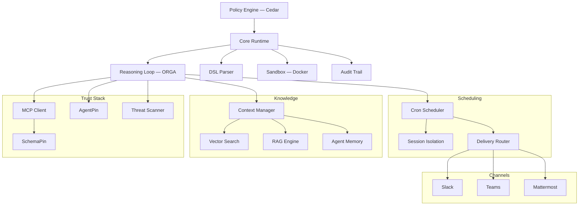

# Symbiont 文档

策略治理的智能体运行时，面向生产环境。在明确的策略、身份和审计控制下执行 AI 智能体和工具。

## 什么是 Symbiont？

Symbiont 是一个 Rust 原生运行时，用于在明确的策略、身份和审计控制下执行 AI 智能体和工具。

大多数智能体框架关注编排。Symbiont 关注的是智能体在具有真实风险的环境中运行时会发生什么：不受信任的工具、敏感数据、审批边界、审计需求和可重复的执行。

### 工作原理

Symbiont 将智能体意图与执行权限分离：

1. **智能体提议**通过推理循环（Observe-Reason-Gate-Act）发起操作
2. **运行时评估**每个操作的策略、身份和信任检查
3. **策略决定** — 允许的操作执行；拒绝的操作被阻止或转交审批
4. **所有操作都被记录** — 每个决策的防篡改审计轨迹

模型输出永远不被视为执行权限。运行时控制实际发生的事情。

### 核心能力

| 能力 | 功能说明 |
|-----------|-------------|
| **策略引擎** | 使用 [Cedar](https://www.cedarpolicy.com/) 对智能体操作、工具调用和资源访问进行细粒度授权 |
| **工具验证** | 执行前通过 [SchemaPin](https://schemapin.org) 对 MCP 工具模式进行密码学验证 |
| **智能体身份** | 通过 [AgentPin](https://agentpin.org) 为智能体和计划任务提供域锚定的 ES256 身份 |
| **推理循环** | 类型状态强制的 Observe-Reason-Gate-Act 循环，带策略门控和断路器 |
| **沙箱** | 基于 Docker 的隔离，对不受信任的工作负载设置资源限制 |
| **审计日志** | 每个策略决策的防篡改日志和结构化记录 |
| **密钥管理** | Vault/OpenBao 集成，AES-256-GCM 加密存储，按智能体隔离 |
| **MCP 集成** | 原生 Model Context Protocol 支持，带治理工具访问 |

附加能力：工具/技能内容的威胁扫描、cron 调度、持久智能体记忆、混合 RAG 搜索（LanceDB/Qdrant）、webhook 验证、投递路由、OTLP 遥测、HTTP 安全加固、通道适配器（Slack/Teams/Mattermost），以及 [Claude Code](https://github.com/thirdkeyai/symbi-claude-code) 和 [Gemini CLI](https://github.com/thirdkeyai/symbi-gemini-cli) 的治理插件。

---

## 快速开始

### 安装

**安装脚本（macOS / Linux）：**
```bash
curl -fsSL https://symbiont.dev/install.sh | bash
```

**Homebrew（macOS）：**
```bash
brew tap thirdkeyai/tap
brew install symbi
```

**Docker：**
```bash
docker run --rm -p 8080:8080 -p 8081:8081 ghcr.io/thirdkeyai/symbi:latest up
```

**从源代码构建：**
```bash
git clone https://github.com/thirdkeyai/symbiont.git
cd symbiont
cargo build --release
```

预构建二进制文件也可从 [GitHub Releases](https://github.com/thirdkeyai/symbiont/releases) 获取。有关完整详情，请参阅[入门指南](/getting-started)。

### 您的第一个智能体

```symbiont
agent secure_analyst(input: DataSet) -> Result {
    policy access_control {
        allow: read(input) if input.verified == true
        deny: send_email without approval
        audit: all_operations
    }

    with memory = "persistent", requires = "approval" {
        result = analyze(input);
        return result;
    }
}
```

有关完整语法（包括 `metadata`、`schedule`、`webhook` 和 `channel` 块），请参阅 [DSL 指南](/dsl-guide)。

### 项目脚手架

```bash
symbi init        # 交互式项目设置，支持配置文件模板
symbi run agent   # 运行单个智能体，无需启动完整运行时
symbi up          # 启动完整运行时，自动配置
```

---

## 架构



---

## 安全模型

Symbiont 围绕一个简单原则设计：**模型输出永远不应被信任为执行权限。**

操作通过运行时控制流转：

- **零信任** — 所有智能体输入默认不受信任
- **策略检查** — 每次工具调用和资源访问前进行 Cedar 授权
- **工具验证** — SchemaPin 对工具模式的密码学验证
- **沙箱边界** — Docker 隔离用于不受信任的执行
- **操作员审批** — 敏感操作的人工审核门控
- **密钥控制** — Vault/OpenBao 后端、加密本地存储、智能体命名空间
- **审计日志** — 每个决策的密码学防篡改记录

有关完整详情，请参阅[安全模型](/security-model)指南。

---

## 指南

- [入门指南](/getting-started) — 安装、配置、第一个智能体
- [安全模型](/security-model) — 零信任架构、策略执行
- [运行时架构](/runtime-architecture) — 运行时内部机制和执行模型
- [推理循环](/reasoning-loop) — ORGA 循环、策略门控、断路器
- [DSL 指南](/dsl-guide) — 智能体定义语言参考
- [API 参考](/api-reference) — HTTP API 端点和配置
- [调度](/scheduling) — Cron 引擎、投递路由、死信队列
- [HTTP 输入](/http-input) — Webhook 服务器、认证、速率限制

---

## 社区与资源

- **包**：[crates.io/crates/symbi](https://crates.io/crates/symbi) | [npm symbiont-sdk-js](https://www.npmjs.com/package/symbiont-sdk-js) | [PyPI symbiont-sdk](https://pypi.org/project/symbiont-sdk/)
- **SDK**：[JavaScript/TypeScript](https://github.com/ThirdKeyAI/symbiont-sdk-js) | [Python](https://github.com/ThirdKeyAI/symbiont-sdk-python)
- **插件**：[Claude Code](https://github.com/thirdkeyai/symbi-claude-code) | [Gemini CLI](https://github.com/thirdkeyai/symbi-gemini-cli)
- **问题**：[GitHub Issues](https://github.com/thirdkeyai/symbiont/issues)
- **许可证**：Apache 2.0（社区版）

---

## 下一步

<div class="grid grid-cols-1 md:grid-cols-3 gap-6 mt-8">
  <div class="card">
    <h3>开始使用</h3>
    <p>安装 Symbiont 并运行您的第一个治理智能体。</p>
    <a href="/getting-started" class="btn btn-outline">快速开始指南</a>
  </div>

  <div class="card">
    <h3>安全模型</h3>
    <p>了解信任边界和策略执行。</p>
    <a href="/security-model" class="btn btn-outline">安全指南</a>
  </div>

  <div class="card">
    <h3>DSL 参考</h3>
    <p>学习智能体定义语言。</p>
    <a href="/dsl-guide" class="btn btn-outline">DSL 指南</a>
  </div>
</div>
