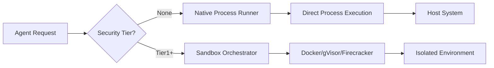

# 原生执行模式（无 Docker/隔离）

## 其他语言


Symbiont 支持在没有 Docker 或容器隔离的情况下运行智能体，适用于开发环境或需要最大性能和最小依赖的受信任部署。

## 安全警告

**重要**：原生执行模式绕过了所有基于容器的安全控制：

- 无进程隔离
- 无文件系统隔离
- 无网络隔离
- 无资源限制执行
- 直接访问主机系统

> **`native-sandbox` 功能在 release 构建中无法编译。** 它在 `not(debug_assertions)` 下被 `compile_error!` 保护，因此 release 二进制永远不会包含原生运行器。它是一个仅限 debug 的开发辅助工具。

**仅在以下情况使用**：
- 使用受信任代码的本地开发
- 使用受信任智能体的受控环境
- 测试和调试
- Docker 不可用的环境

**不要用于**：
- 运行不受信任代码的生产环境
- 多租户部署
- 面向公众的服务
- 处理不受信任的用户输入

## 架构

### 沙箱层级

```
┌─────────────────────────────────────────┐
│ SecurityTier::None (Native Execution)   │ ← No isolation
├─────────────────────────────────────────┤
│ SecurityTier::Tier1 (Docker)            │ ← Container isolation
├─────────────────────────────────────────┤
│ SecurityTier::Tier2 (gVisor)            │ ← Enhanced isolation
├─────────────────────────────────────────┤
│ SecurityTier::Tier3 (Firecracker)       │ ← Maximum isolation
└─────────────────────────────────────────┘
```

### 原生执行流程



## 配置

### 选项 1：TOML 配置

```toml
# symbiont.toml

[security]
# 允许原生执行（默认值：false）
allow_native_execution = true

# 原生执行是其自身的顶级配置节（并非嵌套在 [security] 之下）。
[native_execution]
enabled = true
default_executable = "python3"
working_directory = "/tmp/symbiont-native"
# 即使在原生模式下也应用操作系统资源限制
enforce_resource_limits = true
max_memory_mb = 2048              # Option<u64>
max_cpu_seconds = 300             # Option<u64> —— CPU 时间，而非核心数量
max_execution_time_seconds = 300  # 挂钟超时
allowed_executables = ["python3", "node", "bash"]
```

### 完整配置示例

包含原生执行及其他系统设置的完整 `config.toml`：

```toml
# config.toml
[api]
port = 8080
host = "127.0.0.1"
timeout_seconds = 30
max_body_size = 10485760

[database]
# 嵌入向量维度。LanceDB（默认的嵌入式后端）无需进一步配置。
# 后端在构建时通过 `vector-lancedb`（默认）或 `vector-qdrant` Cargo 功能选择，
# 不存在 `vector_backend` 配置键；可使用 SYMBIONT_VECTOR_BACKEND 环境变量在运行时切换。
vector_dimension = 384

# 在使用 Qdrant 后端（SYMBIONT_VECTOR_BACKEND=qdrant）时使用：
# qdrant_url = "http://localhost:6333"
# qdrant_collection = "symbiont"

[logging]
level = "info"
format = "Pretty"
structured = true

[security]
key_provider = { Environment = { var_name = "SYMBIONT_KEY" } }
enable_compression = true
enable_backups = true
enable_safety_checks = true

[storage]
context_path = "./data/context"
git_clone_path = "./data/git"
backup_path = "./data/backups"
max_context_size_mb = 1024

[native_execution]
enabled = true
default_executable = "python3"
working_directory = "/tmp/symbiont-native"
enforce_resource_limits = true
max_memory_mb = 2048
max_cpu_seconds = 300
max_execution_time_seconds = 300
allowed_executables = ["python3", "python", "node", "bash", "sh"]
```

### NativeExecutionConfig 字段

| 字段 | 类型 | 默认值 | 描述 |
|------|------|--------|------|
| `enabled` | bool | `false` | 启用原生执行模式 |
| `default_executable` | string | `"bash"` | 默认解释器/Shell |
| `working_directory` | path | `/tmp/symbiont-native` | 执行目录 |
| `enforce_resource_limits` | bool | `true` | 应用操作系统级别限制 |
| `max_memory_mb` | Option<u64> | `Some(2048)` | 内存限制（MB） |
| `max_cpu_seconds` | Option<u64> | `Some(300)` | CPU 时间限制 |
| `max_execution_time_seconds` | u64 | `300` | 挂钟超时 |
| `allowed_executables` | Vec<String> | `[bash, python3, etc.]` | 可执行文件白名单 |

### 选项 2：运行时安全守卫（环境变量）

不存在 `SYMBIONT_NATIVE_*` / `SYMBIONT_ALLOW_NATIVE_EXECUTION` /
`SYMBIONT_DEFAULT_SANDBOX_TIER` 等设置——原生执行通过上文的
`[native_execution]` 配置节进行配置。唯一与原生相关的环境变量是这两项运行时安全守卫，
二者都必须设置才能实际运行原生（零隔离）运行器：

```bash
export SYMBI_UNSAFE_NATIVE_SANDBOX=1   # acknowledge the native runner
export SYMBIONT_ALLOW_UNISOLATED=1     # permit SandboxTier::None
```

### 选项 3：智能体级别配置

```symbi
metadata {
  version = "1.0.0"
  description = "Local Development Agent"
}

agent native_worker(task: String) -> String {
  capabilities = ["local_filesystem", "network"]

  policy dev_only {
    allow: ["local_filesystem", "network"] if true
  }

  # tier 0 = 无沙箱（主机执行）；需要上述各项 opt-in
  with sandbox = "none" {
    return process(task);
  }
}
```

## 使用示例

### 示例 1：开发模式

```rust
use symbi_runtime::{Config, SecurityTier, SandboxOrchestrator};

#[tokio::main]
async fn main() -> Result<(), Box<dyn std::error::Error>> {
    // Enable native execution for development
    let mut config = Config::default();
    config.security.allow_native_execution = true;

    let orchestrator = SandboxOrchestrator::new(config)?;

    // Execute code natively
    let result = orchestrator.execute_code(
        SecurityTier::None,
        "print('Hello from native execution!')",
        HashMap::new()
    ).await?;

    println!("Output: {}", result.stdout);
    Ok(())
}
```

### 示例 2：使用原生运行器构建并运行

不存在 `--native` CLI 标志。原生（主机）执行需要三项显式的 opt-in：

1. **使用 `native-sandbox` 功能构建 —— 仅限 debug 构建。** 该功能不提供任何隔离，并在 release 构建中被 `compile_error!` 保护：

   ```bash
   cargo build --features native-sandbox    # 仅限 debug；release 无法编译
   ```

2. **确认两项运行时守卫：**

   ```bash
   export SYMBI_UNSAFE_NATIVE_SANDBOX=1   # 确认使用原生运行器
   export SYMBIONT_ALLOW_UNISOLATED=1     # 在非 dev 运行中允许 SandboxTier::None
   ```

3. **在智能体 DSL 中选择 tier 0（无沙箱）：**

   ```
   with sandbox = "none" {
       // ...
   }
   ```

   资源限制（内存/CPU/超时）来自 `with` 块/配置（见上文），而非 CLI 标志。

随后正常运行：

```bash
symbi run agent.symbi
```

### 示例 3：混合执行

```rust
// Use native execution for trusted local operations
let local_result = orchestrator.execute_code(
    SecurityTier::None,
    local_code,
    env_vars
).await?;

// Use Docker for external/untrusted operations
let isolated_result = orchestrator.execute_code(
    SecurityTier::Tier1,
    untrusted_code,
    env_vars
).await?;
```

## 实现细节

### 原生进程运行器

原生运行器使用 `std::process::Command` 并带有可选的资源限制：

```rust
pub struct NativeRunner {
    config: NativeConfig,
}

impl NativeRunner {
    pub async fn execute(&self, code: &str, env: HashMap<String, String>)
        -> Result<ExecutionResult> {
        // Direct process execution
        let mut command = Command::new(&self.config.executable);
        command.current_dir(&self.config.working_dir);
        command.envs(env);

        // Optional: Apply resource limits via rlimit (Unix)
        #[cfg(unix)]
        if self.config.enforce_limits {
            self.apply_resource_limits(&mut command)?;
        }

        let output = command.output().await?;

        Ok(ExecutionResult {
            stdout: String::from_utf8_lossy(&output.stdout).to_string(),
            stderr: String::from_utf8_lossy(&output.stderr).to_string(),
            exit_code: output.status.code().unwrap_or(-1),
            success: output.status.success(),
        })
    }
}
```

### 资源限制（Unix）

在 Unix 系统上，原生执行仍然可以执行一些限制：

- **内存**：使用 `setrlimit(RLIMIT_AS)`
- **CPU 时间**：使用 `setrlimit(RLIMIT_CPU)`
- **进程数**：使用 `setrlimit(RLIMIT_NPROC)`
- **文件大小**：使用 `setrlimit(RLIMIT_FSIZE)`

### 平台支持

| 平台 | 原生执行 | 资源限制 |
|------|----------|----------|
| Linux | 完全支持 | rlimit |
| macOS | 完全支持 | 部分支持 |
| Windows | 完全支持 | 有限 |

## 从 Docker 迁移

### 步骤 1：更新配置

```diff
# symbiont.toml
[security]
+ allow_native_execution = true
+
++ [native_execution]
++ enabled = true
```

然后在 DSL 中为每个智能体选择第 0 层（无沙箱）：

```
with sandbox = "none" { ... }
```

### 步骤 2：构建并运行（仅限 debug）

```bash
# No longer required
# docker build -t symbi:latest .
# docker run ...

# native-sandbox 特性仅限 debug（release 构建中会触发 compile_error!）：
cargo build --features native-sandbox
SYMBI_UNSAFE_NATIVE_SANDBOX=1 SYMBIONT_ALLOW_UNISOLATED=1 \
  ./target/debug/symbi run agent.symbi
```

### 混合方案

策略性地使用两种执行模式——原生用于受信任的本地操作，Docker 用于不受信任的代码：

```rust
// Trusted local operations
let local_result = orchestrator.execute_code(
    SecurityTier::None,  // Native
    trusted_code,
    env
).await?;

// External/untrusted operations
let isolated_result = orchestrator.execute_code(
    SecurityTier::Tier1,  // Docker
    external_code,
    env
).await?;
```

### 步骤 3：处理环境变量

Docker 自动隔离环境变量。使用原生执行时，需要显式设置它们：

```bash
export AGENT_API_KEY="xxx"
export AGENT_DB_URL="postgresql://..."
export SYMBI_UNSAFE_NATIVE_SANDBOX=1
export SYMBIONT_ALLOW_UNISOLATED=1
symbi run agent.symbi   # 智能体必须声明：with sandbox = "none" { ... }
```

## 性能对比

| 模式 | 启动时间 | 吞吐量 | 内存 | 隔离性 |
|------|----------|--------|------|--------|
| 原生 | ~10ms | 100% | 最小 | 无 |
| Docker | ~500ms | ~95% | +128MB | 良好 |
| gVisor | ~800ms | ~70% | +256MB | 更好 |
| Firecracker | ~125ms | ~90% | +64MB | 最佳 |

## 故障排除

### 问题：权限被拒绝

```bash
# Solution: Ensure working directory is writable
mkdir -p /tmp/symbiont-native
chmod 755 /tmp/symbiont-native
```

### 问题：命令未找到

```bash
# Solution: Ensure executable is in PATH or use absolute path
export PATH=$PATH:/usr/local/bin
# Or configure absolute path
allowed_executables = ["/usr/bin/python3", "/usr/bin/node"]
```

### 问题：资源限制未应用

Windows 上的原生执行资源限制支持有限。考虑：
- 使用 Job Objects（Windows 特有）
- 监控和终止失控进程
- 升级到基于容器的执行

## 最佳实践

1. **仅用于开发**：主要在开发时使用原生执行
2. **渐进迁移**：先使用容器，稳定后再切换到原生
3. **监控**：即使没有隔离，也要监控资源使用
4. **白名单**：限制允许的可执行文件和路径
5. **日志记录**：启用全面的审计日志
6. **测试**：在部署原生模式之前先用容器测试

## 安全检查清单

在任何环境中启用原生执行之前：

- [ ] 所有智能体代码来自受信任的来源
- [ ] 环境与生产环境隔离
- [ ] 不处理外部用户输入
- [ ] 监控和日志已启用
- [ ] 资源限制已配置
- [ ] 可执行文件白名单限制严格
- [ ] 文件系统访问受限
- [ ] 团队了解安全影响

## 相关文档

- [安全模型](security-model.md) - 完整的安全架构
- [沙箱架构](runtime-architecture.md#sandbox-architecture) - 容器层级
- [配置指南](getting-started.md#configuration) - 设置选项
- [DSL 安全指令](dsl-guide.md#security) - 智能体级别的安全

---

**请记住**：原生执行以安全换取便利。始终了解风险，并为您的部署环境应用适当的控制措施。
