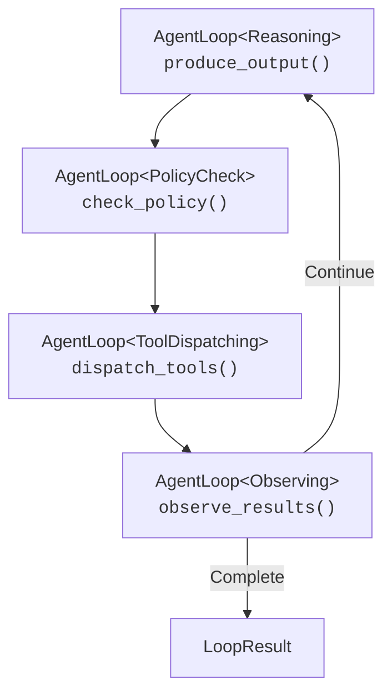

layout: default
title: 推理循环指南
nav_exclude: true
description: "Symbiont 智能体推理循环系统指南"
---

# 推理循环指南

## 其他语言

[English](reasoning-loop.md) | Symbiont 智能体推理循环完整指南：一个通过类型状态强制的 Observe-Reason-Gate-Act (ORGA) 循环，用于自主智能体行为。

## 目录


---

## 概述

推理循环是 Symbiont 中自主智能体的核心执行引擎。它通过一个结构化的循环驱动 LLM、策略门控和外部工具之间的多轮对话：

1. **Observe（观察）** — 收集上一次工具执行的结果
2. **Reason（推理）** — LLM 生成提议的动作（工具调用或文本响应）
3. **Gate（门控）** — 策略引擎评估每个提议的动作
4. **Act（执行）** — 已批准的动作被分发给工具执行器

循环将持续运行，直到 LLM 生成最终文本响应、达到迭代/token 限制或超时。

### 设计原则

- **编译时安全**：通过 Rust 的类型系统在编译时捕获无效的阶段转换
- **渐进式复杂度**：循环只需提供者和策略门控即可工作；知识桥接、Cedar 策略和人机协作都是可选的
- **向后兼容**：添加新功能（如知识桥接）永远不会破坏现有代码
- **可观测性**：每个阶段都会发出日志事件和追踪 span

---

## 快速开始

### 最小示例

```rust
use std::sync::Arc;
use symbi_runtime::reasoning::circuit_breaker::CircuitBreakerRegistry;
use symbi_runtime::reasoning::context_manager::DefaultContextManager;
use symbi_runtime::reasoning::conversation::{Conversation, ConversationMessage};
use symbi_runtime::reasoning::executor::DefaultActionExecutor;
use symbi_runtime::reasoning::loop_types::{BufferedJournal, LoopConfig};
use symbi_runtime::reasoning::policy_bridge::DefaultPolicyGate;
use symbi_runtime::reasoning::reasoning_loop::ReasoningLoopRunner;
use symbi_runtime::types::AgentId;

// Set up the runner with default components
let runner = ReasoningLoopRunner {
    provider: Arc::new(my_inference_provider),
    policy_gate: Arc::new(DefaultPolicyGate::permissive()),
    executor: Arc::new(DefaultActionExecutor::default()),
    context_manager: Arc::new(DefaultContextManager::default()),
    circuit_breakers: Arc::new(CircuitBreakerRegistry::default()),
    journal: Arc::new(BufferedJournal::new(1000)),
    knowledge_bridge: None,
};

// Build a conversation
let mut conv = Conversation::with_system("You are a helpful assistant.");
conv.push(ConversationMessage::user("What is 6 * 7?"));

// Run the loop
let result = runner.run(AgentId::new(), conv, LoopConfig::default()).await;

println!("Output: {}", result.output);
println!("Iterations: {}", result.iterations);
println!("Tokens used: {}", result.total_usage.total_tokens);
```

### 使用工具定义

```rust
use symbi_runtime::reasoning::inference::ToolDefinition;

let config = LoopConfig {
    max_iterations: 10,
    tool_definitions: vec![
        ToolDefinition {
            name: "web_search".into(),
            description: "Search the web for information".into(),
            parameters: serde_json::json!({
                "type": "object",
                "properties": {
                    "query": { "type": "string" }
                },
                "required": ["query"]
            }),
        },
    ],
    ..Default::default()
};

let result = runner.run(agent_id, conv, config).await;
```

---

## 阶段系统

### 类型状态模式

循环使用 Rust 的类型系统在编译时强制执行有效的阶段转换。每个阶段是一个零大小类型标记：

```rust
pub struct Reasoning;      // LLM produces proposed actions
pub struct PolicyCheck;    // Each action evaluated by the gate
pub struct ToolDispatching; // Approved actions executed
pub struct Observing;      // Results collected for next iteration
```

`AgentLoop<Phase>` 结构体携带循环状态，并且只能调用与其当前阶段适配的方法。例如，`AgentLoop<Reasoning>` 只暴露 `produce_output()`，该方法消耗 self 并返回 `AgentLoop<PolicyCheck>`。

这意味着以下错误是**编译错误**，而不是运行时 bug：
- 跳过策略检查
- 在推理之前分发工具
- 在分发之前观察结果

### 阶段流程



---

## 推理提供者

`InferenceProvider` trait 对 LLM 后端进行抽象：

```rust
#[async_trait]
pub trait InferenceProvider: Send + Sync {
    async fn complete(
        &self,
        conversation: &Conversation,
        options: &InferenceOptions,
    ) -> Result<InferenceResponse, InferenceError>;

    fn provider_name(&self) -> &str;
    fn default_model(&self) -> &str;
    fn supports_native_tools(&self) -> bool;
    fn supports_structured_output(&self) -> bool;
}
```

### 云端提供者 (OpenRouter)

`CloudInferenceProvider` 连接到 OpenRouter（或任何 OpenAI 兼容端点）：

```bash
export OPENROUTER_API_KEY="sk-or-..."
export OPENROUTER_MODEL="google/gemini-2.0-flash-001"  # optional
```

```rust
use symbi_runtime::reasoning::providers::cloud::CloudInferenceProvider;

let provider = CloudInferenceProvider::from_env()
    .expect("OPENROUTER_API_KEY must be set");
```

---

## 策略门控

每个提议的动作在执行前都会通过策略门控：

```rust
#[async_trait]
pub trait ReasoningPolicyGate: Send + Sync {
    async fn evaluate_action(
        &self,
        agent_id: &AgentId,
        action: &ProposedAction,
        state: &LoopState,
    ) -> LoopDecision;
}

pub enum LoopDecision {
    Allow,
    Deny { reason: String },
    Modify { modified_action: Box<ProposedAction>, reason: String },
}
```

### 内置门控

- **`DefaultPolicyGate::permissive()`** — 允许所有动作（开发/测试用）
- **`DefaultPolicyGate::new()`** — 默认策略规则
- **`OpaPolicyGateBridge`** — 桥接到基于 OPA 的策略引擎
- **`CedarGate`** — Cedar 策略语言集成

### 策略拒绝反馈

当动作被拒绝时，拒绝原因会作为策略反馈观察反馈给 LLM，允许它在下一次迭代中调整策略。

---

## 动作执行

### ActionExecutor Trait

```rust
#[async_trait]
pub trait ActionExecutor: Send + Sync {
    async fn execute_actions(
        &self,
        actions: &[ProposedAction],
        config: &LoopConfig,
        circuit_breakers: &CircuitBreakerRegistry,
    ) -> Vec<Observation>;
}
```

### 内置执行器

| 执行器 | 描述 |
|--------|------|
| `DefaultActionExecutor` | 带有每个工具超时的并行分发 |
| `EnforcedActionExecutor` | 通过 `ToolInvocationEnforcer` 委托到 MCP 管线 |
| `KnowledgeAwareExecutor` | 拦截知识工具，将其余委托给内部执行器 |

### 断路器

每个工具都有一个关联的断路器来跟踪故障：

- **Closed（关闭）**（正常）：工具调用正常进行
- **Open（打开）**（触发）：连续故障太多；调用立即被拒绝
- **Half-open（半开）**（探测）：允许有限的调用来测试恢复

```rust
let circuit_breakers = CircuitBreakerRegistry::new(CircuitBreakerConfig {
    failure_threshold: 3,
    recovery_timeout: Duration::from_secs(60),
    half_open_max_calls: 1,
});
```

---

## 知识-推理桥接

`KnowledgeBridge` 将智能体的知识存储（分层记忆、知识库、向量搜索）连接到推理循环。

### 设置

```rust
use symbi_runtime::reasoning::knowledge_bridge::{KnowledgeBridge, KnowledgeConfig};

let bridge = Arc::new(KnowledgeBridge::new(
    context_manager.clone(),  // Arc<dyn context::ContextManager>
    KnowledgeConfig {
        max_context_items: 5,
        relevance_threshold: 0.3,
        auto_persist: true,
    },
));

let runner = ReasoningLoopRunner {
    // ... other fields ...
    knowledge_bridge: Some(bridge),
};
```

### 工作原理

**在每个推理步骤之前：**
1. 从最近的用户/工具消息中提取搜索词
2. `query_context()` 和 `search_knowledge()` 检索相关项
3. 结果被格式化并注入为系统消息（替换之前的注入）

**在工具分发期间：**
`KnowledgeAwareExecutor` 拦截两个特殊工具：

- **`recall_knowledge`** — 搜索知识库并返回格式化结果
  ```json
  { "query": "capital of France", "limit": 5 }
  ```

- **`store_knowledge`** — 将新事实存储为主语-谓语-宾语三元组
  ```json
  { "subject": "Earth", "predicate": "has", "object": "one moon", "confidence": 0.95 }
  ```

所有其他工具调用将不变地委托给内部执行器。

**循环完成后：**
如果启用了 `auto_persist`，桥接将提取助手响应并将其存储为工作记忆，供未来对话使用。

### 向后兼容性

将 `knowledge_bridge` 设置为 `None` 使运行器的行为与之前完全相同——没有上下文注入、没有知识工具、没有持久化。

---

## 对话管理

### Conversation 类型

`Conversation` 管理有序的消息序列，支持序列化为 OpenAI 和 Anthropic API 格式：

```rust
let mut conv = Conversation::with_system("You are a helpful assistant.");
conv.push(ConversationMessage::user("Hello"));
conv.push(ConversationMessage::assistant("Hi there!"));

// Serialize for API calls
let openai_msgs = conv.to_openai_messages();
let (system, anthropic_msgs) = conv.to_anthropic_messages();
```

### Token 预算强制

循环内的 `ContextManager`（不要与知识 `ContextManager` 混淆）管理对话的 token 预算：

- **滑动窗口**：优先删除最旧的消息
- **观察掩码**：隐藏冗长的工具结果
- **锚定摘要**：保留系统消息 + N 条最近消息

---

## 持久化日志

每个阶段转换都会向配置的 `JournalWriter` 发出一个 `JournalEntry`：

```rust
pub struct JournalEntry {
    pub sequence: u64,
    pub timestamp: DateTime<Utc>,
    pub agent_id: AgentId,
    pub iteration: u32,
    pub event: LoopEvent,
}

pub enum LoopEvent {
    Started { agent_id, config },
    ReasoningComplete { iteration, actions, usage },
    PolicyEvaluated { iteration, action_count, denied_count },
    ToolsDispatched { iteration, tool_count, duration },
    ObservationsCollected { iteration, observation_count },
    Terminated { reason, iterations, total_usage, duration },
    RecoveryTriggered { iteration, tool_name, strategy, error },
}
```

默认的 `BufferedJournal` 将条目存储在内存中。生产环境部署可以实现 `JournalWriter` 以进行持久化存储。

---

## 配置

### LoopConfig

```rust
pub struct LoopConfig {
    pub max_iterations: u32,        // Default: 25
    pub max_total_tokens: u32,      // Default: 100,000
    pub timeout: Duration,          // Default: 5 minutes
    pub default_recovery: RecoveryStrategy,
    pub tool_timeout: Duration,     // Default: 30 seconds
    pub max_concurrent_tools: usize, // Default: 5
    pub context_token_budget: usize, // Default: 32,000
    pub tool_definitions: Vec<ToolDefinition>,
}
```

### 恢复策略

当工具执行失败时，循环可以应用不同的恢复策略：

| 策略 | 描述 |
|------|------|
| `Retry` | 使用指数退避重试 |
| `Fallback` | 尝试替代工具 |
| `CachedResult` | 如果缓存足够新则使用缓存结果 |
| `LlmRecovery` | 让 LLM 寻找替代方案 |
| `Escalate` | 路由到人工操作队列 |
| `DeadLetter` | 放弃并记录失败 |

---

## 测试

### 单元测试（不需要 API 密钥）

```bash
cargo test -j2 -p symbi-runtime --lib -- reasoning::knowledge
```

### 使用 Mock 提供者的集成测试

```bash
cargo test -j2 -p symbi-runtime --test knowledge_reasoning_tests
```

### 使用真实 LLM 的实时测试

```bash
OPENROUTER_API_KEY="sk-or-..." OPENROUTER_MODEL="google/gemini-2.0-flash-001" \
  cargo test -j2 -p symbi-runtime --features http-input --test reasoning_live_tests -- --nocapture
```

---

## 实现阶段

推理循环分五个阶段构建，每个阶段添加新功能：

| 阶段 | 重点 | 关键组件 |
|------|------|----------|
| **1** | 核心循环 | `conversation`、`inference`、`phases`、`reasoning_loop` |
| **2** | 弹性 | `circuit_breaker`、`executor`、`context_manager`、`policy_bridge` |
| **3** | DSL 集成 | `human_critic`、`pipeline_config`、REPL 内置命令 |
| **4** | 多智能体 | `agent_registry`、`critic_audit`、`saga` |
| **5** | 可观测性 | `cedar_gate`、`journal`、`metrics`、`scheduler`、`tracing_spans` |
| **Bridge** | 知识 | `knowledge_bridge`、`knowledge_executor` |
| **orga-adaptive** | 高级 | `tool_profile`、`progress_tracker`、`pre_hydrate`、扩展 `knowledge_bridge` |

---

## 高级原语 (orga-adaptive)

`orga-adaptive` 特性门控添加了四项高级功能。详见[完整指南](orga-adaptive.md)。

| 原语 | 用途 |
|------|------|
| **Tool Profile** | 基于 glob 的 LLM 可见工具过滤 |
| **Progress Tracker** | 带有卡住循环检测的每步重试限制 |
| **Pre-Hydration** | 从任务输入引用进行确定性上下文预获取 |
| **Scoped Conventions** | 通过 `recall_knowledge` 进行目录感知的约定检索 |

```rust
let config = LoopConfig {
    tool_profile: Some(ToolProfile::include_only(&["search_*", "file_*"])),
    pre_hydration: Some(PreHydrationConfig::default()),
    ..Default::default()
};
```

---

## 下一步

- **[运行时架构](runtime-architecture.md)** — 完整系统架构概览
- **[安全模型](security-model.md)** — 策略执行和审计追踪
- **[DSL 指南](dsl-guide.md)** — 智能体定义语言
- **[API 参考](api-reference.md)** — 完整的 API 文档
