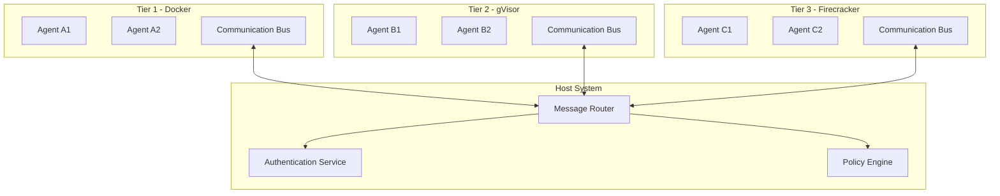

# Sandbox Communication Architecture

## Overview

The Symbiont Agent Runtime implements a sophisticated multi-tier sandbox communication system that enables secure inter-agent messaging across different isolation boundaries. This document explains how the communication bus works across the three sandbox layers and the security mechanisms that govern agent interactions.

## Sandbox Tiers

### Tier 1: Docker Containers
- **Isolation Level**: Process and filesystem isolation
- **Security**: Standard container security with namespace isolation
- **Communication**: Direct network communication within the same Docker network
- **Use Case**: Standard agent operations with moderate security requirements

### Tier 2: gVisor (User-space Kernel)
- **Isolation Level**: Kernel-level syscall interception
- **Security**: Enhanced security through user-space kernel implementation
- **Communication**: Mediated through gVisor's network stack
- **Use Case**: Agents handling sensitive data or untrusted code

### Tier 3: Firecracker (Micro-VMs)
- **Isolation Level**: Full hardware virtualization
- **Security**: Maximum isolation with dedicated kernel per agent
- **Communication**: Network-based communication through virtual interfaces
- **Use Case**: Critical security applications and untrusted workloads

## Communication Bus Architecture

### Core Components



### Message Flow

1. **Message Origination**: Agent creates a message with destination and payload
2. **Local Bus**: Message is submitted to the tier-specific communication bus
3. **Security Check**: Local bus validates agent permissions and message format
4. **Routing**: Message is forwarded to the central message router on the host
5. **Authentication**: Router verifies sender identity and destination validity
6. **Policy Evaluation**: Policy engine checks if the communication is allowed
7. **Delivery**: Message is routed to the destination tier's communication bus
8. **Final Delivery**: Destination bus delivers message to the target agent

## Security Mechanisms

### Cross-Tier Communication Rules

#### Tier 1 ↔ Tier 1 (Docker to Docker)
- **Allowed**: Direct communication within the same network
- **Restrictions**: Subject to agent-specific policies
- **Latency**: Low (direct network communication)

#### Tier 1 ↔ Tier 2 (Docker to gVisor)
- **Allowed**: Mediated through message router
- **Restrictions**: Enhanced validation and policy checks
- **Latency**: Medium (additional security overhead)

#### Tier 1 ↔ Tier 3 (Docker to Firecracker)
- **Allowed**: Highly restricted, policy-dependent
- **Restrictions**: Maximum security validation
- **Latency**: High (full security stack traversal)

#### Tier 2 ↔ Tier 2 (gVisor to gVisor)
- **Allowed**: Direct communication through gVisor network stack
- **Restrictions**: gVisor-enforced security policies
- **Latency**: Medium (gVisor overhead)

#### Tier 2 ↔ Tier 3 (gVisor to Firecracker)
- **Allowed**: Restricted, requires explicit policy approval
- **Restrictions**: Both gVisor and Firecracker security validation
- **Latency**: High (dual security stack overhead)

#### Tier 3 ↔ Tier 3 (Firecracker to Firecracker)
- **Allowed**: Highly controlled, minimal cross-VM communication
- **Restrictions**: Maximum security, explicit policy requirements
- **Latency**: Highest (full virtualization overhead)

### Authentication and Authorization

#### Agent Identity Verification
```rust
pub struct AgentIdentity {
    pub agent_id: String,
    pub tier: SandboxTier,
    pub capabilities: Vec<Capability>,
    pub security_clearance: SecurityLevel,
}

pub enum SecurityLevel {
    Public,
    Restricted,
    Confidential,
    Secret,
}
```

#### Message Authentication
- **Digital Signatures**: All messages are cryptographically signed
- **Timestamp Validation**: Messages include timestamps to prevent replay attacks
- **Nonce System**: Unique nonces prevent message duplication
- **Capability Checks**: Sender capabilities are verified against message requirements

### Policy Engine

#### Communication Policies
```rust
pub struct CommunicationPolicy {
    pub source_tier: SandboxTier,
    pub destination_tier: SandboxTier,
    pub allowed_message_types: Vec<MessageType>,
    pub security_requirements: SecurityRequirements,
    pub rate_limits: RateLimits,
}

pub struct SecurityRequirements {
    pub encryption_required: bool,
    pub signature_required: bool,
    pub audit_logging: bool,
    pub content_filtering: bool,
}
```

#### Policy Evaluation Process
1. **Source Validation**: Verify sender identity and tier
2. **Destination Validation**: Confirm destination agent exists and is reachable
3. **Message Type Check**: Ensure message type is allowed for this communication path
4. **Security Requirements**: Apply encryption, signing, and filtering as required
5. **Rate Limiting**: Check if communication frequency is within allowed limits
6. **Audit Logging**: Log the communication attempt and decision

## Message Types and Protocols

### Standard Message Types

#### Control Messages
- **Purpose**: System control and coordination
- **Security**: High - requires elevated privileges
- **Examples**: Agent lifecycle, resource allocation, emergency shutdown

#### Data Messages
- **Purpose**: Application data exchange
- **Security**: Variable - depends on data classification
- **Examples**: Computation results, file transfers, database queries

#### Event Messages
- **Purpose**: Event notifications and pub/sub
- **Security**: Medium - subject to subscription policies
- **Examples**: Status updates, alerts, progress notifications

#### RPC Messages
- **Purpose**: Remote procedure calls between agents
- **Security**: High - requires explicit capability grants
- **Examples**: Function invocation, service requests, API calls

### Message Format

```rust
pub struct SecureMessage {
    pub header: MessageHeader,
    pub payload: EncryptedPayload,
    pub signature: DigitalSignature,
}

pub struct MessageHeader {
    pub message_id: Uuid,
    pub source_agent: AgentIdentity,
    pub destination_agent: AgentIdentity,
    pub message_type: MessageType,
    pub timestamp: SystemTime,
    pub nonce: u64,
    pub security_level: SecurityLevel,
}
```

## Implementation Details

### Communication Bus Implementation

The communication bus is implemented in [`runtime/src/communication/mod.rs`](src/communication/mod.rs) and provides:

- **Async Message Handling**: Non-blocking message processing
- **Connection Pooling**: Efficient connection management across tiers
- **Retry Logic**: Automatic retry with exponential backoff
- **Circuit Breaker**: Protection against cascading failures
- **Metrics Collection**: Performance and security monitoring

### Sandbox Orchestrator Integration

The sandbox orchestrator ([`runtime/src/integrations/sandbox_orchestrator.rs`](src/integrations/sandbox_orchestrator.rs)) coordinates:

- **Tier Assignment**: Determines appropriate sandbox tier for each agent
- **Resource Allocation**: Manages compute and network resources
- **Security Policy Application**: Enforces tier-specific security policies
- **Health Monitoring**: Tracks agent and communication health

## Performance Characteristics

### Latency by Communication Path

| Source Tier | Destination Tier | Typical Latency | Security Overhead |
|-------------|------------------|-----------------|-------------------|
| Docker      | Docker          | 1-5ms           | Low               |
| Docker      | gVisor          | 5-15ms          | Medium            |
| Docker      | Firecracker     | 15-50ms         | High              |
| gVisor      | gVisor          | 3-10ms          | Medium            |
| gVisor      | Firecracker     | 20-60ms         | High              |
| Firecracker | Firecracker     | 10-30ms         | Very High         |

### Throughput Considerations

- **Intra-Tier**: High throughput with minimal overhead
- **Cross-Tier**: Reduced throughput due to security processing
- **Encryption Impact**: 10-30% throughput reduction for encrypted messages
- **Policy Evaluation**: 1-5ms additional latency per policy check

## Security Considerations

### Threat Model

#### Compromised Agent Scenarios
- **Tier 1 Compromise**: Limited blast radius due to container isolation
- **Tier 2 Compromise**: gVisor provides additional kernel-level protection
- **Tier 3 Compromise**: Full VM isolation prevents lateral movement

#### Network-Level Attacks
- **Man-in-the-Middle**: Prevented by end-to-end encryption
- **Replay Attacks**: Mitigated by nonce and timestamp validation
- **DoS Attacks**: Rate limiting and circuit breaker protection

#### Privilege Escalation
- **Cross-Tier Escalation**: Prevented by strict tier isolation
- **Capability Abuse**: Capability-based security model limits exposure
- **Policy Bypass**: Multiple validation layers prevent policy circumvention

### Best Practices

1. **Principle of Least Privilege**: Grant minimal necessary communication capabilities
2. **Defense in Depth**: Multiple security layers at each tier boundary
3. **Audit Everything**: Comprehensive logging of all communication attempts
4. **Regular Policy Review**: Periodic evaluation and updating of communication policies
5. **Incident Response**: Automated detection and response to security violations

## Monitoring and Debugging

### Metrics Collection

The system collects comprehensive metrics including:

- **Message Volume**: Count and size of messages by tier and type
- **Latency Distribution**: P50, P95, P99 latencies for each communication path
- **Error Rates**: Failed messages by error type and tier
- **Security Events**: Authentication failures, policy violations, suspicious activity

### Debugging Tools

- **Message Tracing**: End-to-end message flow visualization
- **Policy Simulation**: Test policy changes before deployment
- **Security Audit**: Comprehensive security event analysis
- **Performance Profiling**: Identify communication bottlenecks

## Configuration

### Environment Variables

```bash
# Communication Bus Configuration
SYMBIONT_COMM_BUS_PORT=8080
SYMBIONT_COMM_BUS_THREADS=4
SYMBIONT_COMM_BUS_BUFFER_SIZE=1024

# Security Configuration
SYMBIONT_ENCRYPTION_ENABLED=true
SYMBIONT_SIGNATURE_REQUIRED=true
SYMBIONT_AUDIT_LOGGING=true

# Performance Tuning
SYMBIONT_CONN_POOL_SIZE=100
SYMBIONT_RETRY_MAX_ATTEMPTS=3
SYMBIONT_CIRCUIT_BREAKER_THRESHOLD=10
```

### Policy Configuration

Communication policies are defined in YAML format:

```yaml
communication_policies:
  - name: "docker_to_docker"
    source_tier: "docker"
    destination_tier: "docker"
    allowed_message_types: ["data", "event", "rpc"]
    security_requirements:
      encryption_required: false
      signature_required: true
      audit_logging: true
    rate_limits:
      messages_per_second: 1000
      burst_size: 100

  - name: "docker_to_firecracker"
    source_tier: "docker"
    destination_tier: "firecracker"
    allowed_message_types: ["data"]
    security_requirements:
      encryption_required: true
      signature_required: true
      audit_logging: true
      content_filtering: true
    rate_limits:
      messages_per_second: 10
      burst_size: 5
```

## Future Enhancements

### Planned Features

1. **Dynamic Policy Updates**: Runtime policy modification without restart
2. **Advanced Encryption**: Post-quantum cryptography support
3. **Zero-Trust Networking**: Enhanced identity verification and micro-segmentation
4. **AI-Powered Anomaly Detection**: Machine learning-based security monitoring
5. **Cross-Cloud Communication**: Secure communication across cloud providers

### Research Areas

- **Homomorphic Encryption**: Computation on encrypted data
- **Secure Multi-Party Computation**: Privacy-preserving collaborative computation
- **Blockchain Integration**: Immutable audit trails and decentralized trust
- **Quantum-Safe Protocols**: Preparation for quantum computing threats

## Conclusion

The Symbiont Agent Runtime's sandbox communication architecture provides a robust, secure, and scalable foundation for multi-agent systems. By implementing multiple isolation tiers with corresponding security mechanisms, the system can accommodate a wide range of security requirements while maintaining performance and usability.

The architecture's flexibility allows for fine-grained control over agent interactions while providing the security guarantees necessary for production deployments in sensitive environments.